# C++ Nanodegree 

## Introduction to C++

* Standard Library
    * "The C++ Standard Library is a collection of classes and functions, which are written in the core language and part of the C++ ISO Standard itself." Wikipedia

    * Learning how to use the Standard Library is an important part of becoming a proficient C++ software engineer. In almost all cases, it is preferable to utilize functionality that already exists in the Standard Library, instead of implementing functionality from scratch. This is both because using the Standard Library is faster (it is well-documented) and because many expert software engineers have worked on the Standard Library. The performance of Standard Library facilities is optimized, robust, and almost always as fast or faster than an initial re-implementation of the same functionality.

    * In fact, guideline SL.1 of the [C++ Core Guidelines](http://isocpp.github.io/CppCoreGuidelines/CppCoreGuidelines) is:
        * Use libraries wherever possible

        * Reason Save time. Don’t re-invent the wheel. Don’t replicate the work of others. Benefit from other people’s work when they make improvements. Help other people when you make improvements.
    
    * And guideline SL.2 is:
        * Prefer the standard library to other libraries

        * Reason More people know the standard library. It is more likely to be stable, well-maintained, and widely available than your own code or most other libraries.

* Namespace
    * Standard Library functions and classes exist in the `std::` namespace. `std::vector`, for example, refers to the vector class within the Standard Library. Typically, in order to use a Standard Library feature we must both include the necessary header file (e.g. #include <vector>) and also namespace the class with `std::` (e.g. `std::vector`).

* Compilers

    * C++ is a compiled programming language, which means that programmers use a program to compile their human-readable source code into machine-readable object and executable files. The program that performs this task is called a compiler.

    * C++ does not have an "official" compiler. Instead, there are many different compilers that a programmer can use.

    * GNU Compiler Collection (GCC)

        * In this program we primarily use the GNU Compiler Collection, which is a popular, open-source, cross-platform compiler from the larger GNU Project. In particular, we use the `g++` program, which is a command line executable that compiles C++ source code and **automatically links the C++ Standard Library**.
    
    * LLVM (low level virtual machine)
        
        * This is a new infrastructure of compilers, read more [here](https://llvm.org/)

        * The LLVM Project is a collection of modular and reusable compiler and toolchain technologies. Despite its name, LLVM has little to do with traditional virtual machines. The name "LLVM" itself is not an acronym; it is the full name of the project.

        * LLVM began as a research project at the University of Illinois, with the goal of providing a modern, SSA-based compilation strategy capable of supporting both static and dynamic compilation of arbitrary programming languages. Since then, LLVM has grown to be an umbrella project consisting of a number of subprojects, many of which are being used in production by a wide variety of commercial and open source projects as well as being widely used in academic research. Code in the LLVM project is licensed under the "Apache 2.0 License with LLVM exceptions"
    
    * Linking
        * 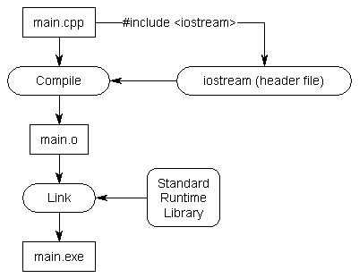 

        * In order to use classes and functions from the C++ Standard Library, the compiler must have access to a compiled version of the standard library, stored in object files. Most compiler implementations, including GCC, **include those object files as part of the installation process**. In order to use the Standard Library facilities, the compiler must "link" the standard library object files to the object files created from the programmer's source code.

        * Once the compiler links together the necessary object files, it is able to generate a standalone executable file that can run on the operating system.

* Build Tools

    * Make and CMake are two separate and similar build tools that both serve to help simplify the process of building software.

    * In particular, build tools automate the process of compiling multiple source code files into object files, linking those object files together, and generating an executable. Build tools also often automate the process of determining which files have changed since the last build and thus need to be recompiled.

    * Make
        * [GNU Make](https://www.gnu.org/software/make/manual/html_node/index.html#Top) is a widely-used build tool that relies on `Makefiles` to automate the process of building a project.

        * A `Makefile` typically includes one or more "targets". Each target performs a different action.

        * `build` is a common **target** name that is configured in the `Makefile` to compile all of the project's source code into an executable file. `clean`, on the other hand, is a common target to delete all object files and other artifacts of the build process, resulting in a clean, unbuilt project state.

        * Running either `make build` or `make clean` (or any other target) on the command line would cause `Make` to search for a local `Makefile`, search for a matching target within that Makefile, and then execute the target.
    
    * CMake

        * [CMake](https://cmake.org/) is a built tool that facilitates **cross-platform** builds, so that it is straightforward to build the same source code on Linux, macOS, Windows, or any other operating system. `CMake` relies on a CMakeLists.txt file, which configures appropriate cross-platform targets.

        * Building a `CMakeLists.txt` file can be a bit daunting, but `CMake` provides a helpful tutorial.

        * In this Nanodegree program, you will not need to build your own `Makefiles` or `CMakeLists.txt` files. We provide the appropriate configuration files for each project and instruct you as to their usage.

* Installation

    * You are welcome to write all of your code in Udacity's web-based Workspaces. If, however, you prefer to work locally on your machine, you will need to install certain software.

    * llvm and clang (this tutorial uses this compiler)
        * [Download and instal](https://releases.llvm.org/download.html)

    * g++, gdb, make

        * MacOS

            * macOS includes g++ as part of Command Line Tools.

            * Launch Terminal, which can be found in the Utilities folder in Applications.
            * Type `xcode-select --install` into the Terminal window and press "Enter"
            * If you don't already have Xcode or Command Line Tools installed, a window will pop up. Press the Install button.
            * Verify: Type `g++` into Terminal and press enter. If the output is `clang: error: no input files`, then the installation was successful.    

        * Linux

            * These programs are typically available through the default package manager for each Linux distribution. For example, we can use APT on Ubuntu systems.

                * `sudo apt update`
                * `sudo apt install build-essential`
                * `sudo apt install gdb`
        
        * Windows

            * MinGW provides the necessary software.
                * Proceed from [Section 3.2](https://www.cs.odu.edu/~zeil/cs250PreTest/latest/Public/installingACompiler/#installing-the-mingw-compiler) of these linked instructions.

* Style

    * A consistent style (hopefully) helps improve and make your code more readable.

    * There are many different C++ styles, none of which is authoritative.

        * [C++ Core Guidlines: Naming and layout rules](http://isocpp.github.io/CppCoreGuidelines/CppCoreGuidelines#nl-naming-and-layout-rules)
        * [Google C++ Style Guide](https://google.github.io/styleguide/cppguide.html)
        * [Mozilla Coding Style: C/C++ practices](https://developer.mozilla.org/en-US/docs/Mozilla/Developer_guide/Coding_Style#CC_practices)
    
    * ClangFormat

        * `clang-format` is a command line text formatter that automatically reformats source code according to configurable set of policies. The tool includes several pre-configured styles, or you can create your own.

        * `clang-format` is an open-source application that you can install on your system, or it is straightforward to install as a Visual Studio Code extension.  
            * `brew install clang-format`
        
* Debugging

    * Debugging is an important part of software development! Therefore, learning how to use a debugger is an important part of becoming a software developer 😬

    * Debuggers

        * Debuggers are tools that allow you to pause the execution of your code in various locations, inspect the state of the program, and step through your code line-by-line.

        * [GDB](https://www.gnu.org/software/gdb/) and [LLDB](https://lldb.llvm.org/) are two popular, open-source debuggers for C++. Integrating them into a code editor often makes debugging easier.

        * In order to use Visual Studio Code's debugger with C++ files, you must install the free C/C++ extension.
            * Remember to compile your code with Symbols `-g` flag
                * `clang++ -std=c++20 -g hello.cpp -o a.out`

## Foundations / Introduction to the C++ Language

* `#include <iostream>`

    * The `#include` is a preprocessor command which is executed before the code is compiled. It searches for the `iostream` header file and pastes its contents into the program. `iostream` contains the declarations for the input/output stream objects.


* `using std::cout;`

    * Namespaces are a way in C++ to group identifiers (names) together. They provide context for identifiers to avoid naming collisions. The `std` namespace is the namespace used for the standard library.
    * The `using` command adds `std::cout` to the global scope of the program. This way you can use `cout` in your code instead of having to write `std::cout`.
    * `cout` is an output stream you will use to send output to the notebook or to a terminal, if you are using one.
    * Note that the second two lines in the example end with a semicolon `;`. Coding statements end with a semicolon in C++. The `#include` statement is a preprocessor command, so it doesn't need one.

* `cout << "Hello!" << "\n";`

    * In this line, the code is using cout to send output to the notebook. The `<<` operator is the **stream insertion operator**, and it writes what's on the right side of the operator to the left side. So in this case, `"Message here"` is written to the output stream `cout`.

### Primitive Variable Types

C++ has several "primitive" variable types, which are things like `int`s (integers), `string`s, `float`s, and others. These should be similar to variable types in other programming languages you have used. 

* In the previous concept, you learned about some of the primitive types that C++ offers, including strings and ints, and you learned how to store these types in your program. In this concept, you will learn about one of the most common data structures in C++: the vector.

    * C++ also has several container types that can be used for storing data. We will start with `vector`s, as these will be used throughout this lesson, but we will also introduce other container types as needed.

    * Vectors are a sequence of elements of a single type, and have useful methods for getting the size, testing if the vector is empty, and adding elements to the vector.

    * Check `1-Foundations/2-vector`

    * Unfortunately, there isn't a built-in way to print vectors in C++ using `cout`. You will learn how to access vector elements and you will write your own function to print vectors later. For now, you can see how vectors are created and stored. Below, you can see how to nest vectors to create 2D containers.

    * Check `1-Foundations/2-vector`

    * You may have noticed comments in some of the code up until this point. C++ provides two kinds of comments:

        * ```
            // You can use two forward slashes for single line comments.

            /*
            For longer comments, you can enclose the text with an opening
            slash-star and closing star-slash.
            */ 
            ```
    
    * You have now seen how to store basic types and vectors containing those types. As you practiced declaring variables, in each case you indicated the type of the variable. It is possible for C++ to do automatic type inference, using the `auto` keyword.

        * Check `1-Foundations/3-auto`
    
    * It is helpful to manually declare the type of a variable if you want the variable type to be clear for reader of your code, or if you want to be explicit about the number precision being used; C++ has several number types with different levels of precision, and this precision might not be clear from the value being assigned.

### Store a Grid in Your Program

* In order to write the A* search algorithm, you will need a grid or "board" to search through. We'll be working with this board throughout the remaining exercises, and we'll start by storing a hard-coded board in the main function. In later exercises, you will write code to read the board from a file.

    * Note: you will need to include the vector library, just as iostream is included. You will also need to use the namespace std::vector if you want to write vector rather than std::vector in your code.

    * This exercise will be ungraded, but if you get stuck, you can find the solution in solution.cpp. Finally, if you feel a little crowded in the editor below and need more space to work, you can click the "Expand" button in the lower left corner.

    * Check `1-Foundations/4-grid`

### Loops

* Just as in other languages you've worked with, C++ has both for loops and while loops. You will learn about for loops in the notebook below, and you will see while loops later in the course.

* `Check 1-Foundations/5-loops`

### The Increment Operator

If you haven't seen the `++` operator before, this is the *post-increment operator*, and it is where the `++` in the name "C++" comes from. The operator increments the value of `i`. 

There is also a *pre-increment operator* which is used before a variable, as well as *pre* and *post decrement* operators: `--`. The difference between *pre* and *post* lies in what value is returned by the operator when it is used.

You will only use the *post-increment operator* `i++` for now, but if you are curious, click below for an explanation of the code:

* `Check 1-Foundations/5-loops`

## For Loop with a Container

C++ offers several ways to iterate over containers. One way is to use an index-based loop as above. Another way is using a "range-based loop", which you will see frequently in the rest of this course. See the following code for an example of how this works:

* ```cpp
    #include <iostream>
    #include <vector>
    using std::cout;
    using std::vector;

    int main() {
        // Add your code here.
        vector<int> a {1, 2, 3, 4, 5};
        for (int i: a) {
            cout << i << "\n";
        }
    }
    ```

### Functions

In the cell below, there is a simple function to add two numbers and return the result. Test the code below, and click the button for a more in-depth explanation.

* ```cpp
    #include <iostream>
    using std::cout;

    // Function declared and defined here.
    int AdditionFunction(int i, int j) 
    {
        return i + j;
    }

    int main() 
    {
        auto d = 3;
        auto f = 7;
        cout << AdditionFunction(d, f) << "\n";
    }
    ```


### File Input Streams

### Creating an Input Stream Object

* In C++, you can use the `std::ifstream` object to handle input file streams. To do this, you will need to include the header file that provides the file streaming classes: `<fstream>`. 

* Once the `<fstream>` header is included, a new input stream object can be declared and initialized using a file path `path`:
```cpp
std::ifstream my_file;
my_file.open(path);
```

* Alternatively, the declaration and initialization can be done in a single line as follows:
```
std::ifstream my_file(path);
```
* C++ `ifstream` objects can also be used as a boolean to check if the stream has been created successfully. If the stream were to initialize successfully, then the `ifstream` object would evaluate to `true`. If there were to be an error opening the file or some other error creating the stream, then the `ifstream` object would evaluate to `false`.

* The following cell creates an input stream from the file `"files/1.board"`:

* ```cpp
    #include <fstream>
    #include <iostream>
    #include <string>

    int main()
    {
        std::ifstream my_file;
        my_file.open("files/1.board");
        if (my_file) {
        std::cout << "The file stream has been created!" << "\n";
        }    
    }
    ```

### Reading Data from the Stream

* If the input file stream object has been successfully created, the lines of the input stream can be read using the `getline` method. In the cell below, a while loop has been added to the previous example to get each line from the stream and print it to the console.

* ```cpp
    #include <fstream>
    #include <iostream>
    #include <string>

    int main() {
        std::ifstream my_file;
        my_file.open("files/1.board");
        if (my_file) {
            std::cout << "The file stream has been created!" << "\n";
            std::string line;
            while (getline(my_file, line)) {
                std::cout << line << "\n";
            }
        }
    }
    ```


## Streaming `int`s from a `string` with istringstream

* In C++ strings can be streamed into temporary variables, similarly to how files can be streamed into strings. 
Streaming a string allows us to work with each character individually.

* One way to stream a string is to use an input string stream object `istringstream` from the `<sstream>` header. 

* Once an `istringstream` object has been created, parts of the string can be streamed and stored using the 
"extraction operator": `>>`. The extraction operator will read until whitespace is reached or until the stream 
fails. Execute the following code to see how this works:

```cpp
#include <iostream>
#include <sstream>
#include <string>

using std::istringstream;
using std::string;
using std::cout;

int main () 
{
    string a("j 2 3");

    istringstream my_stream(a);

    char n;
    my_stream >> n;
    cout << n << "\n";
}
```

* The `istringstream` object can also be used as a boolean to determine if the last extraction operation failed - this happens if there wasn't any more of the string to stream, for example. If the stream still has more characters, you are able to stream again. See the following code for an example of using the `istringstream` this way:

```cpp
#include <iostream>
#include <sstream>
#include <string>

using std::istringstream;
using std::string;
using std::cout;

int main() 
{
    string a("1 2 3");

    istringstream my_stream(a);

    int n;
    
    // Testing to see if the stream was successful and printing results.
    while (my_stream) {
        my_stream >> n;
        if (my_stream) {
            cout << "That stream was successful: " << n << "\n";
        }
        else {
            cout << "That stream was NOT successful!" << "\n";            
        }
    }
}
```

### Adding Data to a Vector

* In the previous exercises, you have declared and initialized vectors, and you have also accessed vector elements. In order to make full use of vectors in your code though, you will need to be able to add additional elements to them. Have a look at the following notebook for examples of how to do this.

## Vector push_back

* Now that you are able to process a string, you may want to store the results of the processing in a convenient container for later use. In the next exercise, you will store the streamed `int`s from each line of the board in a `vector<int>`. To do this, you will add the `int`s to the back of the vector, using the `vector` method `push_back`:

```cpp
#include <vector>
#include <iostream>
using std::vector;
using std::cout;

int main() {
    // Initial Vector
    vector v {1, 2, 3};
    
    // Print the contents of the vector
    for (int i=0; i < v.size(); i++) {
      cout << v[i] << "\n";
    }
    
    // Push 4 to the back of the vector
    v.push_back(4);

    // Print the contents again
    for (int i=0; i < v.size(); i++) {
      cout << v[i] << "\n";
    }
    
}
```

* In the previous exercises, you stored and printed the board as a vector<vector<int>>, where only two states were used for each cell: 0 and 1. This is a great way to get started, but as the program becomes more complicated, there will be more than two possible states for each cell. Additionally, it would be nice to print the board in a way that clearly indicates open areas and obstacles, just as the board is printed above.

* To do this clearly in your code, you will learn about and use something called an enum. An enum, short for enumerator, is a way to define a type in C++ with values that are restricted to a fixed range. For an explanation and examples, see the notebook below.

* ```cpp
    #include <iostream>
    using std::cout;

    int main()
    {
        enum class Direction {kUp, kDown, kLeft, kRight};

        Direction a = Direction::kUp;

        switch (a) {
        case Direction::kUp : cout << "Going up!" << "\n";
            break;
        case Direction::kDown : cout << "Going down!" << "\n";
            break;
        case Direction::kLeft : cout << "Going left!" << "\n";
            break;
        case Direction::kRight : cout << "Going right!" << "\n";
            break;
        }
    }
    ```

## Foundations / A* Search


* Motion Planning
    * The next videos and quizzes are taught by Sebastian Thrun (Udacity's former CEO) and they come from one of Udacity's first courses. The production style is a little different from what you will see in the rest of the course, but the content is very good. In these videos, Sebastian will discuss motion planning in robotics and provide the conceptual foundation for the project that you will build.


* Pass by Reference
    * In the previous exercises, you've written functions that accept and return various kinds of objects. However, in all of the functions you've written so far, the objects returned by the function are different from the objects provided to the function. In other words, when the function is called on some data, a copy of that data is made, and the function operates on a copy of the data instead of the original data. This is referred to as pass by value, since only a copy of the values of an object are passed to the function, and not the actual objects itself.

    * In the following example, the _value_ of `int i` is passed to the function `MultiplyByTwo`. Look carefully at the code and try to guess what the output will be before you execute it. When you are finished executing, click the button for an explanation.

    * ```cpp
        #include <iostream>
        using std::cout;


        int MultiplyByTwo(int i) {
            i = 2*i;
            return i;
        }

        int main() {
            int a = 5;
            cout << "The int a equals: " << a << "\n";
            int b = MultiplyByTwo(a);
            cout << "The int b equals: " << b << "\n";
            cout << "The int a still equals: " << a << "\n";
        }
        ```
    * In the code above, `a` is passed by value to the function, so the variable `a` is not affected by what happens inside the function.

    * But what if we wanted to change the value of `a` itself? For example, it might be that the variable you are passing into a function maintains some state in the program, and you want to write the function to update that state. 

    * It turns out, it is possible to modify `a` from within the function. To do this, you must pass a _reference_ to the variable `a`, instead of the _value_ of `a`. In C++, _a reference is just an alternative name for the same variable_.

    * To pass by reference, you simply need to add an ampersand `&` before the variable in the function declaration. Try the code below to see how this works:

    * ```cpp
        #include <iostream>
        using std::cout;


        int MultiplyByTwo(int &i) {
            i = 2*i;
            return i;
        }

        int main() {
            int a = 5;
            cout << "The int a equals: " << a << "\n";
            int b = MultiplyByTwo(a);
            cout << "The int b equals: " << b << "\n";
            cout << "The int a now equals: " << a << "\n";
        }
        ```
    
    * In the code above, `a` is passed by reference to the function `MultiplyByTwo` since the argument to `MultiplyByTwo` is a reference: `&i`. This means that `i` is becomes another name for whatever variable that is passed into the function. When the function changes the value of `i`, then the value of `a` is changed as well.

    * ```cpp
        #include <iostream>
        #include <string>
        using std::cout;
        using std::string;


        void DoubleString(string value) {
            // Concatentate the string with a space and itself.
            value = value + " " + value;
        }

        int main() {
            string s = "Hello";
            cout << "The string s is: " << s << "\n";
            DoubleString(s);
            cout << "The string s is now: " << s << "\n";
        }
        ```

### Constants 

* C++ supports two notions of immutability:

* `const`: meaning roughly " I promise not to change this value."...The compiler enforces the promise made by `const`....
* `constexpr`: meaning roughly "to be evaluated at compile time." This is used primarily to specify constants...

* ```cpp
    #include <iostream>

    int main()
    {
        int i;
        std::cout << "Enter an integer value for i: ";
        std::cin >> i;
        const int j = i * 2;  // "j can only be evaluated at run time."
                            // "But I promise not to change it after it is initialized."
        
        constexpr int k = 3;  // "k, in contrast, can be evaluated at compile time."
        
        std::cout << "j = " << j << "\n";
        std::cout << "k = " << k << "\n";
    }
    ```

* The major difference between `const` and `constexpr`, though, is that `constexpr` must be evaluated at compile time.

* The compiler will catch a `constexpr` variable that cannot be evaluated at compile time.

* ```cpp
    #include <iostream>

    int main()
    {
        int i;
        std::cout << "Enter an integer value for i: ";
        std::cin >> i;
        constexpr int j = i * 2;  // "j can only be evaluated at run time."
                                // "constexpr must be evaluated at compile time."
                                // "So this code will produce a compilation error."
    }
    ```

* A common usage of `const` is to guard against accidentally changing a variable, especially when it is passed-by-reference as a function argument.

* ```cpp
    #include <iostream>
    #include <vector>

    int sum(const std::vector<int> &v)
    {
        int sum = 0;
        for(int i : v)
            sum += i;
        return sum;
    }

    int main()
    {
        std::vector<int> v {0, 1, 2, 3, 4};
        std::cout << sum(v) << "\n";
    }
    ```

### Arrays

* In the previous exercise, we included an array of directional deltas for convenience:

```cpp
// directional deltas
const int delta[4][2]{{-1, 0}, {0, -1}, {1, 0}, {0, 1}};
```
* Arrays are a lower level data structure than vectors, and can be slightly more efficient, in terms of memory and element access. However, this efficiency comes with a price. Unlike vectors, which can be extended with more elements, arrays have a fixed length. Additionally, arrays may require careful memory management, depending how they are used.

* The example in the project code is a good use case for an array, as it was not intended to be changed during the execution of the program. However, a vector would have worked there as well.

## Foundations / Writing Multiple Files

* Header files, or `.h` files, allow related function, method, and class **declarations** to be collected in one place. The corresponding **definitions** can then be placed in `.cpp` files. The compiler considers a header declaration a "promise" that the definition will be found later in the code, so if the compiler reaches a function that hasn't been defined yet, it can continue on compiling until the definition is found. This allows functions to be defined (and declared) in arbitrary order.

* In the following code example, the functions are out of order, and the code will not compile. Try to fix this by rearranging the functions to be in the correct order.

* ```cpp
    #include <iostream>
    using std::cout;

    void OuterFunction(int i) 
    {
        InnerFunction(i);
    }

    void InnerFunction(int i) 
    {
        cout << "The value of the integer is: " << i << "\n";
    }

    int main() 
    {
        int a = 5;
        OuterFunction(a);
    }
    ```

* In the mini-project for the first half of the course, the instructions were very careful to indicate where each function should be placed, so you didn't run into the problem of functions being out of order.

* Using a Header

* One other way to solve the code problem above (without rearranging the functions) would have been to declare each function at the top of the file. A function **declaration** is much like the first line of a function **definition** - it contains the return type, function name, and input variable types. The details of the function definition are not needed for the declaration though.

To avoid a single file from becomming cluttered with declarations and definitions for every function, it is customary to declare the functions in another file, called the header file. In C++, the header file will have filetype `.h`, and the contents of the header file must be included at the top of the `.cpp` file. See the following example for a refactoring of the code above into a header and a cpp file.

* ```cpp
    // The header file with just the function declarations.
    // When you click the "Run Code" button, this file will
    // be saved as header_example.h.
    #ifndef HEADER_EXAMPLE_H
    #define HEADER_EXAMPLE_H

    void OuterFunction(int);
    void InnerFunction(int);

    #endif
    ```
* ```cpp
    // The contents of header_example.h are included in 
    // the corresponding .cpp file using quotes:
    #include "header_example.h"

    #include <iostream>
    using std::cout;

    void OuterFunction(int i) 
    {
        InnerFunction(i);
    }

    void InnerFunction(int i) 
    {
        cout << "The value of the integer is: " << i << "\n";
    }

    int main() 
    {
        int a = 5;
        OuterFunction(a);
    }
    ```

* Notice that the code from the first example was fixed without having to rearrange the functions! In the code above, you might also have noticed several other things:

    * The function declarations in the header file don't need variable names, just variable types. You can put names in the declaration, however, and doing this often makes the code easier to read.

    * The `#include` statement for the header used quotes " " around the file name, and not angle brackets <>. We have stored the header in the same directory as the .cpp file, and the quotes tell the preprocessor to look for the file in the same directory as the current file - not in the usual set of directories where libraries are typically stored.

    Finally, there is a preprocessor directive:
    ```cpp
        #ifndef HEADER_EXAMPLE_H
        #define HEADER_EXAMPLE_H
    ```
    
    * at the top of the header, along with an #endif at the end. This is called an **"include guard"**. Since the header will be included into another file, and #include just pastes contents into a file, the include guard prevents the same file from being pasted multiple times into another file. This might happen if multiple files include the same header, and then are all included into the same main.cpp, for example. The ifndef checks if HEADER_EXAMPLE_H has not been defined in the file already. If it has not been defined yet, then it is defined with #define HEADER_EXAMPLE_H, and the rest of the header is used. If HEADER_EXAMPLE_H has already been defined, then the preprocessor does not enter the ifndef block. Note: There are other ways to do this. Another common way is to use an **#pragma** oncepreprocessor directive, but we won't cover that in detail here. See this Wikipedia article for examples.

    * The addition of #include guards to a header file is one way to make that file idempotent. Another construct to combat double inclusion is #pragma once, which is non-standard but nearly universally supported among C and C++ compilers.

### CMake and Make

* In the previous notebook, you saw how example code could be split into multiple .h and .cpp files, and you used g++ to build all of the files together. For small projects with a handful of files, this works well. But what would happen if there were hundreds, or even thousands, of files in the project? You could type the names of the files at the command line each time, but there tools to make this easier.

* Many larger C++ projects use a build system to manage all the files during the build process. The build system allows for large projects to be compiled with a few commands, and build systems are able to do this in an efficient way by only recompiling files that have been changed.

* In this workspace you will learn about

    * Object files: what actually happens when you run g++.
    * How to use object files to compile only a single file at a time. If you have many files in a project, this will allow you can compile only files that have changed and need to be re-compiled.
    * How to use cmake (and make), a build system which is popular in large C++ projects.CMake will simplify the process of building project and re-compiling only the changed files.

* Object Files
    * When you compile a project with g++, g++ actually performs several distinct tasks:

    * The preprocessor runs and executes any statement beginning with a hash symbol: #, such as #include statements. This ensures all code is in the correct location and ready to compile.

    * Each file in the source code is compiled into an "object file" (a .o file). Object files are platform-specific machine code that will be used to create an executable.

    * The object files are "linked" together to make a single executable. In the examples you have seen so far, this executable is a.out, but you can specify whatever name you want.

    * It is possible to have g++ perform each of the steps separately by using the -c flag. For example,

        * `g++ -c main.cpp`
    
    * will produce a `main.o` file, and that file can be converted to an executable with

        * `g++ main.o`
    
    * Generate all object files `g++ -c *.cpp` and the link them `g++ *.o`

    * But what if you make changes to your code and you need to re-compile? In that case, you can compile only the file that you changed, and you can use the existing object files from the unchanged source files for linking.


    * Compiling just the file you have changed saves time if there are many files and compilation takes a long time. However, the process above is tedious when using many files, especially if you don't remember which ones you have modified.

    * For larger projects, it is helpful to use a build system which can compile exactly the right files for you and take care of linking.

* CMake and Make

    * CMake is an open-source, platform-independent build system. CMake uses text documents, denoted as CMakeLists.txt files, to manage build environments, like make. A comprehensive tutorial on CMake would require an entire course, but you can learn the basics of CMake here, so you'll be ready to use it in the upcoming projects.

    * CMakeLists.txt

        * CMakeList.txt files are simple text configuration files that tell CMake how to build your project. There can be multiple CMakeLists.txt files in a project. In fact, one CMakeList.txt file can be included in each directory of the project, indicating how the files in that directory should be built.

        * These files can be used to specify the locations of necessary packages, set build flags and environment variables, specify build target names and locations, and other actions.

    
    * The first lines that you'll want in your CMakeLists.txt are lines that specifies the minimum versions of cmake and C++ required to build the project. Add the following lines to your CMakeLists.txt and save the file:


        * ```
            cmake_minimum_required(VERSION 3.5.1)
            set(CMAKE_CXX_STANDARD 14)
            ```
        
        * These lines set the minimum cmake version required to 3.5.1 and set the environment variable CMAKE_CXX_STANDARD so CMake uses C++ 14. On your own computer, if you have a recent g++ compiler, you could use C++ 17 instead.
    
    * CMake requires that we name the project, so you should choose a name for the project and then add the following line to CMakeLists.txt:

        * `project(<your_project_name>)`
    
    * Next, we want to add an executable to this project. You can do that with the add_executable command by specifying the executable name, along with the locations of all the source files that you will need. CMake has the ability to automatically find source files in a directory, but for now, you can just specify each file needed:

        * `add_executable(your_executable_name  path_to_file_1  path_to_file_2 ...)`
    
    * A typical CMake project will have a build directory in the same place as the top-level CMakeLists.txt. Make a build directory in the /home/workspace/cmake_example folder:

    * ```bash
        root@abc123defg:/home/workspace/cmake_example# mkdir build
        root@abc123defg:/home/workspace/cmake_example# cd build
        root@abc123defg:/home/workspace/cmake_example/build# cmake ..
        root@abc123defg:/home/workspace/cmake_example/build# make
        root@abc123defg:/home/workspace/cmake_example/build# ./your_executable_name
        ```
        * The first line directs the cmake command at the top-level CMakeLists.txt file with ... This command uses the CMakeLists.txt to configure the project and create a Makefile in the build directory.

        * In the second line, make finds the Makefile and uses the instructions in the Makefile to build the project.

        * Now that your project builds correctly, try modifying one of the files. When you are ready to run the project again, you'll only need to run the make command from the build folder, and only that file will be compiled again. Try it now!

        * In general, CMake only needs to be run once for a project, unless you are changing build options (e.g. using different build flags or changing where you store your files).

        * Make will be able to keep track of which files have changed and compile only those that need to be compiled before building.

### References

* You have seen references used previously, in both pass-by-reference for functions, and in a range-basedfor loop example that used references to modify a vector. As you write larger C++ programs, you will find references useful in a variety of situations. In this short notebook, you will see a few more examples of references to solidify your knowledge.

* As mentioned previously, a reference is another name given to an existing variable. On the left hand side of any variable declaration, the & operator can be used to declare a reference.

* ```cpp
    #include <iostream>
    using std::cout;

    int main() 
    {
        int i = 1;
        
        // Declare a reference to i.
        int& j = i;
        cout << "The value of j is: " << j << "\n";
        
        // Change the value of i.
        i = 5;
        cout << "The value of i is changed to: " << i << "\n";
        cout << "The value of j is now: " << j << "\n";
        
        // Change the value of the reference.
        // Since reference is just another name for the variable,
        // th
        j = 7;
        cout << "The value of j is now: " << j << "\n";
        cout << "The value of i is changed to: " << i << "\n";
    }
    ```

### Pointers

* Pointers have traditionally been a stumbling block for many students learning C++, but they do not need to be!

* A C++ pointer is just a variable that stores the memory address of an object in your program.

* That is the most important thing to understand and remember about pointers - they essentially keep track of where a variable is stored in the computer's memory.

* In the previous lessons, you implemented A* search in a single file without using C++ pointers, except in `CellSort` code that was provided for you; a C++ program can be written without using pointers extensively (or at all). However, pointers give you better control over how your program uses memory. However, much like the pass-by-reference example that you saw previously, it can often be far more efficient to perform an operation with a pointer to an object than performing the same operation using the object itself.

* Pointers are an extremely important part of the C++ language, and as you are exposed to more C++ code, you will certainly encounter them. 

* Each variable in a program stores its contents in the computer's memory, and each chunk of the memory has an address number. For a given variable, the memory address can be accessed using an ampersand in front of the variable. To see an example of this, execute the following code which displays the hexadecimal memory addresses of the variables i and j:

    * ```cpp
        #include <iostream>
        using std::cout;

        int main() {
            int i = 5;
            int j = 6;
            
            // Print the memory addresses of i and j
            cout << "The address of i is: " << &i << "\n";
            cout << "The address of j is: " << &j << "\n";
        }
        ```
* At this point, you might be wondering why the same symbol & can be used to both access memory addresses and, as you've seen before, pass references into a function. This is a great thing to wonder about. The overloading of the ampersand symbol & and the * symbol probably contribute to much of the confusion around pointers.

    * The symbols & and * have a different meaning, depending on which side of an equation they appear.

    * This is extremely important to remember. For the & symbol, if it appears on the left side of an equation (e.g. when declaring a variable), it means that the variable is declared as a reference. If the & appears on the right side of an equation, or before a previously defined variable, it is used to return a memory address, as in the example above.

    * ```cpp
        #include <iostream>
        using std::cout;

        int main() 
        {
            int i = 5;
            // A pointer pointer_to_i is declared and initialized to the address of i.
            int* pointer_to_i = &i;
            
            // Print the memory addresses of i and j
            cout << "The address of i is:          " << &i << "\n";
            cout << "The variable pointer_to_i is: " << pointer_to_i << "\n";
        }
        ```
    
    * As you can see from the code, the variable pointer_to_i is declared as a pointer to an int using the * symbol, and pointer_to_i is set to the address of i. From the printout, it can be seen that pointer_to_i holds the same value as the address of i.

    * Once you have a pointer, you may want to retrieve the object it is pointing to. In this case, the * symbol can be used again. This time, however, it will appear on the right hand side of an equation or in front of an already-defined variable, so the meaning is different. In this case, it is called the "dereferencing operator", and it returns the object being pointed to. You can see how this works with the code below:

    * ```cpp
        #include <iostream>
        using std::cout;

        int main() 
        {
            int i = 5;
            // A pointer pointer_to_i is declared and initialized to the address of i.
            int* pointer_to_i = &i;
            
            // Print the memory addresses of i and j
            cout << "The address of i is:          " << &i << "\n";
            cout << "The variable pointer_to_i is: " << pointer_to_i << "\n";
            cout << "The value of the variable pointed to by pointer_to_i is: " << *pointer_to_i << "\n";
        }
        ```
    
    * In the following example, the code is similar to above, except that the object that is being pointed to is changed before the pointer is dereferenced. Before executing the following code, guess what you think will happen to the value of the dereferenced pointer.

        * ```cpp
            #include <iostream>
            using std::cout;

            int main() {
                int i = 5;
                // A pointer pointer_to_i is declared and initialized to the address of i.
                int* pointer_to_i = &i;
                
                // Print the memory addresses of i and j
                cout << "The address of i is:          " << &i << "\n";
                cout << "The variable pointer_to_i is: " << pointer_to_i << "\n";
                
                // The value of i is changed.
                i = 7;
                cout << "The new value of the variable i is                     : " << i << "\n";
                cout << "The value of the variable pointed to by pointer_to_i is: " << *pointer_to_i << "\n";
            }
            ```
    
    * In the previous concept, you were introduced to int pointers, and you learned the syntax for creating a pointer and retrieving an object from a pointer.

    * Although the type of object being pointed to must be included in a pointer declaration, pointers hold the same kind of value for every type of object: just a memory address to where the object is stored. In the following code, a vector is declared. Write your own code to create a pointer to the address of that vector. Then, dereference your pointer and print the value of the first item in the vector.

        * ```cpp
            #include <iostream>
            #include <vector>
            using std::cout;
            using std::vector;

            int main() {
                // Vector v is declared and initialized to {1, 2, 3}
                vector<int> v {1, 2, 3};
                
                // Declare and initialize a pointer to the address of v here:
                vector<int> *pointer_to_v = &v;

                // The following loops over each int a in the vector v and prints.
                // Note that this uses a "range-based" for loop: https://www.geeksforgeeks.org/range-based-loop-c/
                for (int a: v) {
                    cout << a << "\n";
                }
                
                // Dereference your pointer to v and print the int at index 0 here (note: you should print 1):
                cout << "The first element of v is: " << (*pointer_to_v)[0] << "\n";
            }
            ```
    
    * Pointers can be used in another form of pass-by-reference when working with functions. When used in this context, they work much like the references that you used for pass-by reference previously. If the pointer is pointing to a large object, it can be much more efficient to pass the pointer to a function than to pass a copy of the object as with pass-by-value.

        * In the following code, a pointer to an int is created, and that pointer is passed to a function. The object pointed to is then modified in the function.

        * ```cpp
            #include <iostream>
            using std::cout;

            void AddOne(int* j)
            {
                // Dereference the pointer and increment the int being pointed to.
                (*j)++;
            }

            int main() 
            {
                int i = 1;
                cout << "The value of i is: " << i << "\n";
                
                // Declare a pointer to i:
                int* pi = &i;
                AddOne(pi);
                cout << "The value of i is now: " << i << "\n";
            }
            ```

    * You can also return a pointer from a function. As mentioned just above, if you do this, you must be careful that the object being pointed to doesn't go out of scope when the function finishes executing. If the object goes out of scope, the memory address being pointed to might then be used for something else.

    * In the example below, a reference is passed into a function and a pointer is returned. This is safe since the pointer being returned points to a reference - a variable that exists outside of the function and will not go out of scope in the function.

    * ```cpp
        #include <iostream>
        using std::cout;

        int* AddOne(int& j) 
        {
            // Increment the referenced int and return the
            // address of j.
            j++;
            return &j;
        }

        int main() 
        {
            int i = 1;
            cout << "The value of i is: " << i << "\n";
            
            // Declare a pointer and initialize to the value
            // returned by AddOne:
            int* my_pointer = AddOne(i);
            cout << "The value of i is now: " << i << "\n";
            cout << "The value of the int pointed to by my_pointer is: " << *my_pointer << "\n";
        }
        ```

### References vs Pointers

* Pointers and references can have similar use cases in C++. As seen previously both references and pointers can be used in pass-by-reference to a function. Additionally, they both provide an alternative way to access an existing variable: pointers through the variable's address, and references through another name for that variable. But what are the differences between the two, and when should each be used? The following list summarizes some of the differences between pointers and references, as well as when each should be used:

| References                                                                                                                                            | Pointers                                                                                                                                                                                                                                                                                                |
|-------------------------------------------------------------------------------------------------------------------------------------------------------|---------------------------------------------------------------------------------------------------------------------------------------------------------------------------------------------------------------------------------------------------------------------------------------------------------|
| References must be initialized when they are declared.  This means that a reference will always point to data  that was intentionally assigned to it. | Pointers can be declared without being  initialized, which is dangerous. If this  happens mistakenly, the pointer could be  pointing to an arbitrary address in memory,  and the data associated with that address  could be meaningless, leading to undefined  behavior and difficult-to-resolve bugs. |
| References can not be null. This means that a reference should  point to meaningful data in the program.                                              | Pointers can be null. In fact, if a pointer is  not initialized immediately, it is often best practice  to initialize to nullptr, a special type which  indicates that the pointer is null.                                                                                                             |
| When used in a function for pass-by-reference,  the reference can be used just as a variable of  the same type would be.                              | When used in a function for pass-by-reference,  a pointer must be dereferenced in order to access  the underlying object.                                                                                                                                                                               |

* References are generally easier and safer than pointers. As a decent rule of thumb, references should be used in place of pointers when possible.

* However, there are times when it is not possible to use references. One example is object initialization. You might like one object to store a reference to another object. However, if the other object is not yet available when the first object is created, then the first object will need to use a pointer, not a reference, since a reference cannot be null. The reference could only be initialized once the other object is created.

### Maps

* So far in this course you have seen container data structures, like the vector and the array. Additionally, you have used classes in your code for this project. Container data structures are fantastic for storing ordered data, and classes are useful for grouping related data and functions together, but neither of these data structures is optimal for storing associated data.

* A map (alternatively hash table, hash map, or dictionary) is a data structure that uses key/value pairs to store data, and provides efficient lookup and insertion of the data. The name "dictionary" should provide an excellent idea of how these work, since a dictionary is a real life example of a map. Here is a slightly edited entry from www.dictionary.com defining the word "word":

    * word

        * a unit of language, consisting of one or more spoken sounds or their written representation, that functions as a principal carrier of meaning.
        * speech or talk: to express one's emotion in words.
        * a short talk or conversation: "Marston, I'd like a word with you."
        * an expression or utterance: a word of warning.

* In the following notebook, you will learn how to use an unordered_map, which is the C++ standard library implementation of a map. Although C++ has several different implementations of map data structures which are similar, unordered_map is the structure that you will use in your project.

* In the cell below, we have created a hash table (unordered_map) to store the data from the example above. To create an unordered_map in C++, you must include the <unordered_map> header, and the sytnax for declaring an unordered_map is as follows:

*  `unordered_map <key_type, value_type> variable_name;`

* In the code below, we check if the key is in the unordered_map using the `.find()` method. If the key does not exist in the map, then `.find()` returns an `unordered_map::end()` type. Otherwise, .find() returns a C++ iterator, which is a pointer that points to the beginning of the iterable key-value pair.

* We haven't covered iterators in this course, and you won't need them for this project, but they are a lot like pointers that can "iterate" forward or backward through a range.

* ```cpp
    #include <iostream>
    #include <vector>
    #include <unordered_map>
    #include <string>
    using std::vector;
    using std::cout;
    using std::unordered_map;
    using std::string;


    int main() {
        // Create strings to use in the hash table.
        string key = "word";
        string def_1 = "a unit of language, consisting of one or more spoken sounds or their written representation, that functions as a principal carrier of meaning";
        string def_2 = "speech or talk: to express one's emotion in words";
        string def_3 = "a short talk or conversation: 'Marston, I'd like a word with you.'";
        string def_4 = "an expression or utterance: a word of warning";
        unordered_map <string, vector<string>> my_dictionary;

        // Check if key is in the hash table.
        if (my_dictionary.find(key) == my_dictionary.end()) {
            cout << "The key 'word' is not in the dictionary." << "\n";
            cout << "Inserting a key-value pair into the dictionary." << "\n\n";
            // Set the value for the key.
            my_dictionary[key] = vector<string> {def_1, def_2, def_3, def_4};
        }

        // The key should now be in the hash table. You can access the
        // value corresponding to the key with square brackets [].
        // Here, the value my_dictionary[key] is a vector of strings.
        // We iterate over the vector and print the strings.
        cout << key << ": \n";
        auto definitions = my_dictionary[key];
        for (string definition : definitions) {
            cout << definition << "\n";
        }
    }
    ```

    * ```cpp
        #include<unordered_map>
        #include<string>
        #include<iostream>
        #include<vector>
        using std::unordered_map;
        using std::string;
        using std::cout;
        using std::vector;

        // Write your program here.
        int main()
        {
            unordered_map<int, string> IDD_codes {{972, "Israel"}, {93, "Afghanistan"}, {355, "Albania"}, {213, "Algeria"}, {376, "Andorra"}, {244, "Angola"}, {54, "Argentina"}, {374, "Armenia"}, {297, "Aruba"}, {61, "Australia"}, {43, "Austria"}, {994, "Azerbaijan"}, {973, "Bahrain"}, {880, "Bangladesh"}, {375, "Belarus"}, {32, "Belgium"}, {501, "Belize"}, {229, "Benin"}, {975, "Bhutan"}, {387, "Bosnia and Herzegovina"}, {267, "Botswana"}, {55, "Brazil"}, {246, "British Indian Ocean Territory"}, {359, "Bulgaria"}, {226, "Burkina Faso"}, {257, "Burundi"}, {855, "Cambodia"}, {237, "Cameroon"}, {1, "Canada"}, {238, "Cape Verde"}, {236, "Central African Republic"}, {235, "Chad"}, {56, "Chile"}, {86, "China"}, {61, "Christmas Island"}, {57, "Colombia"}, {269, "Comoros"}, {242, "Congo"}, {682, "Cook Islands"}, {506, "Costa Rica"}, {385, "Croatia"}, {53, "Cuba"}, {537, "Cyprus"}, {420, "Czech Republic"}, {45, "Denmark"}, {253, "Djibouti"}, {593, "Ecuador"}, {20, "Egypt"}, {503, "El Salvador"}, {240, "Equatorial Guinea"}, {291, "Eritrea"}, {372, "Estonia"}, {251, "Ethiopia"}, {298, "Faroe Islands"}, {679, "Fiji"}, {358, "Finland"}, {33, "France"}, {594, "French Guiana"}, {689, "French Polynesia"}, {241, "Gabon"}, {220, "Gambia"}, {995, "Georgia"}, {49, "Germany"}, {233, "Ghana"}, {350, "Gibraltar"}, {30, "Greece"}, {299, "Greenland"}, {590, "Guadeloupe"}, {502, "Guatemala"}, {224, "Guinea"}, {245, "Guinea-Bissau"}, {595, "Guyana"}, {509, "Haiti"}, {504, "Honduras"}, {36, "Hungary"}, {354, "Iceland"}, {91, "India"}, {62, "Indonesia"}, {964, "Iraq"}, {353, "Ireland"}, {972, "Israel"}, {39, "Italy"}, {81, "Japan"}, {962, "Jordan"}, {254, "Kenya"}, {686, "Kiribati"}, {965, "Kuwait"}, {996, "Kyrgyzstan"}, {371, "Latvia"}, {961, "Lebanon"}, {266, "Lesotho"}, {231, "Liberia"}, {423, "Liechtenstein"}, {370, "Lithuania"}, {352, "Luxembourg"}, {261, "Madagascar"}, {265, "Malawi"}, {60, "Malaysia"}, {223, "Mali"}, {356, "Malta"}, {692, "Marshall Islands"}, {596, "Martinique"}, {222, "Mauritania"}, {230, "Mauritius"}, {262, "Mayotte"}, {52, "Mexico"}, {377, "Monaco"}, {976, "Mongolia"}, {382, "Montenegro"}, {212, "Morocco"}, {95, "Myanmar"}, {264, "Namibia"}, {674, "Nauru"}, {977, "Nepal"}, {31, "Netherlands"}, {599, "Netherlands Antilles"}, {687, "New Caledonia"}, {64, "New Zealand"}, {505, "Nicaragua"}, {227, "Niger"}, {234, "Nigeria"}, {683, "Niue"}, {672, "Norfolk Island"}, {47, "Norway"}, {968, "Oman"}, {92, "Pakistan"}, {680, "Palau"}, {507, "Panama"}, {675, "Papua New Guinea"}, {595, "Paraguay"}, {51, "Peru"}, {63, "Philippines"}, {48, "Poland"}, {351, "Portugal"}, {974, "Qatar"}, {40, "Romania"}, {250, "Rwanda"}, {685, "Samoa"}, {378, "San Marino"}, {966, "Saudi Arabia"}, {221, "Senegal"}, {381, "Serbia"}, {248, "Seychelles"}, {232, "Sierra Leone"}, {65, "Singapore"}, {421, "Slovakia"}, {386, "Slovenia"}, {677, "Solomon Islands"}, {27, "South Africa"}, {500, "South Georgia and the South Sandwich Islands"}, {34, "Spain"}, {94, "Sri Lanka"}, {249, "Sudan"}, {597, "Suriname"}, {268, "Swaziland"}, {46, "Sweden"}, {41, "Switzerland"}, {992, "Tajikistan"}, {66, "Thailand"}, {228, "Togo"}, {690, "Tokelau"}, {676, "Tonga"}, {216, "Tunisia"}, {90, "Turkey"}, {993, "Turkmenistan"}, {688, "Tuvalu"}, {256, "Uganda"}, {380, "Ukraine"}, {971, "United Arab Emirates"}, {44, "United Kingdom"}, {1, "United States"}, {598, "Uruguay"}, {998, "Uzbekistan"}, {678, "Vanuatu"}, {681, "Wallis and Futuna"}, {967, "Yemen"}, {260, "Zambia"}, {263, "Zimbabwe"}, {591, "Bolivia, Plurinational State of"}, {673, "Brunei Darussalam"}, {61, "Cocos (Keeling) Islands"}, {243, "Congo, The Democratic Republic of the"}, {225, "Cote dIvoire"}, {500, "Falkland Islands (Malvinas)"}, {44, "Guernsey"}, {379, "Holy See (Vatican City State)"}, {852, "Hong Kong"}, {98, "Iran, Islamic Republic of"}, {44, "Isle of Man"}, {44, "Jersey"}, {850, "Korea, Democratic People's Republic of"}, {82, "Korea, Republic of"}, {856, "Lao People's Democratic Republic"}, {218, "Libyan Arab Jamahiriya"}, {853, "Macao"}, {389, "Macedonia, The Former Yugoslav Republic of"}, {691, "Micronesia, Federated States of"}, {373, "Moldova, Republic of"}, {258, "Mozambique"}, {970, "Palestinian Territory, Occupied"}, {872, "Pitcairn"}, {262, "Réunion"}, {7, "Russia"}, {590, "Saint Barthélemy"}, {290, "Saint Helena, Ascension and Tristan Da Cunha"}, {590, "Saint Martin"}, {508, "Saint Pierre and Miquelon"}, {239, "Sao Tome and Principe"}, {252, "Somalia"}, {47, "Svalbard and Jan Mayen"}, {963, "Syrian Arab Republic"}, {886, "Taiwan, Province of China"}, {255, "Tanzania, United Republic of"}, {670, "Timor-Leste"}, {58, "Venezuela, Bolivarian Republic of"}, {84, "Viet Nam"}};
            if (IDD_codes.find(960) == IDD_codes.end()) {
                IDD_codes[960] = "Maldives";
            }
            
            vector<int> my_codes {1, 55, 960};
            for (int code : my_codes) {
                cout << code << ": " << IDD_codes[code] << "\n";
            }
        }
        ```

### Classes and Object-Oriented Programming

* If you are taking this course, you have probably used object-oriented programming (OOP) previously in another language. If it's been a while since you've used OOP, OOP is a style of coding that collects related data (object attributes) and functions (object methods) together to form a single data structure, called an object. This allows that collection of attributes and methods to be used repeatedly in your program without code repetition.

* In C++ the attributes and methods that make up an object are specified in a code class, and each object in the program is an instance of that class.

* This concept is intended to provide you with the basic syntax for writing classes in C++. In this Foundations course, you will not need to write your own classes for the project, but you will be modifying existing classes in the code. You will be writing your own classes in the next course of this Nanodegree: Object-Oriented Programming.

* In the next cell, the code above has been rewritten with a `Car` class.

* ```cpp
    #include <iostream>
    #include <string>
    using std::string;
    using std::cout;

    // The Car class
    class Car {
    public:
        // Method to print data.
        void PrintCarData() 
        {
            cout << "The distance that the " << color << " car " << number << " has traveled is: " << distance << "\n";
        }
        
        // Method to increment the distance travelled.
        void IncrementDistance() 
        {
            distance++;
        }
        
        // Class/object attributes
        string color;
        int distance = 0;
        int number;
    };

    int main() 
    {
        // Create class instances for each car.
        Car car_1, car_2, car_3;

        // Set each instance's color.
        car_1.color = "green";
        car_2.color = "red";
        car_3.color = "blue";

        // Set each instance's number.
        car_1.number = 1;
        car_2.number = 2;
        car_3.number = 3;

        // Increment car_1's position by 1.
        car_1.IncrementDistance();

        // Print out the position and color of each car.
        car_1.PrintCarData();
        car_2.PrintCarData();
        car_3.PrintCarData();

    }
    ```

* This looks ok, and you have reduced the number of variables in main, so you might see how this could be more organized going forward. However, there is now a lot more code than you started with, and the main doesn't seem much more organzied. The code above still sets the attributes for each car after the car has been created.

* The best way to fix this is to add a constructor to the Car class. The constructor allows you to instantiate new objects with the data that you want. In the next code cell, we have added a constructor for Car that allows the number and color to be passed in. This means that each Car object can be created with those variables.

* ```cpp
    #include <iostream>
    #include <string>
    using std::string;
    using std::cout;

    class Car {
    public:
        void PrintCarData() 
        {
            cout << "The distance that the " << color << " car " << number << " has traveled is: " << distance << "\n";
        }

        void IncrementDistance() 
        {
            distance++;
        }
        
        // Adding a constructor here:
        Car(string c, int n) 
        {
            // Setting the class attributes with
            // The values passed into the constructor.
            color = c;
            number = n;
        }
        
        string color;
        int distance = 0;
        int number;
    };

    int main() 
    {
        // Create class instances for each car.
        Car car_1 = Car("green", 1);
        Car car_2 = Car("red", 2);
        Car car_3 = Car("blue", 3);

        // Increment car_1's position by 1.
        car_1.IncrementDistance();

        // Print out the position and color of each car.
        car_1.PrintCarData();
        car_2.PrintCarData();
        car_3.PrintCarData();
    }
    ```

* This is now beginning to look better. The main is more organized than when we first started, although there is a little more code overall to accomodate the class definition. At this point, you might want to separate your class definition into it's own .h and .cpp files. We'll do that in the next concept!

### Inheritance

* It is possible for a class to use methods and attributes from another class using class inheritance. For example, if you wanted to make a Sedan class with additional attributes or methods not found in the generic Car class, you could create a Sedan class that inherited from the Car by using the colon notation:

* ```cpp
    class Sedan : public Car {
        // Sedan class declarations/definitions here.
    };
    ```

* By doing this, each Sedan class instance will have access to any of the public methods and attributes of Car. In the code above, these areIncrementDistance() and PrintCarData(). You can add additional features to the Sedan class as well. In the example above, Car is often referred to as the parent class, and Sedan as the child or derived class.

* A full discussion of inheritance is beyond the scope of this course, but you will encounter it briefly in the project code later. In the project code, the classes are set up to inherit from existing classes of an open source code project. You won't need to use inheritance otherwise, but keep in mind that your classes can use all of the public methods and attributes of their parent class.

### Putting the Class Definitions into Separate Files

* In the previous concept, you saw how to create a `Car` classs and use a constructor. At the end of that concept, your code looked like this:

* ```cpp
    #include <iostream>
    #include <string>
    using std::string;
    using std::cout;

    class Car {
    public:
        void PrintCarData() 
        {
            cout << "The distance that the " << color << " car " << number << " has traveled is: " << distance << "\n";
        }

        void IncrementDistance() 
        {
            distance++;
        }
        
        // Adding a constructor here:
        Car(string c, int n) 
        {
            // Setting the class attributes with
            // The values passed into the constructor.
            color = c;
            number = n;
        }
        
        string color;
        int distance = 0;
        int number;
    };

    int main() 
    {
        // Create class instances for each car.
        Car car_1 = Car("green", 1);
        Car car_2 = Car("red", 2);
        Car car_3 = Car("blue", 3);

        // Increment car_1's position by 1.
        car_1.IncrementDistance();

        // Print out the position and color of each car.
        car_1.PrintCarData();
        car_2.PrintCarData();
        car_3.PrintCarData();

    }
    ```

* If you were planning to build a larger program, at this point it might be good to put your class definition and function declarations into a separate file. Just as when we discussed header files before, putting the class definition into a separate header helps to organize your code, and prevents problems with trying to use class objects before the class is defined.

* There are two things to note in the code below. 

1. When the class methods are defined outside the class, the _scope resolution operator_ `::` must be used to indicate which class the method belongs to. For example, in the definition of the `PrintCarData` method you see:
  
* ```cpp
    void Car::PrintCarData()
    ```
* This prevents any compiler issues if there are are two classes with methods that have the same name.

2. We have changed how the constructor initializes the variables. Instead of the previous constructor:
    * ```cpp
        Car(string c, int n) {
            color = c; 
            number = n;
        }
        ```
* the constructor now uses an [_initializer list_](https://en.cppreference.com/w/cpp/language/initializer_list):
    * ```cpp
        Car(string c, int n) : color(c), number(n) {}
        ```

* Here, the class members are initialized before the body of the constructor (which is now empty). Initializer lists are a quick way to initialize many class attributes in the constructor. Additionally, the compiler treats attributes initialized in the list slightly differently than if they are initialized in the constructor body. For reasons beyond the scope of this course, if a class attribute is a reference, it must be initialized using an initializer list.
  
3. Variables that don't need to be visible outside of the class are set as `private`. This means that they can not be accessed outside of the class, which [prevents them from being accidentally changed](https://github.com/isocpp/CppCoreGuidelines/blob/master/CppCoreGuidelines.md#Rc-private).

Check out the cells below to see this code in practice. In this code, we have separated the class into declarations and definitions, with declarations being in the `.h` file and definitions being in `.cpp`. Note that only the `.h` file needs to be included in any other file where the definitions are used.

* `car.h`
* ```cpp
    #ifndef CAR_H
    #define CAR_H

    #include <string>
    using std::string;
    using std::cout;

    class Car {
    public:
        void PrintCarData();
        void IncrementDistance();
        
        // Using a constructor list in the constructor:
        Car(string c, int n) : color(c), number(n) {}
    
    // The variables do not need to be accessed outside of
    // functions from this class, so we can set them to private.
    private:
        string color;
        int distance = 0;
        int number;
    };

    #endif
    ```

* `car.cpp`
* ```cpp
    #include <iostream>
    #include "car.h"

    // Method definitions for the Car class.
    void Car::PrintCarData() 
    {
        cout << "The distance that the " << color << " car " << number << " has traveled is: " << distance << "\n";
    }

    void Car::IncrementDistance() 
    {
        distance++;
    }
    ```

* `main.cpp`
* ```cpp
    #include <iostream>
    #include <string>
    #include "car.h"
    using std::string;
    using std::cout;

    int main() 
    {
        // Create class instances for each car.
        Car car_1 = Car("green", 1);
        Car car_2 = Car("red", 2);
        Car car_3 = Car("blue", 3);

        // Increment car_1's position by 1.
        car_1.IncrementDistance();

        // Print out the position and color of each car.
        car_1.PrintCarData();
        car_2.PrintCarData();
        car_3.PrintCarData();

    }
    ```

* There is a lot going on in the code to unpack, including the `new` keyword and the `->` operator. The arrow operator `->` is used to simultaneously

    * dereference a pointer to an object and
    * access an attribute or method.

* For example, in the code below, cp is a pointer to a Car object, and the following two are equivalent:

* ```cpp
        // Simultaneously dereference the pointer and 
        // access IncrementDistance().
        cp->IncrementDistance();

        // Dereference the pointer using *, then 
        // access IncrementDistance() with traditional 
        // dot notation.
        (*cp).IncrementDistance();
    ```

* The new operator allocates memory on the "heap" for a new Car. In general, this memory must be manually managed (deallocated) to avoid memory leaks in your program. Memory management is the primary focus of one of the later courses in this Nanodegree program, so we won't go into greater depth about the difference between `stack` and `heap` in this lesson.

* ```cpp
    #include <iostream>
    #include <string>
    #include <vector>
    #include "car.h"
    using std::string;
    using std::cout;
    using std::vector;

    int main() {
        // Create an empty vector of pointers to Cars 
        // and a null pointer to a car.
        vector<Car*> car_vect;
        Car* cp = nullptr;
        
        // The vector of colors for the cars:
        vector<string> colors {"red", "blue", "green"};

        // Create 100 cars with different colors and 
        // push pointers to each of those cars into the vector.
        for (int i=0; i < 100; i++) {;
            cp = new Car(colors[i%3], i+1);
            car_vect.push_back(cp);
        }

        // Move each car forward by 1.
        for (Car* cp: car_vect) {
            cp->IncrementDistance();
        }

        // Print data about each car.
        for (Car* cp: car_vect) {
            cp->PrintCarData();
        }
    }
    ```

### This Pointer

When working with classes it is often helpful to be able to refer to the current class instance or object. For example, given the following Car class from a previous lesson, the IncrementDistance() method implicitly refers to the current Car instance's distance attribute:

* ```cpp
    // The Car class
    class Car {
    public:
        // Method to print data.
        void PrintCarData() {
            cout << "The distance that the " << color << " car " << number << " has traveled is: " << distance << "\n";
        }

        // Method to increment the distance travelled.
        void IncrementDistance() {
            distance++;
        }

        // Class/object attributes
        string color;
        int distance = 0;
        int number;
    };
    ```

* It is possible to make this explicit in C++ by using the this pointer, which points to the current class instance. Using this can sometimes be helpful to add clarity to more complicated code:

* ```cpp
    // The Car class
    class Car {
    public:
        // Method to print data.
        void PrintCarData() {
            cout << "The distance that the " << this->color << " car " << this->number << " has traveled is: " << this->distance << "\n";
        }

        // Method to increment the distance travelled.
        void IncrementDistance() {
            this->distance++;
        }

        // Class/object attributes
        string color;
        int distance = 0;
        int number;
    };
    ```

* Note: you may see this used in some code in the remainder of the course.

## Object-Oriented Programming / Intro to OOP

* Structures

    * Structures allow developers to create their own types ("user-defined" types) to aggregate data relevant to their needs.

    * For example, a user might define a Rectangle structure to hold data about rectangles used in a program.

    * ```cpp
        struct Rectangle {
            float length;
            float width;
        };
        ```
        * `length` and `width` are member variables
    
    * Types

        * Every C++ variable is defined with a type.

        * ```cpp
            int value;
            Rectangle rectangle;
            Sphere earth;
            ```
        
        * In this example, the "type" of `value` is `int`. Furthermore, `rectangle` is "of type" `Rectangle`, and `earth` has type `Sphere`.
    
    * Fundamental Types
        
        * C++ includes fundamental types, such as `int` and `float`. These fundamental types are sometimes called "primitives".

        * The Standard Library [includes additional types](, such as `std::size_t` and `std::string`.
    
    * User-Defined Types

        * Structures are "user-defined" types. Structures are a way for programmers to create types that aggregate and store data in way that makes sense in the context of a program.

        * For example, C++ does not have a fundamental type for storing a date. (The Standard Library does include types related to time, which can be converted to dates.)

        * A programmer might desire to create a type to store a date.

        * Consider the following example:

        * ```cpp
            struct Date {
                int day;
                int month;
                int year;
            };
            ```
        
        * The code above creates a structure containing three "member variables" of type int: day, month and year.

        * If you then create an "instance" of this structure, you can initialize these member variables:

        * ```cpp
            // Create an instance of the Date structure
            Date date;
            // Initialize the attributes of Date
            date.day = 1;
            date.month = 10;
            date.year = 2019;
            ```

    * Generally, we want to avoid instantiating an object with undefined members. Ideally, we would like all members of an object to be in a valid state once the object is instantiated. We can change the values of the members later, but we want to avoid any situation in which the members are ever in an invalid state or undefined.

    * In order to ensure that objects of our Date structure always start in a valid state, we can initialize the members from within the structure definition.

    * ```cpp
        struct Date {
            int day{1};
            int month{1};
            int year{0};    
        };
        ```
    
    * There are also several other approaches to either initialize or assign member variables when the object is instantiated. For now, however, this approach ensures that every object of Date begins its life in a defined and valid state.

    * Members of a structure can be specified as `public` or `private`.

    * By default, all members of a structure are `public`, unless they are specifically marked `private`.

    * Public members can be changed directly, by any user of the object, whereas private members can only be changed by the object itself.

    * Private Members

        * This is an implementation of the `Date` structure, with all members marked as private.

        * ```cpp
            struct Date {
                private:
                int day{1};
                int month{1};
                int year{0};
            };
            ```
        
        * Private members of a class are accessible only from within other member functions of the same class (or from their "friends", which we’ll talk about later).

        * There is a third access modifier called `protected`, which implies that members are accessible from other member functions of the same class (or from their "friends"), and also from members of their derived classes. We'll also discuss about derived classes later, when we learn about inheritance.

    * Accessors And Mutators

        * To access private members, we typically define public "accessor" and "mutator" member functions (sometimes called "getter" and "setter" functions).

        * ```cpp
            struct Date {
                public:
                    int Day() { return day; }
                    void Day(int day) { this.day = day; }
                    int Month() { return month; }
                    void Month(int month) { this.month = month; }
                    int Year() { return year; }
                    void Year(int year) { this.year = year; }

                private:
                    int day{1};
                    int month{1};
                    int year{0};
            };
            ```
    
    * Avoid Trivial Getters And Setters

        * Sometimes accessors are not necessary, or even advisable. The C++ Core Guidelines recommend, "A trivial getter or setter adds no semantic value; the data item could just as well be public."

        * ```cpp
            class Point {
                    int x;
                    int y;
                public:
                    Point(int xx, int yy) : x{xx}, y{yy} { }
                    int get_x() const { return x; }  // const here promises not to modify the object
                    void set_x(int xx) { x = xx; }
                    int get_y() const { return y; }  // const here promises not to modify the object
                    void set_y(int yy) { y = yy; }
                    // no behavioral member functions
            };
            ```
        
        * This `class` could be made into a `struct`, with no logic or "invariants", just passive data. The member variables could both be public, with no accessor functions:

        * ```cpp
            struct Point {   // Good: concise
                int x {0};   // public member variable with a default initializer of 0
                int y {0};   // public member variable with a default initializer of 0
            };
            ```
* Classes

    * Classes, like structures, provide a way for C++ programmers to aggregate data together in a way that makes sense in the context of a specific program. By convention, programmers use structures when member variables are independent of each other, and use classes when member variables are related by an "invariant".

    * Invariants

        * An "invariant" is a rule that limits the values of member variables.

        * For example, in a `Date` class, an invariant would specify that the member variable `day` cannot be less than 0. Another invariant would specify that the value of day cannot exceed 28, 29, 30, or 31, depending on the month and year. Yet another invariant would limit the value of month to the range of 1 to 12.

        * `Date` Class

        * Let's define a `Date` class:

        * ```cpp
            // Use the keyword “class” to define a Date class:
            class Date {
                int day{1};
                int month{1};
                int year{0};
            };
            ```
        
        * So far, this class definition provides no invariants. The data members can vary independently of each other.

        * There is one subtle but important change that takes place when we change `struct` Date to `class` Date. By default, **all members of a struct default to public, whereas all members of a class default to private**. Since we have not specified access for the members of class Date, all of the members are private. In fact, we are not able to assign value to them at all!

        * `Date` Accessors And Mutators

        * As the first step to adding the appropriate invariants, let's specify that the member variable `day` is private. In order to access this member, we'll provide accessor and mutatot functions. Then we can add the appropriate invariants to the mutators.

        * ```cpp
            class Date {
                public:
                    int Day() { return day_; }
                    void Day(int d) { day_ = d; }

                private:
                    int day_{1};
                    int month_{1};
                    int year_{0};
                };
            ```
        
        * `Date` Invariants

        * Now we can add the invariants whitin the mutators

        * ```cpp
            class Date {
                public:
                    int Day() { return day; }
                    void Day(int d) {
                        if (d >= 1 && d <= 31) day_ = d;
            }

            private:
                int day_{1};
                int month_{1};
                int year_{0};
            };
            ```

        * Now we have a set of invariants for the the class members!

        * As a general rule, member data subject to an invariant should be specified private, in order to enforce the invariant before updating the member's value.

* Constructors

    * Constructors are member functions of a class or struct that initialize an object. The Core Guidelines define a constructor) as:

        * constructor: an operation that initializes (“constructs”) an object. Typically a constructor establishes an invariant and often acquires resources needed for an object to be used (which are then typically released by a destructor).
    
    * A constructor can take arguments, which can be used to assign values to member variables.

        * ```cpp
            class Date {
            public:
                Date(int d, int m, int y) {  // This is a constructor.
                    Day(d);
                }
                int Day() { return day; }
                void Day(int d) {
                    if (d >= 1 && d <= 31) day = d;
                }
                int Month() { return month; }
                void Month(int m) {
                    if (m >= 1 && m <= 12) month = m;
                }
                int Year() { return year_; }
                void Year(int y) { year = y; }

            private:
                int day{1};
                int month{1};
                int year{0};
            };
            ```
        
        * As you can see, a constructor is also able to call other member functions of the object it is constructing. In the example above, `Date(int d, int m, int y)` assigns a member variable by calling `Day(int d)`.

    * Default Constructor

        * A class object is always initialized by calling a constructor. That might lead you to wonder how it is possible to initialize a class or structure that does not define any constructor at all.

        * For example:

            * ```cpp    
                class Date { 
                    int day{1};
                    int month{1};
                    int year{0};
                };
                ```
        
        * We can initialize an object of this class, even though this class does not explicitly define a constructor.

        * This is possible because of the default constructor. The compiler will define a default constructor, which accepts no arguments, for any class or structure that does not contain an explicitly-defined constructor.

* Scope Resolution

    *  C++ allows different identifiers (variable and function names) to have the same name, as long as they have different scope. For example, two different functions can each declare the variable int i, because each variable only exists within the scope of its parent function.

    * In some cases, scopes can overlap, in which case the compiler may need assistance in determining which identifier the programmer means to use. The process of determining which identifier to use is called "scope resolution".

    * Scope Resultion Operator

        * `::` is the scope resolution operator. We can use this operator to specify which namespace or class to search in order to resolve an identifier.

        * ```cpp
            Person::move(); \\ Call the move the function that is a member of the Person class.
            std::map m; \\ Initialize the map container from the C++ Standard Library.  
            ```
    
    * Class
        * Each class provides its own scope. We can use the scope resolution operator to specify identifiers from a class.

        * This becomes particularly useful if we want to separate class declaration from class definition.

        * ```cpp
            class Date {
                public:
                    int Day() const { return day; }
                    void Day(int day);  // Declare member function Date::Day().
                    int Month() const { return month; }
                    void Month(int month) {
                        if (month >= 1 && month <= 12) Date::month = month;
                    }
                    int Year() const { return year; }
                    void Year(int year) { Date::year = year; }

                private:
                    int day{1};
                    int month{1};
                    int year{0};
            };

            // Define member function Date::Day().
            void Date::Day(int day) {
            if (day >= 1 && day <= 31) Date::day = day;
            }
            ```
    
    * Namespaces

        * Namespaces allow programmers to group logically related variables and functions together. Namespaces also help to avoid conflicts between to variables that have the same name in different parts of a program.

        * ```cpp
            namespace English {
                void Hello() { std::cout << "Hello, World!\n"; }
            }  // namespace English

            namespace Spanish {
                void Hello() { std::cout << "Hola, Mundo!\n"; }
            }  // namespace Spanish

            int main() {
            English::Hello();
            Spanish::Hello();
            }
            ```
        
        * In this example, we have two different `void Hello()` functions. If we put both of these functions in the same namespace, they would conflict and the program would not compile. However, by declaring each of these functions in a separate namespace, they are able to co-exist. Furthermore, we can specify which function to call by prefixing Hello() with the appropriate namespace, followed by the :: operator.

        * ```cpp
            #include <cassert>

            class Date {
                public:
                    int Day() { return day; }
                    void Day(int day);
                    int Month() { return month; }
                    void Month(int month);
                    int Year() { return year; }
                    void Year(int year);

                private:
                    int day{1};
                    int month{1};
                    int year{0};
            };

            // TODO: Define Date::Day(int day)
            void Date::Day(int day) {
                if(day >= 1 && day <= 31)
                    Date::day = day;
            }

            // TODO: Define Date::Month(int month)
            void Date::Month(int month) {
                if(month >= 1 && month <= 12)
                    Date::month = month;
            }

            // TODO: Define Date::Year(int year)
            void Date::Year(int year) { Date::year = year; }

            // Test in main
            int main() {
            Date date;
            date.Day(29);
            date.Month(8);
            date.Year(1981);
            assert(date.Day() == 29);
            assert(date.Month() == 8);
            assert(date.Year() == 1981);
            }
            ```

* Initializer List

    * Initializer lists initialize member variables to specific values, just before the class constructor runs. This initialization ensures that class members are automatically initialized when an instance of the class is created.

    * ```cpp
        Date::Date(int day, int month, int year) : year_(y) {
            Day(day);
            Month(month);
        }
        ```
    
    * In this example, the member value year is initialized through the initializer list, while day and month are assigned from within the constructor. Assigning day and month allows us to apply the invariants set in the mutator.

    * In general, prefer initialization to assignment. Initialization sets the value as soon as the object exists, whereas assignment sets the value only after the object comes into being. This means that assignment creates and opportunity to accidentally use a variable before its value is set.

    * In fact, initialization lists ensure that member variables are initialized before the object is created. **This is why class member variables can be declared const**, but only if the member variable is initialized through an initialization list. Trying to initialize a const class member within the body of the constructor will not work.

    * ```cpp
        #include <assert.h>
        #include <string>

        // TODO: Define class Person
        struct Person {
            // TODO: Define a public constructor with an initialization list
            Person(std::string name) : name(name) {}
            // TODO: Define a public member variable: name
            std::string name;  
        };

        // Test
        int main() {
            Person alice("Alice");
            Person bob("Bob");
            assert(alice.name != bob.name);
        }
        ```

    * Initializer lists exist for a number of reasons. First, the compiler can optimize initialization faster from an initialization list than from within the constructor.

    * A second reason is a bit of a technical paradox. If you have a const class attribute, you can only initialize it using an initialization list. Otherwise, you would violate the const keyword simply by initializing the member in the constructor!

    * The third reason is that attributes defined as references must use initialization lists.

    * ```cpp
        #include <assert.h>
        #include <string>

        struct Person {
            public:
            // TODO: Add an initialization list
            Person(std::string const & n) : name(n) {}
            std::string const name;
        };

        // Test
        int main() {
            Person alice("Alice");
            Person bob("Bob");
            assert(alice.name != bob.name);
        }
        ```
    
* Encapsulation

    * Encapsulation is the grouping together of data and logic into a single unit. In object-oriented programming, classes encapsulate data and functions that operate on that data.

    * This can be a delicate balance, because on the one hand we want to group together relevant data and functions, but on the hand we want to limit member functions to only those functions that need direct access to the representation of a class.

    * In the context of a Date class, a function Date Tomorrow(Date const & date) probably does not need to be encapsulated as a class member. It can exist outside the Date class.

    * However, a function that calculates the number of days in a month probably should be encapsulated with the class, because the class needs this function in order to operate correctly.

    * ```cpp
        #include <cassert>

        class Date {
        public:
            Date(int day, int month, int year);
            int Day() const { return day_; }
            void Day(int day);
            int Month() const { return month_; }
            void Month(int month);
            int Year() const { return year_; }
            void Year(int year);

        private:
            bool LeapYear(int year) const;
            int DaysInMonth(int month, int year) const;
            int day_{1};
            int month_{1};
            int year_{0};
        };

        Date::Date(int day, int month, int year) {
            Year(year);
            Month(month);
            Day(day);
        }

        bool Date::LeapYear(int year) const {
            if(year % 4 != 0)
                return false;
            else if(year % 100 != 0)
                return true;
            else if(year % 400 != 0)
                return false;
            else
                return true;
        }

        int Date::DaysInMonth(int month, int year) const {
            if(month == 2)
                return LeapYear(year) ? 29 : 28;
            else if(month == 4 || month == 6 || month == 9 || month == 11)
                return 30;
            else
                return 31;
        }

        void Date::Day(int day) {
            if (day >= 1 && day <= DaysInMonth(Month(), Year()))
                day_ = day;
        }

        void Date::Month(int month) {
            if (month >= 1 && month <= 12)
                month_ = month; 
        }

        void Date::Year(int year) { year_ = year; }

        // Test
        int main() {
            Date date(29, 2, 2016);
            assert(date.Day() == 29);
            assert(date.Month() == 2);
            assert(date.Year() == 2016);
                
            Date date2(29, 2, 2019);
            assert(date2.Day() != 29);
            assert(date2.Month() == 2);
            assert(date2.Year() == 2019);
        }
        ```

* Accessor Functions

    * Accessor functions are public member functions that allow users to access an object's data, albeit indirectly.

    * `const`

    * Accessors should only retrieve data. They should not change the data stored in the object.

    * The main role of the const specifier in accessor methods is to protect member data. When you specify a member function as const, the compiler will prohibit that function from changing any of the object's member data.

    * ```cpp
        #include <iostream>
        #include <string>

        class BankAccount
        {
        public:
            int number;
            std::string owner;
            double funds;
        };

        int main(){
            // TODO: instantiate and output a bank account
            BankAccount account;
            account.number = 123456789;
            account.owner = "David Silver";
            account.funds   = 1,000,000.01
                
            std::cout << "Account Information\n";
            std::cout << "-------------------\n";
            std::cout << "ID: " << account.number << "\n";
            std::cout << "Owner: " << account.owner << "\n";
            std::cout << "Funds: $" << account.funds << "\n";
        }
        ```

* Mutator Functions

    * ```cpp
        #include <string>
        #include <cstring>
        #include <iostream>

        class Car {
            // TODO: Declare private attributes
            private:
                std::string _brand;
                
            // TODO: Declare getter and setter for brand
            public:
                void brand(char*);
                std::string brand() const;
                
        };

        // Define setters
        void Car::brand(char* brand)
        {
            Car::_brand = brand;
        }

        // Define getters
        std::string Car::brand() const
        {
            return _brand;
        }

        // Test in main()
        int main() 
        {
            Car car;
            char brand[] = "Peugeot";
            car.brand(brand);
            std::cout << car.brand() << "\n";   
        }
        ```

* Abstraction

    * Abstraction refers to the separation of a class's interface from the details of its implementation. The interface provides a way to interact with an object, while hiding the details and implementation of how the class works.

    * Example

        * The String() function within this Date class is an example of abstraction.

        * ```cpp
            class Date {
                public:
                ...
                std::string String() const;
                ...
            };
            ```

        * The user is able to interact with the Date class through the String() function, but the user does not need to know about the implementation of either Date or String().

        * For example, the user does not know, or need to know, that this object internally contains three int member variables. The user can just call the String() method to get data.

        * If the designer of this class ever decides to change how the data is stored internally -- using a vector of ints instead of three separate ints, for example -- the user of the Date class will not need to know.

* Static Members

    * Class members can be declared `static`, which means that the member belongs to the entire class, instead of to a specific instance of the class. More specifically, a `static` member is created only once and then shared by all instances (i.e. objects) of the class. That means that if the static member gets changed, either by a user of the class or within a member function of the class itself, then all members of the class will see that change the next time they access the static member.

    * Implementation

        * `static` members are declared within their class (often in a header file) but in most cases they must be defined within the global scope. That's because memory is allocated for static variables immediately when the program begins, at the same time any global variables are initialized.

        * Here is an example:

        * ```cpp
            #include <cassert>

            class Foo {
                public:
                static int count;
                Foo() { Foo::count += 1; }
            };

            int Foo::count{0};

            int main() {
                Foo f{};
                assert(Foo::count == 1);
            }
            ```

        * An exception to the global definition of `static` members is if such members can be marked as `constexpr`. In that case, the `static` member variable can be both declared and defined within the class definition:

        * ```cpp
            struct Kilometer {
                static constexpr int meters{1000};
            };
            ```

## Object-Oriented Programming / Advanced OOP

* Inheritence

    * In our everyday life, we tend to divide things into groups, based on their shared characteristics. Here are some groups that you have probably used yourself: electronics, tools, vehicles, or plants.

    * Sometimes these groups have hierarchies. For example, computers and smartphones are both types of electronics, but computers and smartphones are also groups in and of themselves. You can imagine a tree with "electronics" at the top, and "computers" and "smartphones" each as children of the "electronics" node.

    * Object-oriented programming uses the same principles! For instance, imagine a Vehicle class:

        * ```cpp
            class Vehicle {
            public:
                int wheels = 0;
                string color = "blue";

                void Print() const
                {
                    std::cout << "This " << color << " vehicle has " << wheels << " wheels!\n";
                }
            };
            ```
    
    * We can derive other classes from Vehicle, such as Car or Bicycle. One advantage is that this saves us from having to re-define all of the common member variables - in this case, wheels and color - in each derived class.

    * Another benefit is that derived classes, for example Car and Bicycle, can have distinct member variables, such as sunroof or kickstand. Different derived classes will have different member variables:

        * ```cpp
            class Car : public Vehicle {
                public:
                    bool sunroof = false;
            };

            class Bicycle : public Vehicle {
                public:
                    bool kickstand = true;
            };
            ```
    
    * Another example:

        * ```cpp
            #include <iostream>
            #include <string>
            using std::string;

            class Vehicle {
            public:
                int wheels = 0;
                string color = "blue";
                string make  = "generic";
                
                void Print() const
                {
                    std::cout << "This " << color << " " << make << " vehicle has " << wheels << " wheels!\n";
                }
            };

            class Car : public Vehicle {
                public:
                    bool sunroof = false;
            };

            class Bicycle : public Vehicle {
                public:
                    bool kickstand = true;
            };

            class Scooter : public Vehicle {
                public:
                    bool electric = false;
            };

            int main() 
            {
                Scooter scooter;
                scooter.wheels = 2;
                scooter.Print();
            };
            ```

* Inherited Access Specifiers

    * Just as access specifiers (i.e. public, protected, and private) define which class members users can access, the same access modifiers also define which class members users of a derived classes can access.

    * Public inheritance: the public and protected members of the base class listed after the specifier keep their member access in the derived class

    * Protected inheritance: the public and protected members of the base class listed after the specifier are protected members of the derived class

    * Private inheritance: the public and protected members of the base class listed after the specifier are private members of the derived class

    * ```cpp
        // This example demonstrates the privacy levels
        // between parent and child classes
        #include <iostream>
        #include <string>
        using std::string;

        class Vehicle {
            public:
                int wheels = 0;
                string color = "blue";
                
                void Print() const
                {
                    std::cout << "This " << color << " vehicle has " << wheels << " wheels!\n";
                }
        };

        class Car : public Vehicle {
            public:
                bool sunroof = false;
        };

        class Bicycle : protected Vehicle {
            public:
                bool kickstand = true;
                void Wheels(int w)
                {
                    wheels = w;
                }
        };

        class Scooter : private Vehicle {
            public:
                bool electric = false;
                void Wheels(int w)
                {
                    wheels = w;
                }
        };

        int main() 
        {
            Car car;
            car.wheels = 4;
            Bicycle bicycle;
            bicycle.Wheels(2);
            Scooter scooter;
            scooter.Wheels(1);
        };
        ```

    * Another example

        * ```cpp
            // Example solution for Animal class
            #include <iostream>
            #include <string>

            // Define base class Animal
            class Animal {
            public:
                std::string color;
                std::string name;
                int age;
            };

            // Declare derived class Snake
            class Snake : public Animal {
            public:
                int length;
                
                void MakeSound() const
                {
                    std::cout << "Hiss\n";
                }
            };

            // Declare derived class Cat
            class Cat : public Animal {
            public:
                int height;

                void MakeSound() const
                {
                    std::cout << "Meow\n";
                }
            };

            // Test in main()
            int main() {

                Cat cat;
                Snake snake;

                cat.age = 10;
                cat.name = "Lucy";
                cat.MakeSound();
                snake.MakeSound();

                std::cout << cat.age << " " << cat.name << "\n";
            }
            ```

* Composition

    * Composition is a closely related alternative to inheritance. Composition involves constructing ("composing") classes from other classes, instead of inheriting traits from a parent class.

    * A common way to distinguish "composition" from "inheritance" is to think about what an object can do, rather than what it is. This is often expressed as "has a" versus "is a".

    * From the standpoint of composition, a cat "has a" head and "has a" set of paws and "has a" tail.

    * From the standpoint of inheritance, a cat "is a" mammal.

    * There is no hard and fast rule about when to prefer composition over inheritance. In general, if a class needs only extend a small amount of functionality beyond what is already offered by another class, it makes sense to inherit from that other class. However, if a class needs to contain functionality from a variety of otherwise unrelated classes, it makes sense to compose the class from those other classes.

    * In this example, you'll practice working with composition in C++.
        
        * ```cpp
            // Example solution for Circle class
            #include <iostream>
            #include <cmath>
            #include <assert.h>
            // Define PI
            #define PI 3.14159;

            // Define LineSegment struct
            struct LineSegment {
                // Define protected attribute length
                public:
                    double length;
            };

            // Define Circle class
            class Circle {
                public:
                    Circle(LineSegment& radius);
                    double Area();

                private:
                    LineSegment& radius_;
            };

            // Declare Circle class
            Circle::Circle(LineSegment& radius) : radius_(radius) {}

            double Circle::Area() 
            {
                return pow(Circle::radius_.length, 2) * PI;
            }

            // Test in main()
            int main() 
            {
                LineSegment radius {3};
                Circle circle(radius);
                assert(int(circle.Area()) == 28);
            }
            ```
    
    * Class Hierarchy

        * ```cpp
            #include <cassert>

            // TODO: Declare Vehicle as the base class
            class Vehicle {};

            // TODO: Derive Car from Vehicle
            class Car : public Vehicle {
                public:
                    int wheels{4};
            };

            // TODO: Derive Sedan from Car
            class Sedan : public Car {
                public:
                    bool trunk{true};
                    int seats{4};
            };

            // TODO: Update main to pass the tests
            int main() {
                Sedan sedan;
                assert(sedan.trunk == true);
                assert(sedan.seats == 4);
                assert(sedan.wheels == 4);
            }
            ```

* Friends

    * In C++, `friend` classes provide an alternative inheritance mechanism to derived classes. The main difference between classical inheritance and friend inheritance is that a `friend` class **can access private members of the base class**, which isn't the case for classical inheritance. In classical inheritance, a derived class can only access public and protected members of the base class.

    * ```cpp
        // Example solution for Rectangle and Square friend classes
        #include <assert.h>

        // Declare class Rectangle
        class Rectangle;

        // Define class Square as friend of Rectangle
        class Square {
        // Add public constructor to Square, initialize side
        public:
            Square(int s) : side(s) {}

        private:
            // Add friend class Rectangle
            friend class Rectangle;
            // Add private attribute side to Square
            int side;
        };

        // Define class Rectangle
        class Rectangle {
        // Add public functions to Rectangle: area() and convert()
        public:
            Rectangle(const Square& a);
            int Area() const;

        private:
            // Add private attributes width, height
            int width {0};
            int height {0};
        };

        // Define a Rectangle constructor that takes a Square
        Rectangle::Rectangle(const Square& a) : width(a.side), height(a.side) {}

        // Define Area() to compute area of Rectangle
        int Rectangle::Area() const
        {
            return width * height;
        }

        // Update main() to pass the tests
        int main()
        {
            Square square(4);
            Rectangle rectangle(square);
            assert(rectangle.Area() == 16); 
        }
        ```

* Polymorphism

    * Polymorphism is means "assuming many forms".

    * In the context of object-oriented programming, polymorphism) describes a paradigm in which a function may behave differently depending on how it is called. In particular, the function will perform differently based on its inputs.

    * Polymorphism can be achieved in two ways in C++: overloading and overriding. In this exercise we will focus on overloading.

    * Overloading

        * In C++, you can write two (or more) versions of a function with the same name. This is called "overloading". Overloading requires that we leave the function name the same, but we modify the function signature. For example, we might define the same function name with multiple different configurations of input arguments.

        * This example of class Date overloads:

            * ```cpp
                #include <ctime>

                class Date {
                public:
                    Date(int day, int month, int year) : day_(day), month_(month), year_(year) {}
                    Date(int day, int month) : day_(day), month_(month)  // automatically sets the Date to the current year
                    {
                        time_t t = time(NULL);
                        tm* timePtr = localtime(&t);
                        year_ = timePtr->tm_year;
                    }

                private:
                    int day_;
                    int month_;
                    int year_;
                };
                ```
        
        * ```cpp
            #include <iostream>

            class Human {};
            class Dog {};
            class Cat {};

            // TODO: Write hello() function
            void hello() { std::cout << "Hello, World!\n"; }

            // TODO: Overload hello() three times
            void hello(Human human) { std::cout << "Hello, Human!\n"; }
            void hello(Dog dog) { std::cout << "Hello, Dog!\n"; }
            void hello(Cat cat) { std::cout << "Hello, Cat!\n"; }

            // TODO: Call hello() from main()
            int main()
            {
                hello();
                hello(Human());
                hello(Dog());
                hello(Cat());
            }
            ```

* Operator Overloading

    * n this exercise you'll see how to achieve polymorphism with operator overloading. You can choose any operator from the ASCII table and give it your own set of rules!

    * Operator overloading can be useful for many things. Consider the + operator. We can use it to add ints, doubles, floats, or even std::strings.

    * In order to overload an operator, use the operator keyword in the function signature:   

        * ```cpp
            Complex operator+(const Complex& addend) {
                //...logic to add complex numbers
            }
            ```
    
    * Imagine vector addition. You might want to perform vector addition on a pair of points to add their x and y components. The compiler won't recognize this type of operation on its own, because this data is user defined. However, you can overload the + operator so it performs the action that you want to implement.

        * ```cpp
            #include <assert.h>

            // TODO: Define Point class
            class Point {
                public:
                    // TODO: Define public constructor
                    Point(int x = 0, int y = 0) : x(x), y(y) {}

                    // TODO: Define + operator overload
                    Point operator+(const Point& addend) {
                        Point sum;
                        sum.x = x + addend.x;
                        sum.y = y + addend.y;
                        return sum;
                    }

                    // TODO: Declare attributes x and y
                    int x, y;
            };

            // Test in main()
            int main() {
                Point p1(10, 5), p2(2, 4);
                Point p3 = p1 + p2; // An example call to "operator +";
                assert(p3.x == p1.x + p2.x);
                assert(p3.y == p1.y + p2.y);
            }
            ```

* Virtual Functions

    * Virtual functions are a polymorphic feature. These functions are declared (and possibly defined) in a base class, and can be overridden by derived classes.

    * This approach declares an interface at the base level, but delegates the implementation of the interface to the derived classes.

    * In this exercise, class Shape is the base class. Geometrical shapes possess both an area and a perimeter. Area() and Perimeter() should be virtual functions of the base class interface. Append `= 0` to each of these functions in order to declare them to be "pure" virtual functions.

    * **A pure virtual function is a virtual function that the base class declares but does not define.**

    * A pure virtual function has the side effect of **making its class abstract**. This means that the class cannot be instantiated. Instead, only classes that derive from the abstract class and override the pure virtual function can be instantiated.

    * ```cpp
        class Shape {
            public:
                Shape() {}
                virtual double Area() const = 0;
                virtual double Perimeter() const = 0;
        };
        ```
    
    * **Virtual functions can be defined by derived classes, but this is not required**. However, if we mark the virtual function with `= 0` in the base class, then we are declaring the function to be a pure virtual function. This means that the **base class does not define this function. A derived class must define this function, or else the derived class will be abstract**.

    * ```cpp
        // Example solution for Shape inheritance
        #include <assert.h>
        #include <cmath>

        // TODO: Define pi
        #define PI 3.14159;

        // TODO: Define the abstract class Shape
        class Shape {
            public:
            // TODO: Define public virtual functions Area() and Perimeter()
            // TODO: Append the declarations with = 0 to specify pure virtual functions
            virtual double Area() const = 0;
            virtual double Perimeter() const = 0;
        };

        // TODO: Define Rectangle to inherit publicly from Shape
        class Rectangle : public Shape {
            public:
                // TODO: Declare public constructor
                Rectangle(double width, double height) : width_(width), height_(height) {}
                // TODO: Override virtual base class functions Area() and Perimeter()
                double Area() const override { return width_ * height_; }
                double Perimeter() const override { return 2 * (width_ + height_); }

            private:
                // TODO: Declare private attributes width and height
                double width_;
                double height_;
        };

        // TODO: Define Circle to inherit from Shape
        class Circle : public Shape {
            public:
                // TODO: Declare public constructor
                Circle(double radius) : radius_(radius) {}
                // TODO: Override virtual base class functions Area() and Perimeter()
                double Area() const override { return pow(radius_, 2) * PI; }
                double Perimeter() const override { return 2 * radius_ * PI; }

            private:
                // TODO: Declare private member variable radius
                double radius_;
        };

        // Test in main()
        int main() {
            double epsilon = 0.1; // useful for floating point equality

            // Test circle
            Circle circle(12.31);
            assert(abs(circle.Perimeter() - 77.35) < epsilon);
            assert(abs(circle.Area() - 476.06) < epsilon);

            // Test rectangle
            Rectangle rectangle(10, 6);
            assert(rectangle.Perimeter() == 32);
            assert(rectangle.Area() == 60);
        }
        ```
    * Polymorphism: Overriding

        * "Overriding" a function occurs when:

            * A base class declares a virtual function.
            
            * A derived class overrides that virtual function by defining its own implementation with an identical function signature (i.e. the same function name and argument types).
        
        * ```cpp
            class Animal {
                public:
                    virtual std::string Talk() const = 0;
            };

            class Cat {
                public:
                    std::string Talk() const { return std::string("Meow"); }
            };
            ```
        
        * ```cpp
            #include <assert.h>
            #include <string>

            class Animal {
                public:
                    virtual std::string Talk() const = 0;
            };

            // TODO: Declare a class Dog that inherits from Animal
            class Dog : Animal {
                public:  
                    std::string Talk() const;
            };

            std::string Dog::Talk() const {
                return "Woof";
            }

            int main() {
                Dog dog;
                assert(dog.Talk() == "Woof");
            }
            ```

    * Override  

        * "Overriding" a function occurs when a derived class defines the implementation of a `virtual` function that it inherits from a base class.

        * It is possible, but not required, to specify a function declaration as `override`.

        * ```cpp
            class Shape {
                public:
                    virtual double Area() const = 0;
                    virtual double Perimeter() const = 0;
            };

            class Circle : public Shape {
                public:
                    Circle(double radius) : radius_(radius) {}
                    double Area() const override { return pow(radius_, 2) * PI; } // specified as an override function
                    double Perimeter() const override { return 2 * radius_ * PI; } // specified as an override function

                private:
                    double radius_;
            };
            ```

        * This specification tells both the compiler and the human programmer that the purpose of this function is to override a virtual function. The compiler will verify that a function specified as `override` does indeed override some other virtual function, or otherwise the compiler will generate an error.

        * Specifying a function as `override` is good practice, as it empowers the compiler to verify the code, and communicates the intention of the code to future users.

        * ```cpp
            #include <assert.h>
            #include <cmath>

            // TODO: Define PI
            #define PI 3.14159

            // TODO: Declare abstract class VehicleModel
            class VehicleModel {
                // TODO: Declare virtual function Move()
                virtual void Move(double v, double phi) = 0;
            };

            // TODO: Derive class ParticleModel from VehicleModel
            class ParticleModel : public VehicleModel {
                public:
                    // TODO: Override the Move() function
                    void Move(double v, double phi) override {
                        theta += phi;
                        x += v * cos(theta);
                        y += v * sin(theta);
                    }
                    // TODO: Define x, y, and theta
                    double x = 0;
                    double y = 0;
                    double theta = 0;
            };

            // TODO: Derive class BicycleModel from ParticleModel
            class BicycleModel : public ParticleModel {
                public:
                    // TODO: Override the Move() function
                    void Move(double v, double phi) override {
                        theta += v / L * tan(phi);
                        x += v * cos(theta);
                        y += v * sin(theta);
                    }
                    // TODO: Define L
                    double L = 1;
            };

            // TODO: Pass the tests
            int main() {
                // Test function overriding
                ParticleModel particle;
                BicycleModel bicycle;
                particle.Move(10, PI / 9);
                bicycle.Move(10, PI / 9);
                assert(particle.x != bicycle.x);
                assert(particle.y != bicycle.y);
                assert(particle.theta != bicycle.theta);
            }
            ```

    * Multiple Inheritance
        * In this exercise, you'll get some practical experience with multiple inheritance. If you have class Animal and another class Pet, then you can construct a class Dog, which inherits from both of these base classes. In doing this, you are able to incorporate attributes of multiple base classes.

        * The Core Guidelines have some worthwhile recommendations about how and when to use multiple inheritance:
            * ["Use multiple inheritance to represent multiple distinct interfaces"](http://isocpp.github.io/CppCoreGuidelines/CppCoreGuidelines#c135-use-multiple-inheritance-to-represent-multiple-distinct-interfaces)
            * ["Use multiple inheritance to represent the union of implementation attributes"](http://isocpp.github.io/CppCoreGuidelines/CppCoreGuidelines#c136-use-multiple-inheritance-to-represent-the-union-of-implementation-attributes)
        
        * ```cpp
            #include <iostream>
            #include <string>
            #include <assert.h>

            class Animal {
                public:
                    double age;
            };

            class Pet {
                public:
                    std::string name;
            };

            // Dog derives from *both* Animal and Pet
            class Dog : public Animal, public Pet {
                public:
                    std::string breed;
            };

            class Cat : public Animal, public Pet {
                public:
                    std::string color;
            };

            int main()
            {
                /*
                Cat cat;
                cat.color = "black";
                cat.age = 10;
                cat.name = "Max";
                */
                assert(cat.color == "black");
                assert(cat.age == 10);
                assert(cat.name == "Max");
            }
            ```

* Generic Programming / Templates

    * Templates

        * Templates enable generic programming by generalizing a function to apply to any class. Specifically, templates use types as parameters so that the same implementation can operate on different data types.

        * For example, you might need a function to accept many different data types. The function acts on those arguments, perhaps dividing them or sorting them or something else. Rather than writing and maintaining the multiple function declarations, each accepting slightly different arguments, you can write one function and pass the argument types as parameters. At compile time, the compiler then expands the code using the types that are passed as parameters.

        * ```cpp
            template <typename Type> Type Sum(Type a, Type b) { return a + b; }

            int main() { std::cout << Sum<double>(20.0, 13.7) << "\n"; }    
            ```
        
        * Because Sum() is defined with a template, when the program calls Sum() with doubles as parameters, the function expands to become:
            
            * ```cpp
                double Sum(double a, double b) {
                    return a+b;
                }
                ```
        
        * Or in this case:

            * ```cpp
                std::cout << Sum<char>(‘Z’, ’j’) << "\n";
                ```
        
        * The program expands to become:

            * ```cpp
                char Sum(char a, char b) {
                    return a+b;
                }
                ```
    
    * We use the keyword `template` to specify which function is generic. Generic code is the term for code that is independent of types. It is mandatory to put the `template<>` tag before the function signature, to specify and mark that the declaration is generic.

    * Besides `template`, the keyword `typename` (or, alternatively, `class`) specifies the generic type in the function prototype. The parameters that follow typename (or class) represent generic types in the function declaration.

    * In order to instantiate a templatized class, use a templatized constructor, for example: ```Sum<double>(20.0, 13.7)```. You might recognize this form as the same form used to construct a vector. That's because vectors are indeed a generic class!

    * ```cpp
        #include <assert.h>

        // TODO: Create a generic function Product that multiplies two parameters
        template <typename T>
        T Product(T a, T b) {
            return a * b;
        }

        int main() { 
            assert(Product<int>(10, 2) == 20); 
        }
        ```
    
    * C++ 20 has a new feature for generic programming called `concept`. Class templates, function templates, and non-template functions (typically members of class templates) may be associated with a constraint, which specifies the requirements on template arguments, which can be used to select the most appropriate function overloads and template specializations.

    * Named sets of such requirements are called concepts. Each concept is a predicate, evaluated at compile time, and becomes a part of the interface of a template where it is used as a constraint:

    * ```cpp
        #include <string>
        #include <cstddef>
        #include <concepts>
        
        // Declaration of the concept "Hashable", which is satisfied by any type 'T'
        // such that for values 'a' of type 'T', the expression std::hash<T>{}(a)
        // compiles and its result is convertible to std::size_t
        template<typename T>
        concept Hashable = requires(T a) {
            { std::hash<T>{}(a) } -> std::convertible_to<std::size_t>;
        };
        
        struct meow {};
        
        // Constrained C++20 function template:
        template<Hashable T>
        void f(T) {}
        //
        // Alternative ways to apply the same constraint:
        // template<typename T>
        //    requires Hashable<T>
        // void f(T) {}
        //
        // template<typename T>
        // void f(T) requires Hashable<T> {}
        
        int main() {
        using std::operator""s;
        f("abc"s); // OK, std::string satisfies Hashable
        //f(meow{}); // Error: meow does not satisfy Hashable
        }

        ```
    
    * ```cpp
        #include <assert.h>

        // TODO: Declare a generic, templatized function Max()
        template <typename T> T Max(T a, T b) {
            return a > b ? a : b;
        }

        int main() { 
            assert(Max(10, 50) == 50);
            assert(Max(5.7, 1.436246) == 5.7);
        }
        ```

* Deduction

    * In this example, you will see the difference between total and partial deduction.

    * Deduction occurs when you instantiate an object without explicitly identifying the types. Instead, the compiler "deduces" the types. This can be helpful for writing code that is generic and can handle a variety of inputs.

    * ```cpp
        #include <assert.h>

        // TODO: Declare a generic, templatized average function
        template <typename T> T average(T a, T b) { return (a+b)/2; }

        int main() { assert(average(2.0,5.0) == 3.5); }
        ```
    
* Exercise

    * ```cpp
        #include <assert.h>
        #include <string>
        #include <sstream>

        // TODO: Add the correct template specification
        template <typename KeyType, typename ValueType>
        class Mapping {
            public:
                Mapping(KeyType key, ValueType value) : key(key), value(value) {}
                std::string Print() const {
                    std::ostringstream stream;
                    stream << key << ": " << value;
                    return stream.str();
                }
                KeyType key;
                ValueType value;
        };

        // Test
        int main() {
            Mapping<std::string, int> mapping("age", 20);
            assert(mapping.Print() == "age: 20");
        }
        ```

## Memory management 

* Memory Addresses and Hexadecimal Numbers

    * Understanding the number system used by computers to store and process data is essential for effective memory management, which is why we will start with an introduction into the binary and hexadecimal number systems and the structure of memory addresses.

    * Early attempts to invent an electronic computing device met with disappointing results as long as engineers and computer scientists tried to use the decimal system. One of the biggest problems was the low distinctiveness of the individual symbols in the presence of noise. A 'symbol' in our alphabet might be a letter in the range A-Z while in our decimal system it might be a number in the range 0-9. The more symbols there are, the harder it can be to differentiate between them, especially when there is electrical interference. After many years of research, an early pioneer in computing, John Atanasoff, proposed to use a coding system that expressed numbers as sequences of only two digits: one by the presence of a charge and one by the absence of a charge. This numbering system is called Base 2 or binary and it is represented by the digits 0 and 1 (called 'bit') instead of 0-9 as with the decimal system. Differentiating between only two symbols, especially at high frequencies, was much easier and more robust than with 10 digits. In a way, the ones and zeroes of the binary system can be compared to Morse Code, which is also a very robust way to transmit information in the presence of much interference. This was one of the primary reasons why the binary system quickly became the standard for computing.

    * Inside each computer, all numbers, characters, commands and every imaginable type of information are represented in binary form. Over the years, many coding schemes and techniques were invented to manipulate these 0s and 1s effectively. One of the most widely used schemes is called ASCII (American Standard Code for Information Interchange), which lists the binary code for a set of 127 characters. The idea was to represent each letter with a sequence of binary numbers so that storing texts on in computer memory and on hard (or floppy) disks would be possible.

    * The film enthusiasts among you might know the scene in the hit movie "The Martian" with Mat Daemon, in which an ASCII table plays an important role in the rescue from Mars.

    * The following figure shows an ASCII table, where each character (rightmost column) is associated with an 8-digit binary number:

    * 

    * In addition to the decimal number (column "Dec") and the binary number, the ASCII table provides a third number for each character (column "Hex"). According to the table above, the letter z is referenced by the decimal number 122, by the binary number 0111 1010 and by 7A. You have probably seen this type of notation before, which is called "hexadecimal". Hexadecimal (hex) numbers are used often in computer systems, e.g for displaying memory readouts - which is why we will look into this topic a little bit deeper. Instead of having a base of 2 (such as binary numbers) or a base of 10 (such as our conventional decimal numbers), hex numbers have a base of 16. The conversion between the different numbering systems is a straightforward operation and can be easily performed with any scientific calculator. More details on how to do this can e.g. be found [here](https://en.wikipedia.org/wiki/Computer_number_format).

    * There are several reasons why it is preferable to use hex numbers instead of binary numbers (which computers store at the lowest level), three of which are given below:

        * **Readability**: It is significantly easier for a human to understand hex numbers as they resemble the decimal numbers we are used to. It is simply not intuitive to look at binary numbers and decide how big they are and how they relate to another binary number.

        * **Information density**: A hex number with two digits can express any number from 0 to 255 (because 16^2 is 256). To do the same in the binary system, we would require 8 digits. This difference is even more pronounced as numbers get larger and thus harder to deal with.

        * **Conversion into bytes**: Bytes are units of information consisting of 8 bits. Almost all computers are byte-addressed, meaning all memory is referenced by byte, instead of by bit. Therefore, using a counting system that can easily convert into bytes is an important requirement. We will shortly see why grouping bits into a byte plays a central role in understanding how computer memory works.
    
    * The reason why early computer scientists have decided to not use decimal numbers can also be seen in the figure below. In these days (before pocket calculators were widely available), programers had to interpret computer output in their head on a regular basis. For them, it was much easier and quicker to look at and interpret `7E` instead of `0111 1110`. Ideally, they would have used the decimal system, but the conversion between base 2 and base 10 is much harder than between base 2 and base 16. Note in the figure that the decimal system's digit transitions never match those of the binary system. With the hexadecimal system, which is based on a multiple of 2, digit transitions match up each time, thus making it much easier to convert quickly between these numbering systems.

* Using the Debugger to Analyze Memory

    * As you have seen in the last section, binary numbers and hex numbers can be used to represent information. A coding scheme such as an ASCII table makes it possible to convert text into binary form. In the following, we will try to look at computer memory and locate information there.

    * In the following example, we will use the debugger to look for a particular string in computer memory. Depending on your computer operating system and on the compiler you have installed, there might be several debugging tools available to you. In the following video, we will use the `gdb` debugger to locate the character sequence "UDACITY" in computer memory. The code below creates an array of characters in computer memory (on the stack, which we will learn more about shortly) and prints it to the console:

        * For `clang` user you can use `lldb`

    * Start the binary by running `lldb a.out`.
        * Make sure to compile with symbols enbaled `clang++ --std=c++14 -g main.cpp`

    * `b main`/`break main` to mark a breakpoint at the `main` function

    * `r main`/`run main` to run the `main` function.

    * `s`/`step` to move inside the code

    * `c`/`continue` to continue the process 

    * More commands can be found [here](https://lldb.llvm.org/use/map.html)

    * `bt` / `backtrace` to print the stack

    * `p var`/ `print var` to print a variable
        * * `expr --raw -- &var` to get a variable address in `lldb`

    * `x/nfu memory_address`:
        * `x` helps access memory
        * `n` how many units to print
        * `f` the format we want to print on
            * `a`: pointer
            * `c`: read as integer print as character 
            * `d`: integer, signed decimal
            * `x`: hexadecimal 
        * `u` the unit
            * `b` byte
            * `h` half-word (two bytes)
            * `w` four bytes
            * `g` giant word (eight bytes)
    
    * Example: `x/7xb`
        * 7 units = how many units
        * hexadecimal = format
        * byte = unit
    
    * Computer memory is treated as a sequence of cells. This means that we can use the starting address to retrieve the byte of information stored there. The following figure illustrates the principle:
        * 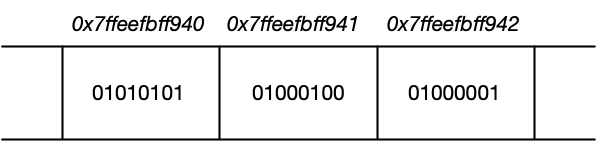
        * Computer memory represented as a sequence of data cells (e.g. 01010101) with their respective memory addresses shown on top.

    * Let us perform a short experiment using gdb again: By adding 1, 2, 3, … to the address of the string variable str1, we can proceed to the next cell until we reach the end of the memory we want to look at.

        * 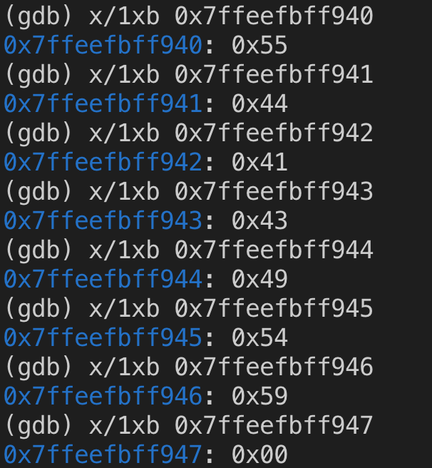 
    
    * Note that the numbers above represent the string "UDACITY" again. Also note that once we exceed the end of the string, the memory cell has the value 0x00. This means that the experiment has shown that an offset of 1 in a hexadecimal address corresponds to an offset of 8 bits (or 1 byte) in computer memory.

* Types of Computer Memory

    * In a course on memory management we obviously need to take a look at the available memory types in computer systems. Below you will find a small list of some common memory types that you will surely have heard of:

        * RAM / ROM
        * Cache (L1, L2)
        * Registers
        * Virtual Memory
        * Hard Disks, USB drives
    
    * Let us look into these types more deeply: When the CPU of a computer needs to access memory, it wants to do this with minimal latency. Also, as large amounts of information need to be processed, the available memory should be sufficiently large with regard to the tasks we want to accomplish.

    * Regrettably though, low latency and large memory are not compatible with each other (at least not at a reasonable price). In practice, the decision for low latency usually results in a reduction of the available storage capacity (and vice versa). This is the reason why a computer has multiple memory types that are arranged hierarchically. The following pyramid illustrates the principle:

        * 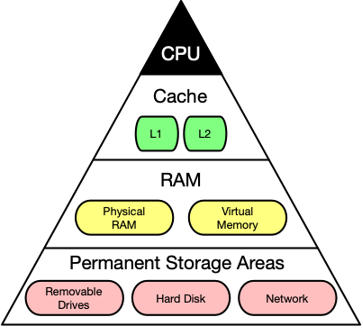
        * Computer memory latency and size hierarchy.

    * As you can see, the CPU and its ultra-fast (but small) registers used for short-term data storage reside at the top of the pyramid. Below are Cache and RAM, which belong to the category of temporary memory which quickly looses its content once power is cut off. Finally, there are permanent storage devices such as the ROM, hard drives as well as removable drives such as USB sticks.

    * Let us take a look at a typical computer usage scenario to see how the different types of memory are used:

        * After switching on the computer, it loads data from its read-only memory (ROM) and performs a power-on self-test (POST) to ensure that all major components are working properly. Additionally, the computer memory controller checks all of the memory addresses with a simple read/write operation to ensure that memory is functioning correctly.

        * After performing the self-test, the computer loads the basic input/output system (BIOS) from ROM. The major task of the BIOS is to make the computer functional by providing basic information about such things as storage devices, boot sequence, security or auto device recognition capability.

        * The process of activating a more complex system on a simple system is called "bootstrapping": It is a solution for the chicken-egg-problem of starting a software-driven system by itself using software. During bootstrapping, the computer loads the operating system (OS) from the hard drive into random access memory (RAM). RAM is considered "random access" because any memory cell can be accessed directly by intersecting the respective row and column in the matrix-like memory layout. For performance reasons, many parts of the OS are kept in RAM as long as the computer is powered on.

        * When an application is started, it is loaded into RAM. However, several application components are only loaded into RAM on demand to preserve memory. Files that are opened during runtime are also loaded into RAM. When a file is saved, it is written to the specified storage device. After closing the application, it is deleted from RAM.

    * This simple usage scenario shows the central importance of the RAM. Every time data is loaded or a file is opened, it is placed into this temporary storage area - but what about the other memory types above the RAM layer in the pyramid?

    * To maximize CPU performance, fast access to large amounts of data is critical. If the CPU cannot get the data it needs, it stops and waits for data availability. Thus, when designing new memory chips, engineers must adapt to the speed of the available CPUs. The problem they are facing is that memory which is able to keep up with modern CPUs running at several GHz is extremely expensive. To combat this, computer designers have created the memory tier system which has already been shown in the pyramid diagram above. The solution is to use expensive memory in small quantities and then back it up using larger quantities of less expensive memory.

    * The cheapest form of memory available today is the hard disk. It provides large quantities of inexpensive and permanent storage. The problem of a hard disk is its comparatively low speed - even though access times with modern solid state disks (SSD) have decreased significantly compared to older magnetic-disc models.

    * The next hierarchical level above hard disks or other external storage devices is the RAM. We will not discuss in detail how it works but only take a look at some key performance metrics of the CPU at this point, which place certain performance expectations on the RAM and its designers:

        * The **bit size** of the CPU decides how many bytes of data it can access in RAM memory at the same time. A 16-bit CPU can access 2 bytes (with each byte consisting of 8 bit) while a 64-bit CPU can access 8 bytes at a time.

        * The **processing speed** of the CPU is measured in Gigahertz or Megahertz and denotes the number of operations it can perform in one second.
    
    * From processing speed and bit size, the data rate required to keep the CPU busy can easily be computed by multiplying bit size with processing speed. With modern CPUs and ever-increasing speeds, the available RAM in the market will not be fast enough to match the CPU data rate requirements.

    * Cache Levels

        * Cache memory is much faster but also significantly smaller than standard RAM. It holds the data that will (or might) be used by the CPU more often. In the memory hierarchy we have seen in the last section, the cache plays an intermediary role between fast CPU and slow RAM and hard disk. The figure below gives a rough overview of a typical system architecture:

        * 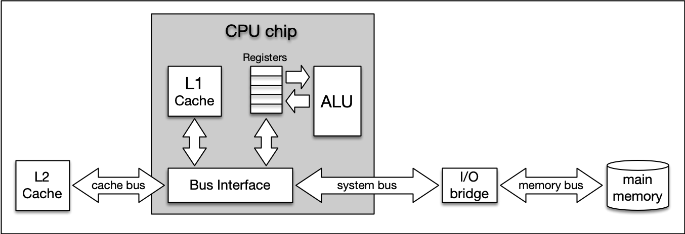

        * System architecture diagram showing caches, ALU (arithmetic logic unit), main memory, and the buses connected each component.

    * The central CPU chip is connected to the outside world by a number of buses. There is a cache bus, which leads to a block denoted as L2 cache, and there is a system bus as well as a memory bus that leads to the computer main memory. The latter holds the comparatively large RAM while the L2 cache as well as the L1 cache are very small with the latter also being a part of the CPU itself.

    * The concept of L1 and L2 (and even L3) cache is further illustrated by the following figure, which shows a multi-core CPU and its interplay with L1, L2 and L3 caches:

        * 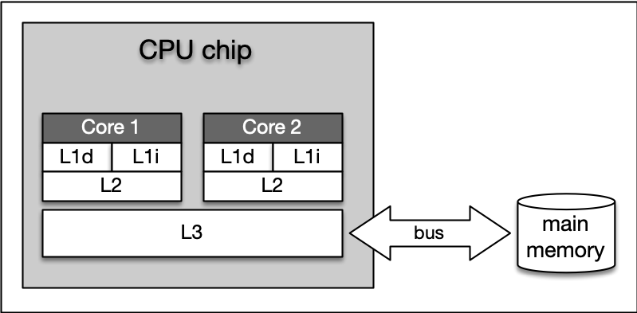 
        * L1, L2, and L3 cache

    * **Level 1 cache** is the fastest and smallest memory type in the cache hierarchy. In most systems, the L1 cache is not very large. Mostly it is in the range of **16 to 64 kBytes**, where the memory areas for instructions and data are separated from each other (L1i and L1d, where "i" stands for "instruction" and "d" stands for "data". Also see "Harvard architecture" for further reference). The importance of the L1 cache grows with increasing speed of the CPU. In the L1 cache, the most frequently required instructions and data are buffered so that as few accesses as possible to the slow main memory are required. This cache avoids delays in data transmission and helps to make optimum use of the CPU's capacity.

    * **Level 2 cache** is located close to the CPU and has a direct connection to it. The information exchange between L2 cache and CPU is managed by the L2 controller on the computer main board. The size of the L2 cache is usually at or below 2 megabytes. On modern multi-core processors, the L2 cache is often located within the CPU itself. The choice between a processor with more clock speed or a larger L2 cache can be answered as follows: With a higher clock speed, individual programs run faster, especially those with high computing requirements. As soon as several programs run simultaneously, a larger cache is advantageous. Usually normal desktop computers with a processor that has a large cache are better served than with a processor that has a high clock rate.

    * **Level 3 cache** is shared among all cores of a multicore processor. With the L3 cache, the cache coherence protocol of multicore processors can work much faster. This protocol compares the caches of all cores to maintain data consistency so that all processors have access to the same data at the same time. The L3 cache therefore has less the function of a cache, but is intended to simplify and accelerate the cache coherence protocol and the data exchange between the cores.

    * On Mac, information about the system cache can be obtained by executing the command `sysctl -a hw` in a terminal. On Debian Linux linux, this information can be found with `lscpu | grep cache`. On my iMac Pro (2017), this command yielded (among others) the following output:

        * ```bash
            hw.memsize: 34359738368
            hw.l1icachesize: 32768
            hw.l1dcachesize: 32768
            hw.l2cachesize: 1048576
            hw.l3cachesize: 14417920
            ```
        * `hw.l1icachesize` is the size of the L1 instruction cache, wich is at 32kB. This cache is strictly reserved for storing CPU instructions only.

        * `hw.l1dcachesize` is also 32 KB and is dedicated for data as opposed to instructions.

        * `hw.l2cachesize` and `hw.l3cachesize` show the size of the L2 and L3 cache, which are at 1MB and 14MB respectively.

        * It should be noted that the size of all caches combined is very small when compared to the size of the main memory (the RAM), which is at 32GB on my system.

    * Ideally, data needed by the CPU should be read from the various caches for more than 90% of all memory access operations. This way, the high latency of RAM and hard disk can be efficiently compensated.

    * Temporal and Spatial Locality
        * The following table presents a rough overview of the latency of various memory access operations. Even though these numbers will differ significantly between systems, the order of magnitude between the different memory types is noteworthy. While L1 access operations are close to the speed of a photon traveling at light speed for a distance of 1 foot, the latency of L2 access is roughly one order of magnitude slower already while access to main memory is two orders of magnitude slower.

        * 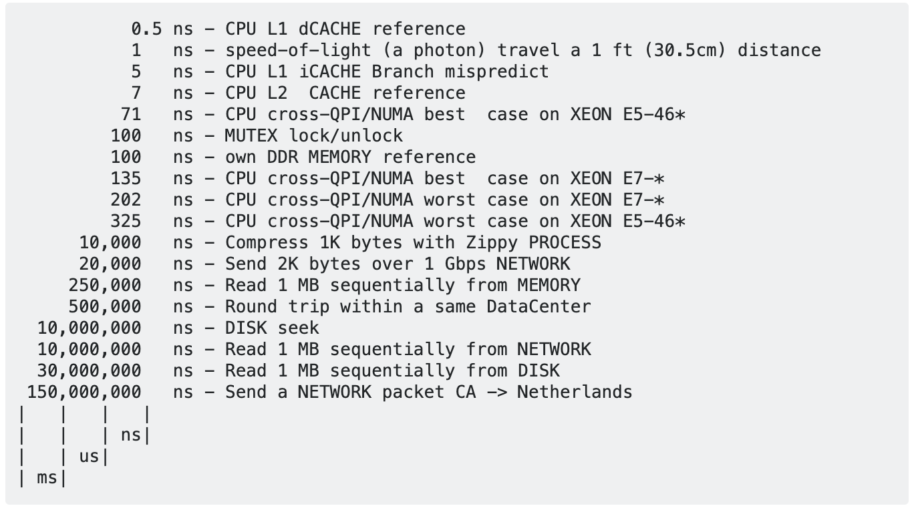
        
        * Originally from Peter Norvig: http://norvig.com/21-days.html#answers

    * In algorithm design, programmers can exploit two principles to increase runtime performance:

        * **Temporal locality** means that address ranges that are accessed are likely to be used again in the near future. In the course of time, the same memory address is accessed relatively frequently (e.g. in a loop). This property can be used at all levels of the memory hierarchy to keep memory areas accessible as quickly as possible.

        * **Spatial locality** means that after an access to an address range, the next access to an address in the immediate vicinity is highly probable (e.g. in arrays). In the course of time, memory addresses that are very close to each other are accessed again multiple times. This can be exploited by moving the adjacent address areas upwards into the next hierarchy level during a memory access.

    * Let us consider the following code example:

    * ```cpp
        #include <chrono>
        #include <iostream>

        int main()
        {
            // create array 
            const int size = 4;
            // static means the variable is not allocated in the stack (stored in data segment or in BSS segment).
            // What it is useful for however is if you have some large structure used in main that would be too big for the stack. Then, declaring the variable as static means it lives in the data segment.
            // Being static also means that, if uninitialized, the variable will be initialized with all 0's, just like globals.


            static int x[size][size];

            auto t1 = std::chrono::high_resolution_clock::now();
            for (int i = 0; i < size; i++)
            {
                for (int j = 0; j < size; j++)
                {
                    x[j][i] = i + j;
                    // std::cout << &x[j][i] << ": i=" << i << ", j=" << j << std::endl;
                }
            }

            // print execution time to console
            auto t2 = std::chrono::high_resolution_clock::now(); // stop time measurement
            auto duration = std::chrono::duration_cast<std::chrono::microseconds>(t2 - t1).count();
            std::cout << "Execution time: " << duration << " microseconds" << std::endl;

            return 0;
        }
        ```
        
        * The order we access our array impacts speed in this example. Having said that, accessing "line" neighbour addesses by using `x[i][j]` is faster compared to accessing "column" neighbour addresses with `x[j][i]`. Remember, a matrix is stored in a single line in memory, just like an array.

        * As can be seen, the rows of the two-dimensional matrix are copied one after the other. This format is called "row major" and is the default for both C and C++. Some other languages such as Fortran are "column major" and a memory-aware programmer should always know the memory layout of the language he or she is using.

        * Note that even though the row major memory layout is used in C++, this doesn't mean that all C++ libraries have the same default; for example, the popular Eigen library used for.

     * **As we have created an array of integers, the difference between two adjacent memory cells will be sizeof(int), which is 4 bytes. Let us verify this by changing the size of the array to 4x4 and by plotting both the address and the index numbers to the console. Be sure to revert the array access back to `x[i][j] = i + j`.**

    
    * You can plot by uncommenting the printout line in the inner for loop:

        * ```bash
            0x6021e0: i=0, j=0
            0x6021e4: i=0, j=1
            0x6021e8: i=0, j=2
            0x6021ec: i=0, j=3

            0x6021f0: i=1, j=0
            0x6021f4: i=1, j=1
            0x6021f8: i=1, j=2
            0x6021fc: i=1, j=3

            0x602200: i=2, j=0
            0x602204: i=2, j=1
            0x602208: i=2, j=2
            0x60220c: i=2, j=3

            0x602210: i=3, j=0
            0x602214: i=3, j=1
            0x602218: i=3, j=2
            0x60221c: i=3, j=3

            Execution time: 83 microseconds
            ```
    * When we interchange the indices i and j when accessing the array as

        * ```cpp
            x[j][i] = i + j;
            std::cout << &x[j][i] << ": i=" << j << ", j=" << i << std::endl;
            ```
        
    * we get the following output:

        * ```bash
            0x6021e0: i=0, j=0
            0x6021f0: i=1, j=0
            0x602200: i=2, j=0
            0x602210: i=3, j=0

            0x6021e4: i=0, j=1
            0x6021f4: i=1, j=1
            0x602204: i=2, j=1
            0x602214: i=3, j=1

            0x6021e8: i=0, j=2
            0x6021f8: i=1, j=2
            0x602208: i=2, j=2
            0x602218: i=3, j=2

            0x6021ec: i=0, j=3
            0x6021fc: i=1, j=3
            0x60220c: i=2, j=3
            0x60221c: i=3, j=3

            Execution time: 115 microseconds
            ```

    * As can be see, the difference between two rows is now 0x10, which is 16 in the decimal system. This means that with each access to the matrix, four memory cells are skipped and the principle of spatial locality is violated. As a result, the wrong data is loaded into the L1 cache, leading to cache misses and costly reload operations - hence the significantly increased execution time between the two code samples. The difference in execution time of both code samples shows that cache-aware programming can increase

* Virtual Memory

    * Problems with physical memory

        * Virtual memory is a very useful concept in computer architecture because it helps with making your software work well given the configuration of the respective hardware on the computer it is running on.

        * The idea of virtual memory stems back from a (not so long ago) time, when the random access memory (RAM) of most computers was severely limited. Programers needed to treat memory as a precious resource and use it most efficiently. Also, they wanted to be able to run programs even if there was not enough RAM available. At the time of writing (August 2019), the amount of RAM is no longer a large concern for most computers and programs usually have enough memory available to them. But in some cases, for example when trying to do video editing or when running multiple large programs at the same time, the RAM memory can be exhausted. In such a case, the computer can slow down drastically.

        * There are several other memory-related problems, that programmers need to know about:

            * **Holes in address space**: If several programs are started one after the other and then shortly afterwards some of these are terminated again, it must be ensured that the freed-up space in between the remaining programs does not remain unused. If memory becomes too fragmented, it might not be possible to allocate a large block of memory due to a large-enough free contiguous block not being available any more.

            * **Programs writing over each other** : If several programs are allowed to access the same memory address, they will overwrite each others' data at this location. In some cases, this might even lead to one program reading sensitive information (e.g. bank account info) that was written by another program. This problem is of particular concern when writing concurrent programs which run several threads at the same time.

        * The basic idea of virtual memory is to separate the addresses a program may use from the addresses in physical computer memory. By using a mapping function, an access to (virtual) program memory can be redirected to a real address which is guaranteed to be protected from other programs.

        * In the following, you will see, how virtual memory solves the problems mentioned above and you will also learn about the concepts of memory pages, frames and mapping. A sound knowledge on virtual memory will help you understand the C++ memory model, which will be introduced in the next lesson of this course.

        * Quiz

            * On a 32-bit machine, each program has its own 32-bit address space. When a program wants to access a memory location, it must specify a 32-bit address, which directs it to the byte stored at this location. On a hardware level, this address is transported to the physical memory via a parallel bus with 32 cables, i.e. each cable can either have the information 'high voltage', and 'low voltage' (or '1' and '0').

            * How large is the address space on a 32-bit system? What is the upper limit for program memory in GB?
                * Correct! 2^32 bytes = 4GB; a 32-bit address space gives a program a (theoretical) total of 4 GB of memory it can address. In practice, the operating systems reserves some of this space however.

        * Expanding the available memory

            * As you have just learned in the quiz, the total amount of addressable memory is limited and depends on the architecture of the system (e.g. 32-bit). But what would happen if the available physical memory was below the upper bound imposed by the architecture? The following figure illustrates the problem for such a case:

            * 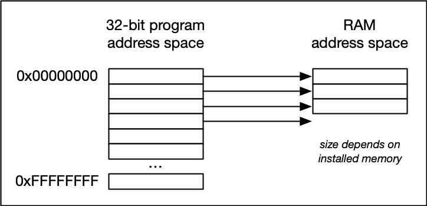 
            * In the image above, the available physical memory is less than the upper bound provided by the 32-bit address space.
        
        * On a typical architecture such as MIPS ("Microprocessor without interlocked pipeline stages"), each program is promised to have access to an address space ranging from 0x00000000 up to 0xFFFFFFFF. If however, the available physical memory is only 1GB in size, a 1-on-1 mapping would lead to undefined behavior as soon as the 30-bit RAM address space were exceeded.

        * With virtual memory however, a mapping is performed between the virtual address space a program sees and the physical addresses of various storage devices such as the RAM but also the hard disk. Mapping makes it possible for the operating system to use physical memory for the parts of a process that are currently being used and back up the rest of the virtual memory to a secondary storage location such as the hard disk. With virtual memory, the size of RAM is not the limit anymore as the system hard disk can be used to store information as well.

        * The following figure illustrates the principle:

        * 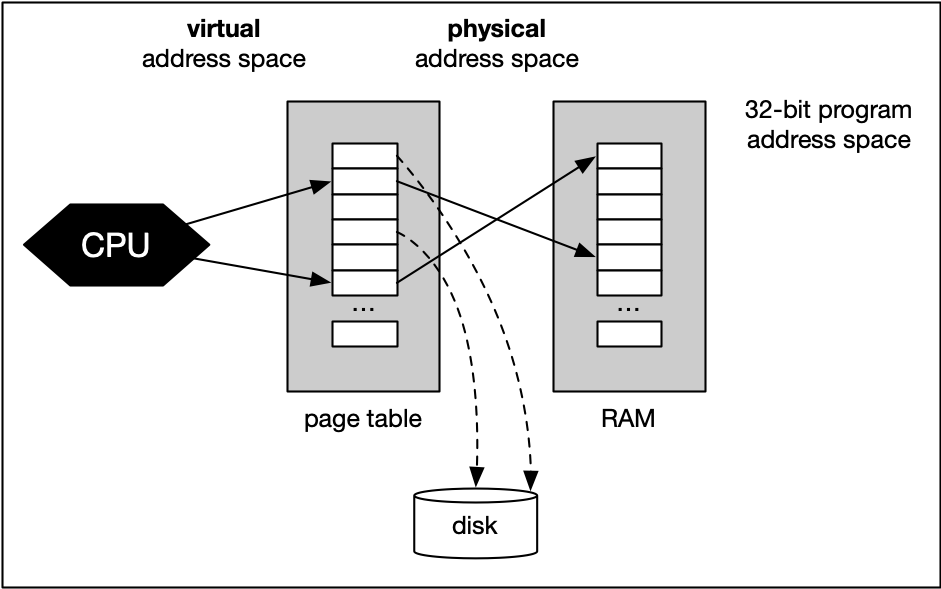 

        * With virtual memory, the RAM acts as a cache for the virtual memory space which resides on secondary storage devices. On Windows systems, the file `pagefile.sys` is such a virtual memory container of varying size. To speed up your system, it makes sense to adjust the system settings in a way that this file is stored on an SSD instead of a slow magnetic hard drive, thus reducing the latency. On a Mac, swap files are stored in `/private/var/vm/`.

    * In a nutshell, virtual memory guarantees us a fixed-size address space which is largely independent of the system configuration. Also, the OS guarantees that the virtual address spaces of different programs do not interfere with each other.

    * The task of mapping addresses and of providing each program with its own virtual address space is performed entirely by the operating system, so from a programmer’s perspective, we usually don’t have to bother much about memory that is being used by other processes.

    * Before we take a closer look at an example though, let us define two important terms which are often used in the context of caches and virtual memory:

        * A **memory page** is a number of directly successive memory locations in virtual memory defined by the computer architecture and by the operating system. The computer memory is divided into **memory pages of equal size**. The use of memory pages enables the operating system to perform virtual memory management. The entire working memory is divided into tiles and each address in this computer architecture is interpreted by the **Memory Management Unit (MMU)** as a **logical address** and converted into a **physical address**.

        * A **memory frame** is mostly identical to the concept of a memory page with the key difference being its **location in the physical main memory instead of the virtual memory**.

    * The following diagram shows two running processes and a collection of memory pages and frames:

    * 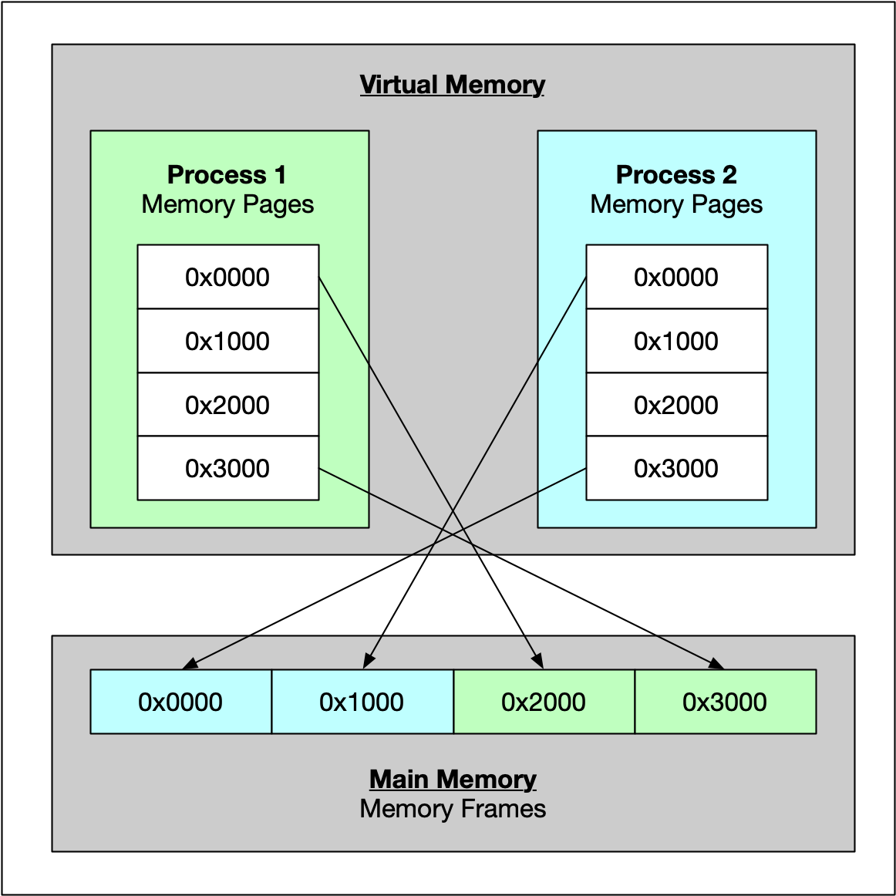

    * As can be seen, both processes have their own virtual memory space. Some of the pages are mapped to frames in the physical memory and some are not. If process 1 needs to use memory in the memory page that starts at address 0x1000, a page fault will occur if the required data is not there. The memory page will then be mapped to a vacant memory frame in physical memory. Also, note that the virtual memory addresses are not the same as the physical addresses. The first memory page of process 1, which starts at the virtual address 0x0000, is mapped to a memory frame that starts at the physical address 0x2000.

    * In summary, virtual memory management is performed by the operating system and programmers do usually not interfere with this process. The major benefit is a unique perspective on a chunk of memory for each program that is only limited in its size by the architecture of the system (32 bit, 64 bit) and by the available physical memory, including the hard disk.

* Variables and Memory

    * The Process Memory Model

        * As we have seen in the previous lesson, each program is assigned its own virtual memory by the operating system. This address space is arranged in a linear fashion with one block of data being stored at each address. It is also divided into several distinct areas as illustrated by the figure below:

        * 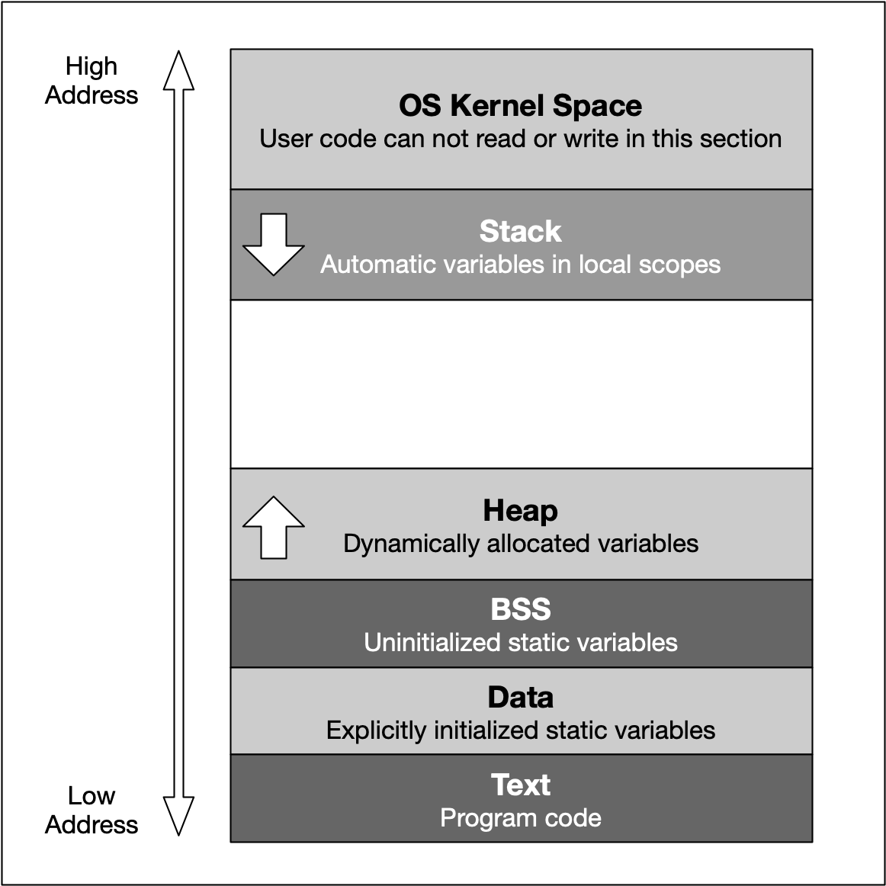

        * The last address `0cFFFFFFFF` converts to the decimal 4.294.967.295 , which is the total amount of memory blocks that can theoretically addressed in a `32 bit` operating system - hence the well-known limit of 4GB of memory. On a 64 bit system, the available space is significantly (!) larger. Also, the addresses are stored with 8 bytes instead of 4 bytes.

        * From a programming perspective though, we are not able to use the entire address space. Instead, the blocks "OS Kernel Space" and "Text" are reserved for the operating system. In kernel space, only the most trusted code is executed - it is fully maintained by the operating system and serves as an interface between the user code and the system kernel. In this course, we will not be directly concerned with this part of memory. The section called 'text' holds the program code generated by the compiler and linker. As with the kernel space, we will not be using this block directly in this course. Let us now take a look at the remaining blocks, starting from the top:

            * The **stack** is a contiguous memory block with a fixed maximum size. If a program exceeds this size, it will crash. The stack is used for storing automatically allocated variables such as local variables or function parameters. If there are multiple threads in a program, then each thread has its own stack memory. New memory on the stack is allocated when the path of execution enters a scope and freed again once the scope is left. It is important to know that the stack is managed "automatically" by the compiler, which means we do not have to concern ourselves with allocation and deallocation.

            * The **heap** (also called "free store" in C++) is where data with dynamic storage lives. It is shared among multiple threads in a program, which means that memory management for the heap needs to take concurrency into account. This makes memory allocations in the heap more complicated than stack allocations. In general, managing memory on the heap is more (computationally) expensive for the operating system, which makes it slower than stack memory. Contrary to the stack, the heap is not managed automatically by the system, but by the programmer. If memory is allocated on the heap, it is the programmer’s responsibility to free it again when it is no longer needed. If the programmer manages the heap poorly or not at all, there will be trouble.

            * The **BSS** (Block Started by Symbol) segment is used in many compilers and linkers for a segment that contains global and static variables that are initialized with zero values. This memory area is suitable, for example, for arrays that are not initialized with predefined values.

            * The **Data** segment serves the same purpose as the BSS segment with the major difference being that variables in the Data segment have been initialized with a value other than zero. Memory for variables in the Data segment (and in BSS) is allocated once when a program is run and persists throughout its lifetime.

* Memory Allocation in C++

    * Now that we have an understanding of the available process memory, let us take a look at memory allocation in C++.

    * Not every variable in a program has a permanently assigned area of memory. The term allocate refers to the process of assigning an area of memory to a variable to store its value. A variable is deallocated when the system reclaims the memory from the variable, so it no longer has an area to store its value.

    * Generally, three basic types of memory allocation are supported:

        * **Static memory allocation** is performed for static and global variables, which are stored in the BSS and Data segment. Memory for these types of variables is allocated once when your program is run and persists throughout the life of your program.

        * **Automatic memory allocation** is performed for function parameters as well as local variables, which are stored on the stack. Memory for these types of variables is allocated when the path of execution enters a scope and freed again once the scope is left.

        * **Dynamic memory allocation** is a possibility for programs to request memory from the operating system at runtime when needed. This is the major difference between automatic and static allocation, where the size of the variable must be known at compile time. Dynamic memory allocation is not performed on the limited stack but on the heap and is thus (almost) only limited by the size of the address space.

    * Properties of Stack Memory

        * In the available literature on C++, the terms stack and heap are used regularly, even though this is not formally correct: C++ has the free space, storage classes and the storage duration of objects. However, since stack and heap are widely used in the C++ community, we will also use it throughout this course. Should you come across the above-mentioned terms in a book or tutorial on the subject, you now know that they refer to the same concepts as stack and heap do.

        * As mentioned in the last section, the stack is the place in virtual memory where the local variables reside, including arguments to functions. Each time a function is called, the stack grows (from top to bottom) and each time a function returns, the stack contracts. When using multiple threads (as in concurrent programming), it is important to know that each thread has its own stack memory - which can be considered thread-safe.

        * In the following, a short list of key properties of the stack is listed:

            * The stack is a contiguous block of memory. It will not become fragmented (as opposed to the heap) and it has a fixed maximum size.

            * When the maximum size of the stack memory is exceeded, a program will crash.

            * Allocating and deallocating memory is fast on the stack. It only involves moving the stack pointer to a new position.

        * The following diagram shows the stack memory during a function call:

        * 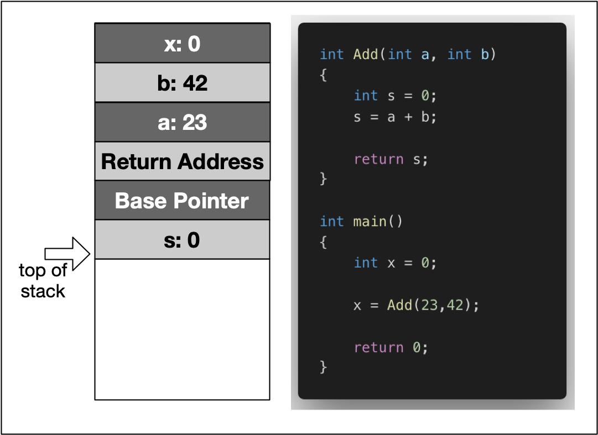 

        * In the example, the variable `x` is created on the stack within the scope of `main`. Then, a stack frame which represents the function `Add` and its variables is pushed to the stack, moving the stack pointer further downwards. It can be seen that this includes the local variables `a` and `b`, as well as the return address, a base pointer and finally the return value `s`.

    * When a thread is created, stack memory is allocated by the operating system as a contiguous block. With each new function call or local variable allocation, the stack pointer is moved until eventually it will reach the bottom of said memory block. Once it exceeds this limit (which is called "stack overflow"), the program will crash. We will try to find out the limit of your computer’s stack memory in the following exercise.

    * Before we take a look at the heap memory in the next lesson, let us briefly revisit the principles of call-by-value and call-by-reference with regard to stack usage.

* Call-by-Value vs Call-by-Reference

    * When passing parameters to a function in C++, there is a variety of strategies a programmer can choose from. In this section, we will take a look at these in turn from the perspective of stack usage. First, we will briefly revisit the definition of scope, as well as the strategies call-by-value and call-by-reference. Then, we will look at the amount of stack memory used by these methods.


    * The time between allocation and deallocation is called the lifetime of a variable. Using a variable after its lifetime has ended is a common programming error, against which most modern languages try to protect: Local variables are only available within their respective scope (e.g. inside a function) and are simply not available outside - so using them inappropriately will result in a compile-time error. When using pointer variables however, programmers must make sure that allocation is handled correctly and that no invalid memory addresses are accessed.

    * ```cpp
        bool MyLocalFunction(int myInt)
        {
            bool isBelowThreshold = myInt < 42 ? true : false;
            return isBelowThreshold;
        }

        int main()
        {
            bool res = MyLocalFunction(23);
            return 0; 
        }
        ```

    * When calling a function as in the previous code example, its parameters (in this case myInt) are used to create local copies of the information provided by the caller. The caller is not sharing the parameter with the function but instead a proprietary copy is created using the assignment operator = (more about that later). When passing parameters in such a way, it is ensured that changes made to the local copy will not affect the original on the caller side. The upside to this is that inner workings of the function and the data owned by the caller are kept neatly separate.

    * However, with a slight modification, we can easily create a backchannel to the caller side. Consider the code bellow.

    * ```cpp
        #include <iostream>

        void AddThree(int *val)
        {
            *val += 3;
        }

        int main()
        {
            int val = 0;
            AddThree(&val);
            val += 2;

            std::cout << "val = " << val << std::endl;
        
            return 0;
        }
        ```

    * Pointers vs. References

        * As we have seen in the examples above, the use of pointers and references to directly manipulate function arguments in a memory-effective way is very similar. Let us compare the two methods in the code on the right.

        * Pointers can be declared without initialization. This means we can pass an uninitialized pointer to a function who then internally performs the initialization for us.

        * Pointers can be reassigned to another memory block on the heap.

        * References are usually easier to use (depending on the expertise level of the programmer). Sometimes however, if a third-party function is used without properly looking at the parameter definition, it might go unnoticed that a value has been modified.

        * Remember, passing a pointer may be expensive:
            * ```cpp
                printf("size of int: %lu\n", sizeof(int));
                printf("size of *int: %lu\n", sizeof(int *));       
                // size of int: 4
                // size of *int: 8
                ```
            * Obviously, the size of the pointer variable is larger than the actual data type. As my machine has a 64 bit architecture, an address requires 8 byte.

            * In order to benefit from call-by-reference, the size of the data type passed to the function has to surpass the size of the pointer on the respective architecture (i.e. 32 bit or 64 bit).

        * ```cpp

            #include <stdio.h>
                
            void CallByValue(int i)
            {
                int j = 1; 
                printf ("call-by-value: %p\n",&j);
            }

            void CallByPointer(int *i)
            {
                int j = 1; 
                printf ("call-by-pointer: %p\n",&j);
            }

            void CallByReference(int &i)
            {
                int j = 1; 
                printf ("call-by-reference: %p\n",&j);
            }

            int main()
            {
                int i = 0;
                printf ("stack bottom: %p\n",&i);
                
                CallByValue(i);

                CallByPointer(&i);

                CallByReference(i);

                return 0;
            }
            ```
        *  CallByValue requires 32 bytes of memory. As discussed before, this is reserved for e.g. the function return address and for the local variables within the function (including the copy of i).

        * CallByPointer on the other hand requires - perhaps surprisingly - 36 bytes of memory. Let us complete the examination before going into more details on this result.

        * CallByReference finally has the same memory requirements as CallByPointer.

* Dynamic Memory Allocation

    * Heap memory, also know as dynamic memory , is an important resource available to programs (and programmers) to store data. The following diagram again shows the layout of virtual memory with the heap being right above the BSS and Data segment.

    * 

    * As mentioned earlier, the heap memory grows upwards while the stack grows in the opposite direction. We have seen in the last lesson that the automatic stack memory shrinks and grows with each function call and local variable. As soon as the scope of a variable is left, it is automatically deallocated and the stack pointer is shifted upwards accordingly.

    * Heap memory is different in many ways: The programmer can request the allocation of memory by issuing a command such as `malloc` or `new` (more on that shortly). This block of memory will remain allocated until the programmer explicitly issues a command such as `free` or `delete`. The huge advantage of heap memory is the high degree of control a programmer can exert, albeit at the price of greater responsibility since memory on the heap must be actively managed.

    * Let us take a look at some properties of heap memory:

        * As opposed to local variables on the stack, memory can now be allocated in an arbitrary scope (e.g. inside a function) without it being deleted when the scope is left. Thus, as long as the address to an allocated block of memory is returned by a function, the caller can freely use it.

        * Local variables on the stack are allocated at compile-time. Thus, the size of e.g. a string variable might not be appropriate as the length of the string will not be known until the program is executed and the user inputs it. With local variables, a solution would be to allocate a long-enough array of and hope that the actual length does not exceed the buffer size. With dynamically allocated heap memory, variables are allocated at run-time. This means that the size of the above-mentioned string variable can be tailored to the actual length of the user input.

        * Heap memory is only constrained by the size of the address space and by the available memory. With modern 64 bit operating systems and large RAM memory and hard disks the programmer commands a vast amount of memory. However, if the programmer forgets to deallocate a block of heap memory, it will remain unused until the program is terminated. This is called a "memory leak".

        * Unlike the stack, the heap is shared among multiple threads, which means that memory management for the heap needs to take concurrency into account as several threads might compete for the same memory resource.

        * When memory is allocated or deallocated on the stack, the stack pointer is simply shifted upwards or downwards. Due to the sequential structure of stack memory management, stack memory can be managed (by the operating system) easily and securely. With heap memory, allocation and deallocation can occur arbitrarily, depending on the lifetime of the variables. This can result in fragmented memory over time, which is much more difficult and expensive to manage.

    * Memory Fragmentation

        * Let us construct a theoretic example of how memory on the heap can become fragmented: Suppose we are interleaving the allocation of two data types `X` and `Y` in the following fashion: First, we allocate a block of memory for a variable of type X, then another block for Y and so on in a repeated manner until some upper bound is reached. At the end of this operation, the heap might look like the following:

        * 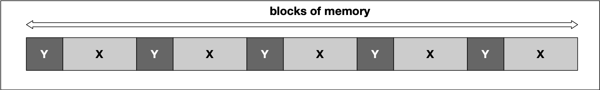

        * At some point, we might then decide to deallocate all variables of type Y, leading to empty spaces in between the remaining variables of type X. In between two blocks of type "X", no memory for an additional "X" could now be squeezed in this example.

        * 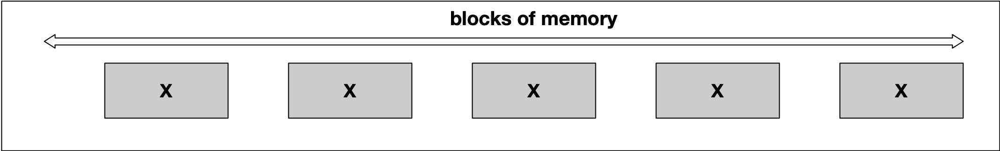

        * A classic symptom of memory fragmentation is that you try to allocate a large block and you can’t, even though you appear to have enough memory free. On systems with virtual memory however, this is less of a problem, because large allocations only need to be contiguous in virtual address space, not in physical address space.

        * When memory is heavily fragmented however, memory allocations will likely take longer because the memory allocator has to do more work to find a suitable space for the new object.

        * Until now, our examples have been only theoretical. It is time to gain some practical experience in the next section using `malloc` and `free` as C-style methods for dynamic memory management.

* `malloc` and `free`

    * So far we only considered primitive data types, whose storage space requirement was already fixed at compile time and could be scheduled with the building of the program executable. However, it is not always possible to plan the memory requirements exactly in advance, and it is inefficient to reserve the maximum memory space each time just to be on the safe side. C and C++ offer the option to reserve memory areas during the program execution, i.e. at runtime. It is important that the reserved memory areas are released again at the "appropriate point" to avoid memory leaks. It is one of the major challenges in memory management to always locate this "appropriate point" though.

* Allocating Dynamic Memory¶

    * To allocate dynamic memory on the heap means to make a contiguous memory area accessible to the program at runtime and to mark this memory as occupied so that no one else can write there by mistake.

    * To reserve memory on the heap, one of the two functions `malloc` (stands for Memory Allocation) or `calloc` (stands for Cleared Memory Allocation) is used. The header file `stdlib.h` or `malloc.h` must be included to use the functions.

    * Here is the syntax of `malloc` and `calloc` in C/C++:

        * ```cpp
            pointer_name = (cast-type*) malloc(size);
            pointer_name = (cast-type*) calloc(num_elems, size_elem);
            ```
    
    * `malloc` is used to dynamically allocate a single large block of memory with the specified size. It returns a pointer of type `void` which can be cast into a pointer of any form.

    * `calloc` is used to dynamically allocate the specified number of blocks of memory of the specified type. It initializes each block with a default value '0'.

    * Both functions return a pointer of type `void` which can be cast into a pointer of any form. If the space for the allocation is insufficient, a NULL pointer is returned.

    * ```cpp
        #include <stdio.h> 
        #include <stdlib.h> 
        
        int main() 
        { 
            void *p = malloc(sizeof(int));
            printf("address=%p, value=%d\n", p, *p);

            return 0; 
        }
        ```

    * The `sizeof` command is a convenient way of specifying the amount of memory (in bytes) needed to store a certain data type. For an int, sizeof returns 4. However, when compiling this code, the following warning is generated on my machine:

    * ```bash
        warning: ISO C++ does not allow indirection on operand of type 'void *' [-Wvoid-ptr-dereference] 

        printf("address=%p, value=%d", p, *p);
        ```
    
    * In the virtual workspace, when compiling with `g++`, an error is thrown instead of a warning.

    * The problem with `void` pointers is that there is no way of knowing the offset to the end of the allocated memory block. For an int, this would be 4 bytes but for a double, the offset would be 8 bytes. So in order to retrieve the entire block of memory that has been reserved, we need to know the data type and the way to achieve this with `malloc` is by casting the return pointer: `int *p = (int*)malloc(sizeof(int));`

    * This code now produces the following output without compiler warnings: `address=0x1003001f0, value=0`

    * Obviously, the memory has been initialized with 0 in this case. However, you should not rely on pre-initialization as this depends on the data type as well as on the compiler you are using.

    * At compile time, only the space for the pointer is reserved (on the stack). When the pointer is initialized, a block of memory of `sizeof(int)` bytes is allocated (on the heap) at program runtime. The pointer on the stack then points to this memory location on the heap.

    * Modify the example in a way that memory for 3 integers is reserved.

    * ```cpp
        // reserve memory for several integers
        int *p2 = (int*)malloc(3*sizeof(int));
        printf("address=%p, value=%d\n", p2, *p2);
        ```

* Memory for Arrays and Structs

    * Since arrays and pointers are displayed and processed identically internally, individual blocks of data can also be accessed using array syntax:

    * ```cpp
        int *p = (int*)malloc(3*sizeof(int));
        p[0] = 1; p[1] = 2; p[2] = 3;
        printf("address=%p, second value=%d\n", p, p[1]);
        ```
    
    * Until now, we have only allocated memory for a C/C++ data primitive (i.e. int). However, we can also define a proprietary structure which consists of several primitive data types and use `malloc` or `calloc` in the same manner as before:

    * ```cpp
        struct MyStruct {
            int i; 
            double d; 
            char a[5];
        };

        MyStruct *p = (MyStruct*)calloc(4,sizeof(MyStruct));
        p[0].i = 1; p[0].d = 3.14159; p[0].a[0] = 'a';
        ```
    
    * After defining the struct `MyStruct` which contains a number of data primitives, a block of memory four times the size of MyStruct is created using the `calloc` command. As can be seen, the various data elements can be accessed very conveniently.

    * The size of the memory area reserved with `malloc` or `calloc` can be increased or decreased with the `realloc` function.

    * `pointer_name = (cast-type*) realloc( (cast-type*)old_memblock, new_size );`

    * To do this, the function must be given a pointer to the previous memory area and the new size in bytes. Depending on the compiler, the reserved memory area is either (a) expanded or reduced internally (if there is still enough free heap after the previously reserved memory area) or (b) a new memory area is reserved in the desired size and the old memory area is released afterwards.

    * The data from the old memory area is retained, i.e. if the new memory area is larger, the data will be available within new memory area as well. If the new memory area is smaller, the data from the old area will be available only up until the site of the new area - the rest is lost.

    * In the example on the right, a block of memory of initially 8 bytes (two integers) is resized to 16 bytes (four integers) using `realloc`.

    * Note that `realloc` has been used to increase the memory size and then decrease it immediately after assigning the values 3 and 4 to the new blocks. The output looks like the following:

        * ```cpp
            address=0x100300060, value=1
            address=0x100300064, value=2
            address=0x100300068, value=3
            address=0x10030006c, value=4
            ```

    * ```cpp
        #include <stdio.h> 
        #include <stdlib.h> 

        int main() 
        { 
            // reserve memory for two integers
            int *p = (int*)malloc(2*sizeof(int));
            p[0] = 1; p[1] = 2; 

            // resize memory to hold four integers
            p = (int*)realloc(p,4*sizeof(int));
            p[2] = 3; p[3] = 4; 

            // resize memory again to hold two integers
            p = (int*)realloc(p,2*sizeof(int));

            printf("address=%p, value=%d\n", p+0, *(p+0)); // valid
            printf("address=%p, value=%d\n", p+1, *(p+1)); // valid

            printf("address=%p, value=%d\n", p+2, *(p+2)); // INVALID
            printf("address=%p, value=%d\n", p+3, *(p+3)); // INVALID

            return 0; 
        }
        ```

    * Interestingly, the pointers `p+2` and `p+3` can still access the memory location they point to. Also, the original data (numbers 3 and 4) is still there. So `realloc` will not erase memory but merely mark it as "available" for future allocations. It should be noted however that accessing a memory location after such an operation must be avoided as it could cause a `segmentation fault`. We will encounter segmentation faults soon when we discuss "dangling pointers" in one of the next lessons.

* Freeing up Memory

    * If memory has been reserved, it should also be released as soon as it is no longer needed. If memory is reserved regularly without releasing it again, the memory capacity may be exhausted at some point. If the RAM memory is completely used up, the data is swapped out to the hard disk, which slows down the computer significantly.

    * The free function releases the reserved memory area so that it can be used again or made available to other programs. To do this, the pointer pointing to the memory area to be freed is specified as a parameter for the function. In the free_example.cpp, a memory area is reserved and immediately released again.

    * ```cpp
        #include <stdio.h>
        #include <stdlib.h>

        int main()
        {
            void *p = malloc(100); 
            free(p);

            return 0;
        }
        ```
    
    * Some things should be considered with dynamic memory management, whose neglect in some cases might result in unpredictable program behavior or a system crash - in some cases unfortunately without error messages from the compiler or the operating system:

        * `free` can only free memory that was reserved with `malloc` or `calloc`.

        * `free` can only release memory that has not been released before. Releasing the same block of memory twice will result in an error.

    * In the example on the right, a pointer `p` is copied into a new variable p2, which is then passed to free AFTER the original pointer has been already released.

    * `free(41143,0x1000a55c0) malloc: *** error for object 0x1003001f0: pointer being freed was not allocated.`

    * In the workspace, you will see this error: `*** Error in './a.out': double free or corruption (fasttop): 0x0000000000755010 ***`

    * The pointer `p2` in the example is invalid as soon as `free(p)` is called. It still holds the address to the memory location which has been freed, but may not access it anymore. Such a pointer is called a **"dangling pointer"**.

    * Memory allocated with `malloc` or `calloc` is not subject to the familiar rules of variables in their respective scopes. This means that they exist independently of block limits until they are released again or the program is terminated. However, the pointers which refer to such heap-allocated memory are created on the stack and thus only exist within a limited scope. As soon as the scope is left, the pointer variable will be lost - but not the heap memory it refers to.


* Using `new` and `delete`

    * Comparing `malloc` with `new`

    * The functions `malloc` and `free` are library function and represent the default way of allocating and deallocating memory in C. In C++, they are also part of the standard and can be used to allocate blocks of memory on the heap.

    * With the introduction of classes and object oriented programming in C++ however, memory allocation and deallocation has become more complex: When an object is created, its constructor needs to be called to allow for member initialization. Also, on object deletion, the destructor is called to free resources and to allow for programmer-defined clean-up tasks. For this reason, C++ introduces the operators `new` / `delete`, which represent the **object-oriented counterpart** to memory management with `malloc` / `free`.

    * ```cpp
        #include <stdlib.h>
        #include <iostream>

        class MyClass
        {
        private:
            int *_number;

        public:
            MyClass()
            {
                std::cout << "Allocate memory\n";
                _number = (int *)malloc(sizeof(int));
            }
            ~MyClass()
            {
                std::cout << "Delete memory\n";
                free(_number);
            }
            void setNumber(int number)
            {
                *_number = number;
                std::cout << "Number: " << _number << "\n";
            }
        };


        int main()
        {
            // allocate memory using malloc
            // comment these lines out to run the example below
            MyClass *myClass = (MyClass *)malloc(sizeof(MyClass));
            myClass->setNumber(42); // EXC_BAD_ACCESS
            free(myClass);
            
            // allocate memory using new
            MyClass *myClass = new MyClass();
            myClass->setNumber(42); // works as expected
            delete myClass;

            return 0;
        }
        ```

    * If we were to create a C++ object with `malloc,` the constructor and destructor of such an object would not be called. Consider the class on the right. The constructor allocates memory for the private element _number (yes, we could have simply used int instead of int*, but that's for educational purposes only), and the destructor releases memory again. The setter method setNumber finally assigns a value to _number under the assumption that memory has been allocated previously.

    * In main, we will allocate memory for an instance of MyClass using both `malloc`/ `free` and `new`/`delete`.

    * With `malloc`, the program crashes on calling the method `setNumber`, as no memory has been allocated for _number - because the constructor has not been called. Hence, an `EXC_BAD_ACCESS` error occurs, when trying to access the memory location to which _number is pointing. With _new, the output looks like the following:

    * ```bash
        Allocate memory
        Number: 42
        Delete memory
        ```

    * Before we go into further details of `new`/`delete`, let us briefly summarize the major differences between `malloc`/`free` and `new`/`delete`:

        * Constructors / Destructors Unlike `malloc( sizeof(MyClass) )`, the call `new MyClass()` calls the constructor. Similarly, delete calls the destructor.

        * Type safety `malloc` returns a void pointer, which needs to be cast into the appropriate data type it points to. This is not type safe, as you can freely vary the pointer type without any warnings or errors from the compiler as in the following small example: `MyObject *p = (MyObject*)malloc(sizeof(int))`;

        * In C++, the call `MyObject *p = new MyObject()` returns the correct type automatically - it is thus type-safe.

        * Operator Overloading As `malloc` and `free` are functions defined in a library, their behavior can not be changed easily. The `new` and `delete` operators however can be overloaded by a class in order to include optional proprietary behavior. We will look at an example of overloading `new` further down in this section.

    * Creating and Deleting Objects

        * As with `malloc` and `free`, a call to `new` always has to be followed by a call to `delete` to ensure that memory is properly deallocated. If the programmer forgets to call delete on the object (which happens quite often, even with experienced programmers), the object resides in memory until the program terminates at some point in the future causing a memory leak.

        * Let us revisit a part of the code example to the right:

            * ```cpp
                myClass = new MyClass();
                myClass->setNumber(42); // works as expected
                delete myClass;
                ```

        * The call to `new` has the following consequences:

            * Memory is allocated to hold a new object of type `MyClass`

            * A new object of type `MyClass` is constructed within the allocated memory by calling the constructor of `MyClass`


        * The call to delete causes the following:

            * The object of type `MyClass` is destroyed by calling its destructor

            * The memory which the object was placed in is deallocated

    * Optimizing Performance with placement `new`

        * In some cases, it makes sense to separate memory allocation from object construction. Consider a case where we need to reconstruct an object several times. If we were to use the standard `new`/`delete` construct, memory would be allocated and freed unnecessarily as only the content of the memory block changes but not its size. By separating allocation from construction, we can get a significant performance increase.

        * C++ allows us to do this by using a construct called `placement new`: With `placement new`, we can pass a preallocated memory and construct an object at that memory location. Consider the following code:

        * ```cpp
            void *memory = malloc(sizeof(MyClass));
            MyClass *object = new (memory) MyClass;
            ```

        * The syntax `new (memory)` is denoted as `placement new`. The difference to the "conventional" `new` we have been using so far is that that **no memory is allocated**. The call constructs an object and places it in the assigned memory location. There is however, no `delete` equivalent to `placement new`, so we have to call the destructor explicitly in this case instead of using `delete` as we would have done with a regular call to `new`:

            * ```cpp
                object->~MyClass();
                free(memory); 
                ```
        * Important: Note that this should never be done outside of `placement new`.

        * In the next section, we will look at how to overload the new operator and show the performance difference between `placement new` and `new`

    * Overloading new and delete

        * ```cpp
            #include <iostream>
            #include <stdlib.h>

            class MyClass
            {
                int _mymember;

            public:
                MyClass()
                {
                    std::cout << "Constructor is called\n";
                }

                ~MyClass()
                {
                    std::cout << "Destructor is called\n";
                }

                void *operator new(size_t size)
                {
                    std::cout << "new: Allocating " << size << " bytes of memory" << std::endl;
                    void *p = malloc(size);

                    return p;
                }

                void operator delete(void *p)
                {
                    std::cout << "delete: Memory is freed again " << std::endl;
                    free(p);
                }
            };

            int main()
            {
                MyClass *p = new MyClass();
                delete p;
            }
            ```

        * One of the major advantages of `new`/`delete` over `free`/`malloc` is the possibility of overloading. While both `malloc` and `free` are function calls and thus can not be changed easily, `new` and `delete` are operators and can thus be overloaded to integrate customized functionality, if needed.

        * The syntax for overloading the new operator looks as follows:
            * `void* operator new(size_t size);`
        
        * The operator receives a parameter size of type `size_t`, which specifies the number of bytes of memory to be allocated. The return type of the overloaded `new` is a `void` pointer, which references the beginning of the block of allocated memory.

        * The syntax for overloading the `delete` operator looks as follows:

            * `void operator delete(void*);`
        
        * The operator takes a pointer to the object which is to be deleted. As opposed to `new`, the operator `delete` does not have a return value.

        * In the code to the above, both the `new` and the `delete` operator are overloaded. In `new`, the size of the class object in bytes is printed to the console. Also, a block of memory of that size is allocated on the heap and the pointer to this block is returned. In `delete`, the block of memory is freed again. The console output of this example looks as follows:

            * ```bash
            new: Allocating 4 bytes of memory
            Constructor is called
            Destructor is called
            delete: Memory is freed again 
            ```

        * As can be seen from the order of text output, memory is instantiated in `new` before the constructor is called, while the order is reversed for the destructor and the call to `delete`.

    * Overloading new[] and delete[]:

        * In addition to the `new` and `delete` operators we have seen so far, we can use the following code to create an array of objects:

        * ```cpp
            void* operator new[](size_t size);
            void operator delete[](void*);
            ```

        * ```cpp
            #include <iostream>
            #include <stdlib.h>

            class MyClass
            {
                int _mymember;

            public:
                MyClass()
                {
                    std::cout << "Constructor is called\n";
                }

                ~MyClass()
                {
                    std::cout << "Destructor is called\n";
                }

                void *operator new[](size_t size)
                {
                    std::cout << "new: Allocating " << size << " bytes of memory" << std::endl;
                    void *p = malloc(size);

                    return p;
                }

                void operator delete[](void *p)
                {
                    std::cout << "delete: Memory is freed again " << std::endl;
                    free(p);
                }
            };

            int main()
            {
                MyClass *p = new MyClass[3]();
                delete[] p;
            }
            ```

    * In main, we are now creating an array of three objects of `MyClass`. Also, the overloaded `new` and `delete` operators have been changed to accept arrays. Let us take a look at the console output:

        * ```bash
            new: Allocating 20 bytes of memory
            Constructor is called
            Constructor is called
            Constructor is called
            Destructor is called
            Destructor is called
            Destructor is called
            delete: Memory is freed again 
            ```

    * Interestingly, the memory requirement is larger than expected: With `new`, the block size was 4 bytes, which is exactly the space required for a single integer. Thus, with three integers, it should now be 12 bytes instead of 20 bytes. The reason for this is the memory allocation overhead that the **compiler needs to keep track of the allocated blocks of memory** - which in itself consumes memory. If we change the above call to e.g. new MyClass[100](), we will see that the overhead of 8 bytes does not change:

        * ```bash
            new: Allocating 408 bytes of memory
            Constructor is called
            …
            Destructor is called
            delete: Memory is freed again 
            ```

    * Reasons for overloading `new` and `delete`

        * Now that we have seen how to overload the `new` and `delete` operators, let us summarize the major scenarios where it makes sense to do this:

            * The overloaded `new` operator function allows to add additional parameters. Therefore, a class can have multiple overloaded `new` operator functions. This gives the programmer more flexibility in customizing the memory allocation for objects.

            * Overloaded the `new` and `delete` operators provides an easy way to integrate a mechanism similar to garbage collection capabilities (such as in Java), as we will shorty see later in this course.

            * By adding exception handling capabilities into new and delete, the code can be made more robust.

            * It is very easy to add customized behavior, such as overwriting deallocated memory with zeros in order to increase the security of critical application data.

* Overview of memory management problems

    * One of the primary advantages of C++ is the flexibility and control of resources such as memory it gives to the programmer. This advantage is further amplified by a significant increase in the performance of C++ programs compared to other languages such as Python or Java.

    * However, these advantages come at a price as they demand a high level of experience from the programer. As Bjarne Stroustrup put it so elegantly:

        * "C makes it easy to shoot yourself in the foot; C++ makes it harder, but when you do it blows your whole leg off".
    
    * In this chapter, we will look at a collection of typical errors in memory management that you need to watch out for.

        * **Memory Leaks** Memory leaks occur when data is allocated on the heap at runtime, but not properly deallocated. A program that forgets to clear a memory block is said to have a memory leak - this may be a serious problem or not, depending on the circumstances and on the nature of the program. For a program that runs, computes something, and quits immediately, memory leaks are usually not a big concern. Memory leaks are mostly problematic for programs that run for a long time and/or use large data structures. In such a case, memory leaks can gradually fill the heap until allocation requests can no longer be properly met and the program stops responding or crashes completely. We will look at an example further down in this section.

        * **Buffer Overruns** Buffer overruns occur when memory outside the allocated limits is overwritten and thus corrupted. One of the resulting problems is that this effect may not become immediately visible. When a problem finally does occur, cause and effect are often hard to discern. It is also sometimes possible to inject malicious code into programs in this way, but this shall not be discussed here.

        * In this example, the allocated stack memory is too small to hold the entire string, which results in a segmentation fault:

        * ```cpp
            char str[5];
            strcpy(str,"BufferOverrun");
            printf("%s",str);
            ```

        * **Uninitialized Memory** Depending on the C++ compiler, data structures are sometimes initialized (most often to zero) and sometimes not. So when allocating memory on the heap without proper initialization, it might sometimes contain garbage that can cause problems.

        * Generally, a variable will be automatically initialized in these cases:

            * it is a class instance where the default constructor initializes all primitive types
            * array initializer syntax is used, such as int a[10] = {}
            * it is a global or extern variable
            * it is defined `static`

        * The behavior of the following code is potentially undefined:

            * ```cpp
                int a;
                int b=a*42;
                printf("%d",b);
                ```

        * **Incorrect pairing of allocation and deallocation** Freeing a block of memory more than once will cause a program to crash. This can happen when a block of memory is freed that has never been allocated or has been freed before. Such behavior could also occur when improper pairings of allocation and deallocation are used such as using `malloc()` with `delete` or `new` with `free()`.

        * In this first example, the wrong new and delete are paired

            * ```cpp
                double *pDbl=new double[5];
                delete pDbl;
                ```
        * In this second example, the pairing is correct but a double deletion is performed:

            * ```cpp
                char *pChr=new char[5];
                delete[] pChr;
                delete[] pChr;
                ```

        * **Invalid memory access** This error occurs then trying to access a block of heap memory that has not yet or has already been deallocated.

        * In this example, the heap memory has already been deallocated at the time when `strcpy()` tries to access it:

        * ```cpp
            char *pStr=new char[25];
            delete[] pStr;
            strcpy(pStr, "Invalid Access");
            ```

* [Valgrind](https://valgrind.org/) for debugging memory leaks

    * Even experienced developers sometimes make mistakes that cannot be discovered at first glance. Instead of spending a lot of time searching, it makes sense for C and C++ programmers to use helper tools to perform automatic analyses of their code.

    * In this section, we will look at `Valgrind`, a free software for Linux and Mac that is able to automatically detect memory. Windows programers can for example use the Visual Studio debugger and C Run-time Library (CRT) to detect and identify memory leaks. More information on how to do this can be found here: [Find memory leaks with the CRT Library - Visual Studio | Microsoft Docs](https://docs.microsoft.com/en-us/visualstudio/debugger/finding-memory-leaks-using-the-crt-library?view=vs-2019)

    * With recent versions of MacOS, occasional difficulties have been reported with installing `Valgrind.` A working version for MacOS Mojave can be downloaded from GitHub via Homebrew: GitHub - sowson/valgrind: [Experimental Version of Valgrind for macOS 10.14.6 Mojave](https://github.com/sowson/valgrind)

    * `Valgrind` is a framework that facilitates the development of tools for the dynamic analysis of programs. Dynamic analysis examines the behavior of a program at runtime, in contrast to static analysis, which often checks programs for various criteria or potential errors at the source code level before, during, or after translation. More information on Valgrind can be found here: [Valgrind: About](https://www.valgrind.org/info/)

    * The Memcheck tool within Valgrind can be used to detect typical errors in programs written in C or C++ that occur in connection with memory management. It is probably the best-known tool in the Valgrind suite, and the name Valgrind is often used as a synonym for Memcheck.

    * The following code generates a memory leak as the integer array has been allocated on the heap but the deallocation has been forgotten by the programmer:

        * ```cpp
            int main()
            {
                int *pInt = new int[10];

                return 0; 
            }
            ```

    * The array of integers on the heap to which pInt is pointing has a size of 10 * sizeof(int), which is 40 bytes. Let us now use Valgrind to search for this leak.

    * After compiling the `memory_leaks_debugging.cpp` code file on the right to a.out, the terminal can be used to start Valgrind with the following command:

        * `valgrind --leak-check=full --show-leak-kinds=all --track-origins=yes --log-file=/home/workspace/valgrind-out.txt /home/workspace/a.out`

    * Let us look at the call parameters one by one:

        * `--leak-check` : Controls the search for memory leaks when the client program finishes. If set to summary, it says how many leaks occurred. If set to full, each individual leak will be shown in detail.

        * `--show-leak-kinds` : controls the set of leak kinds to show when —leak-check=full is specified. Options are definite, indirect, possible reachable, all and none

        * `--track-origins` : can be used to see where uninitialised values come from.

    * You can read the file into the terminal with: `cat valgrind-out.txt`

    * In the following, a (small) excerpt of the `valgrind-out.txt` log file is given:

        * ```bash
            ==952== 40 bytes in 1 blocks are definitely lost in loss record 18 of 45
            ...
            ==952==    by 0x10019A377: operator new(unsigned long) (in /usr/lib/libc++abi.dylib)

            ...

            ==952==    by 0x100000F8A: main (memory_leaks_debugging.cpp:12)

            ...

            ==952== LEAK SUMMARY:
            ==952==    definitely lost: 40 bytes in 1 blocks
            ==952==    indirectly lost: 0 bytes in 0 blocks
            ==952==      possibly lost: 72 bytes in 3 blocks
            ==952==    still reachable: 200 bytes in 6 blocks
            ==952==         suppressed: 18,876 bytes in 160 blocks
            ```

    * As expected, the memory leak caused by the omitted deletion of the array of 10 integers in the code sample above shows up in the leak summary. Additionally, the exact position where the leak occurs in the code (line 12) can also be seen together with the responsible call with caused the leak.

    * This short introduction into memory leak search is only an example of how powerful analysis tools such as Valgrind can be used to detect memory-related problems in your code.

* Resources Copying Polices

    * Default copying

    * Resource management is one of the primary responsibilities of a C++ programmer. Among resources such as multi-threaded locks, files, network and database connections this also includes memory. The common denominator in all of these examples is that access to the resource is often managed through a handle such as a pointer. Also, after the resource has been used and is no longer, it must be released again so that it available for re-use by someone else.

    * In C++, a common way of safely accessing resources is by wrapping a manager class around the handle, which is initialized when the resource is acquired (in the class constructor) and released when it is deleted (in the class destructor). This concept is often referred to as Resource Acquisition is Initialization (RAII), which we will discuss in greater depth in the next concept. One problem with this approach though is that copying the manager object will also copy the handle of the resource. This allows two objects access to the same resource - and this can mean trouble.


