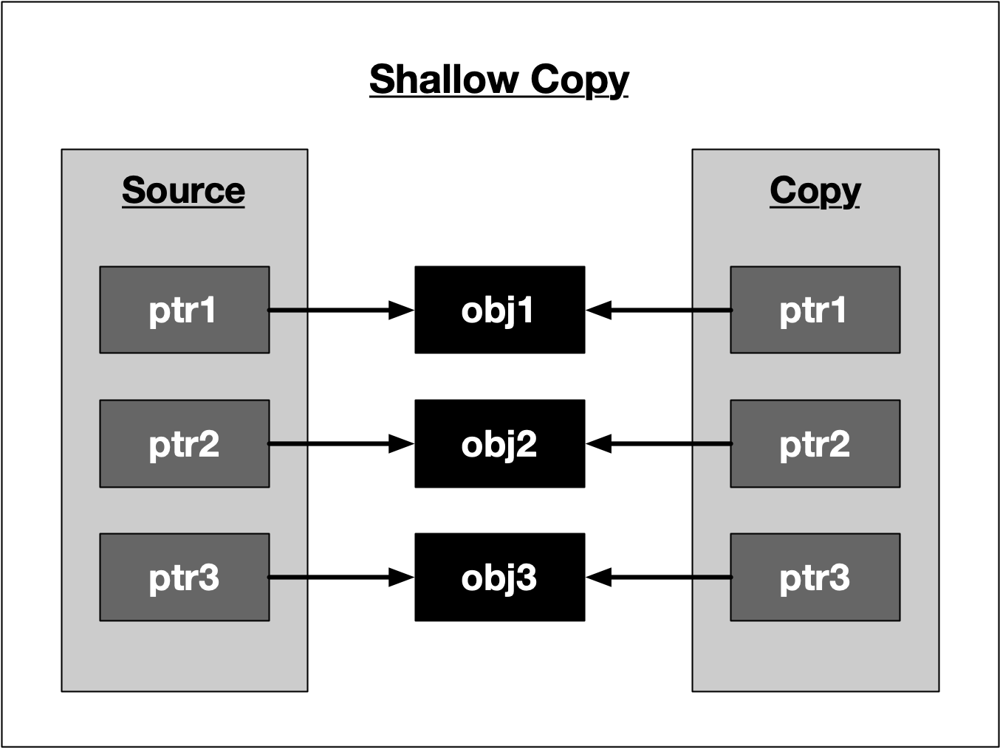
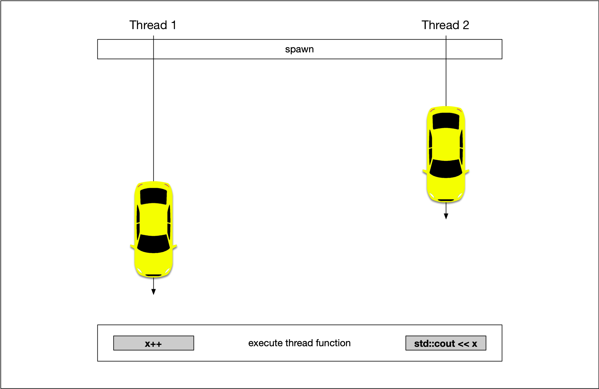
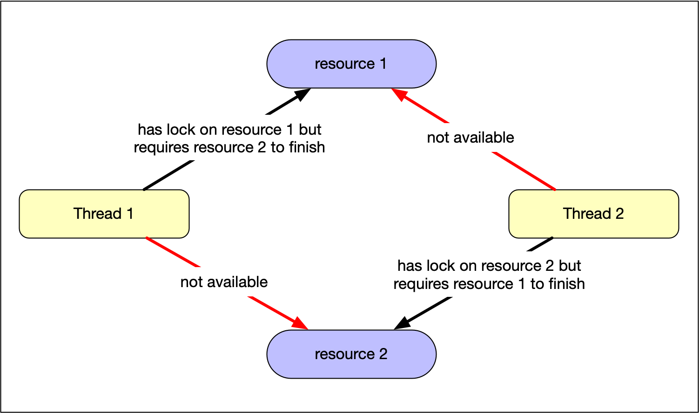
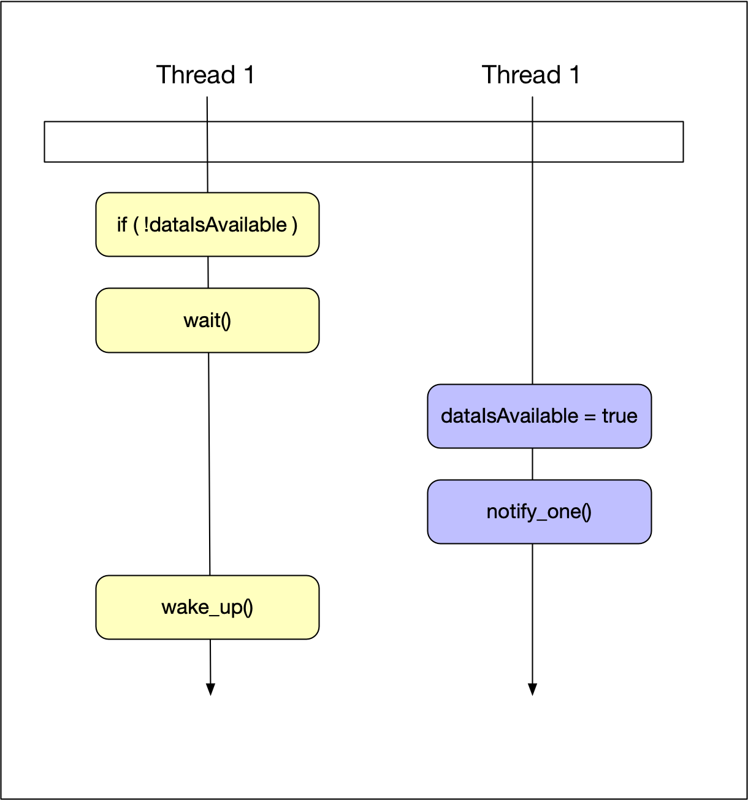
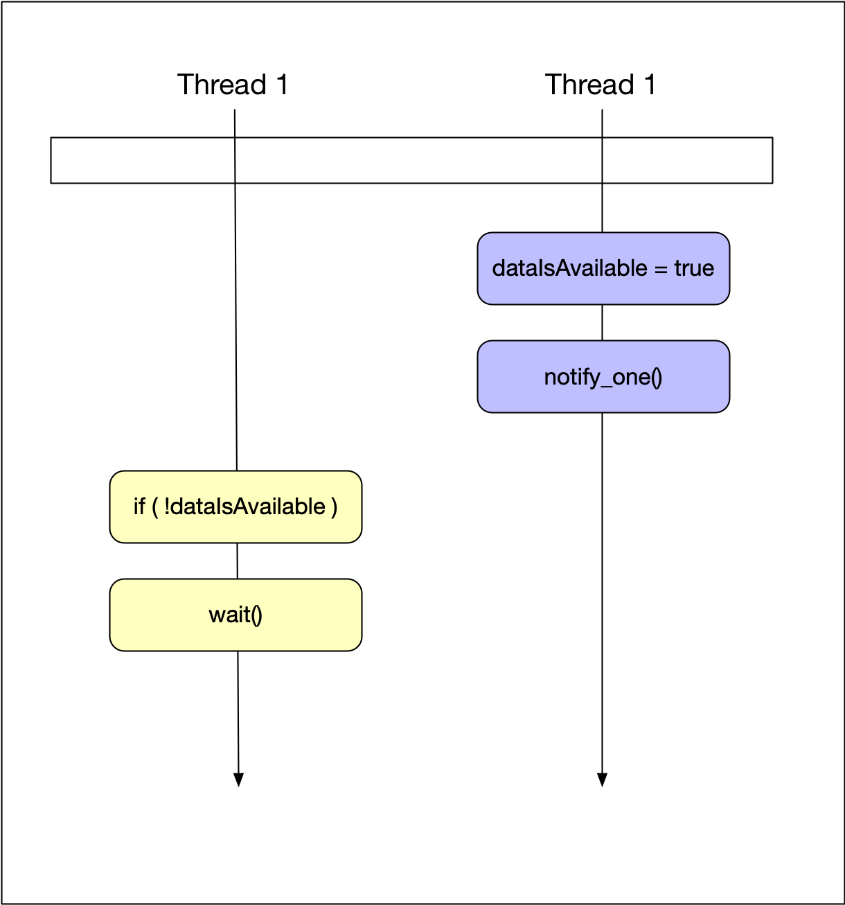
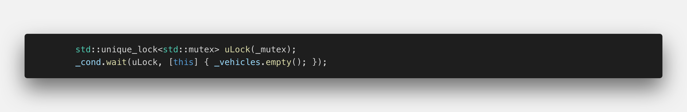

# C++ Nanodegree 

## Introduction to C++

* Standard Library
    * "The C++ Standard Library is a collection of classes and functions, which are written in the core language and part of the C++ ISO Standard itself." Wikipedia

    * Learning how to use the Standard Library is an important part of becoming a proficient C++ software engineer. In almost all cases, it is preferable to utilize functionality that already exists in the Standard Library, instead of implementing functionality from scratch. This is both because using the Standard Library is faster (it is well-documented) and because many expert software engineers have worked on the Standard Library. The performance of Standard Library facilities is optimized, robust, and almost always as fast or faster than an initial re-implementation of the same functionality.

    * In fact, guideline SL.1 of the [C++ Core Guidelines](http://isocpp.github.io/CppCoreGuidelines/CppCoreGuidelines) is:
        * Use libraries wherever possible

        * Reason Save time. Don’t re-invent the wheel. Don’t replicate the work of others. Benefit from other people’s work when they make improvements. Help other people when you make improvements.
    
    * And guideline SL.2 is:
        * Prefer the standard library to other libraries

        * Reason More people know the standard library. It is more likely to be stable, well-maintained, and widely available than your own code or most other libraries.

* Namespace
    * Standard Library functions and classes exist in the `std::` namespace. `std::vector`, for example, refers to the vector class within the Standard Library. Typically, in order to use a Standard Library feature we must both include the necessary header file (e.g. `#include <vector>`) and also namespace the class with `std::` (e.g. `std::vector`).

* Compilers

    * C++ is a compiled programming language, which means that programmers use a program to compile their human-readable source code into machine-readable object and executable files. The program that performs this task is called a compiler.

    * C++ does not have an "official" compiler. Instead, there are many different compilers that a programmer can use.

    * GNU Compiler Collection (GCC)

        * In this program we primarily use the GNU Compiler Collection, which is a popular, open-source, cross-platform compiler from the larger GNU Project. In particular, we use the `g++` program, which is a command line executable that compiles C++ source code and **automatically links the C++ Standard Library**.
    
    * LLVM (low level virtual machine)
        
        * This is a new infrastructure of compilers, read more [here](https://llvm.org/)

        * The LLVM Project is a collection of modular and reusable compiler and toolchain technologies. Despite its name, LLVM has little to do with traditional virtual machines. The name "LLVM" itself is not an acronym; it is the full name of the project.

        * LLVM began as a research project at the University of Illinois, with the goal of providing a modern, SSA-based compilation strategy capable of supporting both static and dynamic compilation of arbitrary programming languages. Since then, LLVM has grown to be an umbrella project consisting of a number of subprojects, many of which are being used in production by a wide variety of commercial and open source projects as well as being widely used in academic research. Code in the LLVM project is licensed under the "Apache 2.0 License with LLVM exceptions"
            * Dynamic compiling means that the language is compiled to machine code while the program is being executed, not before. This allows, for example, just-in-time optimization - the code is optimized while the application is running. A JIT optimizer has the advantage that it has much more reliable information about which branches of the code are used most often and how they are usually used, because it can observe the application in action before applying optimizations.

            * Dynamic compilation is a problem for automatic benchmarking, because multiple measurements of the same program code section can compare completely different machine code interpretations because the optimizer has decided to change the implementation between two runs.
    
    * Linking
        *  

        * In order to use classes and functions from the C++ Standard Library, the compiler must have access to a compiled version of the standard library, stored in object files. Most compiler implementations, including GCC, **include those object files as part of the installation process**. In order to use the Standard Library facilities, the compiler must "link" the standard library object files to the object files created from the programmer's source code.

        * Once the compiler links together the necessary object files, it is able to generate a standalone executable file that can run on the operating system.

* Build Tools

    * Make and CMake are two separate and similar build tools that both serve to help simplify the process of building software.

    * In particular, build tools automate the process of compiling multiple source code files into object files, linking those object files together, and generating an executable. Build tools also often automate the process of determining which files have changed since the last build and thus need to be recompiled.

    * Make
        * [GNU Make](https://www.gnu.org/software/make/manual/html_node/index.html#Top) is a widely-used build tool that relies on `Makefiles` to automate the process of building a project.

        * A `Makefile` typically includes one or more "targets". Each target performs a different action.

        * `build` is a common **target** name that is configured in the `Makefile` to compile all of the project's source code into an executable file. `clean`, on the other hand, is a common target to delete all object files and other artifacts of the build process, resulting in a clean, unbuilt project state.

        * Running either `make build` or `make clean` (or any other target) on the command line would cause `Make` to search for a local `Makefile`, search for a matching target within that Makefile, and then execute the target.
    
    * CMake

        * [CMake](https://cmake.org/) is a built tool that facilitates **cross-platform** builds, so that it is straightforward to build the same source code on Linux, macOS, Windows, or any other operating system. `CMake` relies on a `CMakeLists.txt` file, which configures appropriate cross-platform targets.

        * Building a `CMakeLists.txt` file can be a bit daunting, but `CMake` provides a helpful tutorial.

        * In this Nanodegree program, you will not need to build your own `Makefiles` or `CMakeLists.txt` files. We provide the appropriate configuration files for each project and instruct you as to their usage.

* Installation

    * You are welcome to write all of your code in Udacity's web-based Workspaces. If, however, you prefer to work locally on your machine, you will need to install certain software.

    * `llvm` and `clang` (this tutorial uses this compiler)
        * [Download and instal](https://releases.llvm.org/download.html)

    * `g++, gdb, make`

        * MacOS

            * macOS includes g++ as part of Command Line Tools.

            * Launch Terminal, which can be found in the Utilities folder in Applications.
            * Type `xcode-select --install` into the Terminal window and press "Enter"
            * If you don't already have Xcode or Command Line Tools installed, a window will pop up. Press the Install button.
            * Verify: Type `g++` into Terminal and press enter. If the output is `clang: error: no input files`, then the installation was successful.    

        * Linux

            * These programs are typically available through the default package manager for each Linux distribution. For example, we can use APT on Ubuntu systems.

                * `sudo apt update`
                * `sudo apt install build-essential`
                * `sudo apt install gdb`
        
        * Windows

            * MinGW provides the necessary software.
                * Proceed from [Section 3.2](https://www.cs.odu.edu/~zeil/cs250PreTest/latest/Public/installingACompiler/#installing-the-mingw-compiler) of these linked instructions.

* Style

    * A consistent style (hopefully) helps improve and make your code more readable.

    * There are many different C++ styles, none of which is authoritative.

        * [C++ Core Guidlines: Naming and layout rules](http://isocpp.github.io/CppCoreGuidelines/CppCoreGuidelines#nl-naming-and-layout-rules)
        * [Google C++ Style Guide](https://google.github.io/styleguide/cppguide.html)
        * [Mozilla Coding Style: C/C++ practices](https://developer.mozilla.org/en-US/docs/Mozilla/Developer_guide/Coding_Style#CC_practices)
    
    * ClangFormat

        * `clang-format` is a command line text formatter that automatically reformats source code according to configurable set of policies. The tool includes several pre-configured styles, or you can create your own.

        * `clang-format` is an open-source application that you can install on your system, or it is straightforward to install as a Visual Studio Code extension.  
            * `brew install clang-format`
        
* Debugging

    * Debugging is an important part of software development! Therefore, learning how to use a debugger is an important part of becoming a software developer 😬

    * Debuggers

        * Debuggers are tools that allow you to pause the execution of your code in various locations, inspect the state of the program, and step through your code line-by-line.

        * [GDB](https://www.gnu.org/software/gdb/) and [LLDB](https://lldb.llvm.org/) are two popular, open-source debuggers for C++. Integrating them into a code editor often makes debugging easier.

        * In order to use Visual Studio Code's debugger with C++ files, you must install the free C/C++ extension.
            * Remember to compile your code with Symbols `-g` flag
                * `clang++ -std=c++20 -g hello.cpp -o a.out`

## Foundations / Introduction to the C++ Language

* `#include <iostream>`

    * The `#include` is a preprocessor command which is executed before the code is compiled. It searches for the `iostream` header file and pastes its contents into the program. `iostream` contains the declarations for the input/output stream objects.


* `using std::cout;`

    * Namespaces are a way in C++ to group identifiers (names) together. They provide context for identifiers to avoid naming collisions. The `std` namespace is the namespace used for the standard library.
    * The `using` command adds `std::cout` to the global scope of the program. This way you can use `cout` in your code instead of having to write `std::cout`.
    * `cout` is an output stream you will use to send output to the notebook or to a terminal, if you are using one.
    * Note that the second two lines in the example end with a semicolon `;`. Coding statements end with a semicolon in C++. The `#include` statement is a preprocessor command, so it doesn't need one.

* `cout << "Hello!" << "\n";`

    * In this line, the code is using cout to send output to the notebook. The `<<` operator is the **stream insertion operator**, and it writes what's on the right side of the operator to the left side. So in this case, `"Message here"` is written to the output stream `cout`.

### Primitive Variable Types

C++ has several "primitive" variable types, which are things like `int`s (integers), `string`s, `float`s, and others. These should be similar to variable types in other programming languages you have used. 

* In the previous concept, you learned about some of the primitive types that C++ offers, including strings and ints, and you learned how to store these types in your program. In this concept, you will learn about one of the most common data structures in C++: the vector.

    * C++ also has several container types that can be used for storing data. We will start with `vector`s, as these will be used throughout this lesson, but we will also introduce other container types as needed.

    * Vectors are a sequence of elements of a single type, and have useful methods for getting the size, testing if the vector is empty, and adding elements to the vector.

    * Check `1-Foundations/2-vector`

    * Unfortunately, there isn't a built-in way to print vectors in C++ using `cout`. You will learn how to access vector elements and you will write your own function to print vectors later. For now, you can see how vectors are created and stored. Below, you can see how to nest vectors to create 2D containers.

    * Check `1-Foundations/2-vector`

    * You may have noticed comments in some of the code up until this point. C++ provides two kinds of comments:

        * ```
            // You can use two forward slashes for single line comments.

            /*
            For longer comments, you can enclose the text with an opening
            slash-star and closing star-slash.
            */ 
            ```
    
    * You have now seen how to store basic types and vectors containing those types. As you practiced declaring variables, in each case you indicated the type of the variable. It is possible for C++ to do automatic type inference, using the `auto` keyword.

        * Check `1-Foundations/3-auto`
    
    * It is helpful to manually declare the type of a variable if you want the variable type to be clear for reader of your code, or if you want to be explicit about the number precision being used; C++ has several number types with different levels of precision, and this precision might not be clear from the value being assigned.

### Store a Grid in Your Program

* In order to write the A* search algorithm, you will need a grid or "board" to search through. We'll be working with this board throughout the remaining exercises, and we'll start by storing a hard-coded board in the main function. In later exercises, you will write code to read the board from a file.

    * Note: you will need to include the vector library, just as iostream is included. You will also need to use the namespace `std::vector` if you want to write `vector` rather than `std::vector` in your code.

    * This exercise will be ungraded, but if you get stuck, you can find the solution in solution.cpp. Finally, if you feel a little crowded in the editor below and need more space to work, you can click the "Expand" button in the lower left corner.

    * Check `1-Foundations/4-grid`

### Loops

* Just as in other languages you've worked with, C++ has both for loops and while loops. You will learn about for loops in the notebook below, and you will see while loops later in the course.

* `Check 1-Foundations/5-loops`

### The Increment Operator

If you haven't seen the `++` operator before, this is the *post-increment operator*, and it is where the `++` in the name "C++" comes from. The operator increments the value of `i`. 

There is also a *pre-increment operator* which is used before a variable, as well as *pre* and *post decrement* operators: `--`. The difference between *pre* and *post* lies in what value is returned by the operator when it is used.

You will only use the *post-increment operator* `i++` for now, but if you are curious, click below for an explanation of the code:

* `Check 1-Foundations/5-loops`

## For Loop with a Container

C++ offers several ways to iterate over containers. One way is to use an index-based loop as above. Another way is using a "range-based loop", which you will see frequently in the rest of this course. See the following code for an example of how this works:

* ```cpp
    #include <iostream>
    #include <vector>
    using std::cout;
    using std::vector;

    int main() {
        // Add your code here.
        vector<int> a {1, 2, 3, 4, 5};
        for (int i: a) {
            cout << i << "\n";
        }
    }
    ```

### Functions

In the cell below, there is a simple function to add two numbers and return the result. Test the code below, and click the button for a more in-depth explanation.

* ```cpp
    #include <iostream>
    using std::cout;

    // Function declared and defined here.
    int AdditionFunction(int i, int j) 
    {
        return i + j;
    }

    int main() 
    {
        auto d = 3;
        auto f = 7;
        cout << AdditionFunction(d, f) << "\n";
    }
    ```


### File Input Streams

### Creating an Input Stream Object

* In C++, you can use the `std::ifstream` object to handle input file streams. To do this, you will need to include the header file that provides the file streaming classes: `<fstream>`. 

* Once the `<fstream>` header is included, a new input stream object can be declared and initialized using a file path `path`:
    * ```cpp
        std::ifstream my_file;
        my_file.open(path);
        ```

* Alternatively, the declaration and initialization can be done in a single line as follows:
    * `std::ifstream my_file(path);`

* C++ `ifstream` objects can also be used as a boolean to check if the stream has been created successfully. If the stream were to initialize successfully, then the `ifstream` object would evaluate to `true`. If there were to be an error opening the file or some other error creating the stream, then the `ifstream` object would evaluate to `false`.

* The following cell creates an input stream from the file `"files/1.board"`:

* ```cpp
    #include <fstream>
    #include <iostream>
    #include <string>

    int main()
    {
        std::ifstream my_file;
        my_file.open("files/1.board");
        if (my_file) {
        std::cout << "The file stream has been created!" << "\n";
        }    
    }
    ```

### Reading Data from the Stream

* If the input file stream object has been successfully created, the lines of the input stream can be read using the `getline` method. In the cell below, a while loop has been added to the previous example to get each line from the stream and print it to the console.

* ```cpp
    #include <fstream>
    #include <iostream>
    #include <string>

    int main() {
        std::ifstream my_file;
        my_file.open("files/1.board");
        if (my_file) {
            std::cout << "The file stream has been created!" << "\n";
            std::string line;
            while (getline(my_file, line)) {
                std::cout << line << "\n";
            }
        }
    }
    ```


## Streaming `int`s from a `string` with istringstream

* In C++ strings can be streamed into temporary variables, similarly to how files can be streamed into strings. 
Streaming a string allows us to work with each character individually.

* One way to stream a string is to use an input string stream object `istringstream` from the `<sstream>` header. 

* Once an `istringstream` object has been created, parts of the string can be streamed and stored using the 
"extraction operator": `>>`. The extraction operator will read until whitespace is reached or until the stream 
fails. Execute the following code to see how this works:

```cpp
#include <iostream>
#include <sstream>
#include <string>

using std::istringstream;
using std::string;
using std::cout;

int main () 
{
    string a("j 2 3");

    istringstream my_stream(a);

    char n;
    my_stream >> n;
    cout << n << "\n";
}
```

* The `istringstream` object can also be used as a boolean to determine if the last extraction operation failed - this happens if there wasn't any more of the string to stream, for example. If the stream still has more characters, you are able to stream again. See the following code for an example of using the `istringstream` this way:

```cpp
#include <iostream>
#include <sstream>
#include <string>

using std::istringstream;
using std::string;
using std::cout;

int main() 
{
    string a("1 2 3");

    istringstream my_stream(a);

    int n;
    
    // Testing to see if the stream was successful and printing results.
    while (my_stream) {
        my_stream >> n;
        if (my_stream) {
            cout << "That stream was successful: " << n << "\n";
        }
        else {
            cout << "That stream was NOT successful!" << "\n";            
        }
    }
}
```

### Adding Data to a Vector

* In the previous exercises, you have declared and initialized vectors, and you have also accessed vector elements. In order to make full use of vectors in your code though, you will need to be able to add additional elements to them. Have a look at the following notebook for examples of how to do this.

## Vector push_back

* Now that you are able to process a string, you may want to store the results of the processing in a convenient container for later use. In the next exercise, you will store the streamed `int`s from each line of the board in a `vector<int>`. To do this, you will add the `int`s to the back of the vector, using the `vector` method `push_back`:

```cpp
#include <vector>
#include <iostream>
using std::vector;
using std::cout;

int main() {
    // Initial Vector
    vector v {1, 2, 3};
    
    // Print the contents of the vector
    for (int i=0; i < v.size(); i++) {
      cout << v[i] << "\n";
    }
    
    // Push 4 to the back of the vector
    v.push_back(4);

    // Print the contents again
    for (int i=0; i < v.size(); i++) {
      cout << v[i] << "\n";
    }
    
}
```

* In the previous exercises, you stored and printed the board as a vector<vector<int>>, where only two states were used for each cell: 0 and 1. This is a great way to get started, but as the program becomes more complicated, there will be more than two possible states for each cell. Additionally, it would be nice to print the board in a way that clearly indicates open areas and obstacles, just as the board is printed above.

* To do this clearly in your code, you will learn about and use something called an enum. An enum, short for enumerator, is a way to define a type in C++ with values that are restricted to a fixed range. For an explanation and examples, see the notebook below.

* ```cpp
    #include <iostream>
    using std::cout;

    int main()
    {
        enum class Direction {kUp, kDown, kLeft, kRight};

        Direction a = Direction::kUp;

        switch (a) {
        case Direction::kUp : cout << "Going up!" << "\n";
            break;
        case Direction::kDown : cout << "Going down!" << "\n";
            break;
        case Direction::kLeft : cout << "Going left!" << "\n";
            break;
        case Direction::kRight : cout << "Going right!" << "\n";
            break;
        }
    }
    ```

## Foundations / A* Search


* Motion Planning
    * The next videos and quizzes are taught by Sebastian Thrun (Udacity's former CEO) and they come from one of Udacity's first courses. The production style is a little different from what you will see in the rest of the course, but the content is very good. In these videos, Sebastian will discuss motion planning in robotics and provide the conceptual foundation for the project that you will build.


* Pass by Reference
    * In the previous exercises, you've written functions that accept and return various kinds of objects. However, in all of the functions you've written so far, the objects returned by the function are different from the objects provided to the function. In other words, when the function is called on some data, a copy of that data is made, and the function operates on a copy of the data instead of the original data. This is referred to as pass by value, since only a copy of the values of an object are passed to the function, and not the actual objects itself.

    * In the following example, the _value_ of `int i` is passed to the function `MultiplyByTwo`. Look carefully at the code and try to guess what the output will be before you execute it. When you are finished executing, click the button for an explanation.

    * ```cpp
        #include <iostream>
        using std::cout;


        int MultiplyByTwo(int i) {
            i = 2*i;
            return i;
        }

        int main() {
            int a = 5;
            cout << "The int a equals: " << a << "\n";
            int b = MultiplyByTwo(a);
            cout << "The int b equals: " << b << "\n";
            cout << "The int a still equals: " << a << "\n";
        }
        ```
    * In the code above, `a` is passed by value to the function, so the variable `a` is not affected by what happens inside the function.

    * But what if we wanted to change the value of `a` itself? For example, it might be that the variable you are passing into a function maintains some state in the program, and you want to write the function to update that state. 

    * It turns out, it is possible to modify `a` from within the function. To do this, you must pass a _reference_ to the variable `a`, instead of the _value_ of `a`. In C++, _a reference is just an alternative name for the same variable_.

    * To pass by reference, you simply need to add an ampersand `&` before the variable in the function declaration. Try the code below to see how this works:

    * ```cpp
        #include <iostream>
        using std::cout;


        int MultiplyByTwo(int &i) {
            i = 2*i;
            return i;
        }

        int main() {
            int a = 5;
            cout << "The int a equals: " << a << "\n";
            int b = MultiplyByTwo(a);
            cout << "The int b equals: " << b << "\n";
            cout << "The int a now equals: " << a << "\n";
        }
        ```
    
    * In the code above, `a` is passed by reference to the function `MultiplyByTwo` since the argument to `MultiplyByTwo` is a reference: `&i`. This means that `i` is becomes another name for whatever variable that is passed into the function. When the function changes the value of `i`, then the value of `a` is changed as well.

    * ```cpp
        #include <iostream>
        #include <string>
        using std::cout;
        using std::string;


        void DoubleString(string value) {
            // Concatentate the string with a space and itself.
            value = value + " " + value;
        }

        int main() {
            string s = "Hello";
            cout << "The string s is: " << s << "\n";
            DoubleString(s);
            cout << "The string s is now: " << s << "\n";
        }
        ```

### Constants 

* C++ supports two notions of immutability:

* `const`: meaning roughly " I promise not to change this value."...The compiler enforces the promise made by `const`....
* `constexpr`: meaning roughly "to be evaluated at compile time." This is used primarily to specify constants...

* ```cpp
    #include <iostream>

    int main()
    {
        int i;
        std::cout << "Enter an integer value for i: ";
        std::cin >> i;
        const int j = i * 2;  // "j can only be evaluated at run time."
                            // "But I promise not to change it after it is initialized."
        
        constexpr int k = 3;  // "k, in contrast, can be evaluated at compile time."
        
        std::cout << "j = " << j << "\n";
        std::cout << "k = " << k << "\n";
    }
    ```

* The major difference between `const` and `constexpr`, though, is that `constexpr` must be evaluated at compile time.

* The compiler will catch a `constexpr` variable that cannot be evaluated at compile time.

* ```cpp
    #include <iostream>

    int main()
    {
        int i;
        std::cout << "Enter an integer value for i: ";
        std::cin >> i;
        constexpr int j = i * 2;  // "j can only be evaluated at run time."
                                // "constexpr must be evaluated at compile time."
                                // "So this code will produce a compilation error."
    }
    ```

* A common usage of `const` is to guard against accidentally changing a variable, especially when it is passed-by-reference as a function argument.

* ```cpp
    #include <iostream>
    #include <vector>

    int sum(const std::vector<int> &v)
    {
        int sum = 0;
        for(int i : v)
            sum += i;
        return sum;
    }

    int main()
    {
        std::vector<int> v {0, 1, 2, 3, 4};
        std::cout << sum(v) << "\n";
    }
    ```

### Arrays

* In the previous exercise, we included an array of directional deltas for convenience:

```cpp
// directional deltas
const int delta[4][2]{{-1, 0}, {0, -1}, {1, 0}, {0, 1}};
```
* Arrays are a lower level data structure than vectors, and can be slightly more efficient, in terms of memory and element access. However, this efficiency comes with a price. Unlike vectors, which can be extended with more elements, arrays have a fixed length. Additionally, arrays may require careful memory management, depending how they are used.

* The example in the project code is a good use case for an array, as it was not intended to be changed during the execution of the program. However, a vector would have worked there as well.

## Foundations / Writing Multiple Files

* Header files, or `.h` files, allow related function, method, and class **declarations** to be collected in one place. The corresponding **definitions** can then be placed in `.cpp` files. The compiler considers a header declaration a "promise" that the definition will be found later in the code, so if the compiler reaches a function that hasn't been defined yet, it can continue on compiling until the definition is found. This allows functions to be defined (and declared) in arbitrary order.

* In the following code example, the functions are out of order, and the code will not compile. Try to fix this by rearranging the functions to be in the correct order.

* ```cpp
    #include <iostream>
    using std::cout;

    void OuterFunction(int i) 
    {
        InnerFunction(i);
    }

    void InnerFunction(int i) 
    {
        cout << "The value of the integer is: " << i << "\n";
    }

    int main() 
    {
        int a = 5;
        OuterFunction(a);
    }
    ```

* In the mini-project for the first half of the course, the instructions were very careful to indicate where each function should be placed, so you didn't run into the problem of functions being out of order.

* Using a Header

* One other way to solve the code problem above (without rearranging the functions) would have been to declare each function at the top of the file. A function **declaration** is much like the first line of a function **definition** - it contains the return type, function name, and input variable types. The details of the function definition are not needed for the declaration though.

To avoid a single file from becomming cluttered with declarations and definitions for every function, it is customary to declare the functions in another file, called the header file. In C++, the header file will have filetype `.h`, and the contents of the header file must be included at the top of the `.cpp` file. See the following example for a refactoring of the code above into a header and a cpp file.

* ```cpp
    // The header file with just the function declarations.
    // When you click the "Run Code" button, this file will
    // be saved as header_example.h.
    #ifndef HEADER_EXAMPLE_H
    #define HEADER_EXAMPLE_H

    void OuterFunction(int);
    void InnerFunction(int);

    #endif
    ```
* ```cpp
    // The contents of header_example.h are included in 
    // the corresponding .cpp file using quotes:
    #include "header_example.h"

    #include <iostream>
    using std::cout;

    void OuterFunction(int i) 
    {
        InnerFunction(i);
    }

    void InnerFunction(int i) 
    {
        cout << "The value of the integer is: " << i << "\n";
    }

    int main() 
    {
        int a = 5;
        OuterFunction(a);
    }
    ```

* Notice that the code from the first example was fixed without having to rearrange the functions! In the code above, you might also have noticed several other things:

    * The function declarations in the header file don't need variable names, just variable types. You can put names in the declaration, however, and doing this often makes the code easier to read.

    * The `#include` statement for the header used quotes " " around the file name, and not angle brackets <>. We have stored the header in the same directory as the .cpp file, and the quotes tell the preprocessor to look for the file in the same directory as the current file - not in the usual set of directories where libraries are typically stored.

    Finally, there is a preprocessor directive:
    ```cpp
        #ifndef HEADER_EXAMPLE_H
        #define HEADER_EXAMPLE_H
    ```
    
    * at the top of the header, along with an `#endif` at the end. This is called an **"include guard"**. Since the header will be included into another file, and `#include` just pastes contents into a file, the include guard prevents the same file from being pasted multiple times into another file. This might happen if multiple files include the same header, and then are all included into the same main.cpp, for example. The `ifndef` checks if HEADER_EXAMPLE_H has not been defined in the file already. If it has not been defined yet, then it is defined with #define HEADER_EXAMPLE_H, and the rest of the header is used. If HEADER_EXAMPLE_H has already been defined, then the preprocessor does not enter the ifndef block. Note: There are other ways to do this. Another common way is to use an **#pragma** oncepreprocessor directive, but we won't cover that in detail here. See this Wikipedia article for examples.

    * The addition of #include guards to a header file is one way to make that file idempotent. Another construct to combat double inclusion is `#pragma once`, which is non-standard but nearly universally supported among C and C++ compilers.

### CMake and Make

* In the previous notebook, you saw how example code could be split into multiple .h and .cpp files, and you used g++ to build all of the files together. For small projects with a handful of files, this works well. But what would happen if there were hundreds, or even thousands, of files in the project? You could type the names of the files at the command line each time, but there tools to make this easier.

* Many larger C++ projects use a build system to manage all the files during the build process. The build system allows for large projects to be compiled with a few commands, and build systems are able to do this in an efficient way by only recompiling files that have been changed.

* In this workspace you will learn about

    * Object files: what actually happens when you run g++.
    * How to use object files to compile only a single file at a time. If you have many files in a project, this will allow you can compile only files that have changed and need to be re-compiled.
    * How to use cmake (and make), a build system which is popular in large C++ projects.CMake will simplify the process of building project and re-compiling only the changed files.

* Object Files
    * When you compile a project with g++, g++ actually performs several distinct tasks:

    * The preprocessor runs and executes any statement beginning with a hash symbol: #, such as #include statements. This ensures all code is in the correct location and ready to compile.

    * Each file in the source code is compiled into an "object file" (a .o file). Object files are platform-specific machine code that will be used to create an executable.

    * The object files are "linked" together to make a single executable. In the examples you have seen so far, this executable is a.out, but you can specify whatever name you want.

    * It is possible to have g++ perform each of the steps separately by using the -c flag. For example,

        * `g++ -c main.cpp`
    
    * will produce a `main.o` file, and that file can be converted to an executable with

        * `g++ main.o`
    
    * Generate all object files `g++ -c *.cpp` and the link them `g++ *.o`

    * But what if you make changes to your code and you need to re-compile? In that case, you can compile only the file that you changed, and you can use the existing object files from the unchanged source files for linking.


    * Compiling just the file you have changed saves time if there are many files and compilation takes a long time. However, the process above is tedious when using many files, especially if you don't remember which ones you have modified.

    * For larger projects, it is helpful to use a build system which can compile exactly the right files for you and take care of linking.

* CMake and Make

    * CMake is an open-source, platform-independent build system. CMake uses text documents, denoted as CMakeLists.txt files, to manage build environments, like make. A comprehensive tutorial on CMake would require an entire course, but you can learn the basics of CMake here, so you'll be ready to use it in the upcoming projects.

    * CMakeLists.txt

        * CMakeList.txt files are simple text configuration files that tell CMake how to build your project. There can be multiple CMakeLists.txt files in a project. In fact, one CMakeList.txt file can be included in each directory of the project, indicating how the files in that directory should be built.

        * These files can be used to specify the locations of necessary packages, set build flags and environment variables, specify build target names and locations, and other actions.

    
    * The first lines that you'll want in your CMakeLists.txt are lines that specifies the minimum versions of cmake and C++ required to build the project. Add the following lines to your CMakeLists.txt and save the file:


        * ```
            cmake_minimum_required(VERSION 3.5.1)
            set(CMAKE_CXX_STANDARD 14)
            ```
        
        * These lines set the minimum cmake version required to 3.5.1 and set the environment variable CMAKE_CXX_STANDARD so CMake uses C++ 14. On your own computer, if you have a recent g++ compiler, you could use C++ 17 instead.
    
    * CMake requires that we name the project, so you should choose a name for the project and then add the following line to CMakeLists.txt:

        * `project(<your_project_name>)`
    
    * Next, we want to add an executable to this project. You can do that with the add_executable command by specifying the executable name, along with the locations of all the source files that you will need. CMake has the ability to automatically find source files in a directory, but for now, you can just specify each file needed:

        * `add_executable(your_executable_name  path_to_file_1  path_to_file_2 ...)`
    
    * A typical CMake project will have a build directory in the same place as the top-level CMakeLists.txt. Make a build directory in the /home/workspace/cmake_example folder:

    * ```bash
        root@abc123defg:/home/workspace/cmake_example# mkdir build
        root@abc123defg:/home/workspace/cmake_example# cd build
        root@abc123defg:/home/workspace/cmake_example/build# cmake ..
        root@abc123defg:/home/workspace/cmake_example/build# make
        root@abc123defg:/home/workspace/cmake_example/build# ./your_executable_name
        ```
        * The first line directs the cmake command at the top-level CMakeLists.txt file with ... This command uses the CMakeLists.txt to configure the project and create a Makefile in the build directory.

        * In the second line, make finds the Makefile and uses the instructions in the Makefile to build the project.

        * Now that your project builds correctly, try modifying one of the files. When you are ready to run the project again, you'll only need to run the make command from the build folder, and only that file will be compiled again. Try it now!

        * In general, CMake only needs to be run once for a project, unless you are changing build options (e.g. using different build flags or changing where you store your files).

        * Make will be able to keep track of which files have changed and compile only those that need to be compiled before building.

### References

* You have seen references used previously, in both pass-by-reference for functions, and in a range-basedfor loop example that used references to modify a vector. As you write larger C++ programs, you will find references useful in a variety of situations. In this short notebook, you will see a few more examples of references to solidify your knowledge.

* As mentioned previously, a reference is another name given to an existing variable. On the left hand side of any variable declaration, the & operator can be used to declare a reference.

* ```cpp
    #include <iostream>
    using std::cout;

    int main() 
    {
        int i = 1;
        
        // Declare a reference to i.
        int& j = i;
        cout << "The value of j is: " << j << "\n";
        
        // Change the value of i.
        i = 5;
        cout << "The value of i is changed to: " << i << "\n";
        cout << "The value of j is now: " << j << "\n";
        
        // Change the value of the reference.
        // Since reference is just another name for the variable,
        // th
        j = 7;
        cout << "The value of j is now: " << j << "\n";
        cout << "The value of i is changed to: " << i << "\n";
    }
    ```

### Pointers

* Pointers have traditionally been a stumbling block for many students learning C++, but they do not need to be!

* A C++ pointer is just a variable that stores the memory address of an object in your program.

* That is the most important thing to understand and remember about pointers - they essentially keep track of where a variable is stored in the computer's memory.

* In the previous lessons, you implemented A* search in a single file without using C++ pointers, except in `CellSort` code that was provided for you; a C++ program can be written without using pointers extensively (or at all). However, pointers give you better control over how your program uses memory. However, much like the pass-by-reference example that you saw previously, it can often be far more efficient to perform an operation with a pointer to an object than performing the same operation using the object itself.

* Pointers are an extremely important part of the C++ language, and as you are exposed to more C++ code, you will certainly encounter them. 

* Each variable in a program stores its contents in the computer's memory, and each chunk of the memory has an address number. For a given variable, the memory address can be accessed using an ampersand in front of the variable. To see an example of this, execute the following code which displays the hexadecimal memory addresses of the variables i and j:

    * ```cpp
        #include <iostream>
        using std::cout;

        int main() {
            int i = 5;
            int j = 6;
            
            // Print the memory addresses of i and j
            cout << "The address of i is: " << &i << "\n";
            cout << "The address of j is: " << &j << "\n";
        }
        ```
* At this point, you might be wondering why the same symbol & can be used to both access memory addresses and, as you've seen before, pass references into a function. This is a great thing to wonder about. The overloading of the ampersand symbol & and the * symbol probably contribute to much of the confusion around pointers.

    * The symbols & and * have a different meaning, depending on which side of an equation they appear.

    * This is extremely important to remember. For the & symbol, if it appears on the left side of an equation (e.g. when declaring a variable), it means that the variable is declared as a reference. If the & appears on the right side of an equation, or before a previously defined variable, it is used to return a memory address, as in the example above.

    * ```cpp
        #include <iostream>
        using std::cout;

        int main() 
        {
            int i = 5;
            // A pointer pointer_to_i is declared and initialized to the address of i.
            int* pointer_to_i = &i;
            
            // Print the memory addresses of i and j
            cout << "The address of i is:          " << &i << "\n";
            cout << "The variable pointer_to_i is: " << pointer_to_i << "\n";
        }
        ```
    
    * As you can see from the code, the variable pointer_to_i is declared as a pointer to an int using the * symbol, and pointer_to_i is set to the address of i. From the printout, it can be seen that pointer_to_i holds the same value as the address of i.

    * Once you have a pointer, you may want to retrieve the object it is pointing to. In this case, the * symbol can be used again. This time, however, it will appear on the right hand side of an equation or in front of an already-defined variable, so the meaning is different. In this case, it is called the "dereferencing operator", and it returns the object being pointed to. You can see how this works with the code below:

    * ```cpp
        #include <iostream>
        using std::cout;

        int main() 
        {
            int i = 5;
            // A pointer pointer_to_i is declared and initialized to the address of i.
            int* pointer_to_i = &i;
            
            // Print the memory addresses of i and j
            cout << "The address of i is:          " << &i << "\n";
            cout << "The variable pointer_to_i is: " << pointer_to_i << "\n";
            cout << "The value of the variable pointed to by pointer_to_i is: " << *pointer_to_i << "\n";
        }
        ```
    
    * In the following example, the code is similar to above, except that the object that is being pointed to is changed before the pointer is dereferenced. Before executing the following code, guess what you think will happen to the value of the dereferenced pointer.

        * ```cpp
            #include <iostream>
            using std::cout;

            int main() {
                int i = 5;
                // A pointer pointer_to_i is declared and initialized to the address of i.
                int* pointer_to_i = &i;
                
                // Print the memory addresses of i and j
                cout << "The address of i is:          " << &i << "\n";
                cout << "The variable pointer_to_i is: " << pointer_to_i << "\n";
                
                // The value of i is changed.
                i = 7;
                cout << "The new value of the variable i is                     : " << i << "\n";
                cout << "The value of the variable pointed to by pointer_to_i is: " << *pointer_to_i << "\n";
            }
            ```
    
    * In the previous concept, you were introduced to int pointers, and you learned the syntax for creating a pointer and retrieving an object from a pointer.

    * Although the type of object being pointed to must be included in a pointer declaration, pointers hold the same kind of value for every type of object: just a memory address to where the object is stored. In the following code, a vector is declared. Write your own code to create a pointer to the address of that vector. Then, dereference your pointer and print the value of the first item in the vector.

        * ```cpp
            #include <iostream>
            #include <vector>
            using std::cout;
            using std::vector;

            int main() {
                // Vector v is declared and initialized to {1, 2, 3}
                vector<int> v {1, 2, 3};
                
                // Declare and initialize a pointer to the address of v here:
                vector<int> *pointer_to_v = &v;

                // The following loops over each int a in the vector v and prints.
                // Note that this uses a "range-based" for loop: https://www.geeksforgeeks.org/range-based-loop-c/
                for (int a: v) {
                    cout << a << "\n";
                }
                
                // Dereference your pointer to v and print the int at index 0 here (note: you should print 1):
                cout << "The first element of v is: " << (*pointer_to_v)[0] << "\n";
            }
            ```
    
    * Pointers can be used in another form of pass-by-reference when working with functions. When used in this context, they work much like the references that you used for pass-by reference previously. If the pointer is pointing to a large object, it can be much more efficient to pass the pointer to a function than to pass a copy of the object as with pass-by-value.

        * In the following code, a pointer to an int is created, and that pointer is passed to a function. The object pointed to is then modified in the function.

        * ```cpp
            #include <iostream>
            using std::cout;

            void AddOne(int* j)
            {
                // Dereference the pointer and increment the int being pointed to.
                (*j)++;
            }

            int main() 
            {
                int i = 1;
                cout << "The value of i is: " << i << "\n";
                
                // Declare a pointer to i:
                int* pi = &i;
                AddOne(pi);
                cout << "The value of i is now: " << i << "\n";
            }
            ```

    * You can also return a pointer from a function. As mentioned just above, if you do this, you must be careful that the object being pointed to doesn't go out of scope when the function finishes executing. If the object goes out of scope, the memory address being pointed to might then be used for something else.

    * In the example below, a reference is passed into a function and a pointer is returned. This is safe since the pointer being returned points to a reference - a variable that exists outside of the function and will not go out of scope in the function.

    * ```cpp
        #include <iostream>
        using std::cout;

        int* AddOne(int& j) 
        {
            // Increment the referenced int and return the
            // address of j.
            j++;
            return &j;
        }

        int main() 
        {
            int i = 1;
            cout << "The value of i is: " << i << "\n";
            
            // Declare a pointer and initialize to the value
            // returned by AddOne:
            int* my_pointer = AddOne(i);
            cout << "The value of i is now: " << i << "\n";
            cout << "The value of the int pointed to by my_pointer is: " << *my_pointer << "\n";
        }
        ```

### References vs Pointers

* Pointers and references can have similar use cases in C++. As seen previously both references and pointers can be used in pass-by-reference to a function. Additionally, they both provide an alternative way to access an existing variable: pointers through the variable's address, and references through another name for that variable. But what are the differences between the two, and when should each be used? The following list summarizes some of the differences between pointers and references, as well as when each should be used:

| References                                                                                                                                            | Pointers                                                                                                                                                                                                                                                                                                |
|-------------------------------------------------------------------------------------------------------------------------------------------------------|---------------------------------------------------------------------------------------------------------------------------------------------------------------------------------------------------------------------------------------------------------------------------------------------------------|
| References must be initialized when they are declared.  This means that a reference will always point to data  that was intentionally assigned to it. | Pointers can be declared without being  initialized, which is dangerous. If this  happens mistakenly, the pointer could be  pointing to an arbitrary address in memory,  and the data associated with that address  could be meaningless, leading to undefined  behavior and difficult-to-resolve bugs. |
| References can not be null. This means that a reference should  point to meaningful data in the program.                                              | Pointers can be null. In fact, if a pointer is  not initialized immediately, it is often best practice  to initialize to nullptr, a special type which  indicates that the pointer is null.                                                                                                             |
| When used in a function for pass-by-reference,  the reference can be used just as a variable of  the same type would be.                              | When used in a function for pass-by-reference,  a pointer must be dereferenced in order to access  the underlying object.                                                                                                                                                                               |

* References are generally easier and safer than pointers. As a decent rule of thumb, references should be used in place of pointers when possible.

* However, there are times when it is not possible to use references. One example is object initialization. You might like one object to store a reference to another object. However, if the other object is not yet available when the first object is created, then the first object will need to use a pointer, not a reference, since a reference cannot be null. The reference could only be initialized once the other object is created.

### Maps

* So far in this course you have seen container data structures, like the vector and the array. Additionally, you have used classes in your code for this project. Container data structures are fantastic for storing ordered data, and classes are useful for grouping related data and functions together, but neither of these data structures is optimal for storing associated data.

* A map (alternatively hash table, hash map, or dictionary) is a data structure that uses key/value pairs to store data, and provides efficient lookup and insertion of the data. The name "dictionary" should provide an excellent idea of how these work, since a dictionary is a real life example of a map. Here is a slightly edited entry from www.dictionary.com defining the word "word":

    * word

        * a unit of language, consisting of one or more spoken sounds or their written representation, that functions as a principal carrier of meaning.
        * speech or talk: to express one's emotion in words.
        * a short talk or conversation: "Marston, I'd like a word with you."
        * an expression or utterance: a word of warning.

* In the following notebook, you will learn how to use an unordered_map, which is the C++ standard library implementation of a map. Although C++ has several different implementations of map data structures which are similar, unordered_map is the structure that you will use in your project.

* In the cell below, we have created a hash table (unordered_map) to store the data from the example above. To create an unordered_map in C++, you must include the <unordered_map> header, and the sytnax for declaring an unordered_map is as follows:

*  `unordered_map <key_type, value_type> variable_name;`

* In the code below, we check if the key is in the unordered_map using the `.find()` method. If the key does not exist in the map, then `.find()` returns an `unordered_map::end()` type. Otherwise, .find() returns a C++ iterator, which is a pointer that points to the beginning of the iterable key-value pair.

* We haven't covered iterators in this course, and you won't need them for this project, but they are a lot like pointers that can "iterate" forward or backward through a range.

* ```cpp
    #include <iostream>
    #include <vector>
    #include <unordered_map>
    #include <string>
    using std::vector;
    using std::cout;
    using std::unordered_map;
    using std::string;


    int main() {
        // Create strings to use in the hash table.
        string key = "word";
        string def_1 = "a unit of language, consisting of one or more spoken sounds or their written representation, that functions as a principal carrier of meaning";
        string def_2 = "speech or talk: to express one's emotion in words";
        string def_3 = "a short talk or conversation: 'Marston, I'd like a word with you.'";
        string def_4 = "an expression or utterance: a word of warning";
        unordered_map <string, vector<string>> my_dictionary;

        // Check if key is in the hash table.
        if (my_dictionary.find(key) == my_dictionary.end()) {
            cout << "The key 'word' is not in the dictionary." << "\n";
            cout << "Inserting a key-value pair into the dictionary." << "\n\n";
            // Set the value for the key.
            my_dictionary[key] = vector<string> {def_1, def_2, def_3, def_4};
        }

        // The key should now be in the hash table. You can access the
        // value corresponding to the key with square brackets [].
        // Here, the value my_dictionary[key] is a vector of strings.
        // We iterate over the vector and print the strings.
        cout << key << ": \n";
        auto definitions = my_dictionary[key];
        for (string definition : definitions) {
            cout << definition << "\n";
        }
    }
    ```

    * ```cpp
        #include<unordered_map>
        #include<string>
        #include<iostream>
        #include<vector>
        using std::unordered_map;
        using std::string;
        using std::cout;
        using std::vector;

        // Write your program here.
        int main()
        {
            unordered_map<int, string> IDD_codes {{972, "Israel"}, {93, "Afghanistan"}, {355, "Albania"}, {213, "Algeria"}, {376, "Andorra"}, {244, "Angola"}, {54, "Argentina"}, {374, "Armenia"}, {297, "Aruba"}, {61, "Australia"}, {43, "Austria"}, {994, "Azerbaijan"}, {973, "Bahrain"}, {880, "Bangladesh"}, {375, "Belarus"}, {32, "Belgium"}, {501, "Belize"}, {229, "Benin"}, {975, "Bhutan"}, {387, "Bosnia and Herzegovina"}, {267, "Botswana"}, {55, "Brazil"}, {246, "British Indian Ocean Territory"}, {359, "Bulgaria"}, {226, "Burkina Faso"}, {257, "Burundi"}, {855, "Cambodia"}, {237, "Cameroon"}, {1, "Canada"}, {238, "Cape Verde"}, {236, "Central African Republic"}, {235, "Chad"}, {56, "Chile"}, {86, "China"}, {61, "Christmas Island"}, {57, "Colombia"}, {269, "Comoros"}, {242, "Congo"}, {682, "Cook Islands"}, {506, "Costa Rica"}, {385, "Croatia"}, {53, "Cuba"}, {537, "Cyprus"}, {420, "Czech Republic"}, {45, "Denmark"}, {253, "Djibouti"}, {593, "Ecuador"}, {20, "Egypt"}, {503, "El Salvador"}, {240, "Equatorial Guinea"}, {291, "Eritrea"}, {372, "Estonia"}, {251, "Ethiopia"}, {298, "Faroe Islands"}, {679, "Fiji"}, {358, "Finland"}, {33, "France"}, {594, "French Guiana"}, {689, "French Polynesia"}, {241, "Gabon"}, {220, "Gambia"}, {995, "Georgia"}, {49, "Germany"}, {233, "Ghana"}, {350, "Gibraltar"}, {30, "Greece"}, {299, "Greenland"}, {590, "Guadeloupe"}, {502, "Guatemala"}, {224, "Guinea"}, {245, "Guinea-Bissau"}, {595, "Guyana"}, {509, "Haiti"}, {504, "Honduras"}, {36, "Hungary"}, {354, "Iceland"}, {91, "India"}, {62, "Indonesia"}, {964, "Iraq"}, {353, "Ireland"}, {972, "Israel"}, {39, "Italy"}, {81, "Japan"}, {962, "Jordan"}, {254, "Kenya"}, {686, "Kiribati"}, {965, "Kuwait"}, {996, "Kyrgyzstan"}, {371, "Latvia"}, {961, "Lebanon"}, {266, "Lesotho"}, {231, "Liberia"}, {423, "Liechtenstein"}, {370, "Lithuania"}, {352, "Luxembourg"}, {261, "Madagascar"}, {265, "Malawi"}, {60, "Malaysia"}, {223, "Mali"}, {356, "Malta"}, {692, "Marshall Islands"}, {596, "Martinique"}, {222, "Mauritania"}, {230, "Mauritius"}, {262, "Mayotte"}, {52, "Mexico"}, {377, "Monaco"}, {976, "Mongolia"}, {382, "Montenegro"}, {212, "Morocco"}, {95, "Myanmar"}, {264, "Namibia"}, {674, "Nauru"}, {977, "Nepal"}, {31, "Netherlands"}, {599, "Netherlands Antilles"}, {687, "New Caledonia"}, {64, "New Zealand"}, {505, "Nicaragua"}, {227, "Niger"}, {234, "Nigeria"}, {683, "Niue"}, {672, "Norfolk Island"}, {47, "Norway"}, {968, "Oman"}, {92, "Pakistan"}, {680, "Palau"}, {507, "Panama"}, {675, "Papua New Guinea"}, {595, "Paraguay"}, {51, "Peru"}, {63, "Philippines"}, {48, "Poland"}, {351, "Portugal"}, {974, "Qatar"}, {40, "Romania"}, {250, "Rwanda"}, {685, "Samoa"}, {378, "San Marino"}, {966, "Saudi Arabia"}, {221, "Senegal"}, {381, "Serbia"}, {248, "Seychelles"}, {232, "Sierra Leone"}, {65, "Singapore"}, {421, "Slovakia"}, {386, "Slovenia"}, {677, "Solomon Islands"}, {27, "South Africa"}, {500, "South Georgia and the South Sandwich Islands"}, {34, "Spain"}, {94, "Sri Lanka"}, {249, "Sudan"}, {597, "Suriname"}, {268, "Swaziland"}, {46, "Sweden"}, {41, "Switzerland"}, {992, "Tajikistan"}, {66, "Thailand"}, {228, "Togo"}, {690, "Tokelau"}, {676, "Tonga"}, {216, "Tunisia"}, {90, "Turkey"}, {993, "Turkmenistan"}, {688, "Tuvalu"}, {256, "Uganda"}, {380, "Ukraine"}, {971, "United Arab Emirates"}, {44, "United Kingdom"}, {1, "United States"}, {598, "Uruguay"}, {998, "Uzbekistan"}, {678, "Vanuatu"}, {681, "Wallis and Futuna"}, {967, "Yemen"}, {260, "Zambia"}, {263, "Zimbabwe"}, {591, "Bolivia, Plurinational State of"}, {673, "Brunei Darussalam"}, {61, "Cocos (Keeling) Islands"}, {243, "Congo, The Democratic Republic of the"}, {225, "Cote dIvoire"}, {500, "Falkland Islands (Malvinas)"}, {44, "Guernsey"}, {379, "Holy See (Vatican City State)"}, {852, "Hong Kong"}, {98, "Iran, Islamic Republic of"}, {44, "Isle of Man"}, {44, "Jersey"}, {850, "Korea, Democratic People's Republic of"}, {82, "Korea, Republic of"}, {856, "Lao People's Democratic Republic"}, {218, "Libyan Arab Jamahiriya"}, {853, "Macao"}, {389, "Macedonia, The Former Yugoslav Republic of"}, {691, "Micronesia, Federated States of"}, {373, "Moldova, Republic of"}, {258, "Mozambique"}, {970, "Palestinian Territory, Occupied"}, {872, "Pitcairn"}, {262, "Réunion"}, {7, "Russia"}, {590, "Saint Barthélemy"}, {290, "Saint Helena, Ascension and Tristan Da Cunha"}, {590, "Saint Martin"}, {508, "Saint Pierre and Miquelon"}, {239, "Sao Tome and Principe"}, {252, "Somalia"}, {47, "Svalbard and Jan Mayen"}, {963, "Syrian Arab Republic"}, {886, "Taiwan, Province of China"}, {255, "Tanzania, United Republic of"}, {670, "Timor-Leste"}, {58, "Venezuela, Bolivarian Republic of"}, {84, "Viet Nam"}};
            if (IDD_codes.find(960) == IDD_codes.end()) {
                IDD_codes[960] = "Maldives";
            }
            
            vector<int> my_codes {1, 55, 960};
            for (int code : my_codes) {
                cout << code << ": " << IDD_codes[code] << "\n";
            }
        }
        ```

### Classes and Object-Oriented Programming

* If you are taking this course, you have probably used object-oriented programming (OOP) previously in another language. If it's been a while since you've used OOP, OOP is a style of coding that collects related data (object attributes) and functions (object methods) together to form a single data structure, called an object. This allows that collection of attributes and methods to be used repeatedly in your program without code repetition.

* In C++ the attributes and methods that make up an object are specified in a code class, and each object in the program is an instance of that class.

* This concept is intended to provide you with the basic syntax for writing classes in C++. In this Foundations course, you will not need to write your own classes for the project, but you will be modifying existing classes in the code. You will be writing your own classes in the next course of this Nanodegree: Object-Oriented Programming.

* In the next cell, the code above has been rewritten with a `Car` class.

* ```cpp
    #include <iostream>
    #include <string>
    using std::string;
    using std::cout;

    // The Car class
    class Car {
    public:
        // Method to print data.
        void PrintCarData() 
        {
            cout << "The distance that the " << color << " car " << number << " has traveled is: " << distance << "\n";
        }
        
        // Method to increment the distance travelled.
        void IncrementDistance() 
        {
            distance++;
        }
        
        // Class/object attributes
        string color;
        int distance = 0;
        int number;
    };

    int main() 
    {
        // Create class instances for each car.
        Car car_1, car_2, car_3;

        // Set each instance's color.
        car_1.color = "green";
        car_2.color = "red";
        car_3.color = "blue";

        // Set each instance's number.
        car_1.number = 1;
        car_2.number = 2;
        car_3.number = 3;

        // Increment car_1's position by 1.
        car_1.IncrementDistance();

        // Print out the position and color of each car.
        car_1.PrintCarData();
        car_2.PrintCarData();
        car_3.PrintCarData();

    }
    ```

* This looks ok, and you have reduced the number of variables in main, so you might see how this could be more organized going forward. However, there is now a lot more code than you started with, and the main doesn't seem much more organzied. The code above still sets the attributes for each car after the car has been created.

* The best way to fix this is to add a constructor to the Car class. The constructor allows you to instantiate new objects with the data that you want. In the next code cell, we have added a constructor for Car that allows the number and color to be passed in. This means that each Car object can be created with those variables.

* ```cpp
    #include <iostream>
    #include <string>
    using std::string;
    using std::cout;

    class Car {
    public:
        void PrintCarData() 
        {
            cout << "The distance that the " << color << " car " << number << " has traveled is: " << distance << "\n";
        }

        void IncrementDistance() 
        {
            distance++;
        }
        
        // Adding a constructor here:
        Car(string c, int n) 
        {
            // Setting the class attributes with
            // The values passed into the constructor.
            color = c;
            number = n;
        }
        
        string color;
        int distance = 0;
        int number;
    };

    int main() 
    {
        // Create class instances for each car.
        Car car_1 = Car("green", 1);
        Car car_2 = Car("red", 2);
        Car car_3 = Car("blue", 3);

        // Increment car_1's position by 1.
        car_1.IncrementDistance();

        // Print out the position and color of each car.
        car_1.PrintCarData();
        car_2.PrintCarData();
        car_3.PrintCarData();
    }
    ```

* This is now beginning to look better. The main is more organized than when we first started, although there is a little more code overall to accomodate the class definition. At this point, you might want to separate your class definition into it's own .h and .cpp files. We'll do that in the next concept!

### Inheritance

* It is possible for a class to use methods and attributes from another class using class inheritance. For example, if you wanted to make a Sedan class with additional attributes or methods not found in the generic Car class, you could create a Sedan class that inherited from the Car by using the colon notation:

* ```cpp
    class Sedan : public Car {
        // Sedan class declarations/definitions here.
    };
    ```

* By doing this, each Sedan class instance will have access to any of the public methods and attributes of Car. In the code above, these areIncrementDistance() and PrintCarData(). You can add additional features to the Sedan class as well. In the example above, Car is often referred to as the parent class, and Sedan as the child or derived class.

* A full discussion of inheritance is beyond the scope of this course, but you will encounter it briefly in the project code later. In the project code, the classes are set up to inherit from existing classes of an open source code project. You won't need to use inheritance otherwise, but keep in mind that your classes can use all of the public methods and attributes of their parent class.

### Putting the Class Definitions into Separate Files

* In the previous concept, you saw how to create a `Car` classs and use a constructor. At the end of that concept, your code looked like this:

* ```cpp
    #include <iostream>
    #include <string>
    using std::string;
    using std::cout;

    class Car {
    public:
        void PrintCarData() 
        {
            cout << "The distance that the " << color << " car " << number << " has traveled is: " << distance << "\n";
        }

        void IncrementDistance() 
        {
            distance++;
        }
        
        // Adding a constructor here:
        Car(string c, int n) 
        {
            // Setting the class attributes with
            // The values passed into the constructor.
            color = c;
            number = n;
        }
        
        string color;
        int distance = 0;
        int number;
    };

    int main() 
    {
        // Create class instances for each car.
        Car car_1 = Car("green", 1);
        Car car_2 = Car("red", 2);
        Car car_3 = Car("blue", 3);

        // Increment car_1's position by 1.
        car_1.IncrementDistance();

        // Print out the position and color of each car.
        car_1.PrintCarData();
        car_2.PrintCarData();
        car_3.PrintCarData();

    }
    ```

* If you were planning to build a larger program, at this point it might be good to put your class definition and function declarations into a separate file. Just as when we discussed header files before, putting the class definition into a separate header helps to organize your code, and prevents problems with trying to use class objects before the class is defined.

* There are two things to note in the code below. 

1. When the class methods are defined outside the class, the _scope resolution operator_ `::` must be used to indicate which class the method belongs to. For example, in the definition of the `PrintCarData` method you see:
  
* ```cpp
    void Car::PrintCarData()
    ```
* This prevents any compiler issues if there are are two classes with methods that have the same name.

2. We have changed how the constructor initializes the variables. Instead of the previous constructor:
    * ```cpp
        Car(string c, int n) {
            color = c; 
            number = n;
        }
        ```
* the constructor now uses an [_initializer list_](https://en.cppreference.com/w/cpp/language/initializer_list):
    * ```cpp
        Car(string c, int n) : color(c), number(n) {}
        ```

* Here, the class members are initialized before the body of the constructor (which is now empty). Initializer lists are a quick way to initialize many class attributes in the constructor. Additionally, the compiler treats attributes initialized in the list slightly differently than if they are initialized in the constructor body. For reasons beyond the scope of this course, if a class attribute is a reference, it must be initialized using an initializer list.
  
3. Variables that don't need to be visible outside of the class are set as `private`. This means that they can not be accessed outside of the class, which [prevents them from being accidentally changed](https://github.com/isocpp/CppCoreGuidelines/blob/master/CppCoreGuidelines.md#Rc-private).

Check out the cells below to see this code in practice. In this code, we have separated the class into declarations and definitions, with declarations being in the `.h` file and definitions being in `.cpp`. Note that only the `.h` file needs to be included in any other file where the definitions are used.

* `car.h`
* ```cpp
    #ifndef CAR_H
    #define CAR_H

    #include <string>
    using std::string;
    using std::cout;

    class Car {
    public:
        void PrintCarData();
        void IncrementDistance();
        
        // Using a constructor list in the constructor:
        Car(string c, int n) : color(c), number(n) {}
    
    // The variables do not need to be accessed outside of
    // functions from this class, so we can set them to private.
    private:
        string color;
        int distance = 0;
        int number;
    };

    #endif
    ```

* `car.cpp`
* ```cpp
    #include <iostream>
    #include "car.h"

    // Method definitions for the Car class.
    void Car::PrintCarData() 
    {
        cout << "The distance that the " << color << " car " << number << " has traveled is: " << distance << "\n";
    }

    void Car::IncrementDistance() 
    {
        distance++;
    }
    ```

* `main.cpp`
* ```cpp
    #include <iostream>
    #include <string>
    #include "car.h"
    using std::string;
    using std::cout;

    int main() 
    {
        // Create class instances for each car.
        Car car_1 = Car("green", 1);
        Car car_2 = Car("red", 2);
        Car car_3 = Car("blue", 3);

        // Increment car_1's position by 1.
        car_1.IncrementDistance();

        // Print out the position and color of each car.
        car_1.PrintCarData();
        car_2.PrintCarData();
        car_3.PrintCarData();

    }
    ```

* There is a lot going on in the code to unpack, including the `new` keyword and the `->` operator. The arrow operator `->` is used to simultaneously

    * dereference a pointer to an object and
    * access an attribute or method.

* For example, in the code below, cp is a pointer to a Car object, and the following two are equivalent:

* ```cpp
        // Simultaneously dereference the pointer and 
        // access IncrementDistance().
        cp->IncrementDistance();

        // Dereference the pointer using *, then 
        // access IncrementDistance() with traditional 
        // dot notation.
        (*cp).IncrementDistance();
    ```

* The new operator allocates memory on the "heap" for a new Car. In general, this memory must be manually managed (deallocated) to avoid memory leaks in your program. Memory management is the primary focus of one of the later courses in this Nanodegree program, so we won't go into greater depth about the difference between `stack` and `heap` in this lesson.

* ```cpp
    #include <iostream>
    #include <string>
    #include <vector>
    #include "car.h"
    using std::string;
    using std::cout;
    using std::vector;

    int main() {
        // Create an empty vector of pointers to Cars 
        // and a null pointer to a car.
        vector<Car*> car_vect;
        Car* cp = nullptr;
        
        // The vector of colors for the cars:
        vector<string> colors {"red", "blue", "green"};

        // Create 100 cars with different colors and 
        // push pointers to each of those cars into the vector.
        for (int i=0; i < 100; i++) {;
            cp = new Car(colors[i%3], i+1);
            car_vect.push_back(cp);
        }

        // Move each car forward by 1.
        for (Car* cp: car_vect) {
            cp->IncrementDistance();
        }

        // Print data about each car.
        for (Car* cp: car_vect) {
            cp->PrintCarData();
        }
    }
    ```

### This Pointer

When working with classes it is often helpful to be able to refer to the current class instance or object. For example, given the following Car class from a previous lesson, the IncrementDistance() method implicitly refers to the current Car instance's distance attribute:

* ```cpp
    // The Car class
    class Car {
    public:
        // Method to print data.
        void PrintCarData() {
            cout << "The distance that the " << color << " car " << number << " has traveled is: " << distance << "\n";
        }

        // Method to increment the distance travelled.
        void IncrementDistance() {
            distance++;
        }

        // Class/object attributes
        string color;
        int distance = 0;
        int number;
    };
    ```

* It is possible to make this explicit in C++ by using the this pointer, which points to the current class instance. Using this can sometimes be helpful to add clarity to more complicated code:

* ```cpp
    // The Car class
    class Car {
    public:
        // Method to print data.
        void PrintCarData() {
            cout << "The distance that the " << this->color << " car " << this->number << " has traveled is: " << this->distance << "\n";
        }

        // Method to increment the distance travelled.
        void IncrementDistance() {
            this->distance++;
        }

        // Class/object attributes
        string color;
        int distance = 0;
        int number;
    };
    ```

* Note: you may see this used in some code in the remainder of the course.

## Object-Oriented Programming / Intro to OOP

* Structures

    * Structures allow developers to create their own types ("user-defined" types) to aggregate data relevant to their needs.

    * For example, a user might define a Rectangle structure to hold data about rectangles used in a program.

    * ```cpp
        struct Rectangle {
            float length;
            float width;
        };
        ```
        * `length` and `width` are member variables
    
    * Types

        * Every C++ variable is defined with a type.

        * ```cpp
            int value;
            Rectangle rectangle;
            Sphere earth;
            ```
        
        * In this example, the "type" of `value` is `int`. Furthermore, `rectangle` is "of type" `Rectangle`, and `earth` has type `Sphere`.
    
    * Fundamental Types
        
        * C++ includes fundamental types, such as `int` and `float`. These fundamental types are sometimes called "primitives".

        * The Standard Library [includes additional types](, such as `std::size_t` and `std::string`.
    
    * User-Defined Types

        * Structures are "user-defined" types. Structures are a way for programmers to create types that aggregate and store data in way that makes sense in the context of a program.

        * For example, C++ does not have a fundamental type for storing a date. (The Standard Library does include types related to time, which can be converted to dates.)

        * A programmer might desire to create a type to store a date.

        * Consider the following example:

        * ```cpp
            struct Date {
                int day;
                int month;
                int year;
            };
            ```
        
        * The code above creates a structure containing three "member variables" of type int: day, month and year.

        * If you then create an "instance" of this structure, you can initialize these member variables:

        * ```cpp
            // Create an instance of the Date structure
            Date date;
            // Initialize the attributes of Date
            date.day = 1;
            date.month = 10;
            date.year = 2019;
            ```

    * Generally, we want to avoid instantiating an object with undefined members. Ideally, we would like all members of an object to be in a valid state once the object is instantiated. We can change the values of the members later, but we want to avoid any situation in which the members are ever in an invalid state or undefined.

    * In order to ensure that objects of our Date structure always start in a valid state, we can initialize the members from within the structure definition.

    * ```cpp
        struct Date {
            int day{1};
            int month{1};
            int year{0};    
        };
        ```
    
    * There are also several other approaches to either initialize or assign member variables when the object is instantiated. For now, however, this approach ensures that every object of Date begins its life in a defined and valid state.

    * Members of a structure can be specified as `public` or `private`.

    * By default, all members of a structure are `public`, unless they are specifically marked `private`.

    * Public members can be changed directly, by any user of the object, whereas private members can only be changed by the object itself.

    * Private Members

        * This is an implementation of the `Date` structure, with all members marked as private.

        * ```cpp
            struct Date {
                private:
                int day{1};
                int month{1};
                int year{0};
            };
            ```
        
        * Private members of a class are accessible only from within other member functions of the same class (or from their "friends", which we’ll talk about later).

        * There is a third access modifier called `protected`, which implies that members are accessible from other member functions of the same class (or from their "friends"), and also from members of their derived classes. We'll also discuss about derived classes later, when we learn about inheritance.

        * The differences between a class and a struct in C++ is:

        * `struct` members and base classes/structs are `public` by default.
        * `class` members and base classes/struts are `private` by default.
        * Both classes and structs can have a mixture of `public, protected and private` members, can use inheritance and can have member functions.

    * Accessors And Mutators

        * To access private members, we typically define public "accessor" and "mutator" member functions (sometimes called "getter" and "setter" functions).

        * ```cpp
            struct Date {
                public:
                    int Day() { return day; }
                    void Day(int day) { this.day = day; }
                    int Month() { return month; }
                    void Month(int month) { this.month = month; }
                    int Year() { return year; }
                    void Year(int year) { this.year = year; }

                private:
                    int day{1};
                    int month{1};
                    int year{0};
            };
            ```
    
    * Avoid Trivial Getters And Setters

        * Sometimes accessors are not necessary, or even advisable. The C++ Core Guidelines recommend, "A trivial getter or setter adds no semantic value; the data item could just as well be public."

        * ```cpp
            class Point {
                    int x;
                    int y;
                public:
                    Point(int xx, int yy) : x{xx}, y{yy} { }
                    int get_x() const { return x; }  // const here promises not to modify the object
                    void set_x(int xx) { x = xx; }
                    int get_y() const { return y; }  // const here promises not to modify the object
                    void set_y(int yy) { y = yy; }
                    // no behavioral member functions
            };
            ```
        
        * This `class` could be made into a `struct`, with no logic or "invariants", just passive data. The member variables could both be public, with no accessor functions:

        * ```cpp
            struct Point {   // Good: concise
                int x {0};   // public member variable with a default initializer of 0
                int y {0};   // public member variable with a default initializer of 0
            };
            ```
* Classes

    * Classes, like structures, provide a way for C++ programmers to aggregate data together in a way that makes sense in the context of a specific program. By convention, programmers use structures when member variables are independent of each other, and use classes when member variables are related by an "invariant".

    * Invariants

        * An "invariant" is a rule that limits the values of member variables.

        * For example, in a `Date` class, an invariant would specify that the member variable `day` cannot be less than 0. Another invariant would specify that the value of day cannot exceed 28, 29, 30, or 31, depending on the month and year. Yet another invariant would limit the value of month to the range of 1 to 12.

        * `Date` Class

        * Let's define a `Date` class:

        * ```cpp
            // Use the keyword “class” to define a Date class:
            class Date {
                int day{1};
                int month{1};
                int year{0};
            };
            ```
        
        * So far, this class definition provides no invariants. The data members can vary independently of each other.

        * There is one subtle but important change that takes place when we change `struct` Date to `class` Date. By default, **all members of a struct default to public, whereas all members of a class default to private**. Since we have not specified access for the members of class Date, all of the members are private. In fact, we are not able to assign value to them at all!

        * `Date` Accessors And Mutators

        * As the first step to adding the appropriate invariants, let's specify that the member variable `day` is private. In order to access this member, we'll provide accessor and mutatot functions. Then we can add the appropriate invariants to the mutators.

        * ```cpp
            class Date {
                public:
                    int Day() { return day_; }
                    void Day(int d) { day_ = d; }

                private:
                    int day_{1};
                    int month_{1};
                    int year_{0};
                };
            ```
        
        * `Date` Invariants

        * Now we can add the invariants whitin the mutators

        * ```cpp
            class Date {
                public:
                    int Day() { return day; }
                    void Day(int d) {
                        if (d >= 1 && d <= 31) day_ = d;
            }

            private:
                int day_{1};
                int month_{1};
                int year_{0};
            };
            ```

        * Now we have a set of invariants for the the class members!

        * As a general rule, member data subject to an invariant should be specified private, in order to enforce the invariant before updating the member's value.

* Constructors

    * Constructors are member functions of a class or struct that initialize an object. The Core Guidelines define a constructor) as:

        * constructor: an operation that initializes (“constructs”) an object. Typically a constructor establishes an invariant and often acquires resources needed for an object to be used (which are then typically released by a destructor).
    
    * A constructor can take arguments, which can be used to assign values to member variables.

        * ```cpp
            class Date {
            public:
                Date(int d, int m, int y) {  // This is a constructor.
                    Day(d);
                }
                int Day() { return day; }
                void Day(int d) {
                    if (d >= 1 && d <= 31) day = d;
                }
                int Month() { return month; }
                void Month(int m) {
                    if (m >= 1 && m <= 12) month = m;
                }
                int Year() { return year_; }
                void Year(int y) { year = y; }

            private:
                int day{1};
                int month{1};
                int year{0};
            };
            ```
        
        * As you can see, a constructor is also able to call other member functions of the object it is constructing. In the example above, `Date(int d, int m, int y)` assigns a member variable by calling `Day(int d)`.

    * Default Constructor

        * A class object is always initialized by calling a constructor. That might lead you to wonder how it is possible to initialize a class or structure that does not define any constructor at all.

        * For example:

            * ```cpp    
                class Date { 
                    int day{1};
                    int month{1};
                    int year{0};
                };
                ```
        
        * We can initialize an object of this class, even though this class does not explicitly define a constructor.

        * This is possible because of the default constructor. The compiler will define a default constructor, which accepts no arguments, for any class or structure that does not contain an explicitly-defined constructor.

* Scope Resolution

    *  C++ allows different identifiers (variable and function names) to have the same name, as long as they have different scope. For example, two different functions can each declare the variable int i, because each variable only exists within the scope of its parent function.

    * In some cases, scopes can overlap, in which case the compiler may need assistance in determining which identifier the programmer means to use. The process of determining which identifier to use is called "scope resolution".

    * Scope Resultion Operator

        * `::` is the scope resolution operator. We can use this operator to specify which namespace or class to search in order to resolve an identifier.

        * ```cpp
            Person::move(); \\ Call the move the function that is a member of the Person class.
            std::map m; \\ Initialize the map container from the C++ Standard Library.  
            ```
    
    * Class
        * Each class provides its own scope. We can use the scope resolution operator to specify identifiers from a class.

        * This becomes particularly useful if we want to separate class declaration from class definition.

        * ```cpp
            class Date {
                public:
                    int Day() const { return day; }
                    void Day(int day);  // Declare member function Date::Day().
                    int Month() const { return month; }
                    void Month(int month) {
                        if (month >= 1 && month <= 12) Date::month = month;
                    }
                    int Year() const { return year; }
                    void Year(int year) { Date::year = year; }

                private:
                    int day{1};
                    int month{1};
                    int year{0};
            };

            // Define member function Date::Day().
            void Date::Day(int day) {
            if (day >= 1 && day <= 31) Date::day = day;
            }
            ```
    
    * Namespaces

        * Namespaces allow programmers to group logically related variables and functions together. Namespaces also help to avoid conflicts between to variables that have the same name in different parts of a program.

        * ```cpp
            namespace English {
                void Hello() { std::cout << "Hello, World!\n"; }
            }  // namespace English

            namespace Spanish {
                void Hello() { std::cout << "Hola, Mundo!\n"; }
            }  // namespace Spanish

            int main() {
            English::Hello();
            Spanish::Hello();
            }
            ```
        
        * In this example, we have two different `void Hello()` functions. If we put both of these functions in the same namespace, they would conflict and the program would not compile. However, by declaring each of these functions in a separate namespace, they are able to co-exist. Furthermore, we can specify which function to call by prefixing Hello() with the appropriate namespace, followed by the :: operator.

        * ```cpp
            #include <cassert>

            class Date {
                public:
                    int Day() { return day; }
                    void Day(int day);
                    int Month() { return month; }
                    void Month(int month);
                    int Year() { return year; }
                    void Year(int year);

                private:
                    int day{1};
                    int month{1};
                    int year{0};
            };

            // TODO: Define Date::Day(int day)
            void Date::Day(int day) {
                if(day >= 1 && day <= 31)
                    Date::day = day;
            }

            // TODO: Define Date::Month(int month)
            void Date::Month(int month) {
                if(month >= 1 && month <= 12)
                    Date::month = month;
            }

            // TODO: Define Date::Year(int year)
            void Date::Year(int year) { Date::year = year; }

            // Test in main
            int main() {
            Date date;
            date.Day(29);
            date.Month(8);
            date.Year(1981);
            assert(date.Day() == 29);
            assert(date.Month() == 8);
            assert(date.Year() == 1981);
            }
            ```

* Initializer List

    * Initializer lists initialize member variables to specific values, just before the class constructor runs. This initialization ensures that class members are automatically initialized when an instance of the class is created.

    * ```cpp
        Date::Date(int day, int month, int year) : year_(y) {
            Day(day);
            Month(month);
        }
        ```
    
    * In this example, the member value year is initialized through the initializer list, while day and month are assigned from within the constructor. Assigning day and month allows us to apply the invariants set in the mutator.

    * In general, prefer initialization to assignment. Initialization sets the value as soon as the object exists, whereas assignment sets the value only after the object comes into being. This means that assignment creates and opportunity to accidentally use a variable before its value is set.

    * In fact, initialization lists ensure that member variables are initialized before the object is created. **This is why class member variables can be declared const**, but only if the member variable is initialized through an initialization list. Trying to initialize a const class member within the body of the constructor will not work.

    * ```cpp
        #include <assert.h>
        #include <string>

        // TODO: Define class Person
        struct Person {
            // TODO: Define a public constructor with an initialization list
            Person(std::string name) : name(name) {}
            // TODO: Define a public member variable: name
            std::string name;  
        };

        // Test
        int main() {
            Person alice("Alice");
            Person bob("Bob");
            assert(alice.name != bob.name);
        }
        ```

    * Initializer lists exist for a number of reasons. First, the compiler can optimize initialization faster from an initialization list than from within the constructor.

    * A second reason is a bit of a technical paradox. If you have a const class attribute, you can only initialize it using an initialization list. Otherwise, you would violate the const keyword simply by initializing the member in the constructor!

    * The third reason is that attributes defined as references must use initialization lists.

    * ```cpp
        #include <assert.h>
        #include <string>

        struct Person {
            public:
            // TODO: Add an initialization list
            Person(std::string const & n) : name(n) {}
            std::string const name;
        };

        // Test
        int main() {
            Person alice("Alice");
            Person bob("Bob");
            assert(alice.name != bob.name);
        }
        ```
    
* Encapsulation

    * Encapsulation is the grouping together of data and logic into a single unit. In object-oriented programming, classes encapsulate data and functions that operate on that data.

    * This can be a delicate balance, because on the one hand we want to group together relevant data and functions, but on the hand we want to limit member functions to only those functions that need direct access to the representation of a class.

    * In the context of a Date class, a function Date Tomorrow(Date const & date) probably does not need to be encapsulated as a class member. It can exist outside the Date class.

    * However, a function that calculates the number of days in a month probably should be encapsulated with the class, because the class needs this function in order to operate correctly.

    * ```cpp
        #include <cassert>

        class Date {
        public:
            Date(int day, int month, int year);
            int Day() const { return day_; }
            void Day(int day);
            int Month() const { return month_; }
            void Month(int month);
            int Year() const { return year_; }
            void Year(int year);

        private:
            bool LeapYear(int year) const;
            int DaysInMonth(int month, int year) const;
            int day_{1};
            int month_{1};
            int year_{0};
        };

        Date::Date(int day, int month, int year) {
            Year(year);
            Month(month);
            Day(day);
        }

        bool Date::LeapYear(int year) const {
            if(year % 4 != 0)
                return false;
            else if(year % 100 != 0)
                return true;
            else if(year % 400 != 0)
                return false;
            else
                return true;
        }

        int Date::DaysInMonth(int month, int year) const {
            if(month == 2)
                return LeapYear(year) ? 29 : 28;
            else if(month == 4 || month == 6 || month == 9 || month == 11)
                return 30;
            else
                return 31;
        }

        void Date::Day(int day) {
            if (day >= 1 && day <= DaysInMonth(Month(), Year()))
                day_ = day;
        }

        void Date::Month(int month) {
            if (month >= 1 && month <= 12)
                month_ = month; 
        }

        void Date::Year(int year) { year_ = year; }

        // Test
        int main() {
            Date date(29, 2, 2016);
            assert(date.Day() == 29);
            assert(date.Month() == 2);
            assert(date.Year() == 2016);
                
            Date date2(29, 2, 2019);
            assert(date2.Day() != 29);
            assert(date2.Month() == 2);
            assert(date2.Year() == 2019);
        }
        ```

* Accessor Functions

    * Accessor functions are public member functions that allow users to access an object's data, albeit indirectly.

    * `const`

    * Accessors should only retrieve data. They should not change the data stored in the object.

    * The main role of the const specifier in accessor methods is to protect member data. When you specify a member function as const, the compiler will prohibit that function from changing any of the object's member data.

    * ```cpp
        #include <iostream>
        #include <string>

        class BankAccount
        {
        public:
            int number;
            std::string owner;
            double funds;
        };

        int main(){
            // TODO: instantiate and output a bank account
            BankAccount account;
            account.number = 123456789;
            account.owner = "David Silver";
            account.funds   = 1,000,000.01
                
            std::cout << "Account Information\n";
            std::cout << "-------------------\n";
            std::cout << "ID: " << account.number << "\n";
            std::cout << "Owner: " << account.owner << "\n";
            std::cout << "Funds: $" << account.funds << "\n";
        }
        ```

* Mutator Functions

    * ```cpp
        #include <string>
        #include <cstring>
        #include <iostream>

        class Car {
            // TODO: Declare private attributes
            private:
                std::string _brand;
                
            // TODO: Declare getter and setter for brand
            public:
                void brand(char*);
                std::string brand() const;
                
        };

        // Define setters
        void Car::brand(char* brand)
        {
            Car::_brand = brand;
        }

        // Define getters
        std::string Car::brand() const
        {
            return _brand;
        }

        // Test in main()
        int main() 
        {
            Car car;
            char brand[] = "Peugeot";
            car.brand(brand);
            std::cout << car.brand() << "\n";   
        }
        ```

* Abstraction

    * Abstraction refers to the separation of a class's interface from the details of its implementation. The interface provides a way to interact with an object, while hiding the details and implementation of how the class works.

    * Example

        * The String() function within this Date class is an example of abstraction.

        * ```cpp
            class Date {
                public:
                ...
                std::string String() const;
                ...
            };
            ```

        * The user is able to interact with the Date class through the String() function, but the user does not need to know about the implementation of either Date or String().

        * For example, the user does not know, or need to know, that this object internally contains three int member variables. The user can just call the String() method to get data.

        * If the designer of this class ever decides to change how the data is stored internally -- using a vector of ints instead of three separate ints, for example -- the user of the Date class will not need to know.

* Static Members

    * Class members can be declared `static`, which means that the member belongs to the entire class, instead of to a specific instance of the class. More specifically, a `static` member is created only once and then shared by all instances (i.e. objects) of the class. That means that if the static member gets changed, either by a user of the class or within a member function of the class itself, then all members of the class will see that change the next time they access the static member.

    * Implementation

        * `static` members are declared within their class (often in a header file) but in most cases they must be defined within the global scope. That's because memory is allocated for static variables immediately when the program begins, at the same time any global variables are initialized.

        * Here is an example:

        * ```cpp
            #include <cassert>

            class Foo {
                public:
                static int count;
                Foo() { Foo::count += 1; }
            };

            int Foo::count{0};

            int main() {
                Foo f{};
                assert(Foo::count == 1);
            }
            ```

        * An exception to the global definition of `static` members is if such members can be marked as `constexpr`. In that case, the `static` member variable can be both declared and defined within the class definition:

        * ```cpp
            struct Kilometer {
                static constexpr int meters{1000};
            };
            ```

## Object-Oriented Programming / Advanced OOP

* Inheritence

    * In our everyday life, we tend to divide things into groups, based on their shared characteristics. Here are some groups that you have probably used yourself: electronics, tools, vehicles, or plants.

    * Sometimes these groups have hierarchies. For example, computers and smartphones are both types of electronics, but computers and smartphones are also groups in and of themselves. You can imagine a tree with "electronics" at the top, and "computers" and "smartphones" each as children of the "electronics" node.

    * Object-oriented programming uses the same principles! For instance, imagine a Vehicle class:

        * ```cpp
            class Vehicle {
            public:
                int wheels = 0;
                string color = "blue";

                void Print() const
                {
                    std::cout << "This " << color << " vehicle has " << wheels << " wheels!\n";
                }
            };
            ```
    
    * We can derive other classes from Vehicle, such as Car or Bicycle. One advantage is that this saves us from having to re-define all of the common member variables - in this case, wheels and color - in each derived class.

    * Another benefit is that derived classes, for example Car and Bicycle, can have distinct member variables, such as sunroof or kickstand. Different derived classes will have different member variables:

        * ```cpp
            class Car : public Vehicle {
                public:
                    bool sunroof = false;
            };

            class Bicycle : public Vehicle {
                public:
                    bool kickstand = true;
            };
            ```
    
    * Another example:

        * ```cpp
            #include <iostream>
            #include <string>
            using std::string;

            class Vehicle {
            public:
                int wheels = 0;
                string color = "blue";
                string make  = "generic";
                
                void Print() const
                {
                    std::cout << "This " << color << " " << make << " vehicle has " << wheels << " wheels!\n";
                }
            };

            class Car : public Vehicle {
                public:
                    bool sunroof = false;
            };

            class Bicycle : public Vehicle {
                public:
                    bool kickstand = true;
            };

            class Scooter : public Vehicle {
                public:
                    bool electric = false;
            };

            int main() 
            {
                Scooter scooter;
                scooter.wheels = 2;
                scooter.Print();
            };
            ```

* Inherited Access Specifiers

    * Just as access specifiers (i.e. public, protected, and private) define which class members users can access, the same access modifiers also define which class members users of a derived classes can access.

    * Public inheritance: the public and protected members of the base class listed after the specifier keep their member access in the derived class

    * Protected inheritance: the public and protected members of the base class listed after the specifier are protected members of the derived class

    * Private inheritance: the public and protected members of the base class listed after the specifier are private members of the derived class

    * ```cpp
        // This example demonstrates the privacy levels
        // between parent and child classes
        #include <iostream>
        #include <string>
        using std::string;

        class Vehicle {
            public:
                int wheels = 0;
                string color = "blue";
                
                void Print() const
                {
                    std::cout << "This " << color << " vehicle has " << wheels << " wheels!\n";
                }
        };

        class Car : public Vehicle {
            public:
                bool sunroof = false;
        };

        class Bicycle : protected Vehicle {
            public:
                bool kickstand = true;
                void Wheels(int w)
                {
                    wheels = w;
                }
        };

        class Scooter : private Vehicle {
            public:
                bool electric = false;
                void Wheels(int w)
                {
                    wheels = w;
                }
        };

        int main() 
        {
            Car car;
            car.wheels = 4;
            Bicycle bicycle;
            bicycle.Wheels(2);
            Scooter scooter;
            scooter.Wheels(1);
        };
        ```

    * Another example

        * ```cpp
            // Example solution for Animal class
            #include <iostream>
            #include <string>

            // Define base class Animal
            class Animal {
            public:
                std::string color;
                std::string name;
                int age;
            };

            // Declare derived class Snake
            class Snake : public Animal {
            public:
                int length;
                
                void MakeSound() const
                {
                    std::cout << "Hiss\n";
                }
            };

            // Declare derived class Cat
            class Cat : public Animal {
            public:
                int height;

                void MakeSound() const
                {
                    std::cout << "Meow\n";
                }
            };

            // Test in main()
            int main() {

                Cat cat;
                Snake snake;

                cat.age = 10;
                cat.name = "Lucy";
                cat.MakeSound();
                snake.MakeSound();

                std::cout << cat.age << " " << cat.name << "\n";
            }
            ```

* Composition

    * Composition is a closely related alternative to inheritance. Composition involves constructing ("composing") classes from other classes, instead of inheriting traits from a parent class.

    * A common way to distinguish "composition" from "inheritance" is to think about what an object can do, rather than what it is. This is often expressed as "has a" versus "is a".

    * From the standpoint of composition, a cat "has a" head and "has a" set of paws and "has a" tail.

    * From the standpoint of inheritance, a cat "is a" mammal.

    * There is no hard and fast rule about when to prefer composition over inheritance. In general, if a class needs only extend a small amount of functionality beyond what is already offered by another class, it makes sense to inherit from that other class. However, if a class needs to contain functionality from a variety of otherwise unrelated classes, it makes sense to compose the class from those other classes.

    * In this example, you'll practice working with composition in C++.
        
        * ```cpp
            // Example solution for Circle class
            #include <iostream>
            #include <cmath>
            #include <assert.h>
            // Define PI
            #define PI 3.14159;

            // Define LineSegment struct
            struct LineSegment {
                // Define protected attribute length
                public:
                    double length;
            };

            // Define Circle class
            class Circle {
                public:
                    Circle(LineSegment& radius);
                    double Area();

                private:
                    LineSegment& radius_;
            };

            // Declare Circle class
            Circle::Circle(LineSegment& radius) : radius_(radius) {}

            double Circle::Area() 
            {
                return pow(Circle::radius_.length, 2) * PI;
            }

            // Test in main()
            int main() 
            {
                LineSegment radius {3};
                Circle circle(radius);
                assert(int(circle.Area()) == 28);
            }
            ```
    
    * Class Hierarchy

        * ```cpp
            #include <cassert>

            // TODO: Declare Vehicle as the base class
            class Vehicle {};

            // TODO: Derive Car from Vehicle
            class Car : public Vehicle {
                public:
                    int wheels{4};
            };

            // TODO: Derive Sedan from Car
            class Sedan : public Car {
                public:
                    bool trunk{true};
                    int seats{4};
            };

            // TODO: Update main to pass the tests
            int main() {
                Sedan sedan;
                assert(sedan.trunk == true);
                assert(sedan.seats == 4);
                assert(sedan.wheels == 4);
            }
            ```

* Friends

    * In C++, `friend` classes provide an alternative inheritance mechanism to derived classes. The main difference between classical inheritance and friend inheritance is that a `friend` class **can access private members of the base class**, which isn't the case for classical inheritance. In classical inheritance, a derived class can only access public and protected members of the base class.

    * ```cpp
        // Example solution for Rectangle and Square friend classes
        #include <assert.h>

        // Declare class Rectangle
        class Rectangle;

        // Define class Square as friend of Rectangle
        class Square {
        // Add public constructor to Square, initialize side
        public:
            Square(int s) : side(s) {}

        private:
            // Add friend class Rectangle
            friend class Rectangle;
            // Add private attribute side to Square
            int side;
        };

        // Define class Rectangle
        class Rectangle {
        // Add public functions to Rectangle: area() and convert()
        public:
            Rectangle(const Square& a);
            int Area() const;

        private:
            // Add private attributes width, height
            int width {0};
            int height {0};
        };

        // Define a Rectangle constructor that takes a Square
        Rectangle::Rectangle(const Square& a) : width(a.side), height(a.side) {}

        // Define Area() to compute area of Rectangle
        int Rectangle::Area() const
        {
            return width * height;
        }

        // Update main() to pass the tests
        int main()
        {
            Square square(4);
            Rectangle rectangle(square);
            assert(rectangle.Area() == 16); 
        }
        ```

* Polymorphism

    * Polymorphism is means "assuming many forms".

    * In the context of object-oriented programming, polymorphism) describes a paradigm in which a function may behave differently depending on how it is called. In particular, the function will perform differently based on its inputs.

    * Polymorphism can be achieved in two ways in C++: overloading and overriding. In this exercise we will focus on overloading.

    * Overloading

        * In C++, you can write two (or more) versions of a function with the same name. This is called "overloading". Overloading requires that we leave the function name the same, but we modify the function signature. For example, we might define the same function name with multiple different configurations of input arguments.

        * This example of class Date overloads:

            * ```cpp
                #include <ctime>

                class Date {
                public:
                    Date(int day, int month, int year) : day_(day), month_(month), year_(year) {}
                    Date(int day, int month) : day_(day), month_(month)  // automatically sets the Date to the current year
                    {
                        time_t t = time(NULL);
                        tm* timePtr = localtime(&t);
                        year_ = timePtr->tm_year;
                    }

                private:
                    int day_;
                    int month_;
                    int year_;
                };
                ```
        
        * ```cpp
            #include <iostream>

            class Human {};
            class Dog {};
            class Cat {};

            // TODO: Write hello() function
            void hello() { std::cout << "Hello, World!\n"; }

            // TODO: Overload hello() three times
            void hello(Human human) { std::cout << "Hello, Human!\n"; }
            void hello(Dog dog) { std::cout << "Hello, Dog!\n"; }
            void hello(Cat cat) { std::cout << "Hello, Cat!\n"; }

            // TODO: Call hello() from main()
            int main()
            {
                hello();
                hello(Human());
                hello(Dog());
                hello(Cat());
            }
            ```

* Operator Overloading

    * n this exercise you'll see how to achieve polymorphism with operator overloading. You can choose any operator from the ASCII table and give it your own set of rules!

    * Operator overloading can be useful for many things. Consider the + operator. We can use it to add ints, doubles, floats, or even std::strings.

    * In order to overload an operator, use the operator keyword in the function signature:   

        * ```cpp
            Complex operator+(const Complex& addend) {
                //...logic to add complex numbers
            }
            ```
    
    * Imagine vector addition. You might want to perform vector addition on a pair of points to add their x and y components. The compiler won't recognize this type of operation on its own, because this data is user defined. However, you can overload the + operator so it performs the action that you want to implement.

        * ```cpp
            #include <assert.h>

            // TODO: Define Point class
            class Point {
                public:
                    // TODO: Define public constructor
                    Point(int x = 0, int y = 0) : x(x), y(y) {}

                    // TODO: Define + operator overload
                    Point operator+(const Point& addend) {
                        Point sum;
                        sum.x = x + addend.x;
                        sum.y = y + addend.y;
                        return sum;
                    }

                    // TODO: Declare attributes x and y
                    int x, y;
            };

            // Test in main()
            int main() {
                Point p1(10, 5), p2(2, 4);
                Point p3 = p1 + p2; // An example call to "operator +";
                assert(p3.x == p1.x + p2.x);
                assert(p3.y == p1.y + p2.y);
            }
            ```

* Virtual Functions

    * Virtual functions are a polymorphic feature. These functions are declared (and possibly defined) in a base class, and can be overridden by derived classes.

    * This approach declares an interface at the base level, but delegates the implementation of the interface to the derived classes.

    * In this exercise, class Shape is the base class. Geometrical shapes possess both an area and a perimeter. Area() and Perimeter() should be virtual functions of the base class interface. Append `= 0` to each of these functions in order to declare them to be "pure" virtual functions.

    * **A pure virtual function is a virtual function that the base class declares but does not define.**

    * A pure virtual function has the side effect of **making its class abstract**. This means that the class cannot be instantiated. Instead, only classes that derive from the abstract class and override the pure virtual function can be instantiated.

    * ```cpp
        class Shape {
            public:
                Shape() {}
                virtual double Area() const = 0;
                virtual double Perimeter() const = 0;
        };
        ```
    
    * **Virtual functions can be defined by derived classes, but this is not required**. However, if we mark the virtual function with `= 0` in the base class, then we are declaring the function to be a pure virtual function. This means that the **base class does not define this function. A derived class must define this function, or else the derived class will be abstract**.

    * ```cpp
        // Example solution for Shape inheritance
        #include <assert.h>
        #include <cmath>

        // TODO: Define pi
        #define PI 3.14159;

        // TODO: Define the abstract class Shape
        class Shape {
            public:
            // TODO: Define public virtual functions Area() and Perimeter()
            // TODO: Append the declarations with = 0 to specify pure virtual functions
            virtual double Area() const = 0;
            virtual double Perimeter() const = 0;
        };

        // TODO: Define Rectangle to inherit publicly from Shape
        class Rectangle : public Shape {
            public:
                // TODO: Declare public constructor
                Rectangle(double width, double height) : width_(width), height_(height) {}
                // TODO: Override virtual base class functions Area() and Perimeter()
                double Area() const override { return width_ * height_; }
                double Perimeter() const override { return 2 * (width_ + height_); }

            private:
                // TODO: Declare private attributes width and height
                double width_;
                double height_;
        };

        // TODO: Define Circle to inherit from Shape
        class Circle : public Shape {
            public:
                // TODO: Declare public constructor
                Circle(double radius) : radius_(radius) {}
                // TODO: Override virtual base class functions Area() and Perimeter()
                double Area() const override { return pow(radius_, 2) * PI; }
                double Perimeter() const override { return 2 * radius_ * PI; }

            private:
                // TODO: Declare private member variable radius
                double radius_;
        };

        // Test in main()
        int main() {
            double epsilon = 0.1; // useful for floating point equality

            // Test circle
            Circle circle(12.31);
            assert(abs(circle.Perimeter() - 77.35) < epsilon);
            assert(abs(circle.Area() - 476.06) < epsilon);

            // Test rectangle
            Rectangle rectangle(10, 6);
            assert(rectangle.Perimeter() == 32);
            assert(rectangle.Area() == 60);
        }
        ```
    * Polymorphism: Overriding

        * "Overriding" a function occurs when:

            * A base class declares a virtual function.
            
            * A derived class overrides that virtual function by defining its own implementation with an identical function signature (i.e. the same function name and argument types).
        
        * ```cpp
            class Animal {
                public:
                    virtual std::string Talk() const = 0;
            };

            class Cat {
                public:
                    std::string Talk() const { return std::string("Meow"); }
            };
            ```
        
        * ```cpp
            #include <assert.h>
            #include <string>

            class Animal {
                public:
                    virtual std::string Talk() const = 0;
            };

            // TODO: Declare a class Dog that inherits from Animal
            class Dog : Animal {
                public:  
                    std::string Talk() const;
            };

            std::string Dog::Talk() const {
                return "Woof";
            }

            int main() {
                Dog dog;
                assert(dog.Talk() == "Woof");
            }
            ```

    * Override  

        * "Overriding" a function occurs when a derived class defines the implementation of a `virtual` function that it inherits from a base class.

        * It is possible, but not required, to specify a function declaration as `override`.

        * ```cpp
            class Shape {
                public:
                    virtual double Area() const = 0;
                    virtual double Perimeter() const = 0;
            };

            class Circle : public Shape {
                public:
                    Circle(double radius) : radius_(radius) {}
                    double Area() const override { return pow(radius_, 2) * PI; } // specified as an override function
                    double Perimeter() const override { return 2 * radius_ * PI; } // specified as an override function

                private:
                    double radius_;
            };
            ```

        * This specification tells both the compiler and the human programmer that the purpose of this function is to override a virtual function. The compiler will verify that a function specified as `override` does indeed override some other virtual function, or otherwise the compiler will generate an error.

        * Specifying a function as `override` is good practice, as it empowers the compiler to verify the code, and communicates the intention of the code to future users.

        * ```cpp
            #include <assert.h>
            #include <cmath>

            // TODO: Define PI
            #define PI 3.14159

            // TODO: Declare abstract class VehicleModel
            class VehicleModel {
                // TODO: Declare virtual function Move()
                virtual void Move(double v, double phi) = 0;
            };

            // TODO: Derive class ParticleModel from VehicleModel
            class ParticleModel : public VehicleModel {
                public:
                    // TODO: Override the Move() function
                    void Move(double v, double phi) override {
                        theta += phi;
                        x += v * cos(theta);
                        y += v * sin(theta);
                    }
                    // TODO: Define x, y, and theta
                    double x = 0;
                    double y = 0;
                    double theta = 0;
            };

            // TODO: Derive class BicycleModel from ParticleModel
            class BicycleModel : public ParticleModel {
                public:
                    // TODO: Override the Move() function
                    void Move(double v, double phi) override {
                        theta += v / L * tan(phi);
                        x += v * cos(theta);
                        y += v * sin(theta);
                    }
                    // TODO: Define L
                    double L = 1;
            };

            // TODO: Pass the tests
            int main() {
                // Test function overriding
                ParticleModel particle;
                BicycleModel bicycle;
                particle.Move(10, PI / 9);
                bicycle.Move(10, PI / 9);
                assert(particle.x != bicycle.x);
                assert(particle.y != bicycle.y);
                assert(particle.theta != bicycle.theta);
            }
            ```

    * Multiple Inheritance

        * In this exercise, you'll get some practical experience with multiple inheritance. If you have class Animal and another class Pet, then you can construct a class Dog, which inherits from both of these base classes. In doing this, you are able to incorporate attributes of multiple base classes.

        * The Core Guidelines have some worthwhile recommendations about how and when to use multiple inheritance:
            * ["Use multiple inheritance to represent multiple distinct interfaces"](http://isocpp.github.io/CppCoreGuidelines/CppCoreGuidelines#c135-use-multiple-inheritance-to-represent-multiple-distinct-interfaces)
            * ["Use multiple inheritance to represent the union of implementation attributes"](http://isocpp.github.io/CppCoreGuidelines/CppCoreGuidelines#c136-use-multiple-inheritance-to-represent-the-union-of-implementation-attributes)
        
        * ```cpp
            #include <iostream>
            #include <string>
            #include <assert.h>

            class Animal {
                public:
                    double age;
            };

            class Pet {
                public:
                    std::string name;
            };

            // Dog derives from *both* Animal and Pet
            class Dog : public Animal, public Pet {
                public:
                    std::string breed;
            };

            class Cat : public Animal, public Pet {
                public:
                    std::string color;
            };

            int main()
            {
                /*
                Cat cat;
                cat.color = "black";
                cat.age = 10;
                cat.name = "Max";
                */
                assert(cat.color == "black");
                assert(cat.age == 10);
                assert(cat.name == "Max");
            }
            ```

* Generic Programming / Templates

    * Templates

        * Templates enable generic programming by generalizing a function to apply to any class. Specifically, templates use types as parameters so that the same implementation can operate on different data types.

        * For example, you might need a function to accept many different data types. The function acts on those arguments, perhaps dividing them or sorting them or something else. Rather than writing and maintaining the multiple function declarations, each accepting slightly different arguments, you can write one function and pass the argument types as parameters. At compile time, the compiler then expands the code using the types that are passed as parameters.

        * ```cpp
            template <typename Type> Type Sum(Type a, Type b) { return a + b; }

            int main() { std::cout << Sum<double>(20.0, 13.7) << "\n"; }    
            ```
        
        * Because Sum() is defined with a template, when the program calls Sum() with doubles as parameters, the function expands to become:
            
            * ```cpp
                double Sum(double a, double b) {
                    return a+b;
                }
                ```
        
        * Or in this case:

            * ```cpp
                std::cout << Sum<char>(‘Z’, ’j’) << "\n";
                ```
        
        * The program expands to become:

            * ```cpp
                char Sum(char a, char b) {
                    return a+b;
                }
                ```
    
    * We use the keyword `template` to specify which function is generic. Generic code is the term for code that is independent of types. It is mandatory to put the `template<>` tag before the function signature, to specify and mark that the declaration is generic.

    * Besides `template`, the keyword `typename` (or, alternatively, `class`) specifies the generic type in the function prototype. The parameters that follow typename (or class) represent generic types in the function declaration.

    * In order to instantiate a templatized class, use a templatized constructor, for example: ```Sum<double>(20.0, 13.7)```. You might recognize this form as the same form used to construct a vector. That's because vectors are indeed a generic class!

    * ```cpp
        #include <assert.h>

        // TODO: Create a generic function Product that multiplies two parameters
        template <typename T>
        T Product(T a, T b) {
            return a * b;
        }

        int main() { 
            assert(Product<int>(10, 2) == 20); 
        }
        ```
    
    * C++ 20 has a new feature for generic programming called `concept`. Class templates, function templates, and non-template functions (typically members of class templates) may be associated with a constraint, which specifies the requirements on template arguments, which can be used to select the most appropriate function overloads and template specializations.

    * Named sets of such requirements are called concepts. Each concept is a predicate, evaluated at compile time, and becomes a part of the interface of a template where it is used as a constraint:

    * ```cpp
        #include <string>
        #include <cstddef>
        #include <concepts>
        
        // Declaration of the concept "Hashable", which is satisfied by any type 'T'
        // such that for values 'a' of type 'T', the expression std::hash<T>{}(a)
        // compiles and its result is convertible to std::size_t
        template<typename T>
        concept Hashable = requires(T a) {
            { std::hash<T>{}(a) } -> std::convertible_to<std::size_t>;
        };
        
        struct meow {};
        
        // Constrained C++20 function template:
        template<Hashable T>
        void f(T) {}
        //
        // Alternative ways to apply the same constraint:
        // template<typename T>
        //    requires Hashable<T>
        // void f(T) {}
        //
        // template<typename T>
        // void f(T) requires Hashable<T> {}
        
        int main() {
        using std::operator""s;
        f("abc"s); // OK, std::string satisfies Hashable
        //f(meow{}); // Error: meow does not satisfy Hashable
        }

        ```
    
    * ```cpp
        #include <assert.h>

        // TODO: Declare a generic, templatized function Max()
        template <typename T> T Max(T a, T b) {
            return a > b ? a : b;
        }

        int main() { 
            assert(Max(10, 50) == 50);
            assert(Max(5.7, 1.436246) == 5.7);
        }
        ```

* Deduction

    * In this example, you will see the difference between total and partial deduction.

    * Deduction occurs when you instantiate an object without explicitly identifying the types. Instead, the compiler "deduces" the types. This can be helpful for writing code that is generic and can handle a variety of inputs.

    * ```cpp
        #include <assert.h>

        // TODO: Declare a generic, templatized average function
        template <typename T> T average(T a, T b) { return (a+b)/2; }

        int main() { assert(average(2.0,5.0) == 3.5); }
        ```
    
* Exercise

    * ```cpp
        #include <assert.h>
        #include <string>
        #include <sstream>

        // TODO: Add the correct template specification
        template <typename KeyType, typename ValueType>
        class Mapping {
            public:
                Mapping(KeyType key, ValueType value) : key(key), value(value) {}
                std::string Print() const {
                    std::ostringstream stream;
                    stream << key << ": " << value;
                    return stream.str();
                }
                KeyType key;
                ValueType value;
        };

        // Test
        int main() {
            Mapping<std::string, int> mapping("age", 20);
            assert(mapping.Print() == "age: 20");
        }
        ```

## Memory management 

* Memory Addresses and Hexadecimal Numbers

    * Understanding the number system used by computers to store and process data is essential for effective memory management, which is why we will start with an introduction into the binary and hexadecimal number systems and the structure of memory addresses.

    * Early attempts to invent an electronic computing device met with disappointing results as long as engineers and computer scientists tried to use the decimal system. One of the biggest problems was the low distinctiveness of the individual symbols in the presence of noise. A 'symbol' in our alphabet might be a letter in the range A-Z while in our decimal system it might be a number in the range 0-9. The more symbols there are, the harder it can be to differentiate between them, especially when there is electrical interference. After many years of research, an early pioneer in computing, John Atanasoff, proposed to use a coding system that expressed numbers as sequences of only two digits: one by the presence of a charge and one by the absence of a charge. This numbering system is called Base 2 or binary and it is represented by the digits 0 and 1 (called 'bit') instead of 0-9 as with the decimal system. Differentiating between only two symbols, especially at high frequencies, was much easier and more robust than with 10 digits. In a way, the ones and zeroes of the binary system can be compared to Morse Code, which is also a very robust way to transmit information in the presence of much interference. This was one of the primary reasons why the binary system quickly became the standard for computing.

    * Inside each computer, all numbers, characters, commands and every imaginable type of information are represented in binary form. Over the years, many coding schemes and techniques were invented to manipulate these 0s and 1s effectively. One of the most widely used schemes is called ASCII (American Standard Code for Information Interchange), which lists the binary code for a set of 127 characters. The idea was to represent each letter with a sequence of binary numbers so that storing texts on in computer memory and on hard (or floppy) disks would be possible.

    * The film enthusiasts among you might know the scene in the hit movie "The Martian" with Mat Daemon, in which an ASCII table plays an important role in the rescue from Mars.

    * The following figure shows an ASCII table, where each character (rightmost column) is associated with an 8-digit binary number:

    * 

    * In addition to the decimal number (column "Dec") and the binary number, the ASCII table provides a third number for each character (column "Hex"). According to the table above, the letter z is referenced by the decimal number 122, by the binary number 0111 1010 and by 7A. You have probably seen this type of notation before, which is called "hexadecimal". Hexadecimal (hex) numbers are used often in computer systems, e.g for displaying memory readouts - which is why we will look into this topic a little bit deeper. Instead of having a base of 2 (such as binary numbers) or a base of 10 (such as our conventional decimal numbers), hex numbers have a base of 16. The conversion between the different numbering systems is a straightforward operation and can be easily performed with any scientific calculator. More details on how to do this can e.g. be found [here](https://en.wikipedia.org/wiki/Computer_number_format).

    * There are several reasons why it is preferable to use hex numbers instead of binary numbers (which computers store at the lowest level), three of which are given below:

        * **Readability**: It is significantly easier for a human to understand hex numbers as they resemble the decimal numbers we are used to. It is simply not intuitive to look at binary numbers and decide how big they are and how they relate to another binary number.

        * **Information density**: A hex number with two digits can express any number from 0 to 255 (because 16^2 is 256). To do the same in the binary system, we would require 8 digits. This difference is even more pronounced as numbers get larger and thus harder to deal with.

        * **Conversion into bytes**: Bytes are units of information consisting of 8 bits. Almost all computers are byte-addressed, meaning all memory is referenced by byte, instead of by bit. Therefore, using a counting system that can easily convert into bytes is an important requirement. We will shortly see why grouping bits into a byte plays a central role in understanding how computer memory works.
    
    * The reason why early computer scientists have decided to not use decimal numbers can also be seen in the figure below. In these days (before pocket calculators were widely available), programers had to interpret computer output in their head on a regular basis. For them, it was much easier and quicker to look at and interpret `7E` instead of `0111 1110`. Ideally, they would have used the decimal system, but the conversion between base 2 and base 10 is much harder than between base 2 and base 16. Note in the figure that the decimal system's digit transitions never match those of the binary system. With the hexadecimal system, which is based on a multiple of 2, digit transitions match up each time, thus making it much easier to convert quickly between these numbering systems.

* Using the Debugger to Analyze Memory

    * As you have seen in the last section, binary numbers and hex numbers can be used to represent information. A coding scheme such as an ASCII table makes it possible to convert text into binary form. In the following, we will try to look at computer memory and locate information there.

    * In the following example, we will use the debugger to look for a particular string in computer memory. Depending on your computer operating system and on the compiler you have installed, there might be several debugging tools available to you. In the following video, we will use the `gdb` debugger to locate the character sequence "UDACITY" in computer memory. The code below creates an array of characters in computer memory (on the stack, which we will learn more about shortly) and prints it to the console:

        * For `clang` user you can use `lldb`

    * Start the binary by running `lldb a.out`.
        * Make sure to compile with symbols enbaled `clang++ --std=c++14 -g main.cpp`

    * `b main`/`break main` to mark a breakpoint at the `main` function

    * `r main`/`run main` to run the `main` function.

    * `s`/`step` to move inside the code

    * `c`/`continue` to continue the process 

    * More commands can be found [here](https://lldb.llvm.org/use/map.html)

    * `bt` / `backtrace` to print the stack

    * `p var`/ `print var` to print a variable
        * * `expr --raw -- &var` to get a variable address in `lldb`

    * `x/nfu memory_address`:
        * `x` helps access memory
        * `n` how many units to print
        * `f` the format we want to print on
            * `a`: pointer
            * `c`: read as integer print as character 
            * `d`: integer, signed decimal
            * `x`: hexadecimal 
        * `u` the unit
            * `b` byte
            * `h` half-word (two bytes)
            * `w` four bytes
            * `g` giant word (eight bytes)
    
    * Example: `x/7xb`
        * 7 units = how many units
        * hexadecimal = format
        * byte = unit
    
    * Computer memory is treated as a sequence of cells. This means that we can use the starting address to retrieve the byte of information stored there. The following figure illustrates the principle:
        * 
        * Computer memory represented as a sequence of data cells (e.g. 01010101) with their respective memory addresses shown on top.

    * Let us perform a short experiment using gdb again: By adding 1, 2, 3, … to the address of the string variable str1, we can proceed to the next cell until we reach the end of the memory we want to look at.

        *  
    
    * Note that the numbers above represent the string "UDACITY" again. Also note that once we exceed the end of the string, the memory cell has the value 0x00. This means that the experiment has shown that an offset of 1 in a hexadecimal address corresponds to an offset of 8 bits (or 1 byte) in computer memory.

* Types of Computer Memory

    * In a course on memory management we obviously need to take a look at the available memory types in computer systems. Below you will find a small list of some common memory types that you will surely have heard of:

        * RAM / ROM
        * Cache (L1, L2)
        * Registers
        * Virtual Memory
        * Hard Disks, USB drives
    
    * Let us look into these types more deeply: When the CPU of a computer needs to access memory, it wants to do this with minimal latency. Also, as large amounts of information need to be processed, the available memory should be sufficiently large with regard to the tasks we want to accomplish.

    * Regrettably though, low latency and large memory are not compatible with each other (at least not at a reasonable price). In practice, the decision for low latency usually results in a reduction of the available storage capacity (and vice versa). This is the reason why a computer has multiple memory types that are arranged hierarchically. The following pyramid illustrates the principle:

        * 
        * Computer memory latency and size hierarchy.

    * As you can see, the CPU and its ultra-fast (but small) registers used for short-term data storage reside at the top of the pyramid. Below are Cache and RAM, which belong to the category of temporary memory which quickly looses its content once power is cut off. Finally, there are permanent storage devices such as the ROM, hard drives as well as removable drives such as USB sticks.

    * Let us take a look at a typical computer usage scenario to see how the different types of memory are used:

        * After switching on the computer, it loads data from its read-only memory (ROM) and performs a power-on self-test (POST) to ensure that all major components are working properly. Additionally, the computer memory controller checks all of the memory addresses with a simple read/write operation to ensure that memory is functioning correctly.

        * After performing the self-test, the computer loads the basic input/output system (BIOS) from ROM. The major task of the BIOS is to make the computer functional by providing basic information about such things as storage devices, boot sequence, security or auto device recognition capability.

        * The process of activating a more complex system on a simple system is called "bootstrapping": It is a solution for the chicken-egg-problem of starting a software-driven system by itself using software. During bootstrapping, the computer loads the operating system (OS) from the hard drive into random access memory (RAM). RAM is considered "random access" because any memory cell can be accessed directly by intersecting the respective row and column in the matrix-like memory layout. For performance reasons, many parts of the OS are kept in RAM as long as the computer is powered on.

        * When an application is started, it is loaded into RAM. However, several application components are only loaded into RAM on demand to preserve memory. Files that are opened during runtime are also loaded into RAM. When a file is saved, it is written to the specified storage device. After closing the application, it is deleted from RAM.

    * This simple usage scenario shows the central importance of the RAM. Every time data is loaded or a file is opened, it is placed into this temporary storage area - but what about the other memory types above the RAM layer in the pyramid?

    * To maximize CPU performance, fast access to large amounts of data is critical. If the CPU cannot get the data it needs, it stops and waits for data availability. Thus, when designing new memory chips, engineers must adapt to the speed of the available CPUs. The problem they are facing is that memory which is able to keep up with modern CPUs running at several GHz is extremely expensive. To combat this, computer designers have created the memory tier system which has already been shown in the pyramid diagram above. The solution is to use expensive memory in small quantities and then back it up using larger quantities of less expensive memory.

    * The cheapest form of memory available today is the hard disk. It provides large quantities of inexpensive and permanent storage. The problem of a hard disk is its comparatively low speed - even though access times with modern solid state disks (SSD) have decreased significantly compared to older magnetic-disc models.

    * The next hierarchical level above hard disks or other external storage devices is the RAM. We will not discuss in detail how it works but only take a look at some key performance metrics of the CPU at this point, which place certain performance expectations on the RAM and its designers:

        * The **bit size** of the CPU decides how many bytes of data it can access in RAM memory at the same time. A 16-bit CPU can access 2 bytes (with each byte consisting of 8 bit) while a 64-bit CPU can access 8 bytes at a time.

        * The **processing speed** of the CPU is measured in Gigahertz or Megahertz and denotes the number of operations it can perform in one second.
    
    * From processing speed and bit size, the data rate required to keep the CPU busy can easily be computed by multiplying bit size with processing speed. With modern CPUs and ever-increasing speeds, the available RAM in the market will not be fast enough to match the CPU data rate requirements.

    * Cache Levels

        * Cache memory is much faster but also significantly smaller than standard RAM. It holds the data that will (or might) be used by the CPU more often. In the memory hierarchy we have seen in the last section, the cache plays an intermediary role between fast CPU and slow RAM and hard disk. The figure below gives a rough overview of a typical system architecture:

        * 

        * System architecture diagram showing caches, ALU (arithmetic logic unit), main memory, and the buses connected each component.

    * The central CPU chip is connected to the outside world by a number of buses. There is a cache bus, which leads to a block denoted as L2 cache, and there is a system bus as well as a memory bus that leads to the computer main memory. The latter holds the comparatively large RAM while the L2 cache as well as the L1 cache are very small with the latter also being a part of the CPU itself.

    * The concept of L1 and L2 (and even L3) cache is further illustrated by the following figure, which shows a multi-core CPU and its interplay with L1, L2 and L3 caches:

        *  
        * L1, L2, and L3 cache

    * **Level 1 cache** is the fastest and smallest memory type in the cache hierarchy. In most systems, the L1 cache is not very large. Mostly it is in the range of **16 to 64 kBytes**, where the memory areas for instructions and data are separated from each other (L1i and L1d, where "i" stands for "instruction" and "d" stands for "data". Also see "Harvard architecture" for further reference). The importance of the L1 cache grows with increasing speed of the CPU. In the L1 cache, the most frequently required instructions and data are buffered so that as few accesses as possible to the slow main memory are required. This cache avoids delays in data transmission and helps to make optimum use of the CPU's capacity.

    * **Level 2 cache** is located close to the CPU and has a direct connection to it. The information exchange between L2 cache and CPU is managed by the L2 controller on the computer main board. The size of the L2 cache is usually at or below 2 megabytes. On modern multi-core processors, the L2 cache is often located within the CPU itself. The choice between a processor with more clock speed or a larger L2 cache can be answered as follows: With a higher clock speed, individual programs run faster, especially those with high computing requirements. As soon as several programs run simultaneously, a larger cache is advantageous. Usually normal desktop computers with a processor that has a large cache are better served than with a processor that has a high clock rate.

    * **Level 3 cache** is shared among all cores of a multicore processor. With the L3 cache, the cache coherence protocol of multicore processors can work much faster. This protocol compares the caches of all cores to maintain data consistency so that all processors have access to the same data at the same time. The L3 cache therefore has less the function of a cache, but is intended to simplify and accelerate the cache coherence protocol and the data exchange between the cores.

    * On Mac, information about the system cache can be obtained by executing the command `sysctl -a hw` in a terminal. On Debian Linux linux, this information can be found with `lscpu | grep cache`. On my iMac Pro (2017), this command yielded (among others) the following output:

        * ```bash
            hw.memsize: 34359738368
            hw.l1icachesize: 32768
            hw.l1dcachesize: 32768
            hw.l2cachesize: 1048576
            hw.l3cachesize: 14417920
            ```
        * `hw.l1icachesize` is the size of the L1 instruction cache, wich is at 32kB. This cache is strictly reserved for storing CPU instructions only.

        * `hw.l1dcachesize` is also 32 KB and is dedicated for data as opposed to instructions.

        * `hw.l2cachesize` and `hw.l3cachesize` show the size of the L2 and L3 cache, which are at 1MB and 14MB respectively.

        * It should be noted that the size of all caches combined is very small when compared to the size of the main memory (the RAM), which is at 32GB on my system.

    * Ideally, data needed by the CPU should be read from the various caches for more than 90% of all memory access operations. This way, the high latency of RAM and hard disk can be efficiently compensated.

    * Temporal and Spatial Locality
        * The following table presents a rough overview of the latency of various memory access operations. Even though these numbers will differ significantly between systems, the order of magnitude between the different memory types is noteworthy. While L1 access operations are close to the speed of a photon traveling at light speed for a distance of 1 foot, the latency of L2 access is roughly one order of magnitude slower already while access to main memory is two orders of magnitude slower.

        * 
        
        * Originally from Peter Norvig: http://norvig.com/21-days.html#answers

    * In algorithm design, programmers can exploit two principles to increase runtime performance:

        * **Temporal locality** means that address ranges that are accessed are likely to be used again in the near future. In the course of time, the same memory address is accessed relatively frequently (e.g. in a loop). This property can be used at all levels of the memory hierarchy to keep memory areas accessible as quickly as possible.

        * **Spatial locality** means that after an access to an address range, the next access to an address in the immediate vicinity is highly probable (e.g. in arrays). In the course of time, memory addresses that are very close to each other are accessed again multiple times. This can be exploited by moving the adjacent address areas upwards into the next hierarchy level during a memory access.

    * Let us consider the following code example:

    * ```cpp
        #include <chrono>
        #include <iostream>

        int main()
        {
            // create array 
            const int size = 4;
            // static means the variable is not allocated in the stack (stored in data segment or in BSS segment).
            // What it is useful for however is if you have some large structure used in main that would be too big for the stack. Then, declaring the variable as static means it lives in the data segment.
            // Being static also means that, if uninitialized, the variable will be initialized with all 0's, just like globals.


            static int x[size][size];

            auto t1 = std::chrono::high_resolution_clock::now();
            for (int i = 0; i < size; i++)
            {
                for (int j = 0; j < size; j++)
                {
                    x[j][i] = i + j;
                    // std::cout << &x[j][i] << ": i=" << i << ", j=" << j << std::endl;
                }
            }

            // print execution time to console
            auto t2 = std::chrono::high_resolution_clock::now(); // stop time measurement
            auto duration = std::chrono::duration_cast<std::chrono::microseconds>(t2 - t1).count();
            std::cout << "Execution time: " << duration << " microseconds" << std::endl;

            return 0;
        }
        ```
        
        * The order we access our array impacts speed in this example. Having said that, accessing "line" neighbour addesses by using `x[i][j]` is faster compared to accessing "column" neighbour addresses with `x[j][i]`. Remember, a matrix is stored in a single line in memory, just like an array.

        * As can be seen, the rows of the two-dimensional matrix are copied one after the other. This format is called "row major" and is the default for both C and C++. Some other languages such as Fortran are "column major" and a memory-aware programmer should always know the memory layout of the language he or she is using.

        * Note that even though the row major memory layout is used in C++, this doesn't mean that all C++ libraries have the same default; for example, the popular Eigen library used for.

     * **As we have created an array of integers, the difference between two adjacent memory cells will be sizeof(int), which is 4 bytes. Let us verify this by changing the size of the array to 4x4 and by plotting both the address and the index numbers to the console. Be sure to revert the array access back to `x[i][j] = i + j`.**

    
    * You can plot by uncommenting the printout line in the inner for loop:

        * ```bash
            0x6021e0: i=0, j=0
            0x6021e4: i=0, j=1
            0x6021e8: i=0, j=2
            0x6021ec: i=0, j=3

            0x6021f0: i=1, j=0
            0x6021f4: i=1, j=1
            0x6021f8: i=1, j=2
            0x6021fc: i=1, j=3

            0x602200: i=2, j=0
            0x602204: i=2, j=1
            0x602208: i=2, j=2
            0x60220c: i=2, j=3

            0x602210: i=3, j=0
            0x602214: i=3, j=1
            0x602218: i=3, j=2
            0x60221c: i=3, j=3

            Execution time: 83 microseconds
            ```
    * When we interchange the indices i and j when accessing the array as

        * ```cpp
            x[j][i] = i + j;
            std::cout << &x[j][i] << ": i=" << j << ", j=" << i << std::endl;
            ```
        
    * we get the following output:

        * ```bash
            0x6021e0: i=0, j=0
            0x6021f0: i=1, j=0
            0x602200: i=2, j=0
            0x602210: i=3, j=0

            0x6021e4: i=0, j=1
            0x6021f4: i=1, j=1
            0x602204: i=2, j=1
            0x602214: i=3, j=1

            0x6021e8: i=0, j=2
            0x6021f8: i=1, j=2
            0x602208: i=2, j=2
            0x602218: i=3, j=2

            0x6021ec: i=0, j=3
            0x6021fc: i=1, j=3
            0x60220c: i=2, j=3
            0x60221c: i=3, j=3

            Execution time: 115 microseconds
            ```

    * As can be see, the difference between two rows is now 0x10, which is 16 in the decimal system. This means that with each access to the matrix, four memory cells are skipped and the principle of spatial locality is violated. As a result, the wrong data is loaded into the L1 cache, leading to cache misses and costly reload operations - hence the significantly increased execution time between the two code samples. The difference in execution time of both code samples shows that cache-aware programming can increase

* Virtual Memory

    * Problems with physical memory

        * Virtual memory is a very useful concept in computer architecture because it helps with making your software work well given the configuration of the respective hardware on the computer it is running on.

        * The idea of virtual memory stems back from a (not so long ago) time, when the random access memory (RAM) of most computers was severely limited. Programers needed to treat memory as a precious resource and use it most efficiently. Also, they wanted to be able to run programs even if there was not enough RAM available. At the time of writing (August 2019), the amount of RAM is no longer a large concern for most computers and programs usually have enough memory available to them. But in some cases, for example when trying to do video editing or when running multiple large programs at the same time, the RAM memory can be exhausted. In such a case, the computer can slow down drastically.

        * There are several other memory-related problems, that programmers need to know about:

            * **Holes in address space**: If several programs are started one after the other and then shortly afterwards some of these are terminated again, it must be ensured that the freed-up space in between the remaining programs does not remain unused. If memory becomes too fragmented, it might not be possible to allocate a large block of memory due to a large-enough free contiguous block not being available any more.

            * **Programs writing over each other** : If several programs are allowed to access the same memory address, they will overwrite each others' data at this location. In some cases, this might even lead to one program reading sensitive information (e.g. bank account info) that was written by another program. This problem is of particular concern when writing concurrent programs which run several threads at the same time.

        * The basic idea of virtual memory is to separate the addresses a program may use from the addresses in physical computer memory. By using a mapping function, an access to (virtual) program memory can be redirected to a real address which is guaranteed to be protected from other programs.

        * In the following, you will see, how virtual memory solves the problems mentioned above and you will also learn about the concepts of memory pages, frames and mapping. A sound knowledge on virtual memory will help you understand the C++ memory model, which will be introduced in the next lesson of this course.

        * Quiz

            * On a 32-bit machine, each program has its own 32-bit address space. When a program wants to access a memory location, it must specify a 32-bit address, which directs it to the byte stored at this location. On a hardware level, this address is transported to the physical memory via a parallel bus with 32 cables, i.e. each cable can either have the information 'high voltage', and 'low voltage' (or '1' and '0').

            * How large is the address space on a 32-bit system? What is the upper limit for program memory in GB?
                * Correct! 2^32 bytes = 4GB; a 32-bit address space gives a program a (theoretical) total of 4 GB of memory it can address. In practice, the operating systems reserves some of this space however.

        * Expanding the available memory

            * As you have just learned in the quiz, the total amount of addressable memory is limited and depends on the architecture of the system (e.g. 32-bit). But what would happen if the available physical memory was below the upper bound imposed by the architecture? The following figure illustrates the problem for such a case:

            *  
            * In the image above, the available physical memory is less than the upper bound provided by the 32-bit address space.
        
        * On a typical architecture such as MIPS ("Microprocessor without interlocked pipeline stages"), each program is promised to have access to an address space ranging from 0x00000000 up to 0xFFFFFFFF. If however, the available physical memory is only 1GB in size, a 1-on-1 mapping would lead to undefined behavior as soon as the 30-bit RAM address space were exceeded.

        * With virtual memory however, a mapping is performed between the virtual address space a program sees and the physical addresses of various storage devices such as the RAM but also the hard disk. Mapping makes it possible for the operating system to use physical memory for the parts of a process that are currently being used and back up the rest of the virtual memory to a secondary storage location such as the hard disk. With virtual memory, the size of RAM is not the limit anymore as the system hard disk can be used to store information as well.

        * The following figure illustrates the principle:

        *  

        * With virtual memory, the RAM acts as a cache for the virtual memory space which resides on secondary storage devices. On Windows systems, the file `pagefile.sys` is such a virtual memory container of varying size. To speed up your system, it makes sense to adjust the system settings in a way that this file is stored on an SSD instead of a slow magnetic hard drive, thus reducing the latency. On a Mac, swap files are stored in `/private/var/vm/`.

    * In a nutshell, virtual memory guarantees us a fixed-size address space which is largely independent of the system configuration. Also, the OS guarantees that the virtual address spaces of different programs do not interfere with each other.

    * The task of mapping addresses and of providing each program with its own virtual address space is performed entirely by the operating system, so from a programmer’s perspective, we usually don’t have to bother much about memory that is being used by other processes.

    * Before we take a closer look at an example though, let us define two important terms which are often used in the context of caches and virtual memory:

        * A **memory page** is a number of directly successive memory locations in virtual memory defined by the computer architecture and by the operating system. The computer memory is divided into **memory pages of equal size**. The use of memory pages enables the operating system to perform virtual memory management. The entire working memory is divided into tiles and each address in this computer architecture is interpreted by the **Memory Management Unit (MMU)** as a **logical address** and converted into a **physical address**.

        * A **memory frame** is mostly identical to the concept of a memory page with the key difference being its **location in the physical main memory instead of the virtual memory**.

    * The following diagram shows two running processes and a collection of memory pages and frames:

    * 

    * As can be seen, both processes have their own virtual memory space. Some of the pages are mapped to frames in the physical memory and some are not. If process 1 needs to use memory in the memory page that starts at address 0x1000, a page fault will occur if the required data is not there. The memory page will then be mapped to a vacant memory frame in physical memory. Also, note that the virtual memory addresses are not the same as the physical addresses. The first memory page of process 1, which starts at the virtual address 0x0000, is mapped to a memory frame that starts at the physical address 0x2000.

    * In summary, virtual memory management is performed by the operating system and programmers do usually not interfere with this process. The major benefit is a unique perspective on a chunk of memory for each program that is only limited in its size by the architecture of the system (32 bit, 64 bit) and by the available physical memory, including the hard disk.

* Variables and Memory

    * The Process Memory Model

        * As we have seen in the previous lesson, each program is assigned its own virtual memory by the operating system. This address space is arranged in a linear fashion with one block of data being stored at each address. It is also divided into several distinct areas as illustrated by the figure below:

        * 

        * The last address `0cFFFFFFFF` converts to the decimal 4.294.967.295 , which is the total amount of memory blocks that can theoretically addressed in a `32 bit` operating system - hence the well-known limit of 4GB of memory. On a 64 bit system, the available space is significantly (!) larger. Also, the addresses are stored with 8 bytes instead of 4 bytes.

        * From a programming perspective though, we are not able to use the entire address space. Instead, the blocks "OS Kernel Space" and "Text" are reserved for the operating system. In kernel space, only the most trusted code is executed - it is fully maintained by the operating system and serves as an interface between the user code and the system kernel. In this course, we will not be directly concerned with this part of memory. The section called 'text' holds the program code generated by the compiler and linker. As with the kernel space, we will not be using this block directly in this course. Let us now take a look at the remaining blocks, starting from the top:

            * The **stack** is a contiguous memory block with a fixed maximum size. If a program exceeds this size, it will crash. The stack is used for storing automatically allocated variables such as local variables or function parameters. If there are multiple threads in a program, then each thread has its own stack memory. New memory on the stack is allocated when the path of execution enters a scope and freed again once the scope is left. It is important to know that the stack is managed "automatically" by the compiler, which means we do not have to concern ourselves with allocation and deallocation.

            * The **heap** (also called "free store" in C++) is where data with dynamic storage lives. It is shared among multiple threads in a program, which means that memory management for the heap needs to take concurrency into account. This makes memory allocations in the heap more complicated than stack allocations. In general, managing memory on the heap is more (computationally) expensive for the operating system, which makes it slower than stack memory. Contrary to the stack, the heap is not managed automatically by the system, but by the programmer. If memory is allocated on the heap, it is the programmer’s responsibility to free it again when it is no longer needed. If the programmer manages the heap poorly or not at all, there will be trouble.

            * The **BSS** (Block Started by Symbol) segment is used in many compilers and linkers for a segment that contains global and static variables that are initialized with zero values. This memory area is suitable, for example, for arrays that are not initialized with predefined values.

            * The **Data** segment serves the same purpose as the BSS segment with the major difference being that variables in the Data segment have been initialized with a value other than zero. Memory for variables in the Data segment (and in BSS) is allocated once when a program is run and persists throughout its lifetime.

* Memory Allocation in C++

    * Now that we have an understanding of the available process memory, let us take a look at memory allocation in C++.

    * Not every variable in a program has a permanently assigned area of memory. The term allocate refers to the process of assigning an area of memory to a variable to store its value. A variable is deallocated when the system reclaims the memory from the variable, so it no longer has an area to store its value.

    * Generally, three basic types of memory allocation are supported:

        * **Static memory allocation** is performed for static and global variables, which are stored in the BSS and Data segment. Memory for these types of variables is allocated once when your program is run and persists throughout the life of your program.

        * **Automatic memory allocation** is performed for function parameters as well as local variables, which are stored on the stack. Memory for these types of variables is allocated when the path of execution enters a scope and freed again once the scope is left.

        * **Dynamic memory allocation** is a possibility for programs to request memory from the operating system at runtime when needed. This is the major difference between automatic and static allocation, where the size of the variable must be known at compile time. Dynamic memory allocation is not performed on the limited stack but on the heap and is thus (almost) only limited by the size of the address space.

    * Properties of Stack Memory

        * In the available literature on C++, the terms stack and heap are used regularly, even though this is not formally correct: C++ has the free space, storage classes and the storage duration of objects. However, since stack and heap are widely used in the C++ community, we will also use it throughout this course. Should you come across the above-mentioned terms in a book or tutorial on the subject, you now know that they refer to the same concepts as stack and heap do.

        * As mentioned in the last section, the stack is the place in virtual memory where the local variables reside, including arguments to functions. Each time a function is called, the stack grows (from top to bottom) and each time a function returns, the stack contracts. When using multiple threads (as in concurrent programming), it is important to know that each thread has its own stack memory - which can be considered thread-safe.

        * In the following, a short list of key properties of the stack is listed:

            * The stack is a contiguous block of memory. It will not become fragmented (as opposed to the heap) and it has a fixed maximum size.

            * When the maximum size of the stack memory is exceeded, a program will crash.

            * Allocating and deallocating memory is fast on the stack. It only involves moving the stack pointer to a new position.

        * The following diagram shows the stack memory during a function call:

        *  

        * In the example, the variable `x` is created on the stack within the scope of `main`. Then, a stack frame which represents the function `Add` and its variables is pushed to the stack, moving the stack pointer further downwards. It can be seen that this includes the local variables `a` and `b`, as well as the return address, a base pointer and finally the return value `s`.

    * When a thread is created, stack memory is allocated by the operating system as a contiguous block. With each new function call or local variable allocation, the stack pointer is moved until eventually it will reach the bottom of said memory block. Once it exceeds this limit (which is called "stack overflow"), the program will crash. We will try to find out the limit of your computer’s stack memory in the following exercise.

    * Before we take a look at the heap memory in the next lesson, let us briefly revisit the principles of call-by-value and call-by-reference with regard to stack usage.

* Call-by-Value vs Call-by-Reference

    * When passing parameters to a function in C++, there is a variety of strategies a programmer can choose from. In this section, we will take a look at these in turn from the perspective of stack usage. First, we will briefly revisit the definition of scope, as well as the strategies call-by-value and call-by-reference. Then, we will look at the amount of stack memory used by these methods.


    * The time between allocation and deallocation is called the lifetime of a variable. Using a variable after its lifetime has ended is a common programming error, against which most modern languages try to protect: Local variables are only available within their respective scope (e.g. inside a function) and are simply not available outside - so using them inappropriately will result in a compile-time error. When using pointer variables however, programmers must make sure that allocation is handled correctly and that no invalid memory addresses are accessed.

    * ```cpp
        bool MyLocalFunction(int myInt)
        {
            bool isBelowThreshold = myInt < 42 ? true : false;
            return isBelowThreshold;
        }

        int main()
        {
            bool res = MyLocalFunction(23);
            return 0; 
        }
        ```

    * When calling a function as in the previous code example, its parameters (in this case myInt) are used to create local copies of the information provided by the caller. The caller is not sharing the parameter with the function but instead a proprietary copy is created using the assignment operator = (more about that later). When passing parameters in such a way, it is ensured that changes made to the local copy will not affect the original on the caller side. The upside to this is that inner workings of the function and the data owned by the caller are kept neatly separate.

    * However, with a slight modification, we can easily create a backchannel to the caller side. Consider the code bellow.

    * ```cpp
        #include <iostream>

        void AddThree(int *val)
        {
            *val += 3;
        }

        int main()
        {
            int val = 0;
            AddThree(&val);
            val += 2;

            std::cout << "val = " << val << std::endl;
        
            return 0;
        }
        ```

    * Pointers vs. References

        * As we have seen in the examples above, the use of pointers and references to directly manipulate function arguments in a memory-effective way is very similar. Let us compare the two methods in the code on the right.

        * Pointers can be declared without initialization. This means we can pass an uninitialized pointer to a function who then internally performs the initialization for us.

        * Pointers can be reassigned to another memory block on the heap.

        * References are usually easier to use (depending on the expertise level of the programmer). Sometimes however, if a third-party function is used without properly looking at the parameter definition, it might go unnoticed that a value has been modified.

        * Remember, passing a pointer may be expensive:
            * ```cpp
                printf("size of int: %lu\n", sizeof(int));
                printf("size of *int: %lu\n", sizeof(int *));       
                // size of int: 4
                // size of *int: 8
                ```
            * Obviously, the size of the pointer variable is larger than the actual data type. As my machine has a 64 bit architecture, an address requires 8 byte.

            * In order to benefit from call-by-reference, the size of the data type passed to the function has to surpass the size of the pointer on the respective architecture (i.e. 32 bit or 64 bit).

        * ```cpp

            #include <stdio.h>
                
            void CallByValue(int i)
            {
                int j = 1; 
                printf ("call-by-value: %p\n",&j);
            }

            void CallByPointer(int *i)
            {
                int j = 1; 
                printf ("call-by-pointer: %p\n",&j);
            }

            void CallByReference(int &i)
            {
                int j = 1; 
                printf ("call-by-reference: %p\n",&j);
            }

            int main()
            {
                int i = 0;
                printf ("stack bottom: %p\n",&i);
                
                CallByValue(i);

                CallByPointer(&i);

                CallByReference(i);

                return 0;
            }
            ```
        *  CallByValue requires 32 bytes of memory. As discussed before, this is reserved for e.g. the function return address and for the local variables within the function (including the copy of i).

        * CallByPointer on the other hand requires - perhaps surprisingly - 36 bytes of memory. Let us complete the examination before going into more details on this result.

        * CallByReference finally has the same memory requirements as CallByPointer.

* Dynamic Memory Allocation

    * Heap memory, also know as dynamic memory , is an important resource available to programs (and programmers) to store data. The following diagram again shows the layout of virtual memory with the heap being right above the BSS and Data segment.

    * 

    * As mentioned earlier, the heap memory grows upwards while the stack grows in the opposite direction. We have seen in the last lesson that the automatic stack memory shrinks and grows with each function call and local variable. As soon as the scope of a variable is left, it is automatically deallocated and the stack pointer is shifted upwards accordingly.

    * Heap memory is different in many ways: The programmer can request the allocation of memory by issuing a command such as `malloc` or `new` (more on that shortly). This block of memory will remain allocated until the programmer explicitly issues a command such as `free` or `delete`. The huge advantage of heap memory is the high degree of control a programmer can exert, albeit at the price of greater responsibility since memory on the heap must be actively managed.

    * Let us take a look at some properties of heap memory:

        * As opposed to local variables on the stack, memory can now be allocated in an arbitrary scope (e.g. inside a function) without it being deleted when the scope is left. Thus, as long as the address to an allocated block of memory is returned by a function, the caller can freely use it.

        * Local variables on the stack are allocated at compile-time. Thus, the size of e.g. a string variable might not be appropriate as the length of the string will not be known until the program is executed and the user inputs it. With local variables, a solution would be to allocate a long-enough array of and hope that the actual length does not exceed the buffer size. With dynamically allocated heap memory, variables are allocated at run-time. This means that the size of the above-mentioned string variable can be tailored to the actual length of the user input.

        * Heap memory is only constrained by the size of the address space and by the available memory. With modern 64 bit operating systems and large RAM memory and hard disks the programmer commands a vast amount of memory. However, if the programmer forgets to deallocate a block of heap memory, it will remain unused until the program is terminated. This is called a "memory leak".

        * Unlike the stack, the heap is shared among multiple threads, which means that memory management for the heap needs to take concurrency into account as several threads might compete for the same memory resource.

        * When memory is allocated or deallocated on the stack, the stack pointer is simply shifted upwards or downwards. Due to the sequential structure of stack memory management, stack memory can be managed (by the operating system) easily and securely. With heap memory, allocation and deallocation can occur arbitrarily, depending on the lifetime of the variables. This can result in fragmented memory over time, which is much more difficult and expensive to manage.

    * Memory Fragmentation

        * Let us construct a theoretic example of how memory on the heap can become fragmented: Suppose we are interleaving the allocation of two data types `X` and `Y` in the following fashion: First, we allocate a block of memory for a variable of type X, then another block for Y and so on in a repeated manner until some upper bound is reached. At the end of this operation, the heap might look like the following:

        * 

        * At some point, we might then decide to deallocate all variables of type Y, leading to empty spaces in between the remaining variables of type X. In between two blocks of type "X", no memory for an additional "X" could now be squeezed in this example.

        * 

        * A classic symptom of memory fragmentation is that you try to allocate a large block and you can’t, even though you appear to have enough memory free. On systems with virtual memory however, this is less of a problem, because large allocations only need to be contiguous in virtual address space, not in physical address space.

        * When memory is heavily fragmented however, memory allocations will likely take longer because the memory allocator has to do more work to find a suitable space for the new object.

        * Until now, our examples have been only theoretical. It is time to gain some practical experience in the next section using `malloc` and `free` as C-style methods for dynamic memory management.

* `malloc` and `free`

    * So far we only considered primitive data types, whose storage space requirement was already fixed at compile time and could be scheduled with the building of the program executable. However, it is not always possible to plan the memory requirements exactly in advance, and it is inefficient to reserve the maximum memory space each time just to be on the safe side. C and C++ offer the option to reserve memory areas during the program execution, i.e. at runtime. It is important that the reserved memory areas are released again at the "appropriate point" to avoid memory leaks. It is one of the major challenges in memory management to always locate this "appropriate point" though.

* Allocating Dynamic Memory¶

    * To allocate dynamic memory on the heap means to make a contiguous memory area accessible to the program at runtime and to mark this memory as occupied so that no one else can write there by mistake.

    * To reserve memory on the heap, one of the two functions `malloc` (stands for Memory Allocation) or `calloc` (stands for Cleared Memory Allocation) is used. The header file `stdlib.h` or `malloc.h` must be included to use the functions.

    * Here is the syntax of `malloc` and `calloc` in C/C++:

        * ```cpp
            pointer_name = (cast-type*) malloc(size);
            pointer_name = (cast-type*) calloc(num_elems, size_elem);
            ```
    
    * `malloc` is used to dynamically allocate a single large block of memory with the specified size. It returns a pointer of type `void` which can be cast into a pointer of any form.

    * `calloc` is used to dynamically allocate the specified number of blocks of memory of the specified type. It initializes each block with a default value '0'.

    * Both functions return a pointer of type `void` which can be cast into a pointer of any form. If the space for the allocation is insufficient, a NULL pointer is returned.

    * ```cpp
        #include <stdio.h> 
        #include <stdlib.h> 
        
        int main() 
        { 
            void *p = malloc(sizeof(int));
            printf("address=%p, value=%d\n", p, *p);

            return 0; 
        }
        ```

    * The `sizeof` command is a convenient way of specifying the amount of memory (in bytes) needed to store a certain data type. For an int, sizeof returns 4. However, when compiling this code, the following warning is generated on my machine:

    * ```bash
        warning: ISO C++ does not allow indirection on operand of type 'void *' [-Wvoid-ptr-dereference] 

        printf("address=%p, value=%d", p, *p);
        ```
    
    * In the virtual workspace, when compiling with `g++`, an error is thrown instead of a warning.

    * The problem with `void` pointers is that there is no way of knowing the offset to the end of the allocated memory block. For an int, this would be 4 bytes but for a double, the offset would be 8 bytes. So in order to retrieve the entire block of memory that has been reserved, we need to know the data type and the way to achieve this with `malloc` is by casting the return pointer: `int *p = (int*)malloc(sizeof(int));`

    * This code now produces the following output without compiler warnings: `address=0x1003001f0, value=0`

    * Obviously, the memory has been initialized with 0 in this case. However, you should not rely on pre-initialization as this depends on the data type as well as on the compiler you are using.

    * At compile time, only the space for the pointer is reserved (on the stack). When the pointer is initialized, a block of memory of `sizeof(int)` bytes is allocated (on the heap) at program runtime. The pointer on the stack then points to this memory location on the heap.

    * Modify the example in a way that memory for 3 integers is reserved.

    * ```cpp
        // reserve memory for several integers
        int *p2 = (int*)malloc(3*sizeof(int));
        printf("address=%p, value=%d\n", p2, *p2);
        ```

* Memory for Arrays and Structs

    * Since arrays and pointers are displayed and processed identically internally, individual blocks of data can also be accessed using array syntax:

    * ```cpp
        int *p = (int*)malloc(3*sizeof(int));
        p[0] = 1; p[1] = 2; p[2] = 3;
        printf("address=%p, second value=%d\n", p, p[1]);
        ```
    
    * Until now, we have only allocated memory for a C/C++ data primitive (i.e. int). However, we can also define a proprietary structure which consists of several primitive data types and use `malloc` or `calloc` in the same manner as before:

    * ```cpp
        struct MyStruct {
            int i; 
            double d; 
            char a[5];
        };

        MyStruct *p = (MyStruct*)calloc(4,sizeof(MyStruct));
        p[0].i = 1; p[0].d = 3.14159; p[0].a[0] = 'a';
        ```
    
    * After defining the struct `MyStruct` which contains a number of data primitives, a block of memory four times the size of MyStruct is created using the `calloc` command. As can be seen, the various data elements can be accessed very conveniently.

    * The size of the memory area reserved with `malloc` or `calloc` can be increased or decreased with the `realloc` function.

    * `pointer_name = (cast-type*) realloc( (cast-type*)old_memblock, new_size );`

    * To do this, the function must be given a pointer to the previous memory area and the new size in bytes. Depending on the compiler, the reserved memory area is either (a) expanded or reduced internally (if there is still enough free heap after the previously reserved memory area) or (b) a new memory area is reserved in the desired size and the old memory area is released afterwards.

    * The data from the old memory area is retained, i.e. if the new memory area is larger, the data will be available within new memory area as well. If the new memory area is smaller, the data from the old area will be available only up until the site of the new area - the rest is lost.

    * In the example on the right, a block of memory of initially 8 bytes (two integers) is resized to 16 bytes (four integers) using `realloc`.

    * Note that `realloc` has been used to increase the memory size and then decrease it immediately after assigning the values 3 and 4 to the new blocks. The output looks like the following:

        * ```cpp
            address=0x100300060, value=1
            address=0x100300064, value=2
            address=0x100300068, value=3
            address=0x10030006c, value=4
            ```

    * ```cpp
        #include <stdio.h> 
        #include <stdlib.h> 

        int main() 
        { 
            // reserve memory for two integers
            int *p = (int*)malloc(2*sizeof(int));
            p[0] = 1; p[1] = 2; 

            // resize memory to hold four integers
            p = (int*)realloc(p,4*sizeof(int));
            p[2] = 3; p[3] = 4; 

            // resize memory again to hold two integers
            p = (int*)realloc(p,2*sizeof(int));

            printf("address=%p, value=%d\n", p+0, *(p+0)); // valid
            printf("address=%p, value=%d\n", p+1, *(p+1)); // valid

            printf("address=%p, value=%d\n", p+2, *(p+2)); // INVALID
            printf("address=%p, value=%d\n", p+3, *(p+3)); // INVALID

            return 0; 
        }
        ```

    * Interestingly, the pointers `p+2` and `p+3` can still access the memory location they point to. Also, the original data (numbers 3 and 4) is still there. So `realloc` will not erase memory but merely mark it as "available" for future allocations. It should be noted however that accessing a memory location after such an operation must be avoided as it could cause a `segmentation fault`. We will encounter segmentation faults soon when we discuss "dangling pointers" in one of the next lessons.

* Freeing up Memory

    * If memory has been reserved, it should also be released as soon as it is no longer needed. If memory is reserved regularly without releasing it again, the memory capacity may be exhausted at some point. If the RAM memory is completely used up, the data is swapped out to the hard disk, which slows down the computer significantly.

    * The free function releases the reserved memory area so that it can be used again or made available to other programs. To do this, the pointer pointing to the memory area to be freed is specified as a parameter for the function. In the free_example.cpp, a memory area is reserved and immediately released again.

    * ```cpp
        #include <stdio.h>
        #include <stdlib.h>

        int main()
        {
            void *p = malloc(100); 
            free(p);

            return 0;
        }
        ```
    
    * Some things should be considered with dynamic memory management, whose neglect in some cases might result in unpredictable program behavior or a system crash - in some cases unfortunately without error messages from the compiler or the operating system:

        * `free` can only free memory that was reserved with `malloc` or `calloc`.

        * `free` can only release memory that has not been released before. Releasing the same block of memory twice will result in an error.

    * In the example on the right, a pointer `p` is copied into a new variable p2, which is then passed to free AFTER the original pointer has been already released.

    * `free(41143,0x1000a55c0) malloc: *** error for object 0x1003001f0: pointer being freed was not allocated.`

    * In the workspace, you will see this error: `*** Error in './a.out': double free or corruption (fasttop): 0x0000000000755010 ***`

    * The pointer `p2` in the example is invalid as soon as `free(p)` is called. It still holds the address to the memory location which has been freed, but may not access it anymore. Such a pointer is called a **"dangling pointer"**.

    * Memory allocated with `malloc` or `calloc` is not subject to the familiar rules of variables in their respective scopes. This means that they exist independently of block limits until they are released again or the program is terminated. However, the pointers which refer to such heap-allocated memory are created on the stack and thus only exist within a limited scope. As soon as the scope is left, the pointer variable will be lost - but not the heap memory it refers to.


* Using `new` and `delete`

    * Comparing `malloc` with `new`

    * The functions `malloc` and `free` are library function and represent the default way of allocating and deallocating memory in C. In C++, they are also part of the standard and can be used to allocate blocks of memory on the heap.

    * With the introduction of classes and object oriented programming in C++ however, memory allocation and deallocation has become more complex: When an object is created, its constructor needs to be called to allow for member initialization. Also, on object deletion, the destructor is called to free resources and to allow for programmer-defined clean-up tasks. For this reason, C++ introduces the operators `new` / `delete`, which represent the **object-oriented counterpart** to memory management with `malloc` / `free`.

    * ```cpp
        #include <stdlib.h>
        #include <iostream>

        class MyClass
        {
        private:
            int *_number;

        public:
            MyClass()
            {
                std::cout << "Allocate memory\n";
                _number = (int *)malloc(sizeof(int));
            }
            ~MyClass()
            {
                std::cout << "Delete memory\n";
                free(_number);
            }
            void setNumber(int number)
            {
                *_number = number;
                std::cout << "Number: " << _number << "\n";
            }
        };


        int main()
        {
            // allocate memory using malloc
            // comment these lines out to run the example below
            MyClass *myClass = (MyClass *)malloc(sizeof(MyClass));
            myClass->setNumber(42); // EXC_BAD_ACCESS
            free(myClass);
            
            // allocate memory using new
            MyClass *myClass = new MyClass();
            myClass->setNumber(42); // works as expected
            delete myClass;

            return 0;
        }
        ```

    * If we were to create a C++ object with `malloc,` the constructor and destructor of such an object would not be called. Consider the class on the right. The constructor allocates memory for the private element _number (yes, we could have simply used int instead of int*, but that's for educational purposes only), and the destructor releases memory again. The setter method setNumber finally assigns a value to _number under the assumption that memory has been allocated previously.

    * In main, we will allocate memory for an instance of MyClass using both `malloc`/ `free` and `new`/`delete`.

    * With `malloc`, the program crashes on calling the method `setNumber`, as no memory has been allocated for _number - because the constructor has not been called. Hence, an `EXC_BAD_ACCESS` error occurs, when trying to access the memory location to which _number is pointing. With _new, the output looks like the following:

    * ```bash
        Allocate memory
        Number: 42
        Delete memory
        ```

    * Before we go into further details of `new`/`delete`, let us briefly summarize the major differences between `malloc`/`free` and `new`/`delete`:

        * Constructors / Destructors Unlike `malloc( sizeof(MyClass) )`, the call `new MyClass()` calls the constructor. Similarly, delete calls the destructor.

        * Type safety `malloc` returns a void pointer, which needs to be cast into the appropriate data type it points to. This is not type safe, as you can freely vary the pointer type without any warnings or errors from the compiler as in the following small example: `MyObject *p = (MyObject*)malloc(sizeof(int))`;

        * In C++, the call `MyObject *p = new MyObject()` returns the correct type automatically - it is thus type-safe.

        * Operator Overloading As `malloc` and `free` are functions defined in a library, their behavior can not be changed easily. The `new` and `delete` operators however can be overloaded by a class in order to include optional proprietary behavior. We will look at an example of overloading `new` further down in this section.

    * Creating and Deleting Objects

        * As with `malloc` and `free`, a call to `new` always has to be followed by a call to `delete` to ensure that memory is properly deallocated. If the programmer forgets to call delete on the object (which happens quite often, even with experienced programmers), the object resides in memory until the program terminates at some point in the future causing a memory leak.

        * Let us revisit a part of the code example to the right:

            * ```cpp
                myClass = new MyClass();
                myClass->setNumber(42); // works as expected
                delete myClass;
                ```

        * The call to `new` has the following consequences:

            * Memory is allocated to hold a new object of type `MyClass`

            * A new object of type `MyClass` is constructed within the allocated memory by calling the constructor of `MyClass`


        * The call to delete causes the following:

            * The object of type `MyClass` is destroyed by calling its destructor

            * The memory which the object was placed in is deallocated

    * Optimizing Performance with placement `new`

        * In some cases, it makes sense to separate memory allocation from object construction. Consider a case where we need to reconstruct an object several times. If we were to use the standard `new`/`delete` construct, memory would be allocated and freed unnecessarily as only the content of the memory block changes but not its size. By separating allocation from construction, we can get a significant performance increase.

        * C++ allows us to do this by using a construct called `placement new`: With `placement new`, we can pass a preallocated memory and construct an object at that memory location. Consider the following code:

        * ```cpp
            void *memory = malloc(sizeof(MyClass));
            MyClass *object = new (memory) MyClass;
            ```

        * The syntax `new (memory)` is denoted as `placement new`. The difference to the "conventional" `new` we have been using so far is that that **no memory is allocated**. The call constructs an object and places it in the assigned memory location. There is however, no `delete` equivalent to `placement new`, so we have to call the destructor explicitly in this case instead of using `delete` as we would have done with a regular call to `new`:

            * ```cpp
                object->~MyClass();
                free(memory); 
                ```
        * Important: Note that this should never be done outside of `placement new`.

        * In the next section, we will look at how to overload the new operator and show the performance difference between `placement new` and `new`

    * Overloading new and delete

        * ```cpp
            #include <iostream>
            #include <stdlib.h>

            class MyClass
            {
                int _mymember;

            public:
                MyClass()
                {
                    std::cout << "Constructor is called\n";
                }

                ~MyClass()
                {
                    std::cout << "Destructor is called\n";
                }

                void *operator new(size_t size)
                {
                    std::cout << "new: Allocating " << size << " bytes of memory" << std::endl;
                    void *p = malloc(size);

                    return p;
                }

                void operator delete(void *p)
                {
                    std::cout << "delete: Memory is freed again " << std::endl;
                    free(p);
                }
            };

            int main()
            {
                MyClass *p = new MyClass();
                delete p;
            }
            ```

        * One of the major advantages of `new`/`delete` over `free`/`malloc` is the possibility of overloading. While both `malloc` and `free` are function calls and thus can not be changed easily, `new` and `delete` are operators and can thus be overloaded to integrate customized functionality, if needed.

        * The syntax for overloading the new operator looks as follows:
            * `void* operator new(size_t size);`
        
        * The operator receives a parameter size of type `size_t`, which specifies the number of bytes of memory to be allocated. The return type of the overloaded `new` is a `void` pointer, which references the beginning of the block of allocated memory.

        * The syntax for overloading the `delete` operator looks as follows:

            * `void operator delete(void*);`
        
        * The operator takes a pointer to the object which is to be deleted. As opposed to `new`, the operator `delete` does not have a return value.

        * In the code to the above, both the `new` and the `delete` operator are overloaded. In `new`, the size of the class object in bytes is printed to the console. Also, a block of memory of that size is allocated on the heap and the pointer to this block is returned. In `delete`, the block of memory is freed again. The console output of this example looks as follows:

            * ```bash
            new: Allocating 4 bytes of memory
            Constructor is called
            Destructor is called
            delete: Memory is freed again 
            ```

        * As can be seen from the order of text output, memory is instantiated in `new` before the constructor is called, while the order is reversed for the destructor and the call to `delete`.

    * Overloading new[] and delete[]:

        * In addition to the `new` and `delete` operators we have seen so far, we can use the following code to create an array of objects:

        * ```cpp
            void* operator new[](size_t size);
            void operator delete[](void*);
            ```

        * ```cpp
            #include <iostream>
            #include <stdlib.h>

            class MyClass
            {
                int _mymember;

            public:
                MyClass()
                {
                    std::cout << "Constructor is called\n";
                }

                ~MyClass()
                {
                    std::cout << "Destructor is called\n";
                }

                void *operator new[](size_t size)
                {
                    std::cout << "new: Allocating " << size << " bytes of memory" << std::endl;
                    void *p = malloc(size);

                    return p;
                }

                void operator delete[](void *p)
                {
                    std::cout << "delete: Memory is freed again " << std::endl;
                    free(p);
                }
            };

            int main()
            {
                MyClass *p = new MyClass[3]();
                delete[] p;
            }
            ```

    * In main, we are now creating an array of three objects of `MyClass`. Also, the overloaded `new` and `delete` operators have been changed to accept arrays. Let us take a look at the console output:

        * ```bash
            new: Allocating 20 bytes of memory
            Constructor is called
            Constructor is called
            Constructor is called
            Destructor is called
            Destructor is called
            Destructor is called
            delete: Memory is freed again 
            ```

    * Interestingly, the memory requirement is larger than expected: With `new`, the block size was 4 bytes, which is exactly the space required for a single integer. Thus, with three integers, it should now be 12 bytes instead of 20 bytes. The reason for this is the memory allocation overhead that the **compiler needs to keep track of the allocated blocks of memory** - which in itself consumes memory. If we change the above call to e.g. new MyClass[100](), we will see that the overhead of 8 bytes does not change:

        * ```bash
            new: Allocating 408 bytes of memory
            Constructor is called
            …
            Destructor is called
            delete: Memory is freed again 
            ```

    * Reasons for overloading `new` and `delete`

        * Now that we have seen how to overload the `new` and `delete` operators, let us summarize the major scenarios where it makes sense to do this:

            * The overloaded `new` operator function allows to add additional parameters. Therefore, a class can have multiple overloaded `new` operator functions. This gives the programmer more flexibility in customizing the memory allocation for objects.

            * Overloaded the `new` and `delete` operators provides an easy way to integrate a mechanism similar to garbage collection capabilities (such as in Java), as we will shorty see later in this course.

            * By adding exception handling capabilities into new and delete, the code can be made more robust.

            * It is very easy to add customized behavior, such as overwriting deallocated memory with zeros in order to increase the security of critical application data.

* Overview of memory management problems

    * One of the primary advantages of C++ is the flexibility and control of resources such as memory it gives to the programmer. This advantage is further amplified by a significant increase in the performance of C++ programs compared to other languages such as Python or Java.

    * However, these advantages come at a price as they demand a high level of experience from the programer. As Bjarne Stroustrup put it so elegantly:

        * "C makes it easy to shoot yourself in the foot; C++ makes it harder, but when you do it blows your whole leg off".
    
    * In this chapter, we will look at a collection of typical errors in memory management that you need to watch out for.

        * **Memory Leaks** Memory leaks occur when data is allocated on the heap at runtime, but not properly deallocated. A program that forgets to clear a memory block is said to have a memory leak - this may be a serious problem or not, depending on the circumstances and on the nature of the program. For a program that runs, computes something, and quits immediately, memory leaks are usually not a big concern. Memory leaks are mostly problematic for programs that run for a long time and/or use large data structures. In such a case, memory leaks can gradually fill the heap until allocation requests can no longer be properly met and the program stops responding or crashes completely. We will look at an example further down in this section.

        * **Buffer Overruns** Buffer overruns occur when memory outside the allocated limits is overwritten and thus corrupted. One of the resulting problems is that this effect may not become immediately visible. When a problem finally does occur, cause and effect are often hard to discern. It is also sometimes possible to inject malicious code into programs in this way, but this shall not be discussed here.

        * In this example, the allocated stack memory is too small to hold the entire string, which results in a segmentation fault:

        * ```cpp
            char str[5];
            strcpy(str,"BufferOverrun");
            printf("%s",str);
            ```

        * **Uninitialized Memory** Depending on the C++ compiler, data structures are sometimes initialized (most often to zero) and sometimes not. So when allocating memory on the heap without proper initialization, it might sometimes contain garbage that can cause problems.

        * Generally, a variable will be automatically initialized in these cases:

            * it is a class instance where the default constructor initializes all primitive types
            * array initializer syntax is used, such as int a[10] = {}
            * it is a global or extern variable
            * it is defined `static`

        * The behavior of the following code is potentially undefined:

            * ```cpp
                int a;
                int b=a*42;
                printf("%d",b);
                ```

        * **Incorrect pairing of allocation and deallocation** Freeing a block of memory more than once will cause a program to crash. This can happen when a block of memory is freed that has never been allocated or has been freed before. Such behavior could also occur when improper pairings of allocation and deallocation are used such as using `malloc()` with `delete` or `new` with `free()`.

        * In this first example, the wrong new and delete are paired

            * ```cpp
                double *pDbl=new double[5];
                delete pDbl;
                ```
        * In this second example, the pairing is correct but a double deletion is performed:

            * ```cpp
                char *pChr=new char[5];
                delete[] pChr;
                delete[] pChr;
                ```

        * **Invalid memory access** This error occurs then trying to access a block of heap memory that has not yet or has already been deallocated.

        * In this example, the heap memory has already been deallocated at the time when `strcpy()` tries to access it:

        * ```cpp
            char *pStr=new char[25];
            delete[] pStr;
            strcpy(pStr, "Invalid Access");
            ```

* [Valgrind](https://valgrind.org/) for debugging memory leaks

    * Even experienced developers sometimes make mistakes that cannot be discovered at first glance. Instead of spending a lot of time searching, it makes sense for C and C++ programmers to use helper tools to perform automatic analyses of their code.

    * In this section, we will look at `Valgrind`, a free software for Linux and Mac that is able to automatically detect memory. Windows programers can for example use the Visual Studio debugger and C Run-time Library (CRT) to detect and identify memory leaks. More information on how to do this can be found here: [Find memory leaks with the CRT Library - Visual Studio | Microsoft Docs](https://docs.microsoft.com/en-us/visualstudio/debugger/finding-memory-leaks-using-the-crt-library?view=vs-2019)

    * With recent versions of MacOS, occasional difficulties have been reported with installing `Valgrind.` A working version for MacOS Mojave can be downloaded from GitHub via Homebrew: GitHub - sowson/valgrind: [Experimental Version of Valgrind for macOS 10.14.6 Mojave](https://github.com/sowson/valgrind)

    * `Valgrind` is a framework that facilitates the development of tools for the dynamic analysis of programs. Dynamic analysis examines the behavior of a program at runtime, in contrast to static analysis, which often checks programs for various criteria or potential errors at the source code level before, during, or after translation. More information on Valgrind can be found here: [Valgrind: About](https://www.valgrind.org/info/)

    * The Memcheck tool within Valgrind can be used to detect typical errors in programs written in C or C++ that occur in connection with memory management. It is probably the best-known tool in the Valgrind suite, and the name Valgrind is often used as a synonym for Memcheck.

    * The following code generates a memory leak as the integer array has been allocated on the heap but the deallocation has been forgotten by the programmer:

        * ```cpp
            int main()
            {
                int *pInt = new int[10];

                return 0; 
            }
            ```

    * The array of integers on the heap to which pInt is pointing has a size of 10 * sizeof(int), which is 40 bytes. Let us now use Valgrind to search for this leak.

    * After compiling the `memory_leaks_debugging.cpp` code file on the right to a.out, the terminal can be used to start Valgrind with the following command:

        * `valgrind --leak-check=full --show-leak-kinds=all --track-origins=yes --log-file=/home/workspace/valgrind-out.txt /home/workspace/a.out`

    * Let us look at the call parameters one by one:

        * `--leak-check` : Controls the search for memory leaks when the client program finishes. If set to summary, it says how many leaks occurred. If set to full, each individual leak will be shown in detail.

        * `--show-leak-kinds` : controls the set of leak kinds to show when —leak-check=full is specified. Options are definite, indirect, possible reachable, all and none

        * `--track-origins` : can be used to see where uninitialised values come from.

    * You can read the file into the terminal with: `cat valgrind-out.txt`

    * In the following, a (small) excerpt of the `valgrind-out.txt` log file is given:

        * ```bash
            ==952== 40 bytes in 1 blocks are definitely lost in loss record 18 of 45
            ...
            ==952==    by 0x10019A377: operator new(unsigned long) (in /usr/lib/libc++abi.dylib)

            ...

            ==952==    by 0x100000F8A: main (memory_leaks_debugging.cpp:12)

            ...

            ==952== LEAK SUMMARY:
            ==952==    definitely lost: 40 bytes in 1 blocks
            ==952==    indirectly lost: 0 bytes in 0 blocks
            ==952==      possibly lost: 72 bytes in 3 blocks
            ==952==    still reachable: 200 bytes in 6 blocks
            ==952==         suppressed: 18,876 bytes in 160 blocks
            ```

    * As expected, the memory leak caused by the omitted deletion of the array of 10 integers in the code sample above shows up in the leak summary. Additionally, the exact position where the leak occurs in the code (line 12) can also be seen together with the responsible call with caused the leak.

    * This short introduction into memory leak search is only an example of how powerful analysis tools such as Valgrind can be used to detect memory-related problems in your code.

* Resources Copying Polices

    * Default copying

    * Resource management is one of the primary responsibilities of a C++ programmer. Among resources such as multi-threaded locks, files, network and database connections this also includes memory. The common denominator in all of these examples is that access to the resource is often managed through a handle such as a pointer. Also, after the resource has been used and is no longer, it must be released again so that it available for re-use by someone else.

    * In C++, a common way of safely accessing resources is by wrapping a manager class around the handle, which is initialized when the resource is acquired (in the class constructor) and released when it is deleted (in the class destructor). This concept is often referred to as Resource Acquisition is Initialization (RAII), which we will discuss in greater depth in the next concept. One problem with this approach though is that copying the manager object will also copy the handle of the resource. This allows two objects access to the same resource - and this can mean trouble.

    * Are member variables of an object that is on the heap also automatically on the heap?
        * Yes. It's on the heap. Basically, the space allocated to an object on the heap is big enough to hold all its member variables. More [here](https://stackoverflow.com/questions/1461064/are-member-variables-of-an-object-that-is-on-the-heap-also-automatically-on-the)
    
    * Consider the example on the right of managing access to a block of heap memory.

        * ```cpp
            #include <iostream>

            class MyClass
            {
            private:
                int *_myInt;

            public:
                MyClass()
                {
                    _myInt = (int *)malloc(sizeof(int));
                };
                ~MyClass()
                {
                    free(_myInt);
                };
                void printOwnAddress() { std::cout << "Own address on the stack is " << this << std::endl; }
                void printMemberAddress() { std::cout << "Managing memory block on the heap at " << _myInt << std::endl; }
            };

            int main()
            {
                // instantiate object 1
                MyClass myClass1;
                myClass1.printOwnAddress();
                myClass1.printMemberAddress();

                // copy object 1 into object 2
                MyClass myClass2(myClass1); // copy constructor
                myClass2.printOwnAddress();
                myClass2.printMemberAddress();

                return 0;
            }
            ```
        
        * The class `MyClass` has a private member, which is a pointer to a heap-allocated integer. Allocation is performed in the constructor, deallocation is done in the destructor. This means that the memory block of size `sizeof(int)` is allocated when the objects `myClass1` and `myClass2` are created on the stack and deallocated when their scope is left, which happens at the end of the main. The difference between `myClass1` and `myClass2` is that the latter is instantiated using the copy constructor, which duplicates the members in myClass1 - including the pointer to the heap memory where `_myInt` resides.

        * The output of the program looks like the following:

        * ```bash
            Own address on the stack is 0x7ffeefbff670
            Managing memory block on the heap at 0x100300060
            Own address on the stack is 0x7ffeefbff658
            Managing memory block on the heap at 0x100300060
            copy_constructor_1(87582,0x1000a95c0) malloc: *** error for object 0x100300060: pointer being freed was not allocated
            ```

        * Note that in the workspace, the error will read:

        * ```bash
            *** Error in './a.out': double free or corruption (fasttop): 0x0000000001133c20 ***
            ```
        
        * From the output we can see that the stack address is different for `myClass1` and `myClass2` - as was expected. The address of the managed memory block on the heap however is identical. This means that when the first object goes out of scope, it releases the memory resource by calling free in its destructor. The second object does the same - which causes the program to crash as the pointer is now referencing an invalid area of memory, which has already been freed.

        * The default behavior of both copy constructor and assignment operator is to perform a shallow copy as with the example above. The following figure illustrates the concept:

            * 

        * Fortunately, in C++, the copying process can be controlled by defining a tailored copy constructor as well as a copy assignment operator. The copying process must be closely linked to the respective resource release mechanism and is often referred to as `copy-ownership` policy. Tailoring the copy constructor according to your memory management policy is an important choice you often need to make when designing a class. In the following, we will closely examine several well-known copy-ownership policies.

        * It is important to point out that the `assignment operator` aka the `=` sign will not always invoke the copy constructor. the `assignment operator` only calls the copy constructor when you use it during initialization of an unexisting object: `MyMovableClass obj2 = obj1`. However, if you use the `=` operator after an object was initialized, then it will call the `assignment operator` overloaded method: `obj2 = obj3`. 

    * No copying policy

        * The simplest policy of all is to forbid copying and assigning class instances all together. This can be achieved by declaring, but not defining a private copy constructor and assignment operator (see NoCopyClass1 below) or alternatively by making both public and assigning the `delete` operator (see NoCopyClass2 below). The second choice is more explicit and makes it clearer to the programmer that copying has been actively forbidden. Let us have a look at a code example on the right that illustrates both cases.

        * ```cpp
            class NoCopyClass1
            {
            private:
                NoCopyClass1(const NoCopyClass1 &);
                NoCopyClass1 &operator=(const NoCopyClass1 &);

            public:
                NoCopyClass1(){};
            };

            class NoCopyClass2
            {
            public:
                NoCopyClass2(){}
                NoCopyClass2(const NoCopyClass2 &) = delete;
                NoCopyClass2 &operator=(const NoCopyClass2 &) = delete;
            };

            int main()
            {
                NoCopyClass1 original1;
                NoCopyClass1 copy1a(original1); // copy c’tor
                NoCopyClass1 copy1b = original1; // assigment operator

                NoCopyClass2 original2;
                NoCopyClass2 copy2a(original2); // copy c’tor
                NoCopyClass2 copy2b = original2; // assigment operator

                return 0;
            }
            ```
        
        * On compiling, we get the following error messages


        * ```bash
            error: calling a private constructor of class 'NoCopyClass1'
            NoCopyClass1 copy1(original1);
            NoCopyClass1 copy1b = original1; 

            error: call to deleted constructor of 'NoCopyClass2'
            NoCopyClass2 copy2(original2);
            NoCopyClass2 copy2b = original2; 
            ```
        
        * Both cases effectively prevent the original object from being copied or assigned. In the C++11 standard library, there are some classes for multi-threaded synchronization which use the no copying policy.

    * Exclusive ownership policy

        * This policy states that whenever a resource management object is copied, the resource handle is transferred from the source pointer to the destination pointer. In the process, the source pointer is set to `nullptr` to make ownership exclusive. At any time, the resource handle belongs only to a single object, which is responsible for its deletion when it is no longer needed.

        * The code example on the right illustrates the basic idea of exclusive ownership.

        * ```cpp
            #include <iostream>

            class ExclusiveCopy
            {
            private:
                int *_myInt;

            public:
                ExclusiveCopy()
                {
                    _myInt = (int *)malloc(sizeof(int));
                    std::cout << "resource allocated" << std::endl;
                }
                ~ExclusiveCopy()
                {
                    if (_myInt != nullptr)
                    {
                        free(_myInt);
                        std::cout << "resource freed" << std::endl;
                    }
                        
                }
                ExclusiveCopy(ExclusiveCopy &source)
                {
                    _myInt = source._myInt;
                    source._myInt = nullptr;
                }
                ExclusiveCopy &operator=(ExclusiveCopy &source)
                {
                    _myInt = source._myInt;
                    source._myInt = nullptr;
                    return *this;
                }
            };

            int main()
            {
                ExclusiveCopy source;
                ExclusiveCopy destination(source);

                return 0;
            }
            ```

        * The class `MyClass` overwrites both the copy constructor as well as the assignment operator. Inside, the handle to the resource `_myInt` is first copied from the source object and then set to null so that only a single valid handle exists. After copying, the new object is responsible for properly deleting the memory resource on the heap. The output of the program looks like the following:

        * ```bash
            resource allocated
            resource freed
            ```
        
        * As can be seen, only a single resource is allocated and freed. So by passing handles and invalidating them, we can implement a basic version of an exclusive `ownership policy`. However, this example is not the way exclusive ownership is handled in the standard template library. One problem in this implementation is that for a short time there are effectively two valid handles to the same resource - after the handle has been copied and before it is set to `nullptr`. In concurrent programs, this would cause a data race for the resource. A much better alternative to handle exclusive ownership in C++ would be to use move semantics, which we will discuss shortly in a very detailed lesson.

    * Deep copying policy

        * With this policy, copying and assigning class instances to each other is possible without the danger of resource conflicts. The idea is to allocate proprietary memory in the destination object and then to copy the content to which the source object handle is pointing into the newly allocated block of memory. This way, the content is preserved during copy or assignment. However, this approach increases the memory demands and the uniqueness of the data is lost: After the deep copy has been made, two versions of the same resource exist in memory.

        * Let us look at an example in the code on the bottom.

        * ```cpp
            #include <iostream>

            class DeepCopy
            {
            private:
                int *_myInt;

            public:
                DeepCopy(int val)
                {
                    _myInt = (int *)malloc(sizeof(int));
                    *_myInt = val;
                    std::cout << "resource allocated at address " << _myInt << std::endl;
                }
                ~DeepCopy()
                {
                    free(_myInt);
                    std::cout << "resource freed at address " << _myInt << std::endl;
                }
                DeepCopy(DeepCopy &source)
                {
                    _myInt = (int *)malloc(sizeof(int));
                    *_myInt = *source._myInt;
                    std::cout << "resource allocated at address " << _myInt << " with _myInt = " << *_myInt << std::endl;
                }
                DeepCopy &operator=(DeepCopy &source)
                {
                    _myInt = (int *)malloc(sizeof(int));
                    std::cout << "resource allocated at address " << _myInt << " with _myInt=" << *_myInt << std::endl;
                    *_myInt = *source._myInt;
                    return *this;
                }
            };

            int main()
            {
                DeepCopy source(42);
                DeepCopy dest1(source);
                DeepCopy dest2 = dest1;

                return 0;
            }
            ```

        * The deep-copy version of `MyClass` looks similar to the exclusive ownership policy: Both the assignment operator and the copy constructor have been overloaded with the source object passed by reference. But instead of copying the source handle (and then deleting it), a proprietary block of memory is allocated on the heap and the content of the source is copied into it.

        * The output of the program looks like the following:

        * ```bash
            resource allocated at address 0x100300060
            resource allocated at address 0x100300070 with _myInt = 42
            resource allocated at address 0x100300080 with _myInt = 42
            resource freed at address 0x100300080
            resource freed at address 0x100300070
            resource freed at address 0x100300060
            ```

        * As can be seen, all copies have the same value of 42 while the address of the handle differs between source, dest1 and dest2.

        * To conclude, the following figure illustrates the idea of a deep copy: Image

        * 

    * Shared ownership policy

        * The last ownership policy we will be discussing in this course implements a `shared ownership` behavior. The idea is to perform a copy or assignment similar to the default behavior, i.e. copying the handle instead of the content (as with a shallow copy) **while at the same time keeping track of the number of instances that also point to the same resource**. Each time an instance goes out of scope, the **counter is decremented**. Once the last object is about to be deleted, it can safely deallocate the memory resource. We will see later in this course that this is the central idea of **unique_ptr**, which is a representative of the group of smart pointers.

        * The example on the right illustrates the principle.


        * ```cpp
            #include <iostream>

            class SharedCopy
            {
            private:
                int *_myInt;
                static int _cnt;

            public:
                SharedCopy(int val);
                ~SharedCopy();
                SharedCopy(SharedCopy &source);
            };

            int SharedCopy::_cnt = 0;

            SharedCopy::SharedCopy(int val)
            {
                _myInt = (int *)malloc(sizeof(int));
                *_myInt = val;
                ++_cnt;
                std::cout << "resource allocated at address " << _myInt << std::endl;
            }

            SharedCopy::~SharedCopy()
            {
                --_cnt;
                if (_cnt == 0)
                {
                    free(_myInt);
                    std::cout << "resource freed at address " << _myInt << std::endl;
                }
                else
                {
                    std::cout << "instance at address " << this << " goes out of scope with _cnt = " << _cnt << std::endl;
                }
            }

            SharedCopy::SharedCopy(SharedCopy &source)
            {
                _myInt = source._myInt;
                ++_cnt;
                std::cout << _cnt << " instances with handles to address " << _myInt << " with _myInt = " << *_myInt << std::endl;
            }

            int main()
            {
                SharedCopy source(42);
                SharedCopy destination1(source);
                SharedCopy destination2(source);
                SharedCopy destination3(source);

                return 0;
            }
            ```

        * Note that class MyClass now has a static member _cnt, which is incremented every time a new instance of MyClass is created and decrement once an instance is deleted. On deletion of the last instance, i.e. when _cnt==0, the block of memory to which the handle points is deallocated.

        * The output of the program is the following:   

        * ```bash
            resource allocated at address 0x100300060
            2 instances with handles to address 0x100300060 with _myInt = 42
            3 instances with handles to address 0x100300060 with _myInt = 42
            4 instances with handles to address 0x100300060 with _myInt = 42
            instance at address 0x7ffeefbff6f8 goes out of scope with _cnt = 3
            instance at address 0x7ffeefbff700 goes out of scope with _cnt = 2
            instance at address 0x7ffeefbff718 goes out of scope with _cnt = 1
            resource freed at address 0x100300060
            ```

        * As can be seen, the memory is released only once as soon as the reference counter reaches zero.

    * The Rule of Three

        * In the previous examples we have taken a first look at several copying policies:

            * Default copying
            * No copying
            * Exclusive ownership
            * Deep copying
            * Shared ownership
        
        * In the first example we have seen that the default implementation of the copy constructor does not consider the "special" needs of a class which allocates and deallocates a shared resource on the heap. The problem with implicitly using the default copy constructor or assignment operator is that programmers are not forced to consider the implications for the memory management policy of their program. In the case of the first example, this leads to a segmentation fault and thus a program crash.

        * In order to properly manage memory allocation, deallocation and copying behavior, we have seen that there is an intricate relationship between destructor, copy constructor and copy assignment operator. To this end, the **Rule of Three** states that if a class needs to have an overloaded copy constructor, copy assignment operator, ~or~ destructor, then it must also implement the other two as well to ensure that memory is managed consistently. As we have seen, the copy constructor and copy assignment operator (which are often almost identical) control how the resource gets copied between objects while the destructor manages the resource deletion.

        * You may have noted that in the previous code example, the class `SharedCopy` does not implement the assignment operator. This is a violation of the **Rule of Three** and thus, if we were to use something like `destination3 = source` instead of `SharedCopy destination3(source)`, the counter variable would not be properly decremented.

        * The copying policies discussed in this chapter are the basis for a powerful concept in C++11 - smart pointers. But before we discuss these, we need to go into further detail on move semantics, which is a prerequisite you need to learn more about so you can properly understand the exclusive ownership policy as well as the **Rule of Five**, both of which we will discuss very soon. But before we discuss move semantics, we need to look into the concept of `lvalues` and `rvalues` in the next section.

    * Lvalues and Rvalues

        * What are lvalues and rvalues?

        * A good grasp of `lvalues` and `rvalues` in C++ is essential for understanding the more advanced concepts of `rvalue` references and `motion semantics`.

        * Let us start by stating that every expression in C++ has a type and belongs to a value category. When objects are created, copied or moved during the evaluation of an expression, the compiler uses these value expressions to decide which method to call or which operator to use.

        * ```cpp
            int main()
            {
                // initialize some variables on the stack
                int i, j, *p;

                // correct usage of lvalues and rvalues
                
                i = 42; // i is an lvalue and 42 is an rvalue
                
                p = new int;
                *p = i; // the dereferenced pointer is an lvalue
                delete p; 
                
                ((i < 42) ? i : j) = 23; // the conditional operator returns an lvalue (eiter i or j)

                // incorrect usage of lvalues and rvalues
                //42 = i; // error : the left operand must be an lvalue
                //j * 42 = 23; // error : the left operand must be an lvalue

                return 0; 
            }
            ```
    
    * Lvalue reference

        *  An `lvalue` reference can be considered as an alternative name for an object. It is a reference that binds to an `lvalue` and is declared using an optional list of specifiers (which we will not further discuss here) followed by the reference declarator &. The short code sample on the right declares an integer `i` and a reference `j` which can be used as an alias for the existing object.

        * ```cpp
            #include <iostream>

            int main()
            {
                int i = 1; 
                int &j = i; 
                ++i;
                ++j;

                std::cout << "i = " << i << ", j = " << j << std::endl;

                return 0;
            }
            ```
        
        * The output of the program is `i = 3, j = 3`

        * We can see that the `lvalue` reference `j` can be used just as `i` can. A change to either `i` or `j` will affect the same memory location on the stack.

        * One of the primary use-cases for `lvalue` references is the pass-by-reference semantics in function calls as in the example on the right.

        * ```cpp
            #include <iostream>

            void myFunction(int &val)
            {
                ++val;
            }

            int main()
            {
                int i = 1; 
                myFunction(i);

                std::cout << "i = " << i << std::endl;

                return 0;
            }
            ```
        
        * The function `myFunction` has an `lvalue` reference as a parameter, which establishes an alias to the integer `i` which is passed to it in `main`.


    * Rvalue references

        * You already know that an `rvalue` is a temporary expression which is - among other use-cases, a means of initializing objects. In the call `int i = 42`, 42 is the `rvalue`.

        * Let us consider an example similar to the last one, shown on the right.

        * ```cpp
            #include <iostream>

            void myFunction(int &val)
            {
                std::cout << "val = " << val << std::endl;
            }

            int main()
            {
                int j = 42;
                myFunction(j);

                myFunction(42);

                int k = 23; 
                myFunction(j+k);

                return 0; 
            }
            ```

        * As before, the function `myFunction` takes an `lvalue` reference as its argument. In main, the call `myFunction(j)` works just fine while `myFunction(42)` as well as `myFunction(j+k)` produces the following compiler error on Mac:

        * `candidate function not viable: expects an l-value for 1st argument`

        * and the following error in the workspace with g++:

        * `error: cannot bind non-const lvalue reference of type ‘int&’ to an rvalue of type ‘int’`

        * While the number `42` is obviously an `rvalue`, with `j+k` things might not be so obvious, as `j` and `k` are variables and thus `lvalues`. To compute the result of the addition, the compiler has to create a temporary object to place it in - and this object is an `rvalue`.

    * Since C++11, there is a new type available called `rvalue` reference, which can be identified from the double ampersand `&&` after a type name. With this operator, it is possible to store and even modify an `rvalue`, i.e. a temporary object which would otherwise be lost quickly.

    * ```cpp
        #include <iostream>

        int main()
        {
            int i = 1; 
            int j = 2; 
            int k = i + j; 
            int &&l = i + j; 

            std::cout << "k = " << k << ", l = " << l << std::endl;

            return 0; 
        }
        ```

    * But what do we need this for? Before we look into the answer to this question, let us consider the example on the top.

    * After creating the integers `i` and `j` on the stack, the sum of both is added to a third integer `k`. Let us examine this simple example a little more closely. In the first and second assignment, `i` and `j` are created as `lvalues`, while `1` and `2` are `rvalues`, whose value is copied into the memory location of `i` and `j`. Then, a third `lvalue`, `k`, is created. The sum `i+j` is created as an `rvalue`, which holds the result of the addition before being copied into the memory location of `k`. This is quite a lot of copying and holding of temporary values in memory. With an `rvalue` reference, this can be done more efficiently.

    * The expression `int &&l` creates an `rvalue` reference, to which the address of the temporary object is assigned, that holds the result of the addition. So instead of first creating the `rvalue` `i+j`, **then copying it and finally deleting it, we can now hold the temporary object in memory.**. This is much more efficient than the first approach, even though saving a few bytes of storage in the example might not seem like much at first glance. One of the most important aspects of `rvalue` references is that they pave the way for `move semantics`, which is a mighty technique in modern C++ to optimize memory usage and processing speed. `Move semantics` and `rvalue` references make it possible to write code that transfers resources such as dynamically allocated memory from one object to another in a very efficient manner and also supports the concept of exclusive ownership, as we will shortly see when discussing `smart pointers`. In the next section we will take a close look at move semantics and its benefits for memory management.

    * External Resources
        * Here are some good resources to learn more about Lvalues and Rvalues:

        * How to crack the confusing world of lvalues and rvalues in C++? It is easy!
        * [Lvalues and Rvalues (C++)](https://docs.microsoft.com/en-us/cpp/cpp/lvalues-and-rvalues-visual-cpp?view=msvc-160)

    * `Rvalue` references and `std::move`

        * In order to fully understand the concept of smart pointers in the next lesson, we first need to take a look at a powerful concept introduced with C++11 called `move semantics`.

        * The last section on `lvalues`, `rvalues` and especially `rvalue` references is an important prerequisite for understanding the concept of moving data structures.

        * Let us consider the function on the right which takes an `rvalue` reference as its parameter.

        * ```cpp
            #include <iostream>

            void myFunction(int &&val)
            {
                std::cout << "val = " << val << std::endl;
            }

            int main()
            {
                myFunction(42);

                return 0; 
            }
            ```

        * The important message of the function argument of `myFunction` to the programmer is : The object that binds to the `rvalue` reference `&&val` is yours, it is not needed anymore within the scope of the caller (which is main). As discussed in the previous section on `rvalue` references, this is interesting from two perspectives:

        * Passing values like this `improves performance` as no temporary copy needs to be made anymore and
        * `ownership changes`, since the object the reference binds to has been abandoned by the caller and now binds to a handle which is available only to the receiver. This could not have been achieved with `lvalue` references as any change to the object that binds to the `lvalue` **reference** would also be visible on the caller side.    

        * There is one more important aspect we need to consider: `rvalue` references are themselves `lvalues`. While this might seem confusing at first glance, it really is the mechanism that enables `move semantics`: A reference is always defined in a certain context (such as in the above example the variable val) . Even though the object it refers to (the number 42) may be disposable in the context it has been created (the main function), it is not disposable in the context of the reference . So within the scope of `myFunction`, `val` is an `lvalue` as it gives access to the memory location where the number 42 is stored.

        * Note however that in the above code example we cannot pass an `lvalue` to `myFunction`, because an `rvalue` reference cannot bind to an `lvalue`. The code

        * ```cpp
            int i = 23;
            myFunction(i)
            ```

        * would result in a compiler error. There is a solution to this problem though: The function `std::move` converts an `lvalue` into an `rvalue` (actually, to be exact, into an `xvalue`, which we will not discuss here for the sake of clarity), which makes it possible to use the `lvalue` as an argument for the function:

        * ```cpp
            int i = 23; 
            myFunction(std::move(i));
            ```
        
        * In doing this, we state that in the scope of `main` we will not use `i` anymore, which now exists only in the scope of `myFunction`. Using `std::move` in this way is one of the components of `move semantics`, which we will look into shortly. But first let us consider an example of the `Rule of Three`.

    
    * Let us consider the example to the right of a class which manages a block of dynamic memory and incrementally add new functionality to it. You will add the main function shown above later on in this notebook.

    * ```cpp
        #include <stdlib.h>
        #include <iostream>

        class MyMovableClass
        {
        private:
            int _size;
            int *_data;

        public:
            MyMovableClass(size_t size) // constructor
            {
                _size = size;
                _data = new int[_size];
                std::cout << "CREATING instance of MyMovableClass at " << this << " allocated with size = " << _size*sizeof(int)  << " bytes" << std::endl;
            }

            ~MyMovableClass() // 1 : destructor
            {
                std::cout << "DELETING instance of MyMovableClass at " << this << std::endl;
                delete[] _data;
            }
        };
        ```
    
    * In this class, a block of heap memory is allocated in the constructor and deallocated in the destructor. As we have discussed before, when either destructor, copy constructor or copy assignment operator are defined, it is good practice to also define the other two (known as the `Rule of Three`). While the compiler would generate default versions of the missing components, these would not properly reflect the memory management strategy of our class, so leaving out the manual

    * So let us start with the copy constructor of `MyMovableClass`, which could look like the following:

    * ```cpp
        MyMovableClass(const MyMovableClass &source) // 2 : copy constructor
        {
            _size = source._size;
            _data = new int[_size];
            *_data = *source._data;
            std::cout << "COPYING content of instance " << &source << " to instance " << this << std::endl;
        }
        ```

    * Similar to an example in the section on copy semantics, the copy constructor takes an lvalue reference to the source instance, allocates a block of memory of the same size as in the source and then copies the data into its members (as a deep copy).

    * Next, let us take a look at the copy assignment operator:

    * ```cpp
        MyMovableClass &operator=(const MyMovableClass &source) // 3 : copy assignment operator
        {
            std::cout << "ASSIGNING content of instance " << &source << " to instance " << this << std::endl;
            if (this == &source)
                return *this;
            delete[] _data;
            _data = new int[source._size];
            *_data = *source._data;
            _size = source._size;
            return *this;
        }
        ```

    * The `if-statement` at the top of the above implementation protects against self-assignment and is standard boilerplate code for the user-defined assignment operator. The remainder of the code is more or less identical to the copy constructor, apart from returning a reference to the own instance using this.

    * You might have noticed that both copy constructor and assignment operator take a `const` reference to the source object as an argument, by which they promise that they won’ (and can’t) modify the content of source.

    * We can now use our class to copy objects as shown in the following implementation of main:

    * ```cpp
        int main()
        {
            MyMovableClass obj1(10); // regular constructor
            MyMovableClass obj2(obj1); // copy constructor
            obj2 = obj1; // copy assignment operator

            return 0;
        }
        ```

    * In the main above, the object `obj1` is created using the regular constructor of `MyMovableClass`. Then, both the copy constructor as well as the assignment operator are used with the latter one not creating a new object but instead assigning the content of `obj1` to `obj2` as defined by our copying policy.

    * The output of this textbook implementation of the Rule of Three looks like this:

    * ```bash
        CREATING instance of MyMovableClass at 0x7ffeefbff618 allocated with size = 40 bytes

        COPYING content of instance 0x7ffeefbff618 to instance 0x7ffeefbff608

        ASSIGNING content of instance 0x7ffeefbff618 to instance 0x7ffeefbff608

        DELETING instance of MyMovableClass at 0x7ffeefbff608

        DELETING instance of MyMovableClass at 0x7ffeefbff618
        ```

    * Limitations of Our Current Class Design

        * Let us now consider one more way to instantiate `MyMovableClass` object by using `createObject()` function. Add the following function definition to the rule_of_three.cpp, outside the scope of the class MyMovableClass:

        * ```cpp
            MyMovableClass createObject(int size){
                MyMovableClass obj(size); // regular constructor
                return obj; // return MyMovableClass object by value
            }
            ```

        * Note that when a function returns an object by value, the compiler creates a temporary object as an `rvalue`. Let's call this function inside `main` to create an `obj4` instance, as follows:

            * ```cpp
                int main(){
                    // call to copy constructor, (alternate syntax)
                    MyMovableClass obj3 = obj1;
                    // Here, we are instantiating obj3 in the same statement; hence the copy assignment operator would not be called.

                    MyMovableClass obj4 = createObject(10);
                    // createObject(10) returns a temporary copy of the object as an rvalue, which is passed to the copy constructor.


                    /*
                    * You can try executing the statement below as well
                    * MyMovableClass obj4(createObject(10));
                    */

                    return 0;
                }
                ```

        * In the `main` above, the returned value of `createObject(10)` is passed to the copy constructor. The function `createObject()` returns an instance of `MyMovableClass` by value. In such a case, the compiler creates a temporary copy of the object as an `rvalue`, which is passed to the copy constructor.

            * A special call to copy constructor
            * Try compiling and then running the rule_of_three.cpp to notice that MyMovableClass obj4 = createObject(10); would not print the cout statement of copy constructor on the console. This is because the copy constructor is called on the temporary object.

    * In our current class design, while creating `obj4`, the data is **dynamically allocated on the stack**, which is then copied from the temporary object to its target destination. This means that two expensive memory operations are performed with the first occurring during the creation of the **temporary rvalue** and the second during the execution of the copy constructor. The similar two expensive memory operations would be performed with the assignment operator if we execute the following statement inside `main`:

    * ```cpp
        MyMovableClass obj4 = createObject(10); // Don't write this statement if you have already written it before
        obj4 = createObject(10); // call to copy assignment operator
        ```
    
    * In the above call to copy assignment operator, it would first erase the memory of `obj4`, then reallocate it during the creation of the temporary object; and then copy the data from the temporary object to `obj4`.

    * From a performance viewpoint, this code involves far too many copies, making it inefficient - especially with large data structures. Prior to `C++11`, the proper solution in such a case was to simply avoid returning large data structures by value to prevent the expensive and unnecessary copying process. With `C++11` however, there is a way we can optimize this and return even large data structures by value. The solution is the **move constructor** and the **Rule of Five**.

    * The move constructor

        * The basic idea to optimize the code from the last example is to "steal" the rvalue generated by the compiler during the return-by-value operation and move the expensive data in the source object to the target object - not by copying it but by redirecting the data handles. Moving data in such a way is always cheaper than making copies, which is why programmers are highly encouraged to make use of this powerful tool.

        * The following diagram illustrates the basic principle of moving a resource from a source object to a destination object:

        * 

        * In order to achieve this, we will be using a construct called `move constructor`, which is similar to the copy constructor with the key difference being the re-use of existing data without unnecessarily copying it. In addition to the **move constructor**, there is also a **move assignment operator**, which we need to look at. 

    * Just like the copy constructor, the move constructor builds an instance of a class using a source instance. The key difference between the two is that with the move constructor, the **source instance will no longer be usable afterwards**. Let us take a look at an implementation of the move constructor for our `MyMovableClass`:

    * ```cpp
        MyMovableClass(MyMovableClass &&source) // 4 : move constructor
        {
            std::cout << "MOVING (c’tor) instance " << &source << " to instance " << this << std::endl;
            _data = source._data;
            _size = source._size;
            source._data = nullptr;
            source._size = 0;
        }
        ```
    
    * In this code, the `move constructor` takes as its input an `rvalue` reference to a source object of the same class. In doing so, we are able to use the object within the scope of the `move constructor`. As can be seen, the implementation copies the data handle from source to target and immediately invalidates source after copying is complete. Now, this is responsible for the data and must also release memory on destruction - the ownership has been successfully changed (or moved) without the need to copy the data on the heap.

    * The move assignment operator works in a similar way:

        * ```cpp
            MyMovableClass &operator=(MyMovableClass &&source) // 5 : move assignment operator
            {
                std::cout << "MOVING (assign) instance " << &source << " to instance " << this << std::endl;
                if (this == &source)
                    return *this;

                delete[] _data;

                _data = source._data;
                _size = source._size;

                source._data = nullptr;
                source._size = 0;

                return *this;
            }
            ```

    * As with the move constructor, the data handle is copied from source to target which is coming in as an rvalue reference again. Afterwards, the data members of source are invalidated. The rest of the code is identical with the copy constructor we have already implemented.

    * The Rule of Five

        * By adding both the `move constructor` and the `move assignment operator` to our `MyMovableClass`, we have adhered to the Rule of Five. This rule is an extension of the **Rule of Three** which we have already seen and exists since the introduction of the C++11 standard. The **Rule of Five** is especially important in resource management, where unnecessary copying needs to be avoided due to limited resources and performance reasons. Also, all the STL container classes such as `std::vector` implement the **Rule of Five** and use `move semantics` for increased efficiency.

        * The Rule of Five states that if you have to write one of the functions listed below then you should consider implementing all of them with a proper resource management policy in place. If you forget to implement one or more, the compiler will usually generate the missing ones (without a warning) but the default versions might not be suitable for the purpose you have in mind. The five functions are:

            * The `destructor`: Responsible for freeing the resource once the object it belongs to goes out of scope.

            * The `assignment operator`: The default assignment operation performs a member-wise shallow copy, which does not copy the content behind the resource handle. If a deep copy is needed, it has be implemented by the programmer.

            * The `copy constructor`: As with the assignment operator, the default copy constructor performs a shallow copy of the data members. If something else is needed, the programmer has to implement it accordingly.

            * The `move constructor`: Because copying objects can be an expensive operation which involves creating, copying and destroying temporary objects, `rvalue` references are used to bind to an `rvalue`. Using this mechanism, the move constructor transfers the ownership of a resource from a (temporary) `rvalue` object to a permanent `lvalue` object.

            * The `move assignment operator`: With this operator, ownership of a resource can be transferred from one object to another. The internal behavior is very similar to the move constructor.

    * When are move semantics used?

        * Now that we have seen how move semantics work, let us take a look at situations where they actually apply.

        * One of the primary areas of application are cases, where **heavy-weight** objects need to be passed around in a program. Copying these without move semantics can cause series performance issues. The idea in this scenario is to create the object a single time and then "simply" move it around using `rvalue` references and `move semantics`.

        * A second area of application are cases where ownership needs to be transferred (such as with unique pointers, as we will soon see). The primary difference to shared references is that with move semantics we are not sharing anything but instead we are ensuring through a smart policy that only a single object at a time has access to and thus owns the resource.

    * Let us look at some code examples:

    * ```cpp
        int main()
        {
            MyMovableClass obj1(100), obj2(200); // constructor

            MyMovableClass obj3(obj1); // copy constructor

            MyMovableClass obj4 = obj1; // copy constructor

            obj4 = obj2; // copy assignment operator

            return 0;
        }
        ```

    * If you compile and run this code, be sure to use the `-std=c++11` flag. The reasons for this will be explained below.

    * In the code above, in total, four instances of `MyMovableClass` are constructed here. While obj1 and obj2 are created using the conventional constructor, obj3 is created using the copy constructor instead according to our implementation. Interestingly, even though the creation of obj4 looks like an assignment, the compiler calls the copy constructor int this case. Finally, the last line calls the copy assignment operator. The output of the above main function looks like the following:

        * ```bash
            CREATING instance of MyMovableClass at 0x7ffeefbff718 allocated with size = 400 bytes

            CREATING instance of MyMovableClass at 0x7ffeefbff708 allocated with size = 800 bytes

            COPYING content of instance 0x7ffeefbff718 to instance 0x7ffeefbff6e8

            COPYING content of instance 0x7ffeefbff718 to instance 0x7ffeefbff6d8

            ASSIGNING content of instance 0x7ffeefbff708 to instance 0x7ffeefbff6d8

            DELETING instance of MyMovableClass at 0x7ffeefbff6d8
            DELETING instance of MyMovableClass at 0x7ffeefbff6e8
            DELETING instance of MyMovableClass at 0x7ffeefbff708
            DELETING instance of MyMovableClass at 0x7ffeefbff718
            ```

    * Note that the compiler has been called with the option `-fno-elide-constructors` to turn off an optimization techniques called copy elision, which would make it harder to understand the various calls and the operations they entail. This technique is guaranteed to be used as of C++17, which is why we are also reverting to the C++11 standard for the remainder of this chapter using -std=c++11. Until now, no move operation has been performed yet as all of the above calls were involving `lvalues`.

    * Now consider the following main function instead:

        * ```cpp
            int main()
            {
                MyMovableClass obj1(100); // constructor

                obj1 = MyMovableClass(200); // move assignment operator

                MyMovableClass obj2 = MyMovableClass(300); // move constructor 

                return 0;
            }
            ```

    * In this version, we also have an instance of `MyMovableClass`, obj1. Then, a second instance of `MyMovableClass` is created as an `rvalue`, which is assigned to obj1. Finally, we have a second lvalue `obj2`, which is created by assigning it an rvalue object. Let us take a look at the output of the program:

        * ```bash
            CREATING instance of MyMovableClass at 0x7ffeefbff718 allocated with size = 400 bytes

            CREATING instance of MyMovableClass at 0x7ffeefbff708 allocated with size = 800 bytes

            MOVING (assign) instance 0x7ffeefbff708 to instance 0x7ffeefbff718

            DELETING instance of MyMovableClass at 0x7ffeefbff708

            CREATING instance of MyMovableClass at 0x7ffeefbff6d8 allocated with size = 1200 bytes

            MOVING (c'tor) instance 0x7ffeefbff6d8 to instance 0x7ffeefbff6e8

            DELETING instance of MyMovableClass at 0x7ffeefbff6d8
            DELETING instance of MyMovableClass at 0x7ffeefbff6e8
            DELETING instance of MyMovableClass at 0x7ffeefbff718
            ```
    
    * If that is not the output you see, check this post about copy elision: https://stackoverflow.com/questions/13099603/c11-move-constructor-not-called-default-constructor-preferred

    * By looking at the stack addresses of the objects, we can see that the temporary object at `0x7ffeefbff708` is moved to `0x7ffeefbff718` using the `move assignment operator` we wrote earlier, because the instance `obj1` is assigned an `rvalue`. As expected from an `rvalue`, its destructor is called immediately afterwards. But as we have made sure to null its data pointer in the move constructor, the actual data will not be deleted. The advantage from a performance perspective in this case is that no deep-copy of the `rvalue` object needs to be made, we are simply redirecting the internal resource handle thus making an efficient shallow copy.

    * Next, another temporary instance with a size of 1200 bytes is created as a temporary object and "assigned" to obj3. Note that while the call looks like an assignment, the move constructor is called under the hood, making the call identical to `MyMovableClass obj2(MyMovableClass(300));`. By creating obj3 in such a way, we are reusing the temporary rvalue and transferring ownership of its resources to the newly created obj3.

    * Let us now consider a final example:

    * ```cpp
        void useObject(MyMovableClass obj)
        {
            std::cout << "using object " << &obj << std::endl;
        }

        int main()
        {
            MyMovableClass obj1(100); // constructor

            useObject(obj1);

            return 0;
        }
        ```

    * In this case, an instance of `MyMovableClass`, obj1, is passed to a function useObject by value, thus making a copy of it.

    * Let us take an immediate look at the output of the program, before going into details:

    * ```bash
        (1)
        CREATING instance of MyMovableClass at 0x7ffeefbff718 allocated with size = 400 bytes

        (2)
        COPYING content of instance 0x7ffeefbff718 to instance 0x7ffeefbff708

        using object 0x7ffeefbff708

        (3)
        DELETING instance of MyMovableClass at 0x7ffeefbff708

        (4)
        CREATING instance of MyMovableClass at 0x7ffeefbff6d8 allocated with size = 800 bytes

        (5)
        MOVING (c'tor) instance 0x7ffeefbff6d8 to instance 0x7ffeefbff6e8

        using object 0x7ffeefbff6e8

        DELETING instance of MyMovableClass at 0x7ffeefbff6e8
        DELETING instance of MyMovableClass at 0x7ffeefbff6d8
        DELETING instance of MyMovableClass at 0x7ffeefbff718
        ```
    
    * First, we are creating an instance of `MyMovableClass`, `obj1`, by calling the constructor of the class (1).

    * Then, we are passing `obj1` by-value to a function `useObject`, which causes a temporary object `obj` to be instantiated, which is a copy of `obj1` (2) and is deleted immediately after the function scope is left (3).

    * Then, the function is called with a temporary instance of MyMovableClass as its argument, which creates a temporary instance of MyMovableClass as an rvalue (4). But instead of making a copy of it as before, the move constructor is used (5) to transfer ownership of that temporary object to the function scope, which saves us one expensive deep-copy.

    * Moving `lvalues`

        * There is one final aspect we need to look at: In some cases, it can make sense to treat `lvalues` like `rvalues`. At some point in your code, you might want to transfer ownership of a resource to another part of your program as it is not needed anymore in the current scope. But instead of copying it, you want to just move it as we have seen before. The "problem" with our implementation of `MyMovableClass` is that the call `useObject(obj1)` will trigger the `copy constructor` as we have seen in one of the last examples. But in order to move it, we would have to pretend to the compiler that `obj1` was an `rvalue` instead of an `lvalue` so that we can make an efficient `move operation` instead of an expensive copy.

        * There is a solution to this problem in `C++`, which is `std::move`. This function accepts an `lvalue` argument and returns it as an `rvalue` without triggering copy construction. So by passing an object to `std::move` we can force the compiler to use `move semantics`, either in the form of `move constructor` or the `move assignment operator`:

        * ```cpp
            int main()
            {
                MyMovableClass obj1(100); // constructor

                useObject(std::move(obj1));

                return 0;
            }
            ```
        * Nothing much has changed, apart from `obj1` being passed to the `std::move` function. The output would look like the following:

        * ```bash
            CREATING instance of MyMovableClass at 0x7ffeefbff718 allocated with size = 400 bytes

            MOVING (c'tor) instance 0x7ffeefbff718 to instance 0x7ffeefbff708

            using object 0x7ffeefbff708

            DELETING instance of MyMovableClass at 0x7ffeefbff708
            DELETING instance of MyMovableClass at 0x7ffeefbff718
            ```
        
        * By using `std::move`, we were able to pass the ownership of the resources within `obj1` to the function `useObject`. The local copy `obj1` in the argument list was created with the `move constructor` and thus accepted the ownership transfer from `obj1` to `obj`. Note that after the call to `useObject`, the instance **`obj1` has been invalidated by setting its internal handle to null and thus may not be used anymore within the scope of main** (even though you could theoretically try to access it, but this would be a really bad idea).

    * Exercises - Move semantics

        * Exercise 1:

        * ```cpp
            /* 
            Memory Management exercises part 1: Pass data between functions without using move semantics
            */

            #include <iostream>
            #include <vector>
            #include <cmath>

            using namespace std;

            // pass back by pointer (old C++)
            const int array_size = 1e6; // determines size of the random number array
            vector<int> *RandomNumbers1()
            {
                vector<int> *random_numbers = new vector<int>[array_size]; // allocate memory on the heap...
                for (int i = 0; i < array_size; i++)
                {
                    int b = rand();
                    (*random_numbers).push_back(b); // ...and fill it with random numbers
                }
                return random_numbers; // return pointer to heap memory
            }

            // pass back by reference (old C++)
            void RandomNumbers2(vector<int> &random_numbers)
            {
                random_numbers.resize(array_size); // expand vector to desired size
                for (int i = 0; i < array_size; i++)
                {
                    random_numbers[i] = rand();
                }
            }

            int main()
            {
                /* EXERCISE 1-1: Get access to random data using a returned pointer from function RandomNumbers1 and make sure that there are no memory leaks.*/
                // store the data in a suitable variable named 'random_numbers_1' and free the associated memory immediately afterwards

                // SOLUTION to exercise 1-1
                vector<int> *random_numbers_1 = RandomNumbers1(); // return-by-pointer
                delete random_numbers_1;
                /* EXERCISE 1-2: Get access to data using pass-by-reference */
                // store the data in a suitable variable named 'random_numbers_2'

                // SOLUTION to exercise 1-2
                vector<int> random_numbers_2; // create identifier to pass to the function
                RandomNumbers2(random_numbers_2);
            }
            ```

# Smart Pointers

* Resource Acquisition is Initialization

* Error-prone memory management with new and delete

    * In the previous chapters, we have seen that memory management on the heap using `malloc/free` or `new/delete` is extremely powerful, as they allow for a fine-grained control over the precious memory resource. However, the correct use of these concepts requires some degree of skill and experience (and concentration) from the programmer. If they are not handled correctly, bugs will quickly be introduced into the code. A major source of error is that the details around memory management with `new/delete` are completely left to the programer. In the remainder of this lesson, the pair `malloc/free` will be omitted for reasons of brevity. However, many of the aspects that hold for `new/delete` will also apply to `malloc/free`.

    * Let us take a look at some of the worst problems with `new` and `delete`:

        * Proper pairing of `new` and `delete` : Every dynamically allocated object that is created with `new` must be followed by a manual deallocation at a "proper" place in the program. If the programer forgets to call `delete` (which can happen very quickly) or if it is done at an "inappropriate" position, memory leaks will occur which might clog up a large portion of memory.

        * Correct operator pairing : C++ offers a variety of `new/delete` operators, especially when dealing with arrays on the heap. A dynamically allocated array initialized with `new[]` may only be deleted with the operator `delete[]`. If the wrong operator is used, program behavior will be undefined - which is to be avoided at all cost in C++.

        * Memory ownership : If a third-party function returns a pointer to a data structure, the only way of knowing who will be responsible for resource deallocation is by looking into either the code or the documentation. If both are not available (as is often the case), there is no way to infer the ownership from the return type. As an example, in the final project of this course, we will use the graphical library `wxWidgets` to create the user interface of a chatbot application. In `wxWidgets`, the programmer can create child windows and control elements on the heap using `new`, but the framework will take care of deletion altogether. If for some reason the programmer does not know this, he or she might call `delete` and thus interfere with the inner workings of the `wxWidgets` library.

* The benefits of smart pointers

    * To put it briefly: Smart pointers were introduced in C++ to solve the above mentioned problems by providing a degree of automatic memory management: When a `smart pointer` is no longer needed (which is the case as soon as it goes out of scope), the memory to which it points is automatically deallocated. When contrasted with smart pointers, the conventional pointers we have seen so far are often termed `"raw pointers"`.

    * In essence, `smart pointers` are classes that are wrapped around `raw pointers`. By overloading the `->` and `*` operators, smart pointer objects make sure that the memory to which their internal raw pointer refers to is properly deallocated. This **makes it possible to use smart pointers with the same syntax as raw pointers**. As soon as a smart pointer goes out of scope, its destructor is called and the block of memory to which the internal raw pointer refers is properly deallocated. This technique of wrapping a management class around a resource has been conceived by Bjarne Stroustroup and is called `Resource Acquisition Is Initialization (RAII)`. Before we continue with smart pointers and their usage let us take a close look at this powerful concept.

* Resource Acquisition Is Initialization

    * The `RAII` is a widespread programming paradigm, that can be used to protect a resource such as a file stream, a network connection or a block of memory which need proper management.

    * Acquiring and releasing resources
        * In most programs of reasonable size, there will be many situations where a certain action at some point will necessitate a proper reaction at another point, such as:
            * Allocating memory with new or `malloc`, which must be matched with a call to `delete` or `free`.

            * Opening a file or network connection, which must be closed again after the content has been read or written.

            * Protecting synchronization primitives such as atomic operations, memory barriers, monitors or critical sections, which must be released to allow other threads to obtain them.

    * The following table gives a brief overview of some resources and their respective allocation and deallocation calls in C++:

        * 

* The problem of reliable resource release

    * A general usage pattern common to the above examples looks like the following:

    * 

* However, there are several problems with this seemingly simple pattern:

    * The program might throw an exception during resource use and thus the point of release might never be reached.

    * There might be several points where the resource could potentially be released, making it hard for a programmer to keep track of all eventualities.

    * We might simply forget to release the resource again.

* `RAII` to the rescue

    * The major idea of `RAII` revolves around object ownership and information hiding: `Allocation` and `deallocation` are hidden within the management class, so a programmer using the class does not have to worry about memory management responsibilities. If he has not directly allocated a resource, he will not need to directly deallocate it - whoever owns a resource deals with it. In the case of RAII this is the management class around the protected resource. The overall goal is to have `allocation` and `deallocation` (e.g. with `new` and `delete`) disappear from the surface level of the code you write.

    * RAII can be used to leverage - among others - the following advantages:

        * Use class destructors to perform resource clean-up tasks such as proper memory deallocation when the `RAII` object gets out of scope
        * Manage ownership and lifetime of dynamically allocated objects
        * Implement encapsulation and information hiding due to resource acquisition and release being performed within the same object.

    * In the following, let us look at `RAII` from the perspective of memory management. There are three major parts to an `RAII` class:

        * A resource is allocated in the constructor of the RAII class
        * The resource is deallocated in the destructor
        * **All instances of the RAII class are allocated on the stack to reliably control the lifetime via the object scope**

    * Let us now take a look at the code example on the right.

    * ```cpp
        int main()
        {
            double den[] = {1.0, 2.0, 3.0, 4.0, 5.0};
            for (size_t i = 0; i < 5; ++i)
            {
                // allocate the resource on the heap
                double *en = new double(i);

                // use the resource
                std::cout << *en << "/" << den[i] << " = " << *en / den[i] << std::endl;

                // deallocate the resource
                delete en;
            }

            return 0;
        }
        ```

    * At the beginning of the program, an array of double values `den` is allocated on the stack. Within the loop, a new double is created on the heap using `new`. Then, the result of a division is printed to the console. At the end of the loop, `delete` is called to properly deallocate the heap memory to which en is pointing. Even though this code is working as it is supposed to, it is very easy to forget to call `delete` at the end. Let us therefore use the principles of `RAII` to create a management class that calls delete automatically:

    * ```cpp
        class MyInt
        {
            int *_p; // pointer to heap data
        public:
            MyInt(int *p = NULL) { _p = p; }
            ~MyInt() 
            { 
                std::cout << "resource " << *_p << " deallocated" << std::endl;
                delete _p; 
            }
            int &operator*() { return *_p; } // // overload dereferencing operator
        };
        ```
    
    * In this example, the constructor of class `MyInt` takes a pointer to a memory resource. When the destructor of a MyInt object is called, the resource is deleted from memory - which makes `MyInt` an `RAII` memory management class. Also, the `*` operator is overloaded which enables us to dereference `MyInt` objects in the same manner as with raw pointers. Let us therefore slightly alter our code example from above to see how we can properly use this new construct:

    * ```cpp
        int main()
        {
            double den[] = {1.0, 2.0, 3.0, 4.0, 5.0};
            for (size_t I = 0; I < 5; ++i)
            {
                // allocate the resource on the stack
                MyInt en(new int(i));

                // use the resource
                std::cout << *en << "/" << den[i] << " = " << *en / den[i] << std::endl;
            }

            return 0;
        }
        ```

    * Update the code on the right with the snippets above before proceeding.

* Let us break down the resource allocation part in two steps:

    * The part `new int(i)` creates a new block of memory on the heap and initializes it with the value of `i`. The returned result is the address of the block of memory.
    * The part `MyInt en(…)` calls the constructor of class `MyInt`, passing the address of a valid memory block as a parameter.

* After creating an object of class `MyInt` on the stack, which, internally, created an integer on the heap, we can use the dereference operator in the same manner as before to retrieve the value to which the internal raw pointer is pointing. Because the `MyInt` object `en` lives on the stack, it is automatically deallocated after each loop cycle - which automatically calls the destructor to release the heap memory. The following console output verifies this:

    * ```bash
        0/1 = 0
        resource 0 deallocated
        1/2 = 0.5
        resource 1 deallocated
        2/3 = 0.666667
        resource 2 deallocated
        3/4 = 0.75
        resource 3 deallocated
        4/5 = 0.8
        resource 4 deallocated
        ```
* We have thus successfully used the `RAII` idiom to create a memory management class that spares us from thinking about calling delete. By creating the MyInt object on the stack, we ensure that the deallocation occurs as soon as the object goes out of scope.

* Quiz : What would be the major difference of the following program compared to the last example?

    * ```cpp
        int main()
        {
            double den[] = {1.0, 2.0, 3.0, 4.0, 5.0};
            for (size_t I = 0; I < 5; ++i)
            {
                // allocate the resource on the heap
                MyInt *en = new MyInt(new int(i));

                // use the resource
                std::cout << **en << "/" << den[i] << " = " << **en / den[i] << std::endl;
            }
            // memory leak (en not deallocated)
            return 0;
        }
        ```

* RAII and smart pointers

    * In the last section, we have discussed the powerful RAII idiom, which reduces the risk of improperly managed resources. Applied to the concept of memory management, `RAII` enables us to encapsulate `new` and `delete` calls within a class and thus present the programmer with a clean interface to the resource he intends to use. Since C++11, there exists a language feature called smart pointers, which builds on the concept of `RAII` and - without exaggeration - revolutionizes the way we use resources on the heap. Let’s take a look.

* Smart pointer overview

    * Since C++11, the standard library includes smart pointers, which help to ensure that programs are free of memory leaks while also remaining exception-safe. With smart pointers, resource acquisition occurs at the same time that the object is initialized (when instantiated with `make_shared` or `make_unique`), so that all resources for the object are created and initialized in a single line of code.

    * In modern C++, `raw pointers` managed with `new` and `delete` should only be used in small blocks of code with limited scope, where performance is critical (such as with `placement new`) and ownership rights of the memory resource are clear. We will look at some guidelines on where to use which pointer later.

    * C++11 has introduced three types of `smart pointers`, which are defined in the header of the standard library:

        * The unique pointer `std::unique_ptr` is a smart pointer which exclusively owns a dynamically allocated resource on the heap. **There must not be a second unique pointer to the same resource**.

        * The shared pointer `std::shared_ptr` points to a heap resource but does not explicitly own it. There may even be several shared pointers to the same resource, each of which will increase an internal reference count. As soon as this count reaches zero, the resource will automatically be deallocated.

        * The weak pointer `std::weak_ptr` behaves similar to the shared pointer but does not increase the reference counter.

    * Prior to C++11, there was a concept called `std::auto_ptr`, which tried to realize a similar idea. **However, this concept can now be safely considered as deprecated and should not be used anymore.**

    * Let us now look at each of the three smart pointer types in detail.

* The Unique pointer

    * A unique pointer is the exclusive owner of the memory resource it represents. There must not be a second unique pointer to the same memory resource, otherwise there will be a compiler error. As soon as the unique pointer goes out of scope, the memory resource is deallocated again. Unique pointers are useful when working with a temporary heap resource that is no longer needed once it goes out of scope.

    * The following diagram illustrates the basic idea of a unique pointer:

    * 

    * In the example, a resource in memory is referenced by a unique pointer instance `sourcePtr`. Then, the resource is reassigned to another unique pointer instance `destPtr` using `std::move`. The resource is now owned by `destPtr` while `sourcePtr` can still be used but does not manage a resource anymore.

    * A unique pointer is constructed using the following syntax:

        * `std::unique_ptr<Type> p(new Type);`
    
    * ```cpp
        #include <memory>

        void RawPointer()
        {
            int *raw = new int; // create a raw pointer on the heap
            *raw = 1; // assign a value
            delete raw; // delete the resource again
        }

        void UniquePointer()
        {
            std::unique_ptr<int> unique(new int); // create a unique pointer on the stack
            *unique = 2; // assign a value
            // delete is not neccessary
        }
        ```

    * In the example on the right we will see how a unique pointer is constructed and how it compares to a raw pointer.

    * The function `RawPointer` contains the familiar steps of (1) allocating memory on the heap with new and storing the address in a pointer variable, (2) assigning a value to the memory block using the `dereferencing operator *` and (3) finally deleting the resource on the heap. As we already know, forgetting to call delete will result in a memory leak.

    * The function `UniquePointer` shows how to achieve the same goal using a smart pointer from the standard library. As can be seen, a smart pointer is a class template that is declared on the stack and then initialized by a raw pointer (returned by new ) to a heap-allocated object. The smart pointer is now responsible for deleting the memory that the raw pointer specifies - which happens as soon as the smart pointer goes out of scope. **Note that smart pointers always need to be declared on the stack, otherwise the scoping mechanism would not work.**

    * **The smart pointer destructor contains the call to delete, and because the smart pointer is declared on the stack, its destructor is invoked when the smart pointer goes out of scope, even if an exception is thrown.**

    * In the example now on the right, we will construct a `unique pointer` to a custom class. Also, we will see how the standard `->` and `*` operators can be used to access member functions of the managed object, just as we would with a raw pointer:

    * ```cpp
        #include <iostream>
        #include <memory>
        #include <string>

        class MyClass
        {
        private:
            std::string _text;

        public:
            MyClass() {}
            MyClass(std::string text) { _text = text; }
            ~MyClass() { std::cout << _text << " destroyed" << std::endl; }
            void setText(std::string text) { _text = text; }
        };

        int main()
        {
            // create unique pointer to proprietary class
            std::unique_ptr<MyClass> myClass1(new MyClass());
            std::unique_ptr<MyClass> myClass2(new MyClass("String 2"));

            // call member function using ->
            myClass1->setText("String 1");

            // use the dereference operator * 
            *myClass1 = *myClass2;

            // use the .get() function to retrieve a raw pointer to the object
            std::cout << "Objects have stack addresses " << myClass1.get() << " and " << myClass2.get() << std::endl;

            return 0;
        }
        ```

    * Note that the custom class `MyClass` has two constructors, one without arguments and one with a `string` to be passed, which initializes a member variable `_text` that lives on the stack. Also, once an object of this class gets destroyed, a message to the console is printed, along with the value of `_text`. In main, two unique pointers are created with the address of a `MyClass` object on the heap as arguments. With `myClass2`, we can see that constructor arguments can be passed just as we would with raw pointers. After both pointers have been created, we can use the `->` operator to access members of the class, such as calling the function `setText`. From looking at the function call alone you would not be able to tell that `myClass1` is in fact a smart pointer. Also, we can use the dereference operator `*` to access the value of `myClass1` and `myClass2` and assign the one to the other. Finally, the `.` operator gives us access to proprietary functions of the smart pointer, such as retrieving the internal raw pointer with `get()`.

    * The console output of the program looks like the following:

    * ```bash
        Objects have stack addresses 0x1004000e0 and 0x100400100
        String 2 destroyed
        String 2 destroyed
        ```
    
    * Obviously, both pointers have different addresses on the stack, even after copying the contents from `myClass2` to `myClass1`. As can be seen from the last two lines of the output, the destructor of both objects gets called automatically at the end of the program and - as expected - the value of the internal string is identical due to the copy operation.

    * Summing up, the unique pointer allows a single owner of the underlying internal raw pointer. Unique pointers should be the default choice unless you know for certain that sharing is required at a later stage. We have already seen how to transfer ownership of a resource using the `Rule of Five` and move semantics. Internally, the unique pointer uses this very concept along with `RAII` to encapsulate a resource (the raw pointer) and transfer it between pointer objects when either the move assignment operator or the move constructor are called. Also, a key feature of a `unique pointer`, which makes it so well-suited as a return type for many functions, is the possibility to convert it to a `shared pointer`. We will have a deeper look into this in the section on ownership transfer.

* The Shared Pointer

    * Just as the `unique pointer`, a `shared pointer` owns the resource it points to. The main difference between the two smart pointers is that shared pointers keep a reference counter on how many of them point to the same memory resource. Each time a `shared pointer` goes out of scope, the counter is decreased. When it reaches zero (i.e. when the last shared pointer to the resource is about to vanish). the memory is properly deallocated. This `smart pointer` type is useful for cases where you require access to a memory location on the heap in multiple parts of your program and you want to make sure that whoever owns a `shared pointer` to the memory can rely on the fact that it will be accessible throughout the lifetime of that pointer.

    * The following diagram illustrates the basic idea of a shared pointer:

    * 

    * Please take a look at the code on the right.

    * ```cpp
        #include <iostream>
        #include <memory>

        int main()
        {
            std::shared_ptr<int> shared1(new int);
            std::cout << "shared pointer count = " << shared1.use_count() << std::endl;

            {
                std::shared_ptr<int> shared2 = shared1;
                std::cout << "shared pointer count = " << shared1.use_count() << std::endl;
            }
            
            std::cout << "shared pointer count = " << shared1.use_count() << std::endl;

            return 0;
        }
        ```
    
    * We can see that shared pointers are constructed just as `unique pointers` are. Also, we can access the internal reference count by using the method `use_count()`. In the inner block, a second shared pointer `shared2` is created and `shared1` is assigned to it. In the `copy constructor`, the internal resource pointer is copied to `shared2` and the resource counter is incremented in both `shared1` and `shared2`. Let us take a look at the output of the code:

    * ```bash
        shared pointer count = 1
        shared pointer count = 2
        shared pointer count = 1
        ```
    
    * You may have noticed that the lifetime of `shared2` is **limited to the scope denoted by the enclosing curly brackets**. Thus, once this scope is left and `shared2` is destroyed, the reference counter in `shared1` is decremented by one - which is reflected in the three console outputs given above.

    * A `shared pointer` can also be redirected by using the `reset()` function. If the resource which a `shared pointer` manages is no longer needed in the current scope, the pointer can be reset to manage a difference resource as illustrated in the example on the right.

    * ```cpp
        #include <iostream>
        #include <memory>

        class MyClass
        {
        public:
            ~MyClass() { std::cout << "Destructor of MyClass called" << std::endl; }
        };

        int main()
        {
            std::shared_ptr<MyClass> shared(new MyClass);
            std::cout << "shared pointer count = " << shared.use_count() << std::endl;

            shared.reset(new MyClass);
            std::cout << "shared pointer count = " << shared.use_count() << std::endl;

            return 0;
        }
        ```

    * Note that in the example, the destructor of `MyClass` prints a string to the console when called. The output of the program looks like the following:

    * ```bash
        shared pointer count = 1
        Destructor of MyClass called
        shared pointer count = 1
        Destructor of MyClass called
        ```
    
    * After creation, the program prints `1` as the reference count of `shared`. Then, the `reset` function is called with a new instance of `MyClass` as an argument. This causes the destructor of the first `MyClass` instance to be called, hence the console output. As can be seen, the reference count of the `shared pointer` is still at `1`. Then, at the end of the program, the destructor of the second `MyClass` object is called once the path of execution leaves the scope of main.

    * Despite all the advantages of `shared pointers`, it is still possible to have problems with memory management though. Consider the scenario on the right.

    * ```cpp
        #include <iostream>
        #include <memory>

        class MyClass
        {
        public:
            std::shared_ptr<MyClass> _member;
            ~MyClass() { std::cout << "Destructor of MyClass called" << std::endl; }
        };

        int main()
        {
            std::shared_ptr<MyClass> myClass1(new MyClass);
            std::shared_ptr<MyClass> myClass2(new MyClass);

            return 0;
        }
        ```

    * In main, two shared pointers `myClass1` and `myClass2` which are managing objects of type `MyClass` are allocated on the stack. As can be seen from the console output, both smart pointers are automatically deallocated when the scope of main ends:

    * ```bash
        Destructor of MyClass called
        Destructor of MyClass called
        ```
    
    * When the following two lines are added to main, the result is quite different:

    * ```cpp
        myClass1->_member = myClass2;
        myClass2->_member = myClass1;
        ```
    
    * These two lines produce a circular reference. When `myClass1` goes out of scope at the end of main, its destructor can’t clean up memory as there is still a reference count of `1` in the `smart pointer`, which is caused by the shared pointer `_member` in `myClass2`. The same holds true for `myClass2`, which can not be properly deleted as there is still a shared pointer to it in `myClass1`. This `deadlock` situation prevents the destructors from being called and causes a memory leak. When we use `Valgrind` on this program, we get the following summary:

    * ```bash
        ==20360== LEAK SUMMARY:
        ==20360==    definitely lost: 16 bytes in 1 blocks
        ==20360==    indirectly lost: 80 bytes in 3 blocks
        ==20360==      possibly lost: 72 bytes in 3 blocks
        ==20360==    still reachable: 200 bytes in 6 blocks
        ==20360==         suppressed: 18,985 bytes in 160 blocks
        ```
    
    * As can be seen, the memory leak is clearly visible with 16 bytes being marked as "definitely lost". To prevent such circular references, there is a third smart pointer, which we will look at in the following.

* The Weak Pointer

    * Similar to `shared pointers`, there can be multiple weak pointers to the same resource. The main difference though is that weak pointers **do not increase the reference count**. Weak pointers hold a non-owning reference to an object that is managed by another `shared pointer`.

    * The following rule applies to `weak pointers`: **You can only create weak pointers out of shared pointers** or out of **another weak pointer**. The code on the right shows a few examples of how to use and how not to use weak pointers.

    * ```cpp
        #include <iostream>
        #include <memory>

        int main()
        {
            std::shared_ptr<int> mySharedPtr(new int);
            std::cout << "shared pointer count = " << mySharedPtr.use_count() << std::endl;

            std::weak_ptr<int> myWeakPtr1(mySharedPtr);
            std::weak_ptr<int> myWeakPtr2(myWeakPtr1);
            std::cout << "shared pointer count = " << mySharedPtr.use_count() << std::endl;

            // std::weak_ptr<int> myWeakPtr3(new int); // COMPILE ERROR

            return 0;
        }
        ```

    * The output looks as follows:

    * ```bash
        shared pointer count = 1
        shared pointer count = 1
        ```
    
    * First, a `shared pointer` to an integer is created with a reference count of `1` after creation. Then, two `weak pointers` to the integer resource are created, the first directly from the `shared pointer` and the second indirectly from the first weak pointer. As can be seen from the output, neither of both weak pointers increased the reference count. At the end of `main`, the attempt to directly create a weak pointer to an integer resource would lead to a compile error.

    * As we have seen with `raw pointers`, you can never be sure wether the memory resource to which the pointer refers is still valid. With a `weak pointer`, even though this type does not prevent an object from being deleted, the validity of its resource can be checked. The code on the right illustrates how to use the `expired()` function to do this.

    * ```cpp
        #include <iostream>
        #include <memory>

        int main()
        {
            std::shared_ptr<int> mySharedPtr(new int);
            std::weak_ptr<int> myWeakPtr(mySharedPtr);

            mySharedPtr.reset(new int);

            if (myWeakPtr.expired() == true)
            {
                std::cout << "Weak pointer expired!" << std::endl;
            }

            return 0;
        }
        ```
    
    * Thus, with `smart pointers`, there will always be a managing instance which is responsible for the proper `allocation` and `deallocation` of a resource. In some cases it might be necessary to convert from one `smart pointer` type to another. Let us take a look at the set of possible conversions in the following.

* Converting between smart pointers

    * The example on the right illustrates how to convert between the different pointer types.

    * ```cpp
        #include <iostream>
        #include <memory>

        int main()
        {
            // construct a unique pointer
            std::unique_ptr<int> uniquePtr(new int);
            
            // (1) shared pointer from unique pointer
            std::shared_ptr<int> sharedPtr1 = std::move(uniquePtr);

            // (2) shared pointer from weak pointer
            std::weak_ptr<int> weakPtr(sharedPtr1);
            std::shared_ptr<int> sharedPtr2 = weakPtr.lock();

            // (3) raw pointer from shared (or unique) pointer   
            int *rawPtr = sharedPtr2.get();
            delete rawPtr;

            return 0;
        }
        ```

    * In `(1)`, a conversion from `unique pointer` to `shared pointer` is performed. You can see that this can be achieved by using `std::move`, which calls the `move assignment operator` on `sharedPtr1` and steals the resource from `uniquePtr` while at the same time invalidating its resource handle on the heap-allocated integer.

    * In `(2)`, you can see how to convert from `weak` to `shared pointer`. Imagine that you have been passed a `weak pointer` to a memory object which you want to work on. To avoid invalid memory access, **you want to make sure that the object will not be deallocated** before your work on it has been finished. To do this, you can convert a `weak pointer` to a `shared pointer` by calling the `lock()` function on the `weak pointer`.

    * In `(3)`, a `raw pointer` is extracted from a `shared pointer`. However, this operation does not decrease the reference count within `sharedPtr2`. This means that calling `delete` on `rawPtr` in the last line before `main` returns will generate a `runtime error` as a resource is trying to be deleted which is managed by `sharedPtr2` and has already been removed. The output of the program when compiled with `g++` thus is: `malloc: *** error for object 0x1003001f0: pointer being freed was not allocated`.

    * Note that there are no options for converting away from a shared pointer. Once you have created a shared pointer, you must stick to it (or a copy of it) for the remainder of your program.

* When to use `raw pointers` and `smart pointers`?

    * As a general rule of thumb with modern C++, `smart pointers` should be used often. They will make your code safer as you no longer need to think (much) about the proper `allocation` and `deallocation` of memory. As a consequence, there will be much fewer memory leaks caused by dangling pointers or crashes from accessing invalidated memory blocks.

    * When using `raw pointers` on the other hand, your code might be susceptible to the following bugs:

        * Memory leaks
        * Freeing memory that shouldn’t be freed
        * Freeing memory incorrectly
        * Using memory that has not yet been allocated
        * Thinking that memory is still allocated after being freed

    * With all the advantages of smart pointers in modern C++, one could easily assume that it would be best to completely ban the use of `new` and `delete` from your code. However, while this is in many cases possible, it is not always advisable as well. Let us take a look at the C++ core guidelines, which has several rules for explicit memory `allocation` and `deallocation`. In the scope of this course, we will briefly discuss three of them:

        * R. 10: Avoid `malloc` and `free` While the calls `(MyClass*)malloc( sizeof(MyClass) )` and `new MyClass` both allocate a block of memory on the heap in a perfectly valid manner, only `new` will also **call the constructor** of the class and `free` the **destructor**. To reduce the risk of undefined behavior, `malloc` and `free` should thus be avoided.

        * R. 11: Avoid calling `new` and `delete` explicitly Programmers have to make sure that every call of `new` is paired with the appropriate `delete` at the correct position so that no memory leak or invalid memory access occur. The emphasis here lies in the word "explicitly" as opposed to implicitly, such as with `smart pointers` or `containers` in the standard template library.

        * R. 12: Immediately give the result of an explicit resource allocation to a manager object It is recommended to make use of manager objects for controlling resources such as files, memory or network connections to mitigate the risk of memory leaks. This is the core idea of `smart pointers` as discussed at length in this section.

    * Summarizing, raw pointers created with `new` and `delete` allow for a high degree of flexibility and control over the managed memory as we have seen in earlier lessons of this course. To mitigate their proneness to errors, the following additional recommendations can be given:

        * A call to `new` should not be located too far away from the corresponding `delete`. It is bad style to stretch you `new` / `delete` pairs throughout your program with references criss-crossing your entire code.

        * Calls to `new` and `delete` should always be hidden from third parties so that they must not concern themselves with managing memory manually (which is similar to R. 12).
    
    * In addition to the above recommendations, the C++ core guidelines also contain a total of 13 rules for the recommended use of `smart pointers`. In the following, we will discuss a selection of these:

        * R. 20 : Use `unique_ptr` or `shared_ptr` to represent ownership

        * R. 21 : Prefer `unique_ptr` over `std::shared_ptr` unless you need to share ownership

    * Both pointer types express ownership and responsibilities (R. 20). A `unique_ptr` is an exclusive owner of the managed resource; therefore, it cannot be copied, only moved. In contrast, a `shared_ptr` shares the managed resource with others. As described above, this mechanism works by incrementing and decrementing a common reference counter. The resulting administration overhead makes `shared_ptr` more expensive than `unique_ptr`. For this reason `unique_ptr` should always be the first choice (R. 21).

        * R. 22 : Use `make_shared()` to make `shared_ptr`

        * R. 23 : Use `make_unique()` to make `std::unique_ptr`

    * The increased management overhead compared to raw pointers becomes in particular true if a `shared_ptr` is used. Creating a `shared_ptr` requires (1) the allocation of the resource using `new` and (2) the allocation and management of the reference counter. Using the factory function `make_shared` is a one-step operation with lower overhead and should thus always be preferred. (R.22). This also holds for `unique_ptr` (R.23), although the performance gain in this case is minimal (if existent at all).

    * But there is an additional reason for using the `make_...` factory functions: Creating a `smart pointer` in a single step removes the risk of a memory leak. **Imagine a scenario where an exception happens in the constructor of the resource. In such a case, the object would not be handled properly and its destructor would never be called - even if the managing object goes out of scope**. Therefore, `make_shared` and `make_unique` should always be preferred. Note that `make_unique` is only available with compilers that support at least the C++14 standard.

        * R. 24 : Use `weak_ptr` to break cycles of `shared_ptr`

    * We have seen that `weak pointers` provide a way to break a deadlock caused by two owning references which are cyclicly referring to each other. With `weak pointers`, a resource can be safely deallocated as the reference counter is not increased.

    * The remaining set of guideline rules referring to `smart pointers` are mostly concerning the question of how to pass a `smart pointer` to a function. We will discuss this question in the next concept.

* Transferring Ownership

    * In the previous section, we have taken a look at the three smart pointer types in C++. In addition to `smart pointers`, you are now also familiar with `move semantics`, which is of particular importance in this section. In the following, we will discuss how to properly pass and return `smart pointers` to functions and vice-versa. In modern C++, there are various ways of doing this and in many cases, the method of choice has an impact on both performance and code robustness. The basis of this section are the C++ core guidelines on `smart pointers`, some of which we will be examining in the following.

    * Passing `smart pointers` to functions

        * Let us consider the following recommendation of the C++ guidelines on smart pointers:

        * R. 30 : Take `smart pointers` as parameters only to explicitly express lifetime semantics

        * The core idea behind this rule is the notion that functions that only manipulate objects without affecting its lifetime in any way should not be concerned with a particular kind of `smart pointer`. A function that does not manipulate the lifetime or ownership should use `raw pointers` or `references` instead. A function should take `smart pointers` as parameter only if it examines or manipulates the `smart pointer` itself. As we have seen, `smart pointers` are classes that provide several features such as counting the references of a `shared_ptr` or increasing them by making a copy. Also, data can be moved from one `unique_ptr` to another and thus transferring the ownership. **A particular function should accept smart pointers only if it expects to do something of this sort.** If a function just needs to operate on the underlying object without the need of using any `smart pointer property`, **it should accept the objects via raw pointers or references instead.**

        * The following examples are pass-by-value types that lend the ownership of the underlying object:

            * `void f(std::unique_ptr<MyObject> ptr)`
            * `void f(std::shared_ptr<MyObject> ptr)`
            * `void f(std::weak_ptr<MyObject> ptr)`

        * Passing `smart pointers` by value means to lend their ownership to a particular function `f`. In the above examples 1-3, all pointers are **passed by value**, i.e. the function `f` has a private copy of it which it can (and should) modify. Depending on the type of `smart pointer`, a tailored strategy needs to be used. Before going into details, let us take a look at the underlying rule from the C++ guidelines (where "widget" can be understood as "class").

        * R.32: Take a `unique_ptr` parameter to express that a function assumes ownership of a widget
    
    * The basic idea of a `unique_ptr` is that there exists only a single instance of it. This is why it can’t be copied to a local function but needs to be moved instead with the function `std::move`. The code example on the right illustrates the principle of transferring the object managed by the unique pointer `uniquePtr` into a function `f`.

    * ```cpp
        #include <iostream>
        #include <memory>

        class MyClass
        {
        private:
            int _member;

        public:
            MyClass(int val) : _member{val} {}
            void printVal() { std::cout << ", managed object " << this << " with val = " << _member << std::endl; }
        };

        void f(std::unique_ptr<MyClass> ptr)
        {
            std::cout << "unique_ptr " << &ptr;
            ptr->printVal();
        }

        int main()
        {
            std::unique_ptr<MyClass> uniquePtr = std::make_unique<MyClass>(23);
            std::cout << "unique_ptr " << &uniquePtr;
            uniquePtr->printVal();

            f(std::move(uniquePtr));

            if (uniquePtr)
                uniquePtr->printVal();

            return 0;
        }
        ```

    * The class `MyClass` has a private object `_member` and a public function `printVal()` which prints the address of the managed object `(this)` as well as the member value to the console. In main, an instance of `MyClass` is created by the factory function `make_unique()` and assigned to a `unique pointer` instance `uniquePtr` for management. Then, the pointer instance is moved into the function `f` using `move semantics`. As we have not overloaded the `move constructor` or `move assignment` operator in `MyClass`, the compiler is using the default implementation. In `f`, the address of the copied / moved unique pointer `ptr` is printed and the function `printVal()` is called on it. When the path of execution returns to `main()`, the program checks for the validity of `uniquePtr` and, if valid, calls the function `printVal()` on it again. Here is the console output of the program:

    * ```bash
        unique_ptr 0x7ffeefbff710, managed object 0x100300060 with val = 23
        unique_ptr 0x7ffeefbff6f0, managed object 0x100300060 with val = 23
        ```
    
    * The output nicely illustrates the `copy / move operation`. Note that the address of `unique_ptr` differs between the two calls while the address of the managed object as well as of the value are identical. This is consistent with the inner workings of the `move constructor`, which we overloaded in a previous section. The `copy-by-value` behavior of `f()` creates a new instance of the `unique pointer` but then switches the address of the managed `MyClass` instance from `source` to `destination`. After the move is complete, we can still use the variable `uniquePtr` in `main` but it now is only an empty shell which does not contain an object to manage.

    * When passing a `shared pointer` by value, `move semantics` are not needed. As with `unique pointers`, there is an underlying rule for transferring the ownership of a `shared pointer` to a function:

    * R.34: Take a `shared_ptr` parameter to express that a function is part owner

    * ```cpp
        #include <iostream>
        #include <memory>

        void f(std::shared_ptr<MyClass> ptr)
        {
            std::cout << "shared_ptr (ref_cnt= " << ptr.use_count() << ") " << &ptr;
            ptr->printVal();
        }

        int main()
        {
            std::shared_ptr<MyClass> sharedPtr = std::make_shared<MyClass>(23);
            std::cout << "shared_ptr (ref_cnt= " << sharedPtr.use_count() << ") " << &sharedPtr;
            sharedPtr->printVal();

            f(sharedPtr);

            std::cout << "shared_ptr (ref_cnt= " << sharedPtr.use_count() << ") " << &sharedPtr;
            sharedPtr->printVal();

            return 0;
        }
        ```
    * Consider the example on the right. The main difference in this example is that the `MyClass` instance is managed by a `shared pointer`. After creation in `main()`, the address of the pointer object as well as the current reference count are printed to the console. Then, `sharedPtr` is passed to the function `f()` by value, i.e. a copy is made. After returning to main, pointer address and reference counter are printed again. Here is what the output of the program looks like:

    * ```bash
        shared_ptr (ref_cnt= 1) 0x7ffeefbff708, managed object 0x100300208 with val = 23

        shared_ptr (ref_cnt= 2) 0x7ffeefbff6e0, managed object 0x100300208 with val = 23

        shared_ptr (ref_cnt= 1) 0x7ffeefbff708, managed object 0x100300208 with val = 23
        ```
    
    * Throughout the program, the address of the managed object does not change. When passed to `f()` , the reference count changes to `2`. After the function returns and the local `shared_ptr` is destroyed, the reference count changes back to `1`. In summary, `move semantics` are usually not needed when using `shared pointers`. Shared pointers can be passed by value safely and the main thing to remember is that with each pass, the internal reference counter is increased while the managed object stays the same.

    * Without giving an example here, the `weak_ptr` can be passed by value as well, just like the `shared pointer`. The only difference is that the pass does not increase the reference counter.

    * With the above examples, pass-by-value has been used to lend the ownership of `smart pointers`. Now let us consider the following additional rules from the C++ guidelines on `smart pointers`:

    * R.33: Take a `unique_ptr&` parameter to express that a function reseats the widget

    * and

    * R.35: Take a `shared_ptr&` parameter to express that a function might reseat the `shared pointer`

    * Both rules **recommend passing-by-reference, when the function is supposed to modify the ownership** of an existing `smart pointer` and not a copy. We pass a non-const reference to a `unique_ptr` to a function if it might modify it in any way, including deletion and reassignment to a different resource.

    * Passing a `unique_ptr` as `const` is not useful as the function will not be able to do anything with it: `Unique pointers` are all about proprietary ownership and as soon as the pointer is passed, the function will assume ownership. But without the right to modify the pointer, the options are very limited.

    * A `shared_ptr` can either be passed as `const` or `non-const` reference. The `const` should be used when you want to express that the function will only read from the pointer or it might create a `local copy` and `share ownership`.

    * Lastly, we will take a look at passing `raw pointers` and `references`. The general rule of thumb is that we can use a `simple raw pointer` (which can be null) or a plain reference (which can not be null), when the function we are passing will only inspect the managed object without modifying the `smart pointer`. The **internal (raw) pointer to the object can be retrieved using the `get()` member function**. Also, by providing access to the `raw pointer`, you can use the `smart pointer` to manage memory in your own code and pass the raw pointer to code that does not support `smart pointers`.

    * When using `raw pointers` retrieved from the `get()` function, you should take special care not to `delete` them or to create `new smart pointers` from them. If you did so, the ownership rules applying to the resource would be severely violated. When passing a `raw pointer` to a function or when returning it (see next section), `raw pointers` should always be considered as owned by the `smart pointer` from which the raw reference to the resource has been obtained.

    * Returning `smart pointers` from functions

        * With return values, the same logic that we have used for passing `smart pointers` to functions applies: Return a `smart pointer`, both `unique` or `shared`, if the caller needs to manipulate or access the pointer properties. In case the caller just needs the underlying object, a `raw pointer` should be returned.

        * `Smart pointers` should always be returned by value. This is not only simpler but also has the following advantages:

            * The overhead usually associated with return-by-value due to the expensive copying process is significantly mitigated by the built-in `move semantics` of `smart pointers`. They only hold a reference to the `managed object`, which is quickly switched from `destination` to `source` during the `move process`.

            * Since C++17, the compiler used `Return Value Optimization (RVO)` to avoid the copy usually associated with return-by-value. This technique, together with copy-elision, is able to optimize even `move semantics` and `smart pointers` (not in call cases though, they are still an essential part of modern C++).

            * When returning a `shared_ptr` by value, the internal reference counter is guaranteed to be properly incremented. This is not the case when returning by `pointer` or by `reference`.

        * The topic of `smart pointers` is a complex one. In this course, we have covered many basics and some of the more advanced concepts. However, there are many more aspects to consider and features to use when integrating `smart pointers` into your code. The full set of smart pointer rules in the C++ guidelines is a good start to dig deeper into one of the most powerful features of modern C++.
    
* Best-Practices for `Passing Smart Pointers`

    * This sections contains a condensed summary of when (and when not) to use `smart pointers` and how to properly pass them between functions. This section is intended as a guide for your future use of this important feature in modern C++ and will hopefully encourage you not to ditch `raw pointers` altogether but instead to think about where your code could benefit from `smart pointers` - and when it would most probably not.

    * The following list contains all the variations (omitting const) of passing an object to a function:

    * ```cpp
        void f( object* );  // (a)
        void f( object& ); // (b)
        void f( unique_ptr<object> ); // (c)
        void f( unique_ptr<object>& ); // (d)
        void f( shared_ptr<object> ); // (e)
        void f( shared_ptr<object>& ); // (f)
        ```

    * The Preferred Way
        
        * The preferred way of to pass object parameters is by using a) or b) :

        * ```cpp
            void f( object* );             
            void f( object& );           
            ```

        * In doing so, we do not have to worry about the `lifetime policy` a caller might have implemented. Using a specific `smart pointer` in a case where we only want to observe an object or manipulate a member might be overly restrictive.

        * With the `non-owning raw pointer` `*` or the `reference` `&` we can observe an object from which we can assume that its lifetime will exceed the lifetime of the function parameter. In concurrency however, this might not be the case, but for linear code we can safely assume this.

        * To decide wether a `*` or `&` is more appropriate, you should think about wether you need to express that there is no object. This can only be done with pointers by passing e.g. `nullptr`. In most other cases, you should use a reference instead.

    * The Object Sink

        * The preferred way of passing an object to a function so that the function takes ownership of the object (or "consumes" it) is by using method c) from the above list:

        * `void f( unique_ptr<object> );`

        * In this case, we are passing a `unique pointer` by value from caller to function, which then takes ownership of the the pointer and the underlying object. This is only possible using `move semantics` as there may be only a single reference to the object managed by the `unique pointer`.

        * After the object has been passed in this way, the caller will have an invalid `unique pointer` and the function to which the object now belongs may destroy it or move it somewhere else.

        * Using `const` with this particular call does not make sense as it models an ownership transfer so the source will be definitely modified.

    * In And Out Again 1

        * In some cases, we want to modify a unique pointer (not necessarily the underlying object) and re-use it in the context of the caller. In this case, method d) from the above list might be most suitable:

        * void `f( unique_ptr<object>& );`

        * Using this call structure, the function states that it might modify the smart pointer, e.g. by redirecting it to another object. It is not recommended to use it for accepting an object only because we should avoid restricting ourselves unnecessarily to a particular object lifetime strategy on the caller side.

        * Using `const` with this call structure is not recommendable as we would not be able to modify the `unique_ptr` in this case. In case you want to modify the underlying object, use method a) instead.

    * Sharing Object Ownership

        * In the last examples, we have looked at strategies involving unique ownership. In this example, we want to express that a function will store and share ownership of an object on the heap. This can be achieved by using method e) from the list above:

        * `void f( shared_ptr<object> )`

        * In this example, we are making a copy of the `shared pointer` passed to the function. In doing so, the internal reference counter within all shared pointers referring to the same heap object is incremented by one.

        * This strategy can be recommended for cases where the function needs to retain a copy of the `shared_ptr` and thus share ownership of the object. This is of interest when we need access to `smart pointer` functions such as the `reference count` or we must make sure that the object to which the `shared pointer` refers is not prematurely deallocated (which might happen in concurrent programming).

        * If the local scope of the function is not the final destination, a `shared pointer` can also be moved, which does not increase the reference count and is thus more effective.

        * A disadvantage of using a `shared_ptr` as a function argument is that the function will be limited to using only objects that are managed by `shared pointers` - which limits flexibility and reusability of the code.

    * In And Out Again 2

        * As with `unique pointers`, the need to modify `shared pointers` and re-use them in the context of the caller might arise. In this case, method f) might be the right choice:

        * `void f( shared_ptr<object>& );`

        * This particular way of passing a `shared pointer` expresses that the function `f` will modify the pointer itself. As with method e), we will be limiting the usability of the function to cases where the object is managed by a `shared_ptr` and nothing else.

    * Last Words
        * The topic of `smart pointers` is a complex one. In this course, we have covered many basics and some of the more advanced concepts. However, for some cases there are more aspects to consider and features to use when integrating smart pointers into your code. The full set of smart pointer rules in the C++ guidelines is a good start to dig deeper into one of the most powerful features of modern C++.

* Exercise

* ```cpp
    /* 
    Smart pointer exercises: Handling unique, shared and smart pointers

    // If all tasks are solved properly, the following text should appear in the terminal
    Learn Coding with Udacity!
    weak pointer is expired

    Note: Compile with C++17
    */


    #include <string>
    #include <iostream>
    #include <memory>

    void f1(std::unique_ptr<std::string> unique_ptr)
    {
        // TASK 3: Print the content of unique_ptr to the terminal
        // SOLUTION 3: 
        std::cout << *unique_ptr;
    }

    void f2(std::shared_ptr<std::string> shared_ptr)
    {
        // TASK 4: Print the use count property of shared_ptr to the terminal to see how many pointers refer to its resource
        //         If the use count is 2, print the content of shared_ptr to the terminal
        // SOLUTION 4:
        if(shared_ptr.use_count()==2) 
            std::cout << *shared_ptr;
    }

    void f3(std::weak_ptr<std::string> weak_ptr)
    {
        // TASK 5: Lock the weak pointer by assigning it to a shared pointer. Then, print its content to the terminal.
        //        If the weak ptr can not be locked because the resource it refers to has expired, print the string "weak pointer is expired" to the terminal.
        // SOLUTION 5:
        if (auto shared_ptr = weak_ptr.lock()) // // Copy into a shared_ptr to use it
        {
            std::cout << *shared_ptr << "\n";
        }
        else
        {
            std::cout << "weak pointer is expired\n";
        }
    }

    int main()
    {
        // create resources to move around
        auto unique_str = std::make_unique<std::string>("Learn ");
        auto shared_str_1 = std::make_shared<std::string>("Coding ");
        auto shared_str_2 = std::make_shared<std::string>("with Udacity!");

        // Moving a unique pointer to transfer ownership
        // TASK 1 : pass the pointer 'unique_str' into the function f1 
        // SOLUTION 1: 
        f1(std::move(unique_str));

        // Pass a shared pointer by value
        // TASK 2 : pass the pointer 'shared_str_1' into the function f2 
        // SOLUTION 2:
        f2(shared_str_1);

        // Pass a weak ptr by value and create a shared ptr from it to use it
        std::weak_ptr<std::string> weak_ptr_1;
        weak_ptr_1 = shared_str_2;
        f3(weak_ptr_1);

        // Pass a weak ptr by value after the shared ptr has expired
        std::weak_ptr<std::string> weak_ptr_2;
        {
            auto shared_str_3 = std::make_shared<std::string>("without Udacity");
            weak_ptr_2 = shared_str_3;
        }
        f3(weak_ptr_2);
    }
    ```

## Concurrency

* Processes and Threads

    * In this lesson, you will learn how to start and manage your first parallel path of execution, which runs concurrently with the main program and is thus asynchronous. In contrast to synchronous programs, the main program can continue with its line of execution without the need to wait for the parallel task to complete. The following figure illustrates this difference.

    * 

    * Before we start writing a first asynchronous program in C++, let us take a look at the differences between two important concepts : `processes` and `threads`.

    * A `process` (also called a `task`) is a computer program at runtime. It is comprised of the runtime environment provided by the operating system (OS), as well as of the embedded binary code of the program during execution. A process is controlled by the OS through certain actions with which it sets the process into one of several carefully defined states:

    * 

    * **Ready** : After its creation, a process enters the ready state and is loaded into main memory. The process now is ready to run and is waiting for CPU time to be executed. Processes that are ready for execution by the CPU are stored in a queue managed by the OS.
    * **Running** : The operating system has selected the process for execution and the instructions within the process are executed on one or more of the available CPU cores.
    * **Blocked** : A process that is blocked is one that is waiting for an event (such as a system resource becoming available) or the completion of an I/O operation.
    * **Terminated**: When a process completes its execution or when it is being explicitly killed, it changes to the "terminated" state. The underlying program is no longer executing, but the process remains in the process table as a "zombie process". When it is finally removed from the process table, its lifetime ends.
    * **Ready suspended** : A process that was initially in ready state but has been swapped out of main memory and placed onto external storage is said to be in suspend ready state. The process will transition back to ready state whenever it is moved to main memory again.
    * **Blocked suspended** : A process that is blocked may also be swapped out of main memory. It may be swapped back in again under the same conditions as a "ready suspended" process. In such a case, the process will move to the blocked state, and may still be waiting for a resource to become available.

* Processes are managed by the `scheduler` of the OS. The `scheduler` can either let a process run until it ends or blocks (**non-interrupting scheduler**), or it can ensure that the currently running process is interrupted after a short period of time. The scheduler can switch back and forth between different active processes (**interrupting scheduler**), alternately assigning them CPU time. The latter is the typical scheduling strategy of any modern operating system.

* Since the administration of processes is computationally taxing, operating systems support a more resource-friendly way of realizing concurrent operations: the threads.

* A `thread` represents a concurrent execution unit within a process. In contrast to full-blown processes as described above, threads are characterized as light-weight processes (LWP). These are significantly easier to create and destroy: In many systems the **creation of a thread is up to 100 times faster than the creation of a process**. This is especially advantageous in situations, when the need for concurrent operations changes dynamically.

* 

* Threads exist within processes and share their resources. As illustrated by the figure above, a process can contain several threads or - if no parallel processing is provided for in the program flow - only a single thread.

* A major difference between a process and a thread is that **each process has its own address space, while a thread does not require a new address space to be created.** All the `threads` in a `process` can access its `shared memory`. Threads also share other OS dependent resources such as processors, files, and network connections. As a result, the management overhead for threads is typically less than for processes. **Threads, however, are not protected against each other and must carefully synchronize when accessing the shared process resources to avoid conflicts.**

* Similar to processes, threads exist in different states, which are illustrated in the figure below:

* 

* **New** : A thread is in this state once it has been created. Until it is actually running, it will not take any CPU resources.
* **Runnable** : In this state, a thread might actually be running or it might be ready to run at any instant of time. It is the responsibility of the `thread scheduler` to assign CPU time to the thread.
* **Blocked** : A `thread` might be in this state, when it is waiting for I/O operations to complete. When blocked, a thread cannot continue its execution any further until it is moved to the `runnable state` again. It will not consume any CPU time in this state. The `thread scheduler` is responsible for reactivating the thread.

* Concurrency Support in C++11

    * The concurrency support in C++ makes it possible for a program to execute multiple `threads` in parallel. Concurrency was first introduced into the standard with C++11. Since then, new concurrency features have been added with each new standard update, such as in C++14 and C++17. Before C++11, concurrent behavior had to be implemented using native concurrency support from the OS, using `POSIX Threads`, or third-party libraries such as `BOOST`. The standardization of concurrency in C++ now makes it possible to develop cross-platform concurrent programs, which is as significant improvement that saves time and reduces error proneness. Concurrency in C++ is provided by the `thread` support library, which can be accessed by including the header.

    * A running program consists of at least one thread. When the main function is executed, we refer to it as the "main thread". Threads are uniquely identified by their `thread ID`, which can be particularly useful for debugging a program. The code on the right prints the thread identifier of the main thread and outputs it to the console:

    * ```cpp
        #include <iostream>
        #include <thread>

        int main()
        {
            std::cout << "Hello concurrent world from main! Thread id = " << std::this_thread::get_id() << std::endl;

            return 0;
        }
        ```
    
    * These are the results when run:

    * `Hello concurrent world from main! Thread id = 1`

    * Also, it is possible to retrieve the number of available CPU cores of a system. The example on the right prints the number of CPU cores to the console.

    * ```cpp
        #include <iostream>
        #include <thread>

        int main()
        {
            unsigned int nCores = std::thread::hardware_concurrency();
            std::cout << "This machine supports concurrency with " << nCores << " cores available" << std::endl;

            return 0;
        }
        ```
    
    * These are the results from a local machine at the time of writing:

    * `This machine supports concurrency with 2 cores available`

* Starting a second thread

    * In this section, we will start a second `thread` in addition to the main `thread` of our program. To do this, we need to construct a thread object and pass it the function we want to be executed by the thread. Once the thread enters the runnable state, the execution of the associated `thread` function may start at any point in time.

    * ```cpp
        #include <iostream>
        #include <thread>

        void threadFunction()
        {
            std::this_thread::sleep_for(std::chrono::milliseconds(100)); // simulate work
            std::cout << "Finished work in thread\n"; 
        }

        int main()
        {
            // create thread
            std::thread t(threadFunction);

            // do something in main()
            std::this_thread::sleep_for(std::chrono::milliseconds(50)); // simulate work
            std::cout << "Finished work in main\n";

            // wait for thread to finish
            t.join();

            return 0;
        }
        ```
    
    * After the thread object has been constructed, the main thread will continue and execute the remaining instructions until it reaches the end and returns. It is possible that by this point in time, the thread will also have finished. But if this is not the case, the main program will terminate and the resources of the associated process will be freed by the OS. **As the thread exists within the process, it can no longer access those resources and thus not finish its execution as intended.**

    * To prevent this from happening and have the main program wait for the thread to finish the execution of the thread function, we need to call `join()` on the thread object. This call will only return when the thread reaches the end of the thread function and **block the main thread until then.**

    * The code on the right shows how to use `join()` to ensure that `main()` waits for the thread `t` to finish its operations before returning. It uses the function `sleep_for()`, which pauses the execution of the respective threads for a specified amount of time. The idea is to simulate some work to be done in the respective threads of execution.

    * To compile this code with `g++`, you will need to use the `-pthread` flag. `pthread` adds support for multithreading with the `pthreads` library, and the option sets flags for both the preprocessor and linker:

        * `POSIX Threads`, usually referred to as `pthreads`, is an execution model that exists independently from a language, as well as a parallel execution model. It allows a program to control multiple different flows of work that overlap in time. Each flow of work is referred to as a thread, and creation and control over these flows is achieved by making calls to the POSIX Threads API. POSIX Threads is an API defined by the standard POSIX.1c, Threads extensions (IEEE Std 1003.1c-1995).
    
    * Note: If you compile without the `-pthread` flag, you will see an error of the form: undefined reference to pthread_create. You will need to use the -pthread flag for all other multithreaded examples in this course going forward.

    * The code produces the following output:

    * ```bash
        Finished work in main
        Finished work in thread 
        ```
    
    * Not surprisingly, the main function finishes before the thread because the delay inserted into the thread function is much larger than in the main path of execution. The call to `join()` at the end of the main function ensures that it will not prematurely return. As an experiment, comment out `t.join()` and execute the program. What do you expect will happen?

* Randomness of events

    * One very important trait of concurrent programs is their non-deterministic behavior. It can not be predicted which `thread` the `scheduler` will execute at which point in time. In the code on the right, the amount of work to be performed both in the thread function and in main has been split into two separate jobs.

    * ```cpp
        #include <iostream>
        #include <thread>

        void threadFunction()
        {
            std::this_thread::sleep_for(std::chrono::milliseconds(50)); // simulate work
            std::cout << "Finished work 1 in thread\n"; 

            std::this_thread::sleep_for(std::chrono::milliseconds(50)); 
            std::cout << "Finished work 2 in thread\n"; 
        }

        int main()
        {
            // create thread
            std::thread t(threadFunction);

            // do something in main()
            std::this_thread::sleep_for(std::chrono::milliseconds(50)); // simulate work
            std::cout << "Finished work 1 in main\n";

            std::this_thread::sleep_for(std::chrono::milliseconds(50)); 
            std::cout << "Finished work 2 in main\n";
            
            // wait for thread to finish
            t.join();

            return 0;
        }
        ```
    * The console output shows that the work packages in both threads have been interleaved with the first package being performed before the second package.

    * ```bash
        Finished work 1 in thread
        Finished work 1 in main
        Finished work 2 in thread
        Finished work 2 in main
        ```

    * Interestingly, when executed on my local machine, the order of execution has changed. Now, instead of finishing the second work package in the thread first, main gets there first.

    * Executing the code several times more shows that the two versions of program output interchange in a seemingly random manner. This element of **randomness is an important characteristic of concurrent programs** and we have to take measures to deal with it in a controlled way that prevent unwanted behavior or even program crashes.

    * Reminder: You will need to use the `-pthread` flag when compiling this code, just as you did with the previous example. This flag will be needed for all future multithreaded programs in this course as well.

* Using `join()` as a barrier

    * In the previous example, the order of execution is determined by the scheduler. If we wanted to ensure that the `thread` function completed its work before the `main function` started its own work (because it might be waiting for a result to be available), we could achieve this by repositioning the call to join.

    * ```cpp
        #include <iostream>
        #include <thread>

        void threadFunction()
        {
            std::this_thread::sleep_for(std::chrono::milliseconds(50)); // simulate work
            std::cout << "Finished work 1 in thread\n"; 

            std::this_thread::sleep_for(std::chrono::milliseconds(50)); 
            std::cout << "Finished work 2 in thread\n"; 
        }

        int main()
        {
            // create thread
            std::thread t(threadFunction);
            
            // wait for thread to finish
            t.join();

            // do something in main()
            std::this_thread::sleep_for(std::chrono::milliseconds(50)); // simulate work
            std::cout << "Finished work 1 in main\n";

            std::this_thread::sleep_for(std::chrono::milliseconds(50)); 
            std::cout << "Finished work 2 in main\n";

            return 0;
        }
        ```

    * In the file on the right, the `.join()` has been moved to before the work in `main()`. The order of execution now always looks like the following:

    * ```bash
        Finished work 1 in thread
        Finished work 2 in thread
        Finished work 1 in main
        Finished work 2 in main
        ```
    
    * n later sections of this course, we will make extended use of the join() function to carefully control the flow of execution in our programs and to ensure that results of thread functions are available and complete where we need them to be.

* Detach

    * Let us now take a look at what happens if we don’t join a thread before its destructor is called. When we comment out `join` in the example above and then run the program again, it aborts with an error. The reason why this is done is that the designers of the C++ standard wanted to make debugging a multi-threaded program easier: Having the program crash forces the programer to remember joining the `threads` that are created in a proper way. Such a hard error is usually much easier to detect than soft errors that do not show themselves so obviously.

    * There are some situations however, where it might make sense **to not wait for a thread to finish its work.** This can be achieved by "detaching" the thread, by which the internal state variable "joinable" is set to "false". This works by calling the `detach()` method on the `thread`. **The destructor of a detached thread does nothing**: It neither blocks nor does it terminate the thread. In the following example, `detach` is called on the thread object, which causes the main thread to immediately continue until it reaches the end of the program code and returns. **Note that a detached thread can not be joined ever again.**

    * ```cpp
        #include <iostream>
        #include <thread>

        void threadFunction()
        {
            std::this_thread::sleep_for(std::chrono::milliseconds(50)); // simulate work
            std::cout << "Finished work in thread\n"; 
        }

        int main()
        {
            // create thread
            std::thread t(threadFunction);

            // detach thread and continue with main
            t.detach();

            // do something in main()
            std::this_thread::sleep_for(std::chrono::milliseconds(50)); // simulate work
            std::cout << "Finished work in main\n";

            return 0;
        }
        ```
    
    * You can run the code above using `example_6.cpp` over on the right side of the screen.

    * Programmers should be very careful though when using the `detach()-method`. You have to **make sure that the thread does not access any data that might get out of scope or be deleted**. Also, we do not want our program to terminate with threads still running. Should this happen, **such threads will be terminated very harshly without giving them the chance to properly clean up their resources** - what would usually happen in the destructor. So a well-designed program usually has a well-designed mechanism for joining all threads before exiting.

    * ```cpp
        #include <iostream>
        #include <thread>

        void threadFunctionEven()
        {
            std::this_thread::sleep_for(std::chrono::milliseconds(1)); // simulate work
            std::cout << "Even thread\n";
        }

        /* Student Task START */
        void threadFunctionOdd()
        {
            std::this_thread::sleep_for(std::chrono::milliseconds(1)); // simulate work
            std::cout << "Odd thread\n";
        }
        /* Student Task END */

        int main()
        {
            /* Student Task START */
            for (int i = 0; i < 6; ++i)
            {
                if (i % 2 == 0)
                {
                    std::thread t(threadFunctionEven);
                    t.detach();
                }
                else
                {
                    std::thread t(threadFunctionOdd);
                    t.detach();
                }
            }
            /* Student Task END */

            // ensure that main does not return before the threads are finished
            std::this_thread::sleep_for(std::chrono::milliseconds(1)); // simulate work

            std::cout << "End of main is reached" << std::endl;
            return 0;
        }
        ```
    
    * Run the program several times and look the console output. What do you observe? As a second experiment, comment out the `sleep_for` function in the main thread. What happens to the detached threads in this case?

    * The order in which even and odd threads are executed changes. Also, some threads are executed after the main function reaches its end. When `sleep_for` is removed, threads will not finish before the program terminates.

* Starting a Thread with a Function Object

    * Functions and Callable Objects

    * In the previous section, we have created our first thread by passing it a function to execute. We did not discuss this concept in depth at the time, but in this section we will focus on the details of passing functions to other functions, which is one form of a `callable object`.

    * In C++, `callable objects` are object that can appear as the left-hand operand of the call operator. These can be pointers to functions, objects of a class that defines an overloaded function call operator and lambdas (an anonymous inline function), with which function objects can be created in a very simple way. In the context of concurrency, we can use callable objects to attach a function to a thread.

    * Functor example (defines an overloaded function call operator): 
    * ```cpp
        // this is a functor
        struct add_x {
        add_x(int val) : x(val) {}  // Constructor
        int operator()(int y) const { return x + y; }

        private:
        int x;
        };

        // Now you can use it like this:
        add_x add42(42); // create an instance of the functor class
        ```

    * In the last section, we constructed a thread object by passing a function to it without any arguments. If we were limited to this approach, the only way to make data available from within the thread function would be to use global variables - which is definitely not recommendable and also incredibly messy.

    * In this section, we will therefore look at several ways of passing data to a thread function.

    * The `std::thread` constructor can also be called with instances of classes that implement the function-call operator. In the following, we will thus define a class that has an overloaded `()`-operator. In preparation for the final project of this course, which will be a traffic simulation with vehicles moving through intersections in a street grid, we will define a (very) early version of the `Vehicle` class in this example:

    * ```cpp
        #include <iostream>
        #include <thread>

        class Vehicle
        {
        public:
            void operator()()
            {
                std::cout << "Vehicle object has been created \n" << std::endl;
            }
        };


        int main()
        {
            // create thread 
            std::thread t(Vehicle()); // C++'s most vexing parse

            // do something in main()
            std::cout << "Finished work in main \n";

            // wait for thread to finish
            t.join();

            return 0;
        }
        ```
    
    * When executing this code, the clang++ compiler generates a warning, which is followed by an error:

    * ```bash
        example_1.cpp: In function ‘int main()’:
        example_1.cpp:23:7: error: request for member ‘join’ in ‘t’, which is of non-class type ‘std::thread(Vehicle (*)())’
            t.join();
        ```
    
    * The extra parentheses suggested by the compiler avoid what is known as C++'s "most vexing parse", which is a specific form of syntactic ambiguity resolution in the C++ programming language.

    * The expression was coined by Scott Meyers in 2001, who talks about it in details in his book "Effective STL". The "most vexing parse" comes from a rule in C++ that says that anything that could be considered as a function declaration, the compiler should parse it as a function declaration - even if it could be interpreted as something else.

    * In the previous code example, the line `std::thread t(Vehicle());` is seemingly ambiguous, since it could be interpreted either as:

        * a variable definition for variable `t` of class `std::thread`, initialized with an anonymous instance of class Vehicle or
        * a function declaration for a function `t` that returns an object of type `std::thread` and has a single (unnamed) parameter that is a **pointer to function returning an object of type `Vehicle`**

    * Most programmers would presumable expect the first case to be true, but the C++ standard requires it to be interpreted as the second - hence the compiler warning.

    * There are three ways of forcing the compiler to consider the line as the first case, which would create the thread object we want:

        * Add an extra pair of parentheses
        * Use copy initialization
        * Use uniform initialization with braces
    
    * The following code shows all three variants:

    * ```cpp
        std::thread t1( (Vehicle()) ); // Add an extra pair of parantheses
        
        std::thread t2 = std::thread( Vehicle() ); // Use copy initialization
        
        std::thread t3{ Vehicle() };// Use uniform initialization with braces
        ```
    
    * Whichever option we use, the idea is the same: the function object is copied into internal storage accessible to the new `thread`, and the new thread invokes the operator `()`. The `Vehicle` class can of course have data members and other member functions too, and this is one way of passing data to the thread function: pass it in as a constructor argument and store it as a data member:

    * ```cpp
        #include <iostream>
        #include <thread>

        class Vehicle
        {
        public:
            Vehicle(int id) : _id(id) {}
            void operator()()
            {
                std::cout << "Vehicle #" << _id << " has been created" << std::endl;
            }

        private:
            int _id;
        };

        int main()
        {
            // create thread
            std::thread t = std::thread(Vehicle(1)); // Use copy initialization

            // do something in main()
            std::cout << "Finished work in main \n";

            // wait for thread to finish
            t.join();

            return 0;
        }
        ```

    * In the above code example, the class `Vehicle` has a constructor that takes an integer and it will store it internally in a variable `_id`. In the overloaded function call operator, the vehicle `id` is printed to the console. In `main()`, we are creating the `Vehicle` object using `copy initialization`. The output of the program is given below:

    * ```bash
        Finished work in main 
        Vehicle #1 has been created
        ```
    
    * As can easily be seen, the integer ID has been successfully passed into the thread function.

* Lambdas

    * Another very useful way of starting a `thread` and passing information to it is by using a lambda expression ("Lambda" for short). With a Lambda you can easily **create simple function objects.**

    * The name "Lambda" comes from Lambda Calculus , a mathematical formalism invented by Alonzo Church in the 1930s to investigate questions of logic and computability. Lambda calculus formed the basis of LISP, a functional programming language. Compared to Lambda Calculus and LISP, C ++ - **Lambdas have the properties of being unnamed and capturing variables from the surrounding context, but lack the ability to execute and return functions.**

    * A Lambda is often used as an argument for functions that can take a callable object. This can be easier than creating a named function that is used only when passed as an argument. In such cases, Lambdas are generally preferred because they allow the function objects to be defined inline. If Lambdas were not available, we would have to define an extra function somewhere else in our source file - which would work but at the expense of the clarity of the source code.

    * A Lambda is a function object (a `"functor"`), so it has a type and can be stored and passed around. Its result object is called a `"closure"`, which can be called using the operator `()` as we will see shortly.

    * A lambda formally consists of three parts: a capture list `[]` , a parameter list `()` and a main part `{}`, which contains the code to be executed when the Lambda is called. Note that in principal all parts could be empty.

    * The capture list `[]`: By default, variables outside of the enclosing `{}` around the main part of the Lambda can not be accessed. By adding a variable to the capture list however, it becomes available within the Lambda either **as a copy or as a reference**. The captured variables become a part of the Lambda.

    * By default, variables in the capture block can not be modified within the Lambda. Using the keyword "mutable" allows to modify the parameters captured by copy, and to call their non-const member functions within the body of the Lambda. The following code examples show several ways of making the external variable "id" accessible within a Lambda.

    * ```cpp
        #include <iostream>

        int main()
        {
            // create lambdas
            int id = 0; // Define an integer variable

            //auto f0 = []() { std::cout << "ID = " << id << std::endl; }; // Error: 'id' cannot be accessed

            id++;
            auto f1 = [id]() { std::cout << "ID = " << id << std::endl; }; // OK, 'id' is captured by value

            id++;
            auto f2 = [&id]() { std::cout << "ID = " << id << std::endl; }; // OK, 'id' is captured by reference

            //auto f3 = [id]() { std::cout << "ID = " << ++id << std::endl; }; // Error, 'id' may not be modified

            auto f4 = [id]() mutable { std::cout << "ID = " << ++id << std::endl; }; // OK, 'id' may be modified

            // execute lambdas
            f1();
            f2();
            f4();

            return 0;
        }
        ```
    
    * Even though we have been using Lambdas in the above example in various ways, it is important to note that a Lambda does not exist at runtime. The `runtime` effect of a Lambda is the generation of an `object`, which is known as `closure`. The difference between a Lambda and the corresponding `closure` is similar to the distinction between a `class` and an `instance` of the `class`. A `class` exists only in the source code while the objects created from it exist at runtime.

    * We can use (a copy of) the closure (i.e. f0, f1, …) to execute the code within the Lambda at a position in our program different to the line where the function object was created.

    * The parameter list `()` : The way parameters are passed to a Lambda is basically identical to calling a regular function. If the Lambda takes no arguments, these parentheses can be omitted (except when "mutable" is used).

    * The following example illustrates how the function object is first created and then used to pass the parameter id later in the code.

    * ```cpp
        #include <iostream>

        int main()
        {
            int id = 0; // Define an integer variable

            // create lambda
            auto f = [](const int id) { std::cout << "ID = " << id << std::endl; }; // ID is passed as a parameter

            // execute function object and pass the parameter
            f(id);

            return 0;
        }
        ```
    
    * ```bash
        b) ID in Lambda = 1
        c) ID in Main = 0
        d) ID in Lambda = 1
        e) ID in Main = 1
        f) ID in Lambda = 2
        a) ID in Lambda = 2
        ```
    
    * Starting Threads with Lambdas

    * A Lambda is, as we’ve seen, just an object and, like other objects it may be copied, passed as a parameter, stored in a container, etc. The Lambda object has its own scope and lifetime which may, in some circumstances, be different to those objects it has ‘captured’. Programers need to take special care when capturing local objects by reference because a Lambda’s lifetime may exceed the lifetime of its capture list: **It must be ensured that the object to which the reference points is still in scope when the Lambda is called. This is especially important in multi-threading programs.**

    * So let us start a thread and pass it a Lambda object to execute:

    * ```cpp
        #include <iostream>
        #include <thread>

        int main()
        {
            int id = 0; // Define an integer variable

            // starting a first thread (by reference)
            auto f0 = [&id]() {
                std::this_thread::sleep_for(std::chrono::milliseconds(100));
                std::cout << "a) ID in Thread (call-by-reference) = " << id << std::endl;
            };
            std::thread t1(f0);

            // starting a second thread (by value)
            std::thread t2([id]() mutable {
                std::this_thread::sleep_for(std::chrono::milliseconds(50));
                std::cout << "b) ID in Thread (call-by-value) = " << id << std::endl;
            });

            // increment and print id in main
            ++id;
            std::cout << "c) ID in Main (call-by-value) = " << id << std::endl;

            // wait for threads before returning
            t1.join();
            t2.join();

            return 0;
        }
        ```
    
    * ```bash
        c) ID in Main (call-by-value) = 1
        b) ID in Thread (call-by-value) = 0
        a) ID in Thread (call-by-reference) = 1
        ```
    
    * As you can see, the output in the main thread is generated first, at which point the variable ID has taken the value 1. Then, the call-by-value thread is executed with ID at a value of 0. Then, the call-by-reference thread is executed with ID at a value of 1. This illustrates the effect of passing a value by reference : when the data to which the reference refers changes before the thread is executed, those changes will be visible to the thread. We will see other examples of such behavior later in the course, as this is a primary source of concurrency bugs.

* Starting a Thread with Variadic Templates and Member Functions

    * Passing Arguments using a Variadic Template

    * In the previous section, we have seen that one way to pass arguments in to the thread function is to package them in a class using the `function call operator`. Even though this worked well, it would be very cumbersome to write a special class every time we need to `pass data to a thread`. We can also use a Lambda that captures the arguments and then calls the function. But there is a simpler way: The `thread constructor` may be called with a function and all its arguments. That is possible because the thread constructor is a `variadic template` that takes multiple arguments.

    * Before C++11, **classes and functions could only accept a fixed number of arguments**, which had to be specified during the first declaration. With variadic templates it is possible to include any number of arguments of any type.
        * Variadic functions are functions (e.g. printf) which take a variable number of arguments.
    
    * ```cpp
        #include <iostream>
        #include <thread>
        #include <string>

        void printID(int id)
        {
            std::this_thread::sleep_for(std::chrono::milliseconds(50));
            std::cout << "ID = " << id << std::endl;
            
        }

        void printIDAndName(int id, std::string name)
        {
            std::this_thread::sleep_for(std::chrono::milliseconds(100));
            std::cout << "ID = " << id << ", name = " << name << std::endl;
        }

        int main()
        {
            int id = 0; // Define an integer variable

            // starting threads using variadic templates
            std::thread t1(printID, id);
            std::thread t2(printIDAndName, ++id, "MyString");
            std::thread t3(printIDAndName, ++id); // this procudes a compiler error

            // wait for threads before returning
            t1.join();
            t2.join();
            //t3.join();


            return 0;
        }
        ```
    
    * As seen in the code example above, a first thread object is constructed by passing it the function `printID` and an integer argument. Then, a second thread object is constructed with a function `printIDAndName`, which requires an integer and a string parameter. If only a single argument was provided to the thread when calling `printIDAndName`, a compiler error would occur (see `std::thread t3` in the example) - which is the same type checking we would get when calling the function directly.

    * There is one more difference between calling a function directly and passing it to a thread: With the former, arguments may be passed by value, by reference or by using move semantics - depending on the signature of the function. When calling a function using a `variadic template`, the arguments are by default either **moved or copied** - depending on wether they are `rvalues` or `lvalues`. There are ways however which allow us to overwrite this behavior. If you want to move an `lvalue` for example, we can call `std::move`. In the following example, two threads are started, each with a different string as a parameter. With `t1`, the string `name1` is copied by value, which allows us to print `name1` even after join has been called. The second string `name2` is passed to the thread function using `move semantics`, which means that it is not available any more after `join` has been called on `t2`.

    * ```cpp
        ``#include <iostream>
        #include <thread>
        #include <string>

        void printName(std::string name, int waitTime)
        {
            std::this_thread::sleep_for(std::chrono::milliseconds(waitTime));
            std::cout << "Name (from Thread) = " << name << std::endl;
        }

        int main()
        {
            std::string name1 = "MyThread1";
            std::string name2 = "MyThread2";

            // starting threads using value-copy and move semantics 
            std::thread t1(printName, name1, 50);
            std::thread t2(printName, std::move(name2), 100);

            // wait for threads before returning
            t1.join();
            t2.join();

            // print name from main
            std::cout << "Name (from Main) = " << name1 << std::endl;
            std::cout << "Name (from Main) = " << name2 << std::endl;

            return 0;
        }
        ```
    
    * The console output shows how using copy-by-value and `std::move` affect the string parameters:

    * ```bash
        Name (from Thread) = MyThread1
        Name (from Thread) = MyThread2
        Name (from Main) = MyThread1
        Name (from Main) = 
        ```

    * In the following example, the signature of the thread function is modified to take a non-const reference to the string instead.

    * ```cpp
        #include <iostream>
        #include <thread>
        #include <string>

        void printName(std::string &name, int waitTime)
        {
            std::this_thread::sleep_for(std::chrono::milliseconds(waitTime));
            name += " (from Thread)";
            std::cout << name << std::endl;
        }

        int main()
        {
            std::string name("MyThread");

            // starting thread
            std::thread t(printName, std::ref(name), 50);

            // wait for thread before returning
            t.join();

            // print name from main
            name += " (from Main)";
            std::cout << name << std::endl;

            return 0;
        }
        ```

    * ```bash
        MyThread (from Thread)
        MyThread (from Thread) (from Main)
        ```
    
    * When passing the string variable name to the thread function, we need to explicitly mark it as a `reference`, so the compiler will treat it as such. This can be done by using the `std::ref` function. In the console output it becomes clear that the string has been successfully modified within the thread function before being passed to main.

    * Even though the code works, we are now sharing mutable data between threads - which will be something we discuss in later sections of this course as a primary source for concurrency bugs.

* Starting Threads with Member Functions

    * In the previous sections, you have seen how to start threads with functions and function objects, with and without additional arguments. Also, you now know how to pass arguments to a `thread` function by `reference`. But what if we wish to run a member function other than the function `call operator`, such as a member function of an existing object? Luckily, the C++ library can handle this use-case: For calling member functions, the `std::thread` function requires an additional argument for the object on which to invoke the member function.

    * ```cpp
        #include <iostream>
        #include <thread>

        class Vehicle
        {
        public:
            Vehicle() : _id(0) {}
            void addID(int id) { _id = id; }
            void printID()
            {
                std::cout << "Vehicle ID=" << _id << std::endl;
            }

        private:
            int _id;
        };

        int main()
        {
            // create thread
            Vehicle v1, v2;
            std::thread t1 = std::thread(&Vehicle::addID, v1, 1); // call member function on object v
            std::thread t2 = std::thread(&Vehicle::addID, &v2, 2); // call member function on object v

            // wait for thread to finish
            t1.join();
            t2.join();

            // print Vehicle id
            v1.printID();
            v2.printID();

            return 0;
        }
        ```
    
    * In the example above, the `Vehicle` object `v1` is passed to the thread function by value, thus a copy is made which does not affect the `original` living in the main thread. Changes to its member variable `_id` will thus not show when printing calling `printID()` later in `main`. The second `Vehicle` object `v2` is instead passed by reference. Therefore, changes to its `_id` variable will also be visible in the `main` thread - hence the following console output:

    * ```bash
        Vehicle ID=0
        Vehicle ID=2
        ```
    
    * In the previous example, we have to ensure that the existence of `v2` outlives the completion of the thread `t2` - otherwise there will be an attempt to access an invalidated memory address. An alternative is to use a heap-allocated object and a reference-counted pointer such as `std::shared_ptr<Vehicle>` to ensure that the object lives as long as it takes the thread to finish its work. The following example shows how this can be implemented:

    * ```cpp
        #include <iostream>
        #include <thread>

        class Vehicle
        {
        public:
            Vehicle() : _id(0) {}
            void addID(int id) { _id = id; }
            void printID()
            {
                std::cout << "Vehicle ID=" << _id << std::endl;
            }

        private:
            int _id;
        };

        int main()
        {
            // create thread
            std::shared_ptr<Vehicle> v(new Vehicle);
            std::thread t = std::thread(&Vehicle::addID, v, 1); // call member function on object v
            
            // wait for thread to finish
            t.join();
            
            // print Vehicle id
            v->printID();
            
            return 0;
        }
        ```
    
    * Change the code from the previous example in a way that a new member variable `_name` of type `std::string` is added to the `Vehicle` class. Then, define a function `setName` which takes a string as an argument and assigns this to `_name`. The function `setName` needs to be started as a thread from `main`. Also, add a function `printName` to the Vehicle class which is used at the end of main to print the name to the console.

    * ```cpp
        #include <iostream>
        #include <thread>

        class Vehicle
        {
        public:
            Vehicle() : _id(0) {}
            void addID(int id) { _id = id; }
            void setName(std::string name) { _name = name; }
            void printID()
            {
                std::cout << "Vehicle ID=" << _id << std::endl;
            }
            void printName()
            {
                std::cout << "Vehicle name=" << _name << std::endl;
            }

        private:
            int _id;
            std::string _name;
        };

        int main()
        {
            // create thread 1
            std::shared_ptr<Vehicle> v(new Vehicle);
            std::thread t1 = std::thread(&Vehicle::addID, v, 1); 

            // create thread 2
            std::thread t2 = std::thread(&Vehicle::setName, v, "MyVehicle"); 

            // wait for thread to finish
            t1.join();
            t2.join();

            // print Vehicle id
            v->printID();
            v->printName();

            return 0;
        }
        ```

* Running Multiple Threads

    * Fork-Join Parallelism

    * Using threads follows a basic concept called "fork-join-parallelism". The basic mechanism of this concept follows a simple three-step pattern:

        * Split the flow of execution into a parallel thread ("fork")
        * Perform some work in both the `main` thread and the `parallel thread`
        * Wait for the parallel thread to finish and unite the split flow of execution again ("join")
    
    * The following diagram illustrates the basic idea of forking:

    * 

    * In the `main` thread, the program flow is forked into three parallel branches. In both worker branches, some work is performed - which is why `threads` are often referred to as `"worker threads"`. Once the work is completed, the flow of execution is united again in the main function using the `join()` command. In this example, join acts as a barrier where all threads are united. The execution of `main` is in fact halted, until both worker threads have successfully completed their respective work.

    * In the following example, a number of threads is created and added to a `vector`. The basic idea is to loop over the vector at the end of the `main` function and call `join` on all the thread objects inside the vector.

    * ```cpp
        #include <iostream>
        #include <thread>
        #include <vector>

        void printHello()
        {
            // perform work
            std::cout << "Hello from Worker thread #" << std::this_thread::get_id() << std::endl;
        }

        int main()
        {
            // create threads
            std::vector<std::thread> threads;
            for (size_t i = 0; i < 5; ++i)
            {
                // copying thread objects causes a compile error
                /*
                std::thread t(printHello);
                threads.push_back(t); 
                */

                // moving thread objects will work
                threads.emplace_back(std::thread(printHello));
            }

            // do something in main()
            std::cout << "Hello from Main thread #" << std::this_thread::get_id() << std::endl;

            // call join on all thread objects using a range-based loop
            for (auto &t : threads)
                t.join();

            return 0;
        }
        ```
    
    * When we try to compile the program using the `push_back()` function (which is the usual way in most cases), we get a compiler error. The problem with our code is that by pushing the thread object into the vector, **we attempt to make a copy of it**. However, thread objects do not have a `copy constructor` and thus can not be duplicated. If this were possible, we would create yet another branch in the flow of execution - which is not what we want. The solution to this problem is to use `move semantics`, which provide a convenient way for the contents of objects to be 'moved' between objects, rather than copied. It might be a good idea at this point to refresh your knowledge on `move semantics`, on `rvalues` and `lvalues` as well as on `rvalue references`, as we will make use of these concepts throughout the course.

    * To solve our problem, we can use the function `emplace_back()` instead of `push_back()`, which internally uses `move semantics` to move our thread object into the vector without making a copy. When executing the code, we get the following output:

    * ```bash
        Hello from Worker thread #Hello from Worker thread #140370329347840140370337740544
        Hello from Worker thread #140370320955136
        Hello from Worker thread #140370346133248

        Hello from Main thread #140370363660096
        Hello from Worker thread #140370312562432
        ```
    
    * This is surely not how we intended the console output to look like. When we take a close look at the call to `std::cout` in the thread function, we can see that it actually consists of three parts: the string "Hello from worker…", the respective `thread id` and finally the line break at the end. In the output, all three components are completely intermingled. Also, when the program is run several times, the output will look different with each execution. This shows us two important properties of concurrent programs:

        * **The order in which threads are executed is non-deterministic**. Every time a program is executed, there is a chance for a completely different order of execution.
        * Threads may get preempted in the middle of execution and another thread may be selected to run.

    * These two properties pose a major problem with concurrent applications: A program may run correctly for thousands of times and suddenly, due to a particular interleaving of threads, there might be a problem. From a debugging perspective, such errors are very hard to detect as they can not be reproduced easily.

* A First Concurrency Bug

    * Let us adjust the program code from the previous example and use a Lambda instead of the function `printHello()`. Also, we will pass the loop counter `i` into the Lambda to enforce an individual wait time for each thread. The idea is to prevent the interleaving of text on the command line which we saw in the previous example.

    * ```cpp
        #include <iostream>
        #include <thread>
        #include <chrono>
        #include <random>
        #include <vector>

        int main()
        {
            // create threads
            std::vector<std::thread> threads;
            for (size_t i = 0; i < 10; ++i)
            {
                // create new thread from a Lambda
                threads.emplace_back([&i]() {

                    // wait for certain amount of time
                    std::this_thread::sleep_for(std::chrono::milliseconds(10 * i));

                    // perform work
                    std::cout << "Hello from Worker thread #" << i << std::endl;
                });
            }

            // do something in main()
            std::cout << "Hello from Main thread" << std::endl;

            // call join on all thread objects using a range-based loop
            for (auto &t : threads)
                t.join();

            return 0;
        }
        ```
    
    * In order to ensure the correct view on the counter variable `i`, pass it to the `Lambda` function by value and not by reference.

* C3.2 : Promises and Futures

    * The promise - future communication channel¶

    * The methods for passing data to a thread we have discussed so far are both useful during `thread construction`: We can either pass arguments to the thread function using `variadic templates` or we can use a `Lambda` to capture arguments by value or by reference. The following example illustrates the use of these methods again:

    * ```cpp
        #include <iostream>
        #include <thread>

        void printMessage(std::string message)
        {
            std::this_thread::sleep_for(std::chrono::milliseconds(10)); // simulate work
            std::cout << "Thread 1: " << message << std::endl;
        }

        int main()
        {
            // define message
            std::string message = "My Message";

            // start thread using variadic templates
            std::thread t1(printMessage, message);

            // start thread using a Lambda
            std::thread t2([message] {
                std::this_thread::sleep_for(std::chrono::milliseconds(10)); // simulate work
                std::cout << "Thread 2: " << message << std::endl;
            });

            // thread barrier
            t1.join();
            t2.join();

            return 0;
        }
        ```
    
    * A drawback of these two approaches is that the information flows from the parent thread `(main)` to the worker threads `(t1 and t2)`. In this section, we want to look at a way to pass data in the opposite direction - that is from the worker threads back to the parent thread.

    * In order to achieve this, the threads need to adhere to a strict `synchronization protocol`. There is a such a mechanism available in the C++ standard that we can use for this purpose. This mechanism acts as a `single-use` channel between the `threads`. The sending end of the channel is called `"promise"` while the receiving end is called `"future"`.

    * In the C++ standard, the class template `std::promise` provides a convenient way to store a `value` or an `exception` that will acquired `asynchronously` at a later time via a `std::future` object. Each `std::promise` object is meant to be used only a single time.

    * In the following example, we want to declare a promise which allows for transmitting a string between two threads and modifying it in the process.

    * ```cpp
        #include <iostream>
        #include <thread>
        #include <future>

        void modifyMessage(std::promise<std::string> && prms, std::string message)
        {
            std::this_thread::sleep_for(std::chrono::milliseconds(4000)); // simulate work
            std::string modifiedMessage = message + " has been modified"; 
            prms.set_value(modifiedMessage);
        }

        int main()
        {
            // define message
            std::string messageToThread = "My Message";

            // create promise and future
            std::promise<std::string> prms;
            std::future<std::string> ftr = prms.get_future();

            // start thread and pass promise as argument
            std::thread t(modifyMessage, std::move(prms), messageToThread);

            // print original message to console
            std::cout << "Original message from main(): " << messageToThread << std::endl;

            // retrieve modified message via future and print to console
            std::string messageFromThread = ftr.get();
            std::cout << "Modified message from thread(): " << messageFromThread << std::endl;

            // thread barrier
            t.join();

            return 0;
        }
        ```
    
    * After defining a message, we have to create a suitable `promise` that can take a `string` object. To obtain the corresponding future, we need to call the method `get_future()` on the promise. `Promise` and `future` are the two types of the communication channel we want to use to pass a string between threads. The communication channel set up in this manner can only pass a string.

    * We can now create a thread that takes a function and we will pass it the `promise` as an argument as well as the message to be modified. `Promises` **can not be copied**, because the `promise-future` concept is a two-point communication channel for **one-time use**. Therefore, we must pass the `promise` to the `thread` function using `std::move`. The thread will then, during its execution, use the promise to pass back the modified message.

    * The thread function takes the `promise` as an `rvalue` reference in accordance with `move semantics`. After waiting for several seconds, the message is modified and the method `set_value()` is called on the `promise`.

    * Back in the main thread, after starting the thread, the original message is printed to the console. Then, we start listening on the other end of the communication channel by calling the function `get()` on the `future`. This method will **block until data is available** - which happens as soon as `set_value` has been called on the `promise` (from the thread). If the result is movable (which is the case for `std::string`), it will be moved - otherwise it will be copied instead. After the data has been received (with a considerable delay), the modified message is printed to the console.

    * ```bash
        Original message from main(): My Message
        Modified message from thread(): My Message has been modified
        ```
    
    * It is also possible that the worker value calls `set_value` on the promise before `get()` is called on the `future`. In this case, `get()` returns immediately without any delay. After `get()` has been called once, the `future` is no longer usable. This makes sense as the normal mode of data exchange between `promise` and `future` works with `std::move` - and in this case, the data is no longer available in the channel after the first call to `get()`. If `get()` is called a second time, **an exception is thrown**.

* `get()` vs. `wait()`

    * There are some situations where it might be interesting to separate the waiting for the content from the actual retrieving. Futures allow us to do that using the wait() function. This method will block until the future is ready. Once it returns, it is guaranteed that data is available and we can use get() to retrieve it without delay.

    * In addition to wait, the C++ standard also offers the method wait_for, which takes a time duration as an input and also waits for a result to become available. The method wait_for() will block either until the specified timeout duration has elapsed or the result becomes available - whichever comes first. The return value identifies the state of the result.

    * In the following example, please use the `wait_for` method to wait for the availability of a result for one second. After the time has passed (or the result is available) print the result to the console. Should the time be up without the result being available, print an **error message** to the console instead.

    * ```cpp
        #include <iostream>
        #include <thread>
        #include <future>
        #include <cmath>

        void computeSqrt(std::promise<double> &&prms, double input)
        {
            std::this_thread::sleep_for(std::chrono::milliseconds(2000)); // simulate work
            double output = sqrt(input);
            prms.set_value(output);
        }

        int main()
        {
            // define input data
            double inputData = 42.0;

            // create promise and future
            std::promise<double> prms;
            std::future<double> ftr = prms.get_future();

            // start thread and pass promise as argument
            std::thread t(computeSqrt, std::move(prms), inputData);

        // Student task STARTS here
            // wait for result to become available
            auto status = ftr.wait_for(std::chrono::milliseconds(1000));
            if (status == std::future_status::ready) // result is ready
            {
                std::cout << "Result = " << ftr.get() << std::endl;
            }

            //  timeout has expired or function has not yet been started
            else if (status == std::future_status::timeout || status == std::future_status::deferred)
            {
                std::cout << "Result unavailable" << std::endl;
            }
        // Student task ENDS here    

            // thread barrier
            t.join();

            return 0;
        }
        ```

* Passing exceptions

    * The `future-promise` communication channel may also be used for passing `exceptions`. To do this, the worker thread simply sets an `exception` rather than a value in the `promise`. In the parent thread, the `exception` is then `re-thrown` once `get()` is called on the `future`.

    * Let us take a look at the following example to see how this mechanism works:

    * ```cpp
        #include <iostream>
        #include <thread>
        #include <future>
        #include <cmath>
        #include <memory>

        void divideByNumber(std::promise<double> &&prms, double num, double denom)
        {
            std::this_thread::sleep_for(std::chrono::milliseconds(500)); // simulate work
            try
            {
                if (denom == 0)
                    throw std::runtime_error("Exception from thread: Division by zero!");
                else
                    prms.set_value(num / denom);
            }
            catch (...)
            {
                prms.set_exception(std::current_exception());
            }
        }

        int main()
        {
            // create promise and future
            std::promise<double> prms;
            std::future<double> ftr = prms.get_future();

            // start thread and pass promise as argument
            double num = 42.0, denom = 0.0;
            std::thread t(divideByNumber, std::move(prms), num, denom);

            // retrieve result within try-catch-block
            try
            {
                double result = ftr.get();
                std::cout << "Result = " << result << std::endl;
            }
            catch (std::runtime_error e)
            {
                std::cout << e.what() << std::endl;
            }

            // thread barrier
            t.join();

            return 0;
        }
        ```
    
    * In the thread function, we need to implement a `try-catch` block which can be set to catch a particular exception or - as in our case - to catch `all exceptions`. Instead of setting a value, we now want to throw a `std::exception` along with a customized error message. In the `catch-block`, we catch this exception and throw it to the parent thread using the promise with `set_exception`. The function `std::current_exception` allows us to easily retrieve the exception which has been thrown.

    * On the parent side, we now need to catch this exception. In order to do this, we can use a `try-block` around the call to `get()`. We can set the `catch-block` to catch all exceptions or - as in this example - we could also catch a particular one such as the standard `exception`. Calling the method `what()` on the exception allows us to retrieve the message from the exception - which is the one defined on the promise side of the communication channel.

    * When we run the program, we can see that the exception is being thrown in the `worker thread` with the `main thread `printing the corresponding error message to the console.

    * So a `promise future` pair can be used to pass either values or exceptions between threads.

* Threads vs. Tasks

    * Starting threads with async

    * In the last section we have seen how data can be passed from a `worker thread` to the parent thread using `promises` and `futures`. A disadvantage of the `promise-future` approach however is that it is very cumbersome (and involves a lot of boilerplate code) to pass the `promise` to the `thread` function using an `rvalue` reference and `std::move`. For the straight-forward task of returning `data` or `exceptions` from a worker `thread` to the `parent thread` however, there is a simpler and more convenient way using `std::async()` instead of `std::thread()`.

    * Let us adapt the code example from the last section to use `std::async`:

    * ```cpp
        #include <iostream>
        #include <thread>
        #include <future>
        #include <cmath>
        #include <memory>

        double divideByNumber(double num, double denom)
        {
            std::this_thread::sleep_for(std::chrono::milliseconds(500)); // simulate work

            if (denom == 0)
                throw std::runtime_error("Exception from thread: Division by zero!");

            return num / denom;
        }


        int main()
        {
            // use async to start a task
            double num = 42.0, denom = 2.0;
            std::future<double> ftr = std::async(divideByNumber, num, denom);

            // retrieve result within try-catch-block
            try
            {
                double result = ftr.get();
                std::cout << "Result = " << result << std::endl;
            }
            catch (std::runtime_error e)
            {
                std::cout << e.what() << std::endl;
            }

            return 0;
        }
        ```
    
    * The first change we are making is in the thread function: We are removing the `promise` from the argument list as well as the `try-catch` block. Also, the return type of the function is changed from `void` to `double` as the result of the computation will be channeled back to the `main thread` using a simple `return`. After these changes, the function has no knowledge of `threads`, nor of `futures` or `promises` - it is a simple function that takes `two doubles` as arguments and returns a `double` as a result. Also, it will throw an exception when a division by zero is attempted.

    * In the `main thread`, we need to replace the call to `std::thread` with `std::async`. Note that `async` returns a `future`, which we will use later in the code to retrieve the value that is returned by the function. A `promise`, as with `std::thread`, is no longer needed, so the code becomes much shorter. In the `try-catch` block, nothing has changed - we are still calling `get()` on the future in the `try-block` and exception-handling happens unaltered in the catch-block. Also, we do not need to call `join()` any more. With `async`, the `thread` destructor will be called automatically - which reduces the risk of a concurrency bug.

    * When we execute the code in the previous example, the output is identical to before, so we seemingly have the same functionality as before - or do we? When we use the `std::this_thread::get_id()` to print the system thread ids of the `main` and of the `worker thread`, we get the following command line output:

    * ```bash
        Main thread id = 0x10bf90e00
        Worker thread id = 0x10bf90e00
        Result = 21
        ```

    * As expected, the `ids` between the two threads `differ` (not in my case) from each other - they are running in `parallel`. However, one of the major differences between `std::thread` and `std::async` is that with the latter, the system decides wether the associated function should be run `asynchronously` or `synchronously`. By adjusting the launch parameters of `std::async` manually, we can directly influence wether the associated thread function will be executed `synchronously` or `asynchronously`.

    * `std::future<double> ftr = std::async(std::launch::deferred, divideByNumber, num, denom);`

    * enforces the `synchronous` execution of `divideByNumber`, which results in the following output, where the thread ids for main and worker thread are identical.

    * If we were to use the launch option `"async"` instead of `"deferred"`, we would enforce an `asynchronous` execution whereas the option `"any"` would leave it to the system to decide - which is the default.

    * At this point, let us compare `std::thread` with `std::async`: Internally, `std::async` creates a `promise`, gets a `future` from it and runs a template function that takes the `promise`, calls our function and then either sets the `value` or the `exception` of that `promise` - depending on function behavior. The code used internally by `std::async` is more or less identical to the code we used in the previous example, except that this time it has been generated by the compiler and it is hidden from us - which means that the code we write appears much **cleaner and leaner**. Also, `std::async` makes it possible to control the amount of concurrency by passing an optional launch parameter, which enforces either `synchronous` or `asynchronous` behavior. This ability, especially when left to the system, allows us to prevent an overload of `threads`, which would eventually slow down the system as threads consume resources for both management and communication. If we were to use too many threads, the increased resource consumption would outweigh the advantages of `parallelism` and slow down the program. **By leaving the decision to the system, we can ensure that the number of threads is chosen in a carefully balanced way that optimizes runtime performance by looking at the current workload of the system and the multi-core architecture of the system.**

* Task-based concurrency

    * Determining the optimal number of `threads` to use is a hard problem. It usually depends on the number of available `cores` wether it makes sense to execute code as a thread or in a sequential manner. The use of `std::async (and thus tasks)` take the burden of this decision away from the user and let the system decide wether to execute the code sequentially or as a `thread`. With tasks, the programmer decides what **CAN be run in parallel** in principle and the system then decides at runtime what **WILL be run in parallel**.

    * Internally, this is achieved by using `thread-pools` wich represent the number of available threads based on the `cores/processors` as well as by using `work-stealing queues`, where tasks are re-distributed among the available processors dynamically. The following diagram shows the principal of task distribution on a multi-core system using `work stealing queues`.

    * 

    * As can be seen, the first core in the example is heavily **oversubscribed** with several tasks that are waiting to be executed. The other `cores` however are running `idle`. The idea of a `work-stealing queue` is to have a `watchdog program` running in the background that regularly monitors the amount of work performed by each processor and redistributes it as needed. For the above example this would mean **that tasks waiting for execution on the first core would be shifted (or "stolen") from busy cores and added to available free cores** such that `idle` time is reduced. After this rearranging procedire, the task distribution in our example could look as shown in the following diagram.

    * 

    * A work distribution in this manner can only work, when `parallelism` is explicitly described in the program by the programmer. If this is not the case, `work-stealing` will not perform effectively.

    * To conclude this section, a general comparison of `task-based` and `thread-based` programming is given in the following:

    * With `tasks`, the system takes care of many details `(e.g. join)`. With `threads`, the programmer is responsible for many details. As far as resources go, `threads` are usually more `heavy-weight` as they are generated by the `operating system (OS)`. It takes time for the `OS` to be called and to **allocate memory / stack / kernel data structures for the thread**. Also, destroying the `thread` is `expensive`. `Tasks` on the other hand are more `light-weight` as they will be using a pool of already created threads (the `"thread pool"`).

    * `Threads` and `tasks` are used for different problems. `Threads` have more to do with `latency`. When you have functions that can block (e.g. file input, server connection), threads can avoid the program to be blocked, when e.g. the server is waiting for a response. `Tasks` on the other hand focus on `throughput`, where many operations are executed in `parallel`.

* Assessing the advantage of parallel execution

    * In this section, we want to explore the influence of the number of `threads` on the performance of a program with respect to its overall runtime. The example below has a `thread` function called "workerThread" which contains a loop with an adjustable number of cycles in which a mathematical operation is performed.

    * ```cpp
        #include <iostream>
        #include <thread>
        #include <future>
        #include <cmath>
        #include <vector>
        #include <chrono>

        void workerFunction(int n)
        {
            // print system id of worker thread
            std::cout << "Worker thread id = " << std::this_thread::get_id() << std::endl;

            // perform work
            for (int i = 0; i < n; ++i)
            {
                sqrt(12345.6789);
            }
        }

        int main()
        {
            // print system id of worker thread
            std::cout << "Main thread id = " << std::this_thread::get_id() << std::endl;

            // start time measurement
            std::chrono::high_resolution_clock::time_point t1 = std::chrono::high_resolution_clock::now();
            
            // launch various tasks
            std::vector<std::future<void>> futures;
            int nLoops = 10, nThreads = 5;
            for (int i = 0; i < nThreads; ++i)
            {
                futures.emplace_back(std::async(std::launch::any, workerFunction, nLoops));
            }

            // wait for tasks to complete
            for (const std::future<void> &ftr : futures)
                ftr.wait();

            // stop time measurement and print execution time
            std::chrono::high_resolution_clock::time_point t2 = std::chrono::high_resolution_clock::now();
            auto duration = std::chrono::duration_cast<std::chrono::microseconds>( t2 - t1 ).count();
            std::cout << "Execution finished after " << duration <<" microseconds" << std::endl;
            
            return 0;
        }
        ```
    
    * In `main()`, a for-loop starts a configurable number of tasks that can either be executed `synchronously` or `asynchronously`. As an experiment, we will now use a number of different parameter settings to execute the program and evaluate the time it takes to finish the computations. The idea is to gauge the effect of the number of threads on the overall runtime:

    * `int nLoops = 1e7 , nThreads = 4 , std::launch::async`

    * ```bash
        Main thread id = 0x115ae0e00
        Worker thread id = Worker thread id = 0x70000e3c7000
        Worker thread id = 0x70000e344000
        0x70000e4cd000
        Worker thread id = 0x70000e44a000
        Execution finished after 21401 microseconds
        ```

    * With this set of parameters, the high workload is computed in parallel, with an overall runtime of `~21` milliseconds.

    * `int nLoops = 1e7 , nThreads = 5 , std::launch::deferred`

    * ```bash
        Main thread id = 0x112aebe00
        Worker thread id = 0x112aebe00
        Worker thread id = 0x112aebe00
        Worker thread id = 0x112aebe00
        Worker thread id = 0x112aebe00
        Execution finished after 78357 microseconds
        ```

    * The difference to the first set of parameters is the `synchronous` execution of the tasks - all computations are performed `sequentially` - with an overall runtime of `~80 milliseconds`. While impressive with regard to the achieved speed-up, the relative runtime advantage of setting 1 to this settings is at a factor of `~3.8 on a 4-core machine`.

    * `int nLoops = 10 , nThreads = 5 , std::launch::async`

    * ```bash
        Main thread id = 0x10edb1e00
        Worker thread id = 0x7000001cf000
        Worker thread id = 0x7000002d5000
        Worker thread id = 0x700000252000
        Worker thread id = 0x7000003db000Worker thread id = 
        0x700000358000
        Execution finished after 287 microseconds
        ```

    * In this parameter setting, the tasks are run in `parallel` again but with a significantly lower number of computations: The `thread` function now computes only `10 square roots` where with settings 1 and 2 a total of 10.000.000 square roots were computed. The overall runtime of this example therefore is significantly lower with only ~3 milliseconds.

    * `int nLoops = 10 , nThreads = 5 , std::launch::deferred`

    * ```bash
        Main thread id = 0x116bbee00
        Worker thread id = 0x116bbee00
        Worker thread id = 0x116bbee00
        Worker thread id = 0x116bbee00
        Worker thread id = 0x116bbee00
        Worker thread id = 0x116bbee00
        Execution finished after 29 microseconds
        ```

    * In this last example, the same 10 square roots are computed sequentially. Surprising, the overall runtime is at only `0.01 milliseconds` - an astounding difference to the `asynchronous` execution and a stark reminder that **starting and managing threads takes a significant amount of time**. It is therefore not a general advantage if computations are performed in `parallel`: **It must be carefully weighed with regard to the computational effort whether parallelization makes sense.**

    *  

* Avoiding Data Races

    * Understanding data races

    * One of the primary sources of error in concurrent programming are data races. They occur, when two concurrent `threads` are accessing the same memory location while at least one of them is modifying (the other thread might be reading or modifying). In this scenario, the value at the memory location is completely undefined. Depending on the system scheduler, the second thread will be executed at an unknown point in time and thus see different data at the memory location with each execution. Depending on the type of program, the result might be anything from a crash to a security breach when data is read by a thread that was not meant to be read, such as a user password or other sensitive information. Such an error is called a `data race` because two threads are racing to get access to a memory location first, with the content at the memory location depending on the result of the race.

    * The following diagram illustrates the principle: One `thread` wants to increment a variable `x`, whereas the other thread wants to print the same variable. Depending on the timing of the program and thus the order of execution, the printed result might change each time the program is executed.

    *  

    * ```cpp
        #include <iostream>
        #include <thread>
        #include <future>

        class Vehicle
        {
        public:
            //default constructor
            Vehicle() : _id(0)
            {
                std::cout << "Vehicle #" << _id << " Default constructor called" << std::endl;
            }

            //initializing constructor
            Vehicle(int id) : _id(id)
            {
                std::cout << "Vehicle #" << _id << " Initializing constructor called" << std::endl;
            }

            // setter and getter
            void setID(int id) { _id = id; }
            int getID() { return _id; }

        private:
            int _id;
        };

        int main()
        {
            // create instances of class Vehicle
            Vehicle v0; // default constructor
            Vehicle v1(1); // initializing constructor

            // read and write name in different threads (which one of the above creates a data race?)
            std::future<void> ftr = std::async([](Vehicle v) {
                std::this_thread::sleep_for(std::chrono::milliseconds(500)); // simulate work
                v.setID(2);
            }, v0);

            v0.setID(3);

            ftr.wait();
            std::cout << "Vehicle #" << v0.getID() << std::endl;

            return 0;
        }
        ```

    * In this example, one safe way of passing data to a thread would be to carefully `synchronize` the two threads using either `join()` or the `promise-future` concept that can guarantee the availability of a result. Data races are always to be avoided. Even if nothing bad seems to happen, they are a bug and should always be treated as such. Another possible solution for the above example would be to make a copy of the original argument and pass the copy to the thread, thereby preventing the data race.

* Passing data to a thread by value

    * In the following example, an instance of the proprietary class `Vehicle` is created and passed to a thread by value, thus making a copy of it.

    * ```cpp
        #include <iostream>
        #include <thread>
        #include <future>

        class Vehicle
        {
        public:
            //default constructor
            Vehicle() : _id(0)
            {
                std::cout << "Vehicle #" << _id << " Default constructor called" << std::endl;
            }

            //initializing constructor
            Vehicle(int id) : _id(id)
            {
                std::cout << "Vehicle #" << _id << " Initializing constructor called" << std::endl;
            }

            // setter and getter
            void setID(int id) { _id = id; }
            int getID() { return _id; }

        private:
            int _id;
        };

        int main()
        {
            // create instances of class Vehicle
            Vehicle v0; // default constructor
            Vehicle v1(1); // initializing constructor

            // read and write name in different threads (which one of the above creates a data race?)
            std::future<void> ftr = std::async([](Vehicle v) {
                std::this_thread::sleep_for(std::chrono::milliseconds(500)); // simulate work
                v.setID(2);
            }, v0);

            v0.setID(3);

            ftr.wait();
            std::cout << "Vehicle #" << v0.getID() << std::endl;

            return 0;
        }
        ```
    
    * Note that the class `Vehicle` has a default constructor and an initializing constructor. In the `main` function, when the instances `v0` and `v1` are created, each constructor is called respectively. Note that `v0` is passed by value to a `Lambda`, which serves as the thread function for `std::async`. Within the Lambda, the `id` of the `Vehicle` object is changed from the default (which is `0`) to a new value `2`. Note that the thread execution is paused for `500` milliseconds to guarantee that the change is performed well after the `main` thread has proceeded with its execution.

    * In the `main` thread, immediately after starting up the worker thread, the `id` of `v0` is changed to `3`. Then, after waiting for the completion of the `thread`, the vehicle `id` is printed to the console. In this program, the output will always be the following:

    * ```bash
        Vehicle #0 Default constructor called
        Vehicle #1 Initializing constructor called
        Vehicle #3
        ```

    * Passing data to a `thread` in this way is a clean and safe method as there is no danger of a data race - at least when atomic data types such as integers, doubles, chars or booleans are passed.

    * When passing a `complex data structure` however, there are sometimes pointer variables hidden within, that point to a (potentially) shared `data buffer` - which might cause a data race even though the programmer believes that the copied data will effectively preempt this. The next example illustrates this case by adding a new `member variable` to the `Vehicle` class, which is a pointer to a `string` object, as well as the corresponding `getter` and `setter` functions.

    * ```cpp
        #include <iostream>
        #include <thread>
        #include <future>

        class Vehicle
        {
        public:
            //default constructor
            Vehicle() : _id(0), _name(new std::string("Default Name"))
            {
                std::cout << "Vehicle #" << _id << " Default constructor called" << std::endl;
            }

            //initializing constructor
            Vehicle(int id, std::string name) : _id(id), _name(new std::string(name))
            {
                std::cout << "Vehicle #" << _id << " Initializing constructor called" << std::endl;
            }

            // setter and getter
            void setID(int id) { _id = id; }
            int getID() { return _id; }
            void setName(std::string name) { *_name = name; }
            std::string getName() { return *_name; }

        private:
            int _id;
            std::string *_name;
        };

        int main()
        {
            // create instances of class Vehicle
            Vehicle v0;    // default constructor
            Vehicle v1(1, "Vehicle 1"); // initializing constructor

            // launch a thread that modifies the Vehicle name
            std::future<void> ftr = std::async([](Vehicle v) {
                // std::this_thread::sleep_for(std::chrono::milliseconds(500)); // simulate work
                v.setName("Vehicle 2");
            },v0);

            v0.setName("Vehicle 3");

            ftr.wait();
            std::cout << v0.getName() << std::endl;

            return 0;
        }
        ```
    
    * The output of the program looks like this:

    * ```bash
        Vehicle #0 Default constructor called
        Vehicle #1 Initializing constructor called
        Vehicle 2
        ```
    
    * The basic program structure is mostly identical to the previous example with the object `v0` being copied by value when passed to the `thread` function. This time however, even though a copy has been made, the original object `v0` is modified, when the `thread` function sets the new `name`. This happens because the member `_name` is a pointer to a `string` and after copying, even though the pointer variable has been duplicated, it still points to the same location as its value (i.e. the `memory location`) has not changed. Note that when the delay is removed in the thread function, the console output varies between `"Vehicle 2" and "Vehicle 3"`, depending on the system scheduler. Such an error might go unnoticed for a long time. It could show itself well after a program has been shipped to the client - which is what makes this error type so treacherous.

    * Classes from the standard template library usually implement a `deep copy` behavior by default (such as `std::vector`). When dealing with proprietary data types, this is not guaranteed. The only safe way to tell whether a data structure can be safely passed is by looking at its implementation: Does it contain only `atomic` data types or are there `pointers` somewhere? If this is the case, does the data structure implement the copy constructor (and the assignment operator) correctly? Also, if the data structure under scrutiny contains sub-objects, their respective implementation has to be analyzed as well to ensure that deep copies are made everywhere.

    * Unfortunately, one of the primary concepts of object-oriented programming - `information hiding` - often prevents us from looking at the implementation details of a class - we can only see the interface, which does not tell us what we need to know to make sure that an object of the class may be safely passed by value.

* Overwriting the copy constructor

    * The problem with passing a proprietary class is that the standard `copy constructor` makes a `1:1` copy of all data members, including pointers to objects. This behavior is also referred to as "shallow copy". In the above example we would have liked (and maybe expected) a "deep copy" of the object though, i.e. a copy of the data to which the pointer refers. A solution to this problem is to create a proprietary `copy constructor` in the class `Vehicle`. The following piece of code overwrites the default `copy constructor` and can be modified to make a customized copy of the data members.

    * ```cpp
        #include <iostream>
        #include <thread>
        #include <future>

        class Vehicle
        {
        public:
            //default constructor
            Vehicle() : _id(0), _name(new std::string("Default Name"))
            {
                std::cout << "Vehicle #" << _id << " Default constructor called" << std::endl;
            }

            //initializing constructor
            Vehicle(int id, std::string name) : _id(id), _name(new std::string(name))
            {
                std::cout << "Vehicle #" << _id << " Initializing constructor called" << std::endl;
            }

            // copy constructor 
            Vehicle(Vehicle const &src)
            {
                // QUIZ: Student code STARTS here
                _id = src._id;
                if (src._name != nullptr)
                {
                    _name = new std::string;
                    *_name = *src._name;
                }
                // QUIZ: Student code ENDS here
                std::cout << "Vehicle #" << _id << " copy constructor called" << std::endl;
            };

            // setter and getter
            void setID(int id) { _id = id; }
            int getID() { return _id; }
            void setName(std::string name) { *_name = name; }
            std::string getName() { return *_name; }

        private:
            int _id;
            std::string *_name;
        };

        int main()
        {
            // create instances of class Vehicle
            Vehicle v0;    // default constructor
            Vehicle v1(1, "Vehicle 1"); // initializing constructor

            // launch a thread that modifies the Vehicle name
            std::future<void> ftr = std::async([](Vehicle v) {
                std::this_thread::sleep_for(std::chrono::milliseconds(500)); // simulate work
                v.setName("Vehicle 2");
            },v0);

            v0.setName("Vehicle 3");

            ftr.wait();
            std::cout << v0.getName() << std::endl;

            return 0;
        }
        ```

    * Expanding on the code example from above, please implement the code required for a deep copy so that the program always prints `"Vehicle 3"` to the console, regardless of the delay within the thread function.

* Passing data using move semantics

    * Even though a customized `copy constructor` can help us to avoid data races, it is also time (and memory) consuming. In the following, we will use `move semantics` to implement a more effective way of safely passing data to a `thread`.

    * A `move constructor` enables the resources owned by an `rvalue` object to be moved into an `lvalue` without physically copying it. `Rvalue` references support the implementation of `move semantics`, which enables the programmer to write code that transfers resources (such as dynamically allocated memory) from one object to another.

    * To make use of `move semantics`, we need to provide a `move constructor` (and optionally a `move assignment operator`). `Copy and assignment operations` whose sources are `rvalues` automatically take advantage of `move semantics`. Unlike the default `copy constructor` however, the compiler does not provide a default `move constructor`.

    * To define a `move constructor` for a C++ class, the following steps are required:

    * 1. Define an empty constructor method that takes an `rvalue` reference to the class type as its parameter

    * ```cpp
        // move constructor 
        Vehicle(Vehicle && src)
        {
            //...
            std::cout << "Vehicle #" << _id << " move constructor called" << std::endl;
        };
        ```

    * 2. In the `move constructor`, assign the class data members from the source object to the object that is being constructed

    * ```cpp
        _id = src.getID();
        _name = new std::string(src.getName());
        ```
    
    * 3. Assign the data members of the source object to default values.

    * ```cpp
        src.setID(0);
        src.setName("Default Name");    
        ```
    
    * When launching the thread, the Vehicle object `v0` can be passed using `std::move()` - which calls the move constructor and invalidates the original object `v0` in the main thread.

    * ```cpp
        #include <iostream>
        #include <thread>
        #include <future>

        class Vehicle
        {
        public:
            //default constructor
            Vehicle() : _id(0), _name(new std::string("Default Name"))
            {
                std::cout << "Vehicle #" << _id << " Default constructor called" << std::endl;
            }

            //initializing constructor
            Vehicle(int id, std::string name) : _id(id), _name(new std::string(name))
            {
                std::cout << "Vehicle #" << _id << " Initializing constructor called" << std::endl;
            }

            // copy constructor 
            Vehicle(Vehicle const &src)
            {
                //...
                std::cout << "Vehicle #" << _id << " copy constructor called" << std::endl;
            };

            // move constructor 
            Vehicle(Vehicle && src)
            {
                _id = src.getID();
                _name = new std::string(src.getName());

                src.setID(0);
                src.setName("Default Name");

                std::cout << "Vehicle #" << _id << " move constructor called" << std::endl;
            };

            // setter and getter
            void setID(int id) { _id = id; }
            int getID() { return _id; }
            void setName(std::string name) { *_name = name; }
            std::string getName() { return *_name; }

        private:
            int _id;
            std::string *_name;
        };

        int main()
        {
            // create instances of class Vehicle
            Vehicle v0;    // default constructor
            Vehicle v1(1, "Vehicle 1"); // initializing constructor

            // launch a thread that modifies the Vehicle name
            std::future<void> ftr = std::async([](Vehicle v) {
                v.setName("Vehicle 2");
            },std::move(v0));

            ftr.wait();
            std::cout << v0.getName() << std::endl;

            return 0;
        }
        ```

* Move semantics and uniqueness

    * As with the above-mentioned `copy constructor`, passing by value is usually safe - provided that a deep copy is made of all the data structures within the object that is to be passed. With `move semantics` , we can additionally use the notion of uniqueness to prevent data races by default. In the following example, a `unique_pointer` instead of a `raw pointer` is used for the string member in the `Vehicle` class.

    * ```cpp
        #include <iostream>
        #include <thread>
        #include <future>
        #include <memory>

        class Vehicle
        {
        public:
            //default constructor
            Vehicle() : _id(0), _name(new std::string("Default Name"))
            {
                std::cout << "Vehicle #" << _id << " Default constructor called" << std::endl;
            }

            //initializing constructor
            Vehicle(int id, std::string name) : _id(id), _name(new std::string(name))
            {
                std::cout << "Vehicle #" << _id << " Initializing constructor called" << std::endl;
            }

            // move constructor with unique pointer
            Vehicle(Vehicle && src) : _name(std::move(src._name))
            {
                // move id to this and reset id in source
                _id = src.getID();
                src.setID(0);

                std::cout << "Vehicle #" << _id << " move constructor called" << std::endl;
            };

            // setter and getter
            void setID(int id) { _id = id; }
            int getID() { return _id; }
            void setName(std::string name) { *_name = name; }
            std::string getName() { return *_name; }

        private:
            int _id;
            std::unique_ptr<std::string> _name;
        };


        int main()
        {
            // create instances of class Vehicle
            Vehicle v0;    // default constructor
            Vehicle v1(1, "Vehicle 1"); // initializing constructor

            // launch a thread that modifies the Vehicle name
            std::future<void> ftr = std::async([](Vehicle v) {
                v.setName("Vehicle 2");
            },std::move(v0));

            ftr.wait();
            std::cout << v0.getName() << std::endl; // this will now cause an exception

            return 0;
        }
        ```
    
    * As can be seen, the `std::string` has now been changed to a `unique pointer`, which means that only a single reference to the memory location it points to is allowed. Accordingly, the `move constructor` transfers the `unique pointer` to the worker by using `std::move` and thus invalidates the pointer in the main thread. When calling `v0.getName()`, an exception is thrown, making it clear to the programmer that accessing the data at this point is not permissible - which is the whole point of using a `unique pointer` here as a data race will now be effectively prevented.

    * The point of this example has been to illustrate that `move semantics` on its own is not enough to avoid data races. The key to thread safety is to use `move semantics` in conjunction with `uniqueness`. It is the responsibility of the programmer to ensure that pointers to objects that are moved between threads are unique.

* Mutexes and Locks

    * Using a Mutex To Protect Shared Data

    * The mutex entity

    * Until now, the methods we have used to pass data between threads were short-term and involved passing an argument `(the promise)` from a parent `thread` to a `worker` thread and then passing a result back to the parent thread (via the `future`) once it has become available. The `promise-future` construct is a **non-permanent communication channel for one-time usage**.

    * We have seen that in order to avoid data races, we need to either forego accessing `shared data` or use it in `read-only` access without mutating the data. In this chapter, we want to look at a way to establish a stable `long-term` communication channel that allows for both `sharing` and `mutation`. Ideally, we would like to have a communication protocol that corresponds to voice communication over a radio channel, where the transmitter uses the expression `"over"` to indicate the end of the transmission to the receiver. By using such a protocol, sender and receiver can take turns in transmitting their data. In C++, this concept of taking turns can be constructed by an entity called a `"mutex"` - which stands for `MUtual EXclusion`.

    * Recall that a `data race` requires simultaneous access from `two threads`. If we can guarantee that only a `single thread` at a time can access a particular memory location, `data races` would not occur. In order for this to work, we would need to establish a communication protocol. It is important to note that a `mutex` is not the solution to the data race problem per se but merely an enabler for a `thread-safe` communication protocol that has to be implemented and adhered to by the programmer.

    * 

    * Let us take a look at how this protocol works: Assuming we have a piece of memory (e.g. a `shared variable`) that we want to protect from simultaneous access, we can assign a `mutex` to be the guardian of this particular memory. It is important to understand that a `mutex` is bound to `the memory it protects`. A `thread 1` who wants to access the protected memory must `"lock"` the `mutex` first. After `thread 1` is `"under the lock"`, a `thread 2` is `blocked` from access to the `shared variable`, it can not acquire the `lock` on the `mutex` and is temporarily suspended by the system.

    * Once the reading or writing operation of `thread 1` is complete, it must `"unlock"` the `mutex` so that `thread 2` can access the memory location. Often, the code which is executed `"under the lock"` is referred to as a `"critical section"`. It is important to note that also `read-only` access to the `shared memory` has to `lock` the `mutex` to prevent a data race - which would happen when another `thread`, who might be under the `lock` at that time, were to modify the data.

    * When several `threads` were to try to acquire and `lock` the `mutex`, only one of them would be successful. All other `threads` would automatically be put on hold - just as cars waiting at an intersection for a green light (see the final project of this course). Once the `thread` who has succeeded in acquiring the `lock` had finished its job and `unlocked` the `mutex`, a queued `thread` waiting for access would be woken up and allowed to `lock` the `mutex` to proceed with his `read / write` operation. If all `threads` were to follow this protocol, a data race would effectively be avoided. Before we take a closer look at such a protocol, let us analyze a code example next.

    * ```cpp
        #include <iostream>
        #include <thread>
        #include <vector>
        #include <future>
        #include<algorithm>

        class Vehicle
        {
        public:
            Vehicle(int id) : _id(id) {}

        private:
            int _id;
        };

        class WaitingVehicles
        {
        public:
            WaitingVehicles() : _tmpVehicles(0) {}

            // getters / setters
            void printSize()
            {
                std::cout << "#vehicles = " << _tmpVehicles << std::endl;
            }

            // typical behaviour methods
            void pushBack(Vehicle &&v)
            {
                //_vehicles.push_back(std::move(v)); // data race would cause an exception
                int oldNum = _tmpVehicles;
                std::this_thread::sleep_for(std::chrono::microseconds(1)); // wait deliberately to expose the data race
                _tmpVehicles = oldNum + 1;
            }

        private:
            std::vector<Vehicle> _vehicles; // list of all vehicles waiting to enter this intersection
            int _tmpVehicles; 
        };

        int main()
        {
            std::shared_ptr<WaitingVehicles> queue(new WaitingVehicles); 
            std::vector<std::future<void>> futures;
            for (int i = 0; i < 1000; ++i)
            {
                Vehicle v(i);
                futures.emplace_back(std::async(std::launch::async, &WaitingVehicles::pushBack, queue, std::move(v)));
            }

            std::for_each(futures.begin(), futures.end(), [](std::future<void> &ftr) {
                ftr.wait();
            });

            queue->printSize();

            return 0;
        }
        ```
    
    * This code builds on some of the classes we have seen in the previous lesson project - the concurrent traffic simulation. There is a class `Vehicle` that has a single data member (int `_id`). Also, there is a class `WaitingVehicles`, which is supposed to store a number of vehicles in an internal vector. Note that contrary to the lesson project, a vehicle is moved into the vector using an `rvalue` reference. Also note that the `push_back` function is commented out here. The reason for this is that we are trying to provoke a data race - leaving `push_back` active would cause the program to crash (we will comment it in later). This is also the reason why there is an auxiliary member `_tmpVehicles`, which will be used to count the number of `Vehicles` added via calls to `pushBack()`. This temporary variable will help us expose the data race without crashing the program.

    * In `main()`, a `for-loop` is used to launch a large number of tasks who all try to add a newly created `Vehicle` to the queue. Running the program `synchronously` with launch option `std::launch::deferred` generates the following output on the console:

    * `#vehicles = 1000`
    
    * Just as one would have expected, each task inserted an element into the queue with the total number of vehicles amounting to `1000`.

    * Now let us enforce a concurrent behavior and change the launch option to `std::launch::async`. This generates the following output (with different results each time):

        * `#vehicles = 191` then another execution gives `#vehicles = 179`
    
    * It seems that not all the vehicles could be added to the queue. But why is that? Note that in the thread function `"pushBack"` there is a call to `sleep_for`, which pauses the `thread` execution for a short time. This is the position where the data race occurs: First, the current value of `_tmpVehicles` is stored in a temporary variable `oldNum`. While the thread is paused, there might (and will) be changes to `_tmpVehicles` performed by other `threads`. When the execution resumes, the former value of `_tmpVehicles` is written back, thus invalidating the contribution of all the `threads` who had write access in the mean time. Interestingly, when `sleep_for` is commented out, the output of the program is the same as with `std::launch::deferred` - at least that will be the case for most of the time when we run the program. But once in a while, there might be a `scheduling constellation` which causes the bug to expose itself. Apart from understanding the data race, you should take as an advice that introducing deliberate time delays in the testing / debugging phase of development can help expose many concurrency bugs.

* Using mutex to protect data

    * In its simplest form, using a mutex consists of four straight-forward steps:

        * Include the `<mutex>` header
        * Create an `std::mutex`
        * Lock the `mutex` using `lock()` before `read/write` is called
        * Unlock the `mutex` after the `read/write` operation is finished using `unlock()`
    
    * In order to protect the access to `_vehicles` from being manipulated by several `threads` at once, a `mutex` has been added to the class as a `private data member`. In the `pushBack` function, the `mutex` is locked before a new element is added to the vector and unlocked after the operation is complete.

    * Note that the `mutex` is also locked in the function `printSize` just before printing the size of the `vector`. The reason for this lock is two-fold: First, we want to prevent a `data race` that would occur when a `read-access` to the vector and a simultaneous `write access` (even when under the lock) would occur. And second, we want to exclusively reserve the `standard output` to the console for printing the vector size without other `threads` printing to it at the same time.

    * When this code is executed, `1000` elements will be in the vector. By using a `mutex` to our shared resource, a data race has been effectively avoided.

    * ```cpp
        #include <iostream>
        #include <thread>
        #include <vector>
        #include <future>
        #include <mutex>
        #include<algorithm>

        class Vehicle
        {
        public:
            Vehicle(int id) : _id(id) {}

        private:
            int _id;
        };

        class WaitingVehicles
        {
        public:
            WaitingVehicles() {}

            // getters / setters
            void printSize()
            {
                _mutex.lock();
                std::cout << "#vehicles = " << _vehicles.size() << std::endl;
                _mutex.unlock();
            }

            // typical behaviour methods
            void pushBack(Vehicle &&v)
            {
                _mutex.lock();
                _vehicles.emplace_back(std::move(v)); // data race would cause an exception
                _mutex.unlock();
            }

        private:
            std::vector<Vehicle> _vehicles; // list of all vehicles waiting to enter this intersection
            std::mutex _mutex;
        };

        int main()
        {
            std::shared_ptr<WaitingVehicles> queue(new WaitingVehicles); 
            std::vector<std::future<void>> futures;
            for (int i = 0; i < 1000; ++i)
            {
                Vehicle v(i);
                futures.emplace_back(std::async(std::launch::async, &WaitingVehicles::pushBack, queue, std::move(v)));
            }

            std::for_each(futures.begin(), futures.end(), [](std::future<void> &ftr) {
                ftr.wait();
            });

            queue->printSize();

            return 0;
        }
        ```

* Using timed_mutex

    * In the following, a short overview of the different available `mutex` types is given:

        * `mutex`: provides the core functions `lock()` and `unlock()` and the non-blocking `try_lock()` method that returns if the `mutex` is not available.
        * `recursive_mutex`: allows multiple acquisitions of the `mutex` from the same `thread`.
        * `timed_mutex`: similar to `mutex`, but it comes with two more methods `try_lock_for()` and `try_lock_until()` that try to acquire the `mutex` for a period of time or until a moment in time is reached.
        * `recursive_timed_mutex`: is a combination of `timed_mutex` and `recursive_mutex`.
    
    * Please adapt the code from the previous example (example_2.cpp) in a way that a `timed_mutex` is used. Also, in the function `pushBack`, please use the method try_lock_for instead of lock, which should be executed until a maximum number of attempts is reached (e.g. 3 times) or until it succeeds. When an attempt fails, you should print an error message to the console that also contains the respective vehicle id and then put the thread to sleep for an amount of time before the next attempt is trief. Also, to expose the timing issues in this example, please introduce a call to sleep_for with a delay of several milliseconds before releasing the lock on the mutex. When done, experiment with the timing parameters to see how many vehicles will be added to the vector in the end.

    * ```cpp
        #include <iostream>
        #include <thread>
        #include <vector>
        #include <future>
        #include <mutex>

        class Vehicle
        {
        public:
            Vehicle(int id) : _id(id) {}
            int getID() { return _id; }

        private:
            int _id;
        };

        class WaitingVehicles
        {
        public:
            WaitingVehicles() {}

            // getters / setters
            void printSize()
            {
                _mutex.lock();
                std::cout << "#vehicles = " << _vehicles.size() << std::endl;
                _mutex.unlock();
            }

            // typical behaviour methods
            void pushBack(Vehicle &&v)
            {
                for (size_t i = 0; i < 3; ++i)
                {
                    if (_mutex.try_lock_for(std::chrono::milliseconds(100)))
                    {
                        _vehicles.emplace_back(std::move(v));
                        //std::this_thread::sleep_for(std::chrono::milliseconds(10));
                        _mutex.unlock();
                        break;
                    }
                    else
                    {
                        std::cout << "Error! Vehicle #" << v.getID() << " could not be added to the vector" << std::endl;
                        std::this_thread::sleep_for(std::chrono::milliseconds(100));
                    }
                }
            }

        private:
            std::vector<Vehicle> _vehicles; // list of all vehicles waiting to enter this intersection
            std::timed_mutex _mutex;
        };

        int main()
        {
            std::shared_ptr<WaitingVehicles> queue(new WaitingVehicles);
            std::vector<std::future<void>> futures;
            for (int i = 0; i < 1000; ++i)
            {
                Vehicle v(i);
                futures.emplace_back(std::async(std::launch::async, &WaitingVehicles::pushBack, queue, std::move(v)));
            }

            std::for_each(futures.begin(), futures.end(), [](std::future<void> &ftr) {
                ftr.wait();
            });

            queue->printSize();

            return 0;
        }
        ```

* Deadlock 1

    * Using `mutexes` can significantly reduce the risk of data races as seen in the example above. But imagine what would happen if an exception was thrown while executing code in the critical section, i.e. between `lock` and `unlock`. In such a case, the `mutex` would remain `locked` indefinitely and no other `thread` could unlock it - the program would most likely freeze.

    * Let us take a look at the following code example, which performs a division of numbers:

    * ```cpp
        #include <iostream>
        #include <thread>
        #include <vector>
        #include <future>
        #include<algorithm>

        double result;

        void printResult(int denom)
        {
            std::cout << "for denom = " << denom << ", the result is " << result << std::endl;
        }

        void divideByNumber(double num, double denom)
        {
            try
            {
                // divide num by denom but throw an exception if division by zero is attempted
                if (denom != 0) 
                {
                    result = num / denom;
                    std::this_thread::sleep_for(std::chrono::milliseconds(1)); 
                    printResult(denom);
                }
                else
                {
                    throw std::invalid_argument("Exception from thread: Division by zero!");
                }
            }
            catch (const std::invalid_argument &e)
            {
                // notify the user about the exception and return
                std::cout << e.what() << std::endl;
                return; 
            }
        }

        int main()
        {
            // create a number of threads which execute the function "divideByNumber" with varying parameters
            std::vector<std::future<void>> futures;
            for (double i = -5; i <= +5; ++i)
            {
                futures.emplace_back(std::async(std::launch::async, divideByNumber, 50.0, i));
            }

            // wait for the results
            std::for_each(futures.begin(), futures.end(), [](std::future<void> &ftr) {
                ftr.wait();
            });

            return 0;
        }
        ```
    
    * In this example, a number of tasks is started up in `main()` with the method `divideByNumber` as the `thread` function. Each `task` is given a different denominator and within `divideByNumber` a check is performed to avoid a division by zero. If `denom` should be zero, an `exception is thrown`. In the `catch-block`, the exception is caught, printed to the console and then the function returns immediately. The output of the program changes with each execution and might look like this:

    * ```bash
        for denom = -3, the result is -25
        for denom = -2, the result is -50
        for denom = -5, the result is -50
        for denom = -4, the result is 50
        Exception from thread: Division by zero!
        for denom = -1, the result is 16.6667
        for denom = 3, the result is 12.5
        for denom = 1, the result is 10
        for denom = 2, the result is 10
        for denom = 4, the result is 10
        for denom = 5, the result is 10
        ```
    
    * As can easily be seen, the console output is totally mixed up and some results appear multiple times. There are several issues with this program, so let us look at them in turn:

        * First, the thread function writes its result to a `global variable` which is passed to it by `reference`. This will cause a data race as illustrated in the last section. The `sleep_for` function exposes the data race clearly.
        * Second, the result is printed to the console by several `threads` at the same time, causing the chaotic output.
    
    * As we have seen already, using a `mutex` can protect shared resources. So please modify the code in a way that both the console as well as the shared `global` variable result are properly protected.

    * The problem you have just seen is one type of deadlock, which causes a program to freeze because one thread does not release the lock on the mutex while all other threads are waiting for access indefinitely. Let us now look at another type.

    * ```cpp
        #include <iostream>
        #include <thread>
        #include <vector>
        #include <future>
        #include <mutex>

        std::mutex mtx;
        double result;

        void printResult(int denom)
        {
            std::cout << "for denom = " << denom << ", the result is " << result << std::endl;
        }

        void divideByNumber(double num, double denom)
        {
            mtx.lock();
            try
            {
                // divide num by denom but throw an exception if division by zero is attempted
                if (denom != 0) 
                {
                    result = num / denom;
                    std::this_thread::sleep_for(std::chrono::milliseconds(1)); 
                    printResult(denom);
                }
                else
                {
                    throw std::invalid_argument("Exception from thread: Division by zero!");
                }
            }
            catch (const std::invalid_argument &e)
            {
                // notify the user about the exception and return
                std::cout << e.what() << std::endl;
                return; // deadlock
            } 
            mtx.unlock();
        }

        int main()
        {
            // create a number of threads which execute the function "divideByNumber" with varying parameters
            std::vector<std::future<void>> futures;
            for (double i = -5; i <= +5; ++i)
            {
                futures.emplace_back(std::async(std::launch::async, divideByNumber, 50.0, i));
            }

            // wait for the results
            std::for_each(futures.begin(), futures.end(), [](std::future<void> &ftr) {
                ftr.wait();
            });

            return 0;
        }
        ```

* Deadlock 2

    * A second type of `deadlock` is a state in which two or more threads are blocked because each thread waits for the resource of the other `thread` to be released before releasing its resource. The result of the `deadlock` is a complete standstill. The `thread` and therefore usually the whole program is blocked forever. The following code illustrates the problem:

    * ```cpp
        #include <iostream>
        #include <thread>
        #include <mutex>
        
        std::mutex mutex1, mutex2;
        
        void ThreadA()
        {
            // Creates deadlock problem
            mutex2.lock();
            std::cout << "Thread A" << std::endl;
            mutex1.lock();
            mutex2.unlock();
            mutex1.unlock();
        }
        
        void ThreadB()
        {
            // Creates deadlock problem
            mutex1.lock();
            std::cout << "Thread B" << std::endl;
            mutex2.lock();
            mutex1.unlock();
            mutex2.unlock();
        }
        
        void ExecuteThreads()
        {
            std::thread t1( ThreadA );
            std::thread t2( ThreadB );
        
            t1.join();
            t2.join();
        
            std::cout << "Finished" << std::endl;
        }
        
        int main()
        {
            ExecuteThreads();
        
            return 0;
        }
        ```
    
    * When the program is executed, it produces the following output:

    * `Thread AThread B`

    * Notice that it does not print the `"Finished"` statement nor does it return - the program is in a `deadlock`, which it can never leave.

    * Let us take a closer look at this problem:

    * `ThreadA` and `ThreadB` both require access to the console. Unfortunately, they request this resource which is protected by two `mutexes` in different order. If the two `threads` work `interlocked` so that first `ThreadA` locks `mutex 1`, then `ThreadB` locks `mutex 2`, the program is in a `deadlock`: Each `thread` tries to lock the other `mutex` and needs to wait for its release, which never comes. The following figure illustrates the problem graphically.

    * 

    * One way to avoid such a `deadlock` would be to number all resources and require that processes request resources only in strictly increasing (or decreasing) order. Please try to manually rearrange the locks and unlocks in a way that the deadlock does not occur and the following text is printed to the console:

    * ```cpp
        #include <iostream>
        #include <thread>
        #include <mutex>

        std::mutex mutex1, mutex2;

        void ThreadA()
        {
            // Solves deadlock problem
            mutex1.lock();
            std::cout << "Thread A" << std::endl;
            mutex2.lock();
            mutex2.unlock();
            mutex1.unlock();
        }

        void ThreadB()
        {
            // Solves deadlock problem
            mutex1.lock();
            std::cout << "Thread B" << std::endl;
            mutex2.lock();
            mutex1.unlock();
            mutex2.unlock();
        }

        void ExecuteThreads()
        {
            std::thread t1( ThreadA );
            std::thread t2( ThreadB );

            t1.join();
            t2.join();

            std::cout << "Finished" << std::endl;
        }

        int main()
        {
            ExecuteThreads();

            return 0;
        }
        ```
    
    * As you have seen, avoiding such a deadlock is possible but requires time and a great deal of experience. In the next section, we will look at ways to avoid deadlocks - both of this type as well as the previous type, where a call to unlock the mutex had not been issued.

* Using Locks to Avoid Deadlocks

    * Lock Guard

    * In the previous example, we have directly called the `lock()` and `unlock()` functions of a `mutex`. The idea of "working under the lock" is to block unwanted access by other `threads` to the same resource. Only the thread which acquired the `lock` can `unlock` the `mutex` and give all remaining `threads` the chance to acquire the `lock`. In practice however, direct calls to `lock()` should be avoided at all cost! Imagine that while working under the `lock`, a `thread` would throw an `exception` and exit the critical section without calling the `unlock` function on the `mutex`. In such a situation, the program would most likely freeze as no other `thread` could acquire the `mutex` any more. This is exactly what we have seen in the function `divideByNumber` from the previous example.

    * We can avoid this problem by creating a `std::lock_guard` object, which keeps an associated `mutex` locked during the entire object life time. The lock is acquired on `construction` and released automatically on `destruction`. This makes it impossible to forget `unlocking` a critical section. Also, `std::lock_guard` guarantees `exception` safety because any critical section is automatically `unlocked` when an exception is thrown. In our previous example, we can simply replace `_mutex.lock()` and `_mutex.unlock()` with the following code:

    * ```cpp
        #include <iostream>
        #include <thread>
        #include <vector>
        #include <future>
        #include <mutex>
        #include<algorithm>

        std::mutex mtx;
        double result;

        void printResult(int denom)
        {
            std::cout << "for denom = " << denom << ", the result is " << result << std::endl;
        }

        void divideByNumber(double num, double denom)
        {
            try
            {
                // divide num by denom but throw an exception if division by zero is attempted
                if (denom != 0) 
                {
                    std::lock_guard<std::mutex> lck(mtx);
                    
                    result = num / denom;
                    std::this_thread::sleep_for(std::chrono::milliseconds(1)); 
                    printResult(denom);
                }
                else
                {
                    throw std::invalid_argument("Exception from thread: Division by zero!");
                }
            }
            catch (const std::invalid_argument &e)
            {
                // notify the user about the exception and return
                std::cout << e.what() << std::endl;
                return; 
            }
        }

        int main()
        {
            // create a number of threads which execute the function "divideByNumber" with varying parameters
            std::vector<std::future<void>> futures;
            for (double i = -5; i <= +5; ++i)
            {
                futures.emplace_back(std::async(std::launch::async, divideByNumber, 50.0, i));
            }

            // wait for the results
            std::for_each(futures.begin(), futures.end(), [](std::future<void> &ftr) {
                ftr.wait();
            });

            return 0;
        }
        ```
    
    * Note that there is no direct call to `lock` or `unlock` the `mutex` anymore. We now have a `std::lock_guard` object that takes the mutex as an argument and `locks` it at creation. When the method `divideByNumber` exits, the `mutex` is automatically `unlocked` by the `std::lock_guard` object as soon as it is destroyed - which happens, when the local variable gets out of scope.

    * We can improve even further on this code by limiting the scope of the `mutex` to the section which accesses the critical resource. Please change the code in a way that the `mutex` is only locked for the time when result is modified and the result is printed.

    * ```cpp
        #include <iostream>
        #include <thread>
        #include <vector>
        #include <future>
        #include <mutex>

        std::mutex mtx;
        double result;

        void printResult(int denom)
        {
            std::cout << "for denom = " << denom << ", the result is " << result << std::endl;
        }

        void divideByNumber(double num, double denom)
        {
            try
            {
                // divide num by denom but throw an exception if division by zero is attempted
                if (denom != 0) 
                {
                    std::lock_guard<std::mutex> lck(mtx);

                    result = num / denom;
                    std::this_thread::sleep_for(std::chrono::milliseconds(1)); 
                    printResult(denom);
                }
                else
                {
                    throw std::invalid_argument("Exception from thread: Division by zero!");
                }
            }
            catch (const std::invalid_argument &e)
            {
                // notify the user about the exception and return
                std::cout << e.what() << std::endl;
                return; 
            }
        }

        int main()
        {
            // create a number of threads which execute the function "divideByNumber" with varying parameters
            std::vector<std::future<void>> futures;
            for (double i = -5; i <= +5; ++i)
            {
                futures.emplace_back(std::async(std::launch::async, divideByNumber, 50.0, i));
            }

            // wait for the results
            std::for_each(futures.begin(), futures.end(), [](std::future<void> &ftr) {
                ftr.wait();
            });

            return 0;
        }
        ```

* Unique Lock

    * The problem with the previous example is that we can only `lock` the `mutex` once and the only way to control `lock` and `unlock` is by invalidating the scope of the `std::lock_guard` object. But what if we wanted (or needed) a finer control of the locking mechanism?

    * A more flexible alternative to `std::lock_guard` is `unique_lock`, that also provides support for more advanced mechanisms, such as `deferred locking`, `time locking`, `recursive locking`, `transfer of lock` ownership and use of condition variables (which we will discuss later). It behaves similar to `lock_guard` but provides much more flexibility, especially with regard to the timing behavior of the locking mechanism.

    * Let us take a look at an adapted version of the code from the previous section above:

    * ```cpp
        #include <iostream>
        #include <thread>
        #include <vector>
        #include <future>
        #include <mutex>
        #include<algorithm>

        std::mutex mtx;
        double result;

        void printResult(int denom)
        {
            std::cout << "for denom = " << denom << ", the result is " << result << std::endl;
        }

        void divideByNumber(double num, double denom)
        {
            std::unique_lock<std::mutex> lck(mtx);
            try
            {
                // divide num by denom but throw an exception if division by zero is attempted
                if (denom != 0) 
                {   
                    result = num / denom;
                    std::this_thread::sleep_for(std::chrono::milliseconds(100)); 
                    printResult(denom);
                    lck.unlock();

                    // do something outside of the lock
                    std::this_thread::sleep_for(std::chrono::milliseconds(100)); 

                    lck.lock(); 
                    // do someting else under the lock
                    std::this_thread::sleep_for(std::chrono::milliseconds(100)); 
                }
                else
                {
                    throw std::invalid_argument("Exception from thread: Division by zero!");
                }
            }
            catch (const std::invalid_argument &e)
            {
                // notify the user about the exception and return
                std::cout << e.what() << std::endl;
                return; 
            }
        }

        int main()
        {
            // create a number of threads which execute the function "divideByNumber" with varying parameters
            std::vector<std::future<void>> futures;
            for (double i = -5; i <= +5; ++i)
            {
                futures.emplace_back(std::async(std::launch::async, divideByNumber, 50.0, i));
            }

            // wait for the results
            std::for_each(futures.begin(), futures.end(), [](std::future<void> &ftr) {
                ftr.wait();
            });

            return 0;
        }
        ```
    
    * In this version of the code, `std::lock_guard` has been replaced with `std::unique_lock`. As before, the `lock` object `lck` will `unlock` the `mutex` in its `destructor`, i.e. when the function `divideByNumber` returns and `lck` gets out of scope. In addition to this automatic unlocking, `std::unique_lock` offers the additional flexibility to `engage` and `disengage` the `lock` as needed by manually calling the methods `lock()` and `unlock()`. This ability can greatly improve the performance of a concurrent program, especially when many `threads` are waiting for access to a `locked` resource. In the example, the `lock` is released before some non-critical work is performed (simulated by `sleep_for`) and re-engaged before some other work is performed in the critical section and thus under the `lock` again at the end of the function. This is particularly useful for optimizing performance and responsiveness when a significant amount of time passes between two accesses to a critical resource.

    * The main advantages of using `std::unique_lock<>` over `std::lock_guard` are briefly summarized in the following. Using `std::unique_lock` allows you to…

        * …construct an instance without an associated `mutex` using the default constructor
        * …construct an instance with an associated `mutex` while leaving the `mutex` `unlocked` at first using the `deferred-locking constructor`
        * …construct an instance that tries to `lock` a `mutex`, but leaves it `unlocked` if the `lock` failed using the `try-lock` constructor
        * …construct an instance that tries to acquire a `lock` for either a specified time period or until a specified point in time

    * Despite the advantages of `std::unique_lock<>` and `std::lock_guard` over accessing the `mutex` directly, however, the `deadlock` situation where two mutexes are accessed simultaneously (see the last section) will still occur.

* Avoiding deadlocks with `std::lock()`

    * In most cases, your code should only hold one lock on a `mutex` at a time. Occasionally you can nest your `locks`, for example by calling a subsystem that protects its internal data with a `mutex` while holding a lock on another `mutex`, but it is generally better to avoid `locks` on multiple `mutexes` at the same time, if possible. Sometimes, however, it is necessary to hold a `lock` on more than one `mutex` because you need to perform an operation on two different data elements, each protected by its own mutex.

    * In the last section, we have seen that using several `mutexes` at once can lead to a `deadlock`, if the order of locking them is not carefully managed. To avoid this problem, the system must be told that both `mutexes` should be locked at the same time, so that one of the `threads` takes over both `locks` and **blocking is avoided**. That's what the `std::lock()` function is for - you provide a set of `lock_guard` or `unique_lock` objects and the system ensures that they are all locked when the function returns.

    * In the following example, which is a version of the code we saw in the last section were `std::mutex` has been replaced with `std::lock_guard`.

    * ```cpp
        #include <iostream>
        #include <thread>
        #include <mutex>
        
        std::mutex mutex1, mutex2;
        
        void ThreadA()
        {
            // Creates deadlock problem
            std::lock_guard<std::mutex> lock2(mutex2);
            std::cout << "Thread A" << std::endl;
            std::lock_guard<std::mutex> lock1(mutex1);
            
        }
        
        void ThreadB()
        {
            // Creates deadlock problem
            std::lock_guard<std::mutex> lock1(mutex1);
            std::cout << "Thread B" << std::endl;
            std::lock_guard<std::mutex> lock2(mutex2);
        }
        
        void ExecuteThreads()
        {
            std::thread t1( ThreadA );
            std::thread t2( ThreadB );
        
            t1.join();
            t2.join();
        
            std::cout << "Finished" << std::endl;
        }
        
        int main()
        {
            ExecuteThreads();
        
            return 0;
        }
        ```
    
    * Note that when executing this code, it still produces a deadlock, despite the use of `std::lock_guard`.

    * In the following `deadlock-free` code, `std::lock` is used to ensure that the `mutexes` are always locked in the same order, regardless of the order of the arguments. Note that `std::adopt_lock` option allows us to use `std::lock_guard` on an already locked `mutex`.

    * ```cpp
        #include <iostream>
        #include <thread>
        #include <mutex>
        
        std::mutex mutex1, mutex2;
        
        void ThreadA()
        {
            // Ensure that locks are always executed in the same order
            std::lock(mutex1, mutex2);
            std::lock_guard<std::mutex> lock2(mutex2, std::adopt_lock);
            std::cout << "Thread A" << std::endl;
            std::lock_guard<std::mutex> lock1(mutex1, std::adopt_lock);
            
        }
        
        void ThreadB()
        {
            std::lock(mutex1, mutex2);
            std::lock_guard<std::mutex> lock1(mutex1, std::adopt_lock);
            std::cout << "Thread B" << std::endl;
            std::lock_guard<std::mutex> lock2(mutex2, std::adopt_lock);
        }
        
        void ExecuteThreads()
        {
            std::thread t1( ThreadA );
            std::thread t2( ThreadB );
        
            t1.join();
            t2.join();
        
            std::cout << "Finished" << std::endl;
        }
        
        int main()
        {
            ExecuteThreads();
        
            return 0;
        }
        ```
    
    * As a rule of thumb, programmers should try to avoid using several mutexes at once. Practice shows that this can be achieved in the majority of cases. For the remaining cases though, using `std::lock` is a safe way to avoid a deadlock situation.

* Condition Variables and Message Queues 

    * The Monitor Object Pattern

    * In the previous sections we have learned that data protection is a critical element in concurrent programming. After looking at several ways to achieve this, we now want to build on these concepts to devise a method for a controlled and finely-grained data exchange between `threads` - a concurrent message queue. One important step towards such a construct is to implement a `monitor object`, which is a `design pattern` that `synchronizes` concurrent method execution to ensure that only **one method at a time runs within an object**. It also allows an object's methods to cooperatively schedule their execution sequences. The problem solved by this pattern is based on the observation that many applications contain objects whose methods are invoked concurrently by multiple client threads. These methods often modify the state of their objects, for example by adding data to an internal vector. For such concurrent programs to execute correctly, it is necessary to **synchronize and schedule** access to the objects very carefully. The idea of a monitor object is to `synchronize the access to an object's methods so that only one method can execute at any one time.`

    * ```cpp
        #include <iostream>
        #include <thread>
        #include <vector>
        #include <future>
        #include <mutex>

        class Vehicle
        {
        public:
            Vehicle(int id) : _id(id) {}
            int getID() { return _id; }

        private:
            int _id;
        };

        class WaitingVehicles
        {
        public:
            WaitingVehicles() {}

            void printIDs()
            {
                std::lock_guard<std::mutex> myLock(_mutex); // lock is released when myLock goes out of scope
                for(auto &v : _vehicles)
                    std::cout << "   Vehicle #" << v.getID() << " is now waiting in the queue" << std::endl;
                
            }

            void pushBack(Vehicle &&v)
            {
                // perform vector modification under the lock
                std::lock_guard<std::mutex> uLock(_mutex);
                std::cout << "   Vehicle #" << v.getID() << " will be added to the queue" << std::endl; 
                _vehicles.emplace_back(std::move(v));

                // simulate some work
                std::this_thread::sleep_for(std::chrono::milliseconds(500));
            }

        private:
            std::vector<Vehicle> _vehicles; // list of all vehicles waiting to enter this intersection
            std::mutex _mutex;
        };

        int main()
        {
            // create monitor object as a shared pointer to enable access by multiple threads
            std::shared_ptr<WaitingVehicles> queue(new WaitingVehicles);

            std::cout << "Spawning threads..." << std::endl;
            std::vector<std::future<void>> futures;
            for (int i = 0; i < 10; ++i)
            {
                // create a new Vehicle instance and move it into the queue
                Vehicle v(i);
                futures.emplace_back(std::async(std::launch::async, &WaitingVehicles::pushBack, queue, std::move(v)));
            }

            std::for_each(futures.begin(), futures.end(), [](std::future<void> &ftr) {
                ftr.wait();
            });

            std::cout << "Collecting results..." << std::endl;
            queue->printIDs();

            return 0;
        }
        ```
    
    * In a previous section, we have looked at a code example which came pretty close to the functionality of a `monitor object` : the class `WaitingVehicles`.

    * Let us modify and partially reimplement this class, which we want to use as a shared place where concurrent threads may store data, in our case instances of the class `Vehicle`. As we will be using the same `WaitingVehicles` object for all the threads, we have to pass it to them by `reference` - and as all threads will be writing to this object at the same time (which is a mutating operation) we will pass it as a `shared pointer`. Keep in mind that there will be many threads that will try to pass data to the `WaitingVehicles` object simultaneously and thus there is the danger of a data race.

    * Before we take a look at the implementation of `WaitingVehicles`, let us look at the `main` function first where all the threads are spawned. We need a vector to store the futures as there is no data to be returned from the threads. Also, we need to call `wait()` on the futures at the end of `main()` so the program will not prematurely exit before the thread executions are complete.

    * Instead of using `push_back` we will again be using `emplace_back` to construct the `futures` in place rather than moving them into the `vector`. After constructing a new `Vehicle` object within the `for-loop`, we start a new task by passing it a reference to the `pushBack` function, a `shared pointer` to our `WaitingVehicles` object and the newly created vehicle. Note that the latter is passed using `move semantics`.

    * Now let us take a look at the implementation of the `WaitingVehicle` object.

    * We need to enable it to process write requests from several threads at the same time. Every time a request comes in from a `thread`, the object needs to add the new data to its internal storage. Our storage container will be an `std::vector`. As we need to protect the vector from simultaneous access later, we also need to integrate a `mutex` into the class. As we already know, a `mutex` has the methods `lock` and `unlock`. In order to avoid data races, the `mutex` needs to be locked every time a thread wants to access the vector and it needs to be unlocked one the write operation is complete. In order to avoid a program freeze due to a missing unlock operation, we will be using a `lock guard` object, which automatically `unlocks once the lock object gets out of scope`.

    * In our modified `pushBack` function, we will first create a `lock guard` object and pass it the `mutex` member variable. Now we can freely move the `Vehicle` object into our vector without the danger of a data race. At the end of the function, there is a call to `std::sleep_for`, which simulates some work and helps us to better expose potential concurrency problems. With each new `Vehicle` object that is passed into the queue, we will see an output to the console.

    * Another function within the `WaitingVehicle` class is `printIDs()`, which loops over all the elements of the vector and prints their respective IDs to the console. One major difference between `pushBack()` and `printIDs()` is that the latter function accesses all `Vehicle` objects by looping through the vector while `pushBack` only accesses a single object - which is the newest addition to the `Vehicle` vector.

    * When the program is executed, the following output is printed to the console:

    * ```bash
        Spawning threads...
        Vehicle #0 will be added to the queue
        Vehicle #3 will be added to the queue
        Vehicle #2 will be added to the queue
        Vehicle #1 will be added to the queue
        Vehicle #4 will be added to the queue
        Vehicle #5 will be added to the queue
        Vehicle #6 will be added to the queue
        Vehicle #8 will be added to the queue
        Vehicle #7 will be added to the queue
        Vehicle #9 will be added to the queue
        Collecting results...
        Vehicle #0 is now waiting in the queue
        Vehicle #3 is now waiting in the queue
        Vehicle #2 is now waiting in the queue
        Vehicle #1 is now waiting in the queue
        Vehicle #4 is now waiting in the queue
        Vehicle #5 is now waiting in the queue
        Vehicle #6 is now waiting in the queue
        Vehicle #8 is now waiting in the queue
        Vehicle #7 is now waiting in the queue
        Vehicle #9 is now waiting in the queue
        ```
    
    * As can be seen, the `Vehicle` objects are added one at a time, with all threads duly waiting for their turn. Then, once all `Vehicle` objects have been stored, the call to `printIDs` prints the entire content of the vector all at once.

    * While the functionality of the `monitor object` we have constructed is an improvement over many other methods that allow passing data to threads, it has one significant disadvantage: The `main thread` has to wait until all `worker threads` have completed their jobs and only then can it access the added data in bulk. A system which is truly interactive however has to react to events as they arrive - it should not wait until all threads have completed their jobs but instead `act` immediately as soon as new data arrives. In the following, we want to add this functionality to our monitor object.

* Creating an infinite polling loop

    * While the `pushBack` method is used by the `threads` to add data to the monitor incrementally, the `main thread` uses `printSize` at the end to display all the results at once. Our goal is to change the code in a way that the `main thread` gets notified every time new data becomes available. But how can the `main thread` know whether new data has become available? The solution is to write a new method that regularly checks for the arrival of new data.

    * In the code listed below, a new method `dataIsAvailable()` has been added while `printIDs()` has been removed. This method returns true if data is available in the vector and false otherwise. Once the `main thread` has found out via `dataIsAvailable()` that new data is in the `vector`, it can call the method `popBack()` to retrieve the data from the `monitor object`. Note that instead of copying the data, it is moved from the vector to the `main method`.

    * ```cpp
        #include <iostream>
        #include <thread>
        #include <vector>
        #include <future>
        #include <mutex>

        class Vehicle
        {
        public:
            Vehicle(int id) : _id(id) {}
            int getID() { return _id; }

        private:
            int _id;
        };

        class WaitingVehicles
        {
        public:
            WaitingVehicles() {}

            bool dataIsAvailable()
            {
                std::lock_guard<std::mutex> myLock(_mutex);
                return !_vehicles.empty();
            }

            Vehicle popBack()
            {
                // perform vector modification under the lock
                std::lock_guard<std::mutex> uLock(_mutex);

                // remove last vector element from queue
                Vehicle v = std::move(_vehicles.back());
                _vehicles.pop_back();

                return v; // will not be copied due to return value optimization (RVO) in C++
            }

            void pushBack(Vehicle &&v)
            {
                // simulate some work
                std::this_thread::sleep_for(std::chrono::milliseconds(100));

                // perform vector modification under the lock
                std::lock_guard<std::mutex> uLock(_mutex);

                // add vector to queue
                std::cout << "   Vehicle #" << v.getID() << " will be added to the queue" << std::endl;
                _vehicles.emplace_back(std::move(v));
            }

        private:
            std::vector<Vehicle> _vehicles; // list of all vehicles waiting to enter this intersection
            std::mutex _mutex;
        };

        int main()
        {
            // create monitor object as a shared pointer to enable access by multiple threads
            std::shared_ptr<WaitingVehicles> queue(new WaitingVehicles);

            std::cout << "Spawning threads..." << std::endl;
            std::vector<std::future<void>> futures;
            for (int i = 0; i < 10; ++i)
            {
                // create a new Vehicle instance and move it into the queue
                Vehicle v(i);
                futures.emplace_back(std::async(std::launch::async, &WaitingVehicles::pushBack, queue, std::move(v)));
            }

            std::cout << "Collecting results..." << std::endl;
            while (true)
            {
                if (queue->dataIsAvailable())
                {
                    Vehicle v = queue->popBack();
                    std::cout << "   Vehicle #" << v.getID() << " has been removed from the queue" << std::endl;
                }
            }

            std::for_each(futures.begin(), futures.end(), [](std::future<void> &ftr) {
                ftr.wait();
            });

            std::cout << "Finished processing queue" << std::endl;

            return 0;
        }
        ```
    
    * In the `main` thread, we will use an infinite `while-loop` to frequently poll the monitor object and check whether new data has become available. Contrary to before, we will now perform the read operation before the workers are done - so we have to integrate our loop before `wait()` is called on the `futures` at the end of `main()`. Once a new `Vehicle` object becomes available, we want to print it within the loop.

    * When we execute the code, we get a console output similar to the one listed below:

    *  

    * From the output it can easily be seen, that adding and removing to and from the monitor object is now interleaved. When executed repeatedly, the order of the vehicles will most probably differ between executions.   

* Writing a vehicle counter

    * Note that the program in the example above did not terminate - even though no new `Vehicles` are added to the `queue`, the `infinite while-loop` will not exit.

    * One possible solution to this problem would be to integrate a vehicle counter into the `WaitingVehicles` class, that is incremented each time a `Vehicle` object is added and decremented when it is removed. The `while-loop` could then be terminated as soon as the counter reaches zero. Please go ahead and implement this functionality - but remember to protect the counter as it will also be accessed by several threads at once. Also, it will be a good idea to introduce a small delay between spawning threads and collecting results. Otherwise, the queue will be empty by default and the program will terminate prematurely. At the end of main(), please also print the number of remaining Vehicle objects in the vector.

    * ```cpp
        #include <iostream>
        #include <thread>
        #include <vector>
        #include <future>
        #include <mutex>

        class Vehicle
        {
        public:
            Vehicle(int id) : _id(id) {}
            int getID() { return _id; }

        private:
            int _id;
        };

        class WaitingVehicles
        {
        public:
            WaitingVehicles() : _numVehicles(0) {}

            int getNumVehicles() 
            { 
                std::lock_guard<std::mutex> uLock(_mutex);
                return _numVehicles; 
            }

            bool dataIsAvailable()
            {
                std::lock_guard<std::mutex> myLock(_mutex);
                return !_vehicles.empty();
            }

            Vehicle popBack()
            {
                // perform vector modification under the lock
                std::lock_guard<std::mutex> uLock(_mutex);

                // remove last vector element from queue
                Vehicle v = std::move(_vehicles.back());
                _vehicles.pop_back();
                --_numVehicles;

                return v; // will not be copied due to return value optimization (RVO) in C++
            }

            void pushBack(Vehicle &&v)
            {
                // simulate some work
                std::this_thread::sleep_for(std::chrono::milliseconds(100));

                // perform vector modification under the lock
                std::lock_guard<std::mutex> uLock(_mutex);

                // add vector to queue
                std::cout << "   Vehicle #" << v.getID() << " will be added to the queue" << std::endl;
                _vehicles.emplace_back(std::move(v));
                ++_numVehicles;
            }

        private:
            std::vector<Vehicle> _vehicles; // list of all vehicles waiting to enter this intersection
            std::mutex _mutex;
            int _numVehicles;
        };

        int main()
        {
            // create monitor object as a shared pointer to enable access by multiple threads
            std::shared_ptr<WaitingVehicles> queue(new WaitingVehicles);

            std::cout << "Spawning threads..." << std::endl;
            std::vector<std::future<void>> futures;
            for (int i = 0; i < 10; ++i)
            {
                // create a new Vehicle instance and move it into the queue
                Vehicle v(i);
                futures.emplace_back(std::async(std::launch::async, &WaitingVehicles::pushBack, queue, std::move(v)));
            }

            std::cout << "Collecting results..." << std::endl;
            while (true)
            {
                if (queue->dataIsAvailable())
                {
                    Vehicle v = queue->popBack();
                    std::cout << "   Vehicle #" << v.getID() << " has been removed from the queue" << std::endl;

                    if(queue->getNumVehicles()<=0)
                    {
                        std::this_thread::sleep_for(std::chrono::milliseconds(200));
                        break;
                    }
                }
            }

            std::for_each(futures.begin(), futures.end(), [](std::future<void> &ftr) {
                ftr.wait();
            });

            std::cout << "Finished : " << queue->getNumVehicles() << " vehicle(s) left in the queue" << std::endl;

            return 0;
        }
        ```

* Building a Concurrent Message Queue

    * Condition variables

    * The polling loop we have used in the previous example has not been programmed optimally: As long as the program is running, the `while-loop` will keep the processor busy, constantly asking wether new data is available. In the following, we will look at a better way to solve this problem without putting too much load on the processor.

    * The alternative to a polling loop is for the `main thread` to block and wait for a signal that new data is available. This would prevent the infinite loop from keeping the processor busy. We have already discussed a mechanism that would fulfill this purpose - the `promise-future` construct. The problem with futures is that they can only be used a single time. Once a future is ready and `get()` has been called, it can not be used any more. For our purpose, we need a signaling mechanism that can be re-used. The C++ standard offers such a construct in the form of "condition variables".

    * A `std::condition_variable` has a method `wait()`, which blocks, when it is called by a `thread`. The condition variable is kept blocked until it is released by another `thread`. The release works via the method `notify_one()` or the `notify_all` method. The key difference between the two methods is that `notify_one` will only wake up a single waiting thread while `notify_all` will wake up all the waiting threads at once.

    * ```cpp
        #include <iostream>
        #include <thread>
        #include <vector>
        #include <future>
        #include <mutex>

        class Vehicle
        {
        public:
            Vehicle(int id) : _id(id) {}
            int getID() { return _id; }

        private:
            int _id;
        };

        class WaitingVehicles
        {
        public:
            WaitingVehicles() {}

            Vehicle popBack()
            {
                // perform vector modification under the lock
                std::unique_lock<std::mutex> uLock(_mutex);
                _cond.wait(uLock, [this] { return !_vehicles.empty(); }); // pass unique lock to condition variable

                // remove last vector element from queue
                Vehicle v = std::move(_vehicles.back());
                _vehicles.pop_back();

                return v; // will not be copied due to return value optimization (RVO) in C++
            }

            void pushBack(Vehicle &&v)
            {
                // simulate some work
                std::this_thread::sleep_for(std::chrono::milliseconds(100));

                // perform vector modification under the lock
                std::lock_guard<std::mutex> uLock(_mutex);

                // add vector to queue
                std::cout << "   Vehicle #" << v.getID() << " will be added to the queue" << std::endl;
                _vehicles.push_back(std::move(v));
                _cond.notify_one(); // notify client after pushing new Vehicle into vector
            }

        private:
            std::mutex _mutex;
            std::condition_variable _cond;
            std::vector<Vehicle> _vehicles; // list of all vehicles waiting to enter this intersection
        };

        int main()
        {
            // create monitor object as a shared pointer to enable access by multiple threads
            std::shared_ptr<WaitingVehicles> queue(new WaitingVehicles);

            std::cout << "Spawning threads..." << std::endl;
            std::vector<std::future<void>> futures;
            for (int i = 0; i < 10; ++i)
            {
                // create a new Vehicle instance and move it into the queue
                Vehicle v(i);
                futures.emplace_back(std::async(std::launch::async, &WaitingVehicles::pushBack, queue, std::move(v)));
            }

            std::cout << "Collecting results..." << std::endl;
            while (true)
            {
                // popBack wakes up when a new element is available in the queue
                Vehicle v = queue->popBack();
                std::cout << "   Vehicle #" << v.getID() << " has been removed from the queue" << std::endl;
            }

            std::for_each(futures.begin(), futures.end(), [](std::future<void> &ftr) {
                ftr.wait();
            });

            std::cout << "Finished!" << std::endl;

            return 0;
        }
        ```

    * A condition variable is a low-level building block for more advanced communication protocols. It neither has a memory of its own nor does it remember notifications. Imagine that one `thread` calls `wait()` before another thread calls `notify()`, the condition variable works as expected and the first thread will wake up. Imagine the case however where the call order is reversed such that `notify()` is called before `wait()`, the notification will be lost and the thread will block indefinitely. So in more sophisticated communication protocols a condition variable should always be used in conjunction with another shared state that can be checked independently. Notifying a condition variable in this case would then only mean to proceed and check this other shared state.

    * Let us pretend our shared variable was a boolean called `dataIsAvailable`. Now let’s discuss two scenarios for the protocol depending on who acts first, the producer or the consumer thread.

    * 

    * The consumer thread checks `dataIsAvailable()` and since it is `false`, the consumer thread blocks and waits on the condition variable. Later in time, the producer thread sets dataIsAvailable to true and calls notify_one on the condition variable. At this point, the consumer wakes up and proceeds with its work.

    * 

    * Here, the producer thread comes first, sets `dataIsAvailable()` to true and calls `notify_one`. Then, the consumer thread comes and checks `dataIsAvailable()` and finds it to be `true` - so it does not call `wait` and proceeds directly with its work. Even though the notification is lost, it does not cause a problem in this construct - the message has been passed successfully through `dataIsAvailable` and the `wait-lock` has been avoided.

    * In an ideal (non-concurrent) world, these two scenarios would most probably be sufficient to describe to possible combinations. But in concurrent programming, things are not so easy. As seen in the diagrams, there are `four atomic` operations, two for each `thread`. So when executed often enough, all possible interleavings will show themselves - and we have to find the ones that still cause a problem.

    * Here is one combination that will cause the program to lock:

    * 

    * The consumer thread reads `dataIsAvailable()`, which is `false` in the example. Then, the producer sets `dataIsAvailable()` to `true` and calls `notify`. Due to this unlucky interleaving of actions, the consumer thread calls `wait` because it has seen `dataIsAvailable()` as `false`. This is possible because the consumer thread tasks are not a joint atomic operation but may be separated by the scheduler and interleaved with some other tasks - in this case the two actions performed by the producer thread. The problem here is that after calling wait, the consumer thread will never wake up again. Also, as you may have noticed, the shared variable `dataReady` is not protected by a `mutex` here - which makes it even more likely that something will go wrong.

    * One quick idea for a solution which might come to mind would be to perform the two operations `dataIsAvailable` and `wait` under a `locked mutex`. While this would effectively prevent the interleaving of tasks between different threads, it would also prevent another thread from ever modifying `dataIsAvailable` again.

    * One reason for discussing these failed scenarios in such depth is to make you aware of the complexity of concurrent behavior - even with a simple protocol like the one we are discussing right now.

    * So let us now look at the final solution to the above problems and thus a working version of our communication protocol.

    * 

    * As seen above, we are closing the gap between reading the state and entering the wait. We are reading the state under the lock (red bar) and we call `wait` still under the `lock`. Then, we let `wait` **release the lock** and enter the `wait` state in one atomic step. This is only possible because the `wait()` method is able to take a `lock` as an argument. The `lock` that we can pass to `wait` however is not the `lock_guard` we have been using so often until now but instead it has to be a lock that can be temporarily `unlocked` inside `wait` - a suitable `lock` for this purpose would be the `unique_lock` type which we have discussed in the previous section.

* Implementing the WaitingVehicles queue

    * Now that we have all the ingredients to implement the concurrent `queue` to store waiting `Vehicle` objects, let us start with the implementation according to the diagram above.

    * The first step is to add a condition variable to `WaitingVehicles` class as a private member - just as the `mutex`.

    * ```cpp
        private:
            std::mutex _mutex;
            std::condition_variable _cond;
        ```

    * The next step is to notify the client after pushing a new `Vehicle` into the vector.

    *  ```cpp
        // add vector to queue
        std::cout << "   Vehicle #" << v.getID() << " will be added to the queue" << std::endl;
        _vehicles.push_back(std::move(v));
        _cond.notify_one(); // notify client after pushing new Vehicle into vector
        ```

    * In the method `popBack`, we need to create the `lock` first - it can not be a `lock_guard` any more as we need to pass it to the condition variable - to its method `wait.` Thus it must be a `unique_lock`. Now we can enter the `wait` state while at same time releasing the `lock`. It is only inside `wait`, that the `mutex` is temporarily `unlocked` - which is a very important point to remember: We are holding the `lock` before AND after our call to `wait` - which means that we are free to access whatever data is protected by the `mutex`. In our example, this will be `dataIsAvailable()`.

    * Before we continue, we need to discuss the problem of "spurious wake-ups": Once in a while, the system will - for no obvious reason - `wake up a thread`. If such a spurious wake-up happened with taking proper precautions, we would issue `wait` without new data being available (because the wake-up has not been caused by the condition variable but by the system in this case). To prevent the call to wait in this case, we have to modify the code slightly:

    * 

    * (continued) In this code, even after a spurious wake-up, we are now checking wether data really is available. If so, we would be issuing the call to `wait` on the condition variable. And only if we are inside wait, may other threads modify and access `dataIsAvailable`.

    * (If the vector is `empty`, `wait` is called. When the thread wakes up again, the condition is immediately re-checked and - in case it has not been a spurious wake-up we can continue with our job and retrieve the vector.

    * We can further simplify this code by letting the `wait()` function do the testing as well as the looping for us. Instead of the while loop, we can just pass a `Lambda` to `wait()`, which repeatedly checks wether the vector contains elements (thus the inverted logical expression):

    * 

    * (continued) When `wait()` finishes, we are guaranteed to find a new element in the vector this time. Also, we are still holding the `lock` and thus no other thread is able to access the vector - so there is no danger of a data race in this situation. As soon as we are out of scope, the lock will be automatically released.

    * In the `main()` function, there is still the polling loop that infinitely queries the availability of new `Vehicle` objects. But contrary to the example before, a call to popBack now puts the `main()` thread into a `wait` state and only resumes when new data is available - thus significantly reducing the load to the processor.

    * Let us now take a look at the complete code…

    * ```cpp
        #include <iostream>
        #include <thread>
        #include <vector>
        #include <future>
        #include <mutex>

        class Vehicle
        {
        public:
            Vehicle(int id) : _id(id) {}
            int getID() { return _id; }

        private:
            int _id;
        };

        class WaitingVehicles
        {
        public:
            WaitingVehicles() {}

            Vehicle popBack()
            {
                // perform vector modification under the lock
                std::unique_lock<std::mutex> uLock(_mutex);
                _cond.wait(uLock, [this] { return !_vehicles.empty(); }); // pass unique lock to condition variable

                // remove last vector element from queue
                Vehicle v = std::move(_vehicles.back());
                _vehicles.pop_back();

                return v; // will not be copied due to return value optimization (RVO) in C++
            }

            void pushBack(Vehicle &&v)
            {
                // simulate some work
                std::this_thread::sleep_for(std::chrono::milliseconds(100));

                // perform vector modification under the lock
                std::lock_guard<std::mutex> uLock(_mutex);

                // add vector to queue
                std::cout << "   Vehicle #" << v.getID() << " will be added to the queue" << std::endl;
                _vehicles.push_back(std::move(v));
                _cond.notify_one(); // notify client after pushing new Vehicle into vector
            }

        private:
            std::mutex _mutex;
            std::condition_variable _cond;
            std::vector<Vehicle> _vehicles; // list of all vehicles waiting to enter this intersection
        };

        int main()
        {
            // create monitor object as a shared pointer to enable access by multiple threads
            std::shared_ptr<WaitingVehicles> queue(new WaitingVehicles);

            std::cout << "Spawning threads..." << std::endl;
            std::vector<std::future<void>> futures;
            for (int i = 0; i < 10; ++i)
            {
                // create a new Vehicle instance and move it into the queue
                Vehicle v(i);
                futures.emplace_back(std::async(std::launch::async, &WaitingVehicles::pushBack, queue, std::move(v)));
            }

            std::cout << "Collecting results..." << std::endl;
            while (true)
            {
                // popBack wakes up when a new element is available in the queue
                Vehicle v = queue->popBack();
                std::cout << "   Vehicle #" << v.getID() << " has been removed from the queue" << std::endl;
            }

            std::for_each(futures.begin(), futures.end(), [](std::future<void> &ftr) {
                ftr.wait();
            });

            std::cout << "Finished!" << std::endl;

            return 0;
        }
        ```
    
    * … and at the console output it produces:

    * ```bash
        Spawning threads...
        Collecting results...
        Message 0 has been sent to the queue
        Message #0 has been removed from the queue
        Message 2 has been sent to the queue
        Message #2 has been removed from the queue
        Message 1 has been sent to the queue
        Message 6 has been sent to the queue
        Message 7 has been sent to the queue
        Message 8 has been sent to the queue
        Message 9 has been sent to the queue
        Message 3 has been sent to the queue
        Message 4 has been sent to the queue
        Message 5 has been sent to the queue
        Message #5 has been removed from the queue
        Message #4 has been removed from the queue
        Message #3 has been removed from the queue
        Message #9 has been removed from the queue
        Message #8 has been removed from the queue
        Message #7 has been removed from the queue
        Message #6 has been removed from the queue
        Message #1 has been removed from the queue
        ```
    
    * Better code

    * ```cpp
        #include <iostream>
        #include <thread>
        #include <queue>
        #include <future>
        #include <mutex>

        template <class T>
        class MessageQueue
        {
        public:
            T receive()
            {
                // perform queue modification under the lock
                std::unique_lock<std::mutex> uLock(_mutex);
                _cond.wait(uLock, [this] { return !_messages.empty(); }); // pass unique lock to condition variable

                // remove last vector element from queue
                T msg = std::move(_messages.back());
                _messages.pop_back();

                return msg; // will not be copied due to return value optimization (RVO) in C++
            }

            void send(T &&msg)
            {
                // simulate some work
                std::this_thread::sleep_for(std::chrono::milliseconds(100));

                // perform vector modification under the lock
                std::lock_guard<std::mutex> uLock(_mutex);

                // add vector to queue
                std::cout << "   Message " << msg << " has been sent to the queue" << std::endl;
                _messages.push_back(std::move(msg));
                _cond.notify_one(); // notify client after pushing new Vehicle into vector
            }

        private:
            std::mutex _mutex;
            std::condition_variable _cond;
            std::deque<T> _messages;
        };

        int main()
        {
            // create monitor object as a shared pointer to enable access by multiple threads
            std::shared_ptr<MessageQueue<int>> queue(new MessageQueue<int>);

            std::cout << "Spawning threads..." << std::endl;
            std::vector<std::future<void>> futures;
            for (int i = 0; i < 10; ++i)
            {
                int message = i;
                futures.emplace_back(std::async(std::launch::async, &MessageQueue<int>::send, queue, std::move(message)));
            }

            std::cout << "Collecting results..." << std::endl;
            while (true)
            {
                int message = queue->receive();
                std::cout << "   Message #" << message << " has been removed from the queue" << std::endl;
            }

            std::for_each(futures.begin(), futures.end(), [](std::future<void> &ftr) {
                ftr.wait();
            });

            std::cout << "Finished!" << std::endl;

            return 0;
        }
        ```
    
    * A message queue is an effective and very useful mechanism to enable a safe and reusable communication channel between threads. In the final project, we will use shorty use this construct to integrate another component into our simulation - traffic lights at intersections.